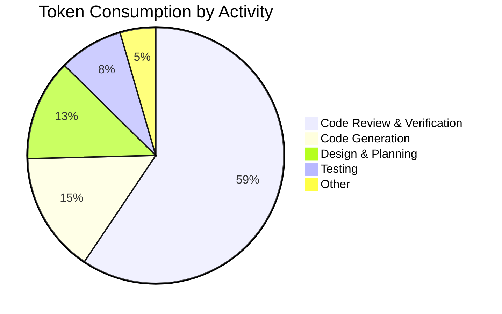
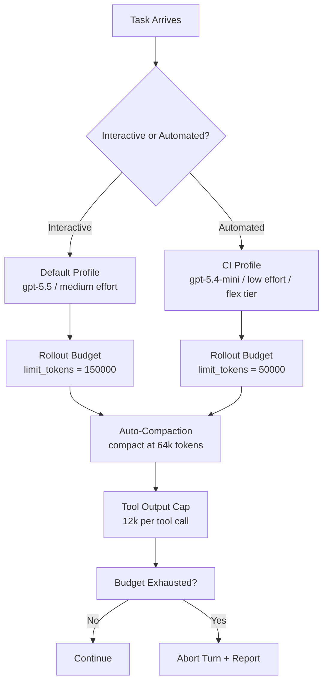

# Where Do Your Tokens Go? What Empirical Research Reveals About Coding Agent Token Consumption — and How to Control It with Codex CLI


---

The agentic coding revolution has a bill attached. Microsoft's Experiences + Devices division reportedly ordered engineers off Claude Code by June 2026 after per-engineer token costs hit roughly \$2,000 per month, exhausting the annual AI budget months early [^1]. Uber's CTO disclosed that the firm burnt through its entire 2026 AI budget on coding agents in four months [^1]. Goldman Sachs projects that agentic AI could drive a 24-fold increase in token consumption by 2030, reaching 120 quadrillion tokens per month [^2].

The instinct is to blame profligate usage. Two recent empirical studies — Bai et al.'s *How Do AI Agents Spend Your Money?* and Salim et al.'s *Tokenomics* — suggest the real problem is structural. Understanding *where* tokens go changes how you configure your agent. This article maps their findings onto Codex CLI's cost-control surface.

## The Scale Problem: 1,000× More Than Chat

Bai et al. (arXiv:2604.22750) conducted the first systematic analysis of token consumption across eight frontier models on SWE-bench Verified [^3]. The headline finding: agentic coding tasks consume roughly 1,000× more tokens than code reasoning or code chat [^3]. Input tokens — not output — drive the cost, because every turn re-ingests the full conversation history plus tool outputs.

Worse, token usage is *stochastic*. Runs on the same task with the same model can differ by up to 30× [^3]. This makes flat-rate budgeting unreliable and per-task cost prediction nearly impossible without empirical calibration.

## The Efficiency Illusion: Spending More Buys Nothing

A counterintuitive finding undermines the assumption that harder problems simply need more tokens. Bai et al. show that performance peaks at intermediate token expenditure and saturates at higher costs [^3]. Kimi-K2 and Claude Sonnet 4.5 consume over 1.5 million additional tokens compared to GPT-5 on identical SWE-bench tasks — without corresponding accuracy gains [^3].

This is not a model quality claim. It is a *cost-efficiency* observation: the marginal token has diminishing returns, and some models reach diminishing returns far earlier than others.


## Where Tokens Actually Go: The Read Dominance Problem

Salim et al. (arXiv:2601.14470) decomposed token consumption across the software development lifecycle using ChatDev with GPT-5 [^4]. Their breakdown reveals:

- **Code review** consumes 59.4% of all tokens — nearly six times more than initial code generation [^4]
- **Input tokens** account for 53.9% of total consumption on average [^4]
- The bulk of cost comes from *automated refinement and verification*, not from producing the first draft

This aligns with the well-known "context snowball" effect: each agent turn re-reads the entire conversation, the original prompt, all previous tool outputs, and its own prior responses. Read operations have been independently measured at 76.1% of token consumption in agentic workflows [^5].



## Models Cannot Predict Their Own Costs

Perhaps the most practically damaging finding is that frontier models are poor predictors of their own token consumption. Bai et al. report correlation coefficients of at most 0.39 between self-estimated and actual token usage, with systematic underestimation [^3]. Human expert assessments of task difficulty only weakly align with actual computational cost [^3].

This means that neither the model nor the developer can reliably forecast what a task will cost before executing it. The implication is clear: you need runtime budget controls, not pre-task estimates.

## Codex CLI's Cost-Control Surface

Codex CLI (v0.142.5 as of July 2026) exposes a layered set of configuration keys that directly address these empirical findings [^6 [^7]. Cost optimisation in Codex CLI is a configuration problem, not a usage problem.

### Rollout Token Budget

The rollout budget feature provides hard ceiling enforcement across agent threads [^6]:

```toml
[features.rollout_budget]
enabled = true
limit_tokens = 100000
reminder_interval_tokens = 10000
sampling_token_weight = 1.0
prefill_token_weight = 1.0
```

When the budget is exhausted, Codex aborts the current turn. The `reminder_interval_tokens` key injects remaining-budget warnings into the agent's context at regular intervals — a lightweight form of cost-awareness that does not rely on the model's poor self-prediction [^6].

For multi-agent workflows where subagents can fan out unpredictably, this is the single most important cost-control mechanism.

### Context Compaction

The context snowball is the primary cost driver. Codex CLI's auto-compaction directly targets it [^7]:

```toml
model_context_window = 272000
model_auto_compact_token_limit = 64000
tool_output_token_limit = 12000
```

`model_auto_compact_token_limit` triggers automatic history compaction when the conversation exceeds the threshold [^7]. `tool_output_token_limit` caps the tokens stored per individual tool output — critical because read operations (file contents, grep results, test output) dominate the input token count [^7].

Setting `tool_output_token_limit` aggressively (e.g. 8000 instead of the default 12000) directly reduces the read dominance problem identified by Salim et al.

### Model Routing via Profiles

Given that different models have dramatically different cost-efficiency curves, profile-based model routing lets you match model capability to task complexity [^8]:

```toml
# ~/.codex/config.toml — default for interactive work
model = "gpt-5.5"
model_reasoning_effort = "medium"
service_tier = "flex"
```

```toml
# ~/.codex/ci.config.toml — lean profile for CI/CD
model = "gpt-5.4-mini"
model_reasoning_effort = "low"
service_tier = "flex"
```

Switch at invocation time with `codex --profile ci`. The `flex` service tier trades latency for lower cost — ideal for background and automated workflows where wall-clock time is secondary [^7].

### Reasoning Effort

The `model_reasoning_effort` key (`minimal | low | medium | high | xhigh`) adjusts internal chain-of-thought depth [^7]. For tasks where the model reaches diminishing returns early — the majority, per Bai et al. — lowering reasoning effort from `high` to `medium` or `low` can substantially reduce output token counts without measurable accuracy loss on routine tasks.

## A Defence-in-Depth Cost Configuration

Combining these controls into a layered strategy:



This configuration addresses the three core empirical findings:

1. **Read dominance** → `tool_output_token_limit` and `model_auto_compact_token_limit` shrink the context snowball
2. **Diminishing returns** → `model_reasoning_effort` and profile-based model routing avoid overspending on routine tasks
3. **Poor self-prediction** → `rollout_token_budget` enforces hard limits that do not rely on model cost estimates

## The Research Gap: What SWE-Pruner Promises

SWE-Pruner (arXiv:2601.16746) takes a complementary approach: a 0.6B-parameter neural "skimmer" that performs task-aware context pruning, preserving semantically relevant lines whilst discarding boilerplate [^9]. Early results show 23–54% token reduction on SWE-bench Verified tasks with up to 14.84× compression, and claimed 20–40% cost savings on Claude Code without performance degradation [^9].

This is not yet integrated into Codex CLI. However, it maps naturally to a PostToolUse hook that prunes tool output before it enters the conversation history — a plausible near-term addition to the Codex CLI plugin ecosystem.

## Practical Recommendations

1. **Set a rollout budget for every automated workflow.** The 30× variance in token consumption means any unbounded run risks cost blowout. Start with `limit_tokens = 100000` and tune empirically.

2. **Use `flex` service tier for background work.** The latency trade-off is irrelevant for CI, automation, and scheduled tasks.

3. **Lower reasoning effort for subagents.** Per-subagent `model_reasoning_effort = "low"` with `gpt-5.4-mini` exploits the finding that most tasks reach peak performance at intermediate cost [^3].

4. **Cap tool output aggressively.** If read operations consume 76% of tokens, reducing `tool_output_token_limit` from 12000 to 8000 has outsized impact on total spend.

5. **Monitor before you optimise.** Codex CLI's trace logs (improved in v0.142.5 to exclude full WebSocket payloads [^10]) provide per-turn token counts. Use them to identify which tasks actually hit diminishing returns.

## Conclusion

The empirical evidence is now clear: coding agents are structurally expensive, their cost profiles are dominated by context re-reading rather than generation, their spend is unpredictably variable, and they cannot accurately forecast their own consumption. These are not behavioural problems to be solved by telling developers to "use AI less" — they are engineering constraints to be managed through configuration.

Codex CLI's layered cost controls — rollout budgets, context compaction, model routing, and reasoning effort tuning — map directly to the problems identified by the research. The question is not whether to use them, but how aggressively to set them. Start with the defaults, measure with trace logs, and tighten until you find your cost-performance frontier.

---

## Citations

[^1]: Fortune, "Microsoft reports are exposing AI's real cost problem: Using the tech is more expensive than paying human employees," May 2026. [https://fortune.com/2026/05/22/microsoft-ai-cost-problem-tokens-agents/](https://fortune.com/2026/05/22/microsoft-ai-cost-problem-tokens-agents/)

[^2]: Stanford Digital Economy Lab, "How are AI agents spending your tokens?," 2026. [https://digitaleconomy.stanford.edu/news/how-are-ai-agents-spending-your-tokens/](https://digitaleconomy.stanford.edu/news/how-are-ai-agents-spending-your-tokens/)

[^3]: Bai, L., Huang, Z., Wang, X., Sun, J., Mihalcea, R., Brynjolfsson, E., Pentland, A. & Pei, J., "How Do AI Agents Spend Your Money? Analyzing and Predicting Token Consumption in Agentic Coding Tasks," arXiv:2604.22750, April 2026. [https://arxiv.org/abs/2604.22750](https://arxiv.org/abs/2604.22750)

[^4]: Salim, M. et al., "Tokenomics: Quantifying Where Tokens Are Used in Agentic Software Engineering," arXiv:2601.14470, January 2026. [https://arxiv.org/abs/2601.14470](https://arxiv.org/abs/2601.14470)

[^5]: ResearchGate, "How Do AI Agents Spend Your Money? Analyzing and Predicting Token Consumption in Agentic Coding Tasks — read operations at 76.1%," 2026. [https://www.researchgate.net/publication/404217261](https://www.researchgate.net/publication/404217261)

[^6]: OpenAI, "Configuration Reference — Codex," 2026. [https://developers.openai.com/codex/config-reference](https://developers.openai.com/codex/config-reference)

[^7]: OpenAI, "Sample Configuration — Codex," 2026. [https://developers.openai.com/codex/config-sample](https://developers.openai.com/codex/config-sample)

[^8]: OpenAI, "Advanced Configuration — Codex," 2026. [https://developers.openai.com/codex/config-advanced](https://developers.openai.com/codex/config-advanced)

[^9]: SWE-Pruner, "Self-Adaptive Context Pruning for Coding Agents," arXiv:2601.16746, January 2026. [https://arxiv.org/abs/2601.16746](https://arxiv.org/abs/2601.16746)

[^10]: OpenAI, "Codex Releases — rust-v0.142.5," GitHub, July 2026. [https://github.com/openai/codex/releases](https://github.com/openai/codex/releases)
