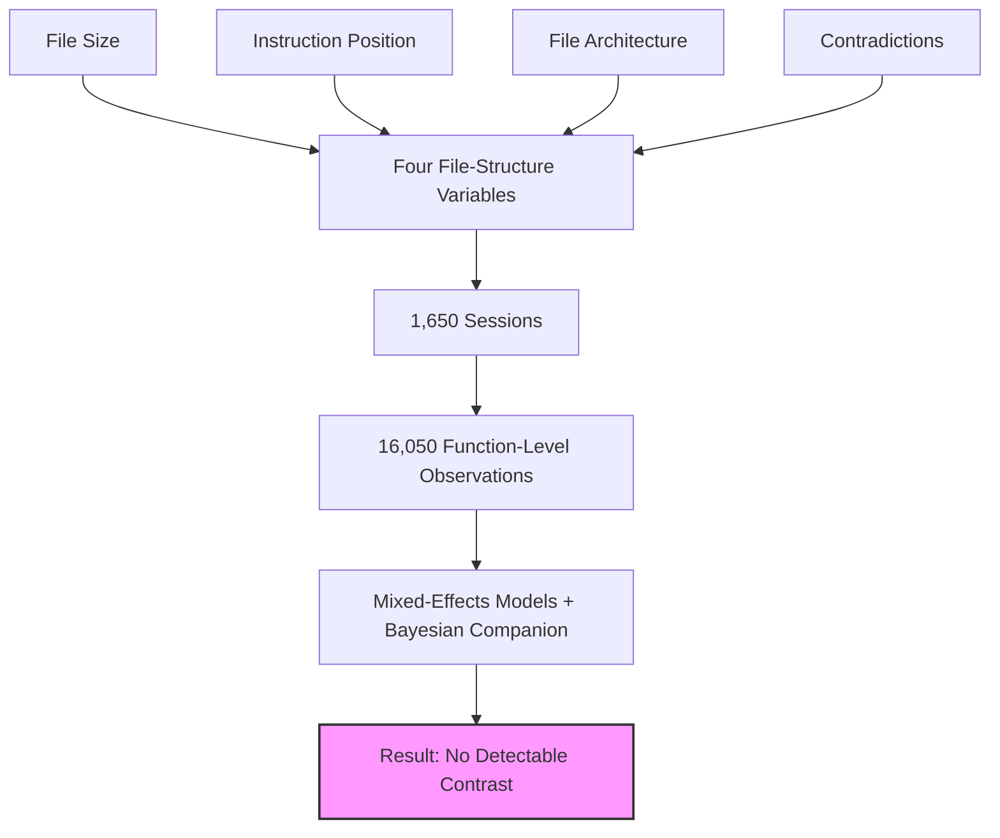
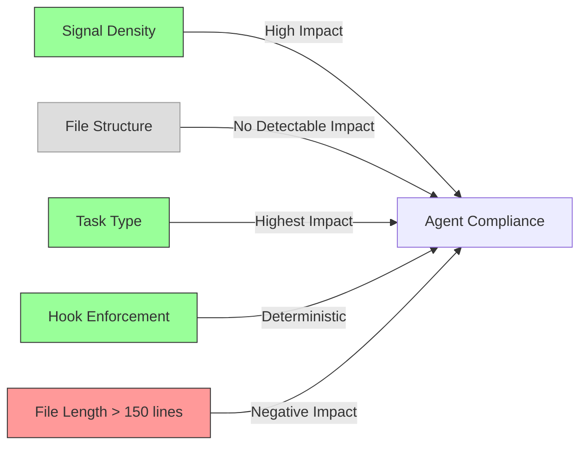

# AGENTS.md Structure Doesn't Matter: What a 16,050-Observation Factorial Study Reveals About Instruction Adherence


---

The cottage industry of AGENTS.md advice — where to place your critical rules, how to split files, whether longer means better — just received its first rigorous empirical challenge. McMillan's factorial study[^1] tested four structural variables across 1,650 Claude Code CLI sessions and found that *none of them* produced a statistically detectable effect on instruction compliance after multiple-testing correction.

For Codex CLI users who've spent hours restructuring their AGENTS.md files based on blog-post heuristics, the implications are significant: you've been optimising the wrong thing.

## The Study Design

The paper manipulated four variables that practitioners commonly assume influence whether coding agents follow instructions[^1]:

1. **File size** — short versus long configuration files
2. **Instruction position** — rules placed at the top versus buried deeper
3. **File architecture** — monolithic single file versus split across multiple files
4. **Contradictions in adjacent files** — conflicting directives in directory-level overrides

The target annotation was deliberately trivial — a specific code-style convention that any model should easily follow if it reads the instruction at all. This isolation lets the study measure *structural* effects without confounding them with instruction complexity.

### Scale and Statistical Rigour

The experiment measured compliance across 16,050 function-level observations on two TypeScript codebases, using three frontier models (primarily Sonnet 4.6, with Opus 4.6 and Opus 4.7 as cross-checks) and five distinct coding tasks[^1]. Mixed-effects models with a Bayesian companion provided the statistical backbone.



## The Null Result and Why It Matters

None of the four structural variables, nor any of the three two-way interactions tested, produced a statistically significant effect after multiple-testing correction[^1]. This is a clean null — not a failure to collect enough data, but a well-powered experiment that found nothing to find.

What *did* matter? **Task identity**. The paper reports a 26.2 percentage-point gap in compliance between different coding tasks, despite those tasks having similar average function counts[^1]. The type of work the agent performs predicts compliance far better than where you put your instructions.

### What This Means for Your Workflow

The study suggests that if your agent isn't following a rule, restructuring your AGENTS.md won't fix it. The failure mode is more likely:

- The instruction conflicts with the model's training distribution for that *type of task*
- The agent's planning process for complex tasks crowds out constraint-tracking
- The instruction itself is ambiguous or the desired behaviour is context-dependent

## Complementary Evidence: The Gloaguen Study

These findings align with Gloaguen et al.'s earlier work evaluating AGENTS.md files across SWE-Bench Lite and a custom AgentBench[^2]. Their key findings:

- LLM-generated AGENTS.md files *reduced* task success by approximately 3% on average
- Inference costs increased by over 20% with verbose generated files
- Developer-written files improved success rates by approximately 4% and reduced agent-generated bugs by 35–55%[^2]

The combined message from both papers: **signal density matters; structure does not**.

## Practical Implications for Codex CLI Configuration

Given these findings, here's what Codex CLI users should actually focus on:

### 1. Content Over Architecture

Stop debating monolithic versus split files. Codex's cascading instruction chain — from `~/.codex/AGENTS.md` through repo root to subdirectories[^3] — exists for *organisational convenience*, not because directory-level placement affects adherence. Use the hierarchy to keep files small and relevant, not because position matters.

```toml
# ~/.codex/config.toml — configure fallback names for convenience, not compliance
project_doc_fallback_filenames = ["AGENTS.md", "TEAM_GUIDE.md", ".agents.md"]
project_doc_max_bytes = 32768
```

### 2. Write Executable Instructions, Not Prose

The evidence points toward *specificity* as the real lever[^4]. Compare:

```markdown
# Ineffective (aspirational prose)
Write clean, maintainable code following best practices.

# Effective (verifiable command)
Use Result<T, E> instead of throwing exceptions. Pattern-match all variants.
Run `cargo clippy -- -D warnings` before marking any task complete.
```

### 3. Invest in Enforcement, Not Documentation

If an instruction truly cannot be violated, don't rely on AGENTS.md alone. Codex CLI's hook system provides deterministic enforcement[^5]:

```toml
# .codex/config.toml — hard enforcement via hooks
[[hooks]]
event = "post_tool_use"
tool = "shell"
command = "cargo clippy -- -D warnings"
on_failure = "stop"
```

AGENTS.md *reduces probability* of violations; hooks and sandbox policies *reduce possibility*[^4].

### 4. Focus on Task-Specific Rules

Since task identity is the strongest predictor of compliance, write instructions that address the specific failure modes you've *observed* for each type of task your agent performs:

```markdown
## When writing database migrations

- Never drop columns in the same migration that removes their usage
- Always include a rollback section
- Test with `dbmate up && dbmate down && dbmate up`

## When modifying API endpoints

- Update the OpenAPI spec before changing handler code
- Run contract tests: `npm run test:contract`
```

### 5. Keep Files Under 150 Lines

Research across 2,500+ repositories found that length beyond 150 lines delivers diminishing returns and can increase inference costs by 20–23% without improving agent performance[^2]. Codex enforces a 32 KiB default limit via `project_doc_max_bytes`[^3], but you should aim well below that.



## The Broader Pattern: Governance Layers

The factorial study reinforces a principle that's been emerging across the coding-agent literature throughout 2026: effective agent governance requires *layered defences*, not perfected prompts.

| Layer | Mechanism | Guarantee |
|-------|-----------|-----------|
| AGENTS.md | Probabilistic instruction | Shapes behaviour, doesn't enforce it |
| Hooks (PreToolUse/PostToolUse) | Deterministic validation | Blocks violations at runtime[^5] |
| Sandbox policies | Capability restriction | Makes violations impossible |
| exec policies | Allow/block/prompt rules | Classifies commands before execution |

The factorial study's null result on file structure tells us that Layer 1 has a *ceiling* — once the agent has read the instruction, how you formatted it doesn't materially change compliance. To raise the ceiling, move critical constraints to Layers 2–4.

## What We Still Don't Know

Several limitations deserve attention:

- ⚠️ The study used a *trivial* target annotation (a code-style convention). Complex, multi-step instructions may behave differently under structural variation.
- ⚠️ Testing used Claude models via Claude Code CLI. Codex CLI's GPT-5.5/GPT-5.6 models may exhibit different sensitivity to file structure — no equivalent factorial study exists for OpenAI models as of July 2026.
- ⚠️ The 26.2 percentage-point task-identity gap was observed but not fully explained. Understanding *why* certain tasks reduce compliance is an open research question.

## Actionable Takeaways

1. **Stop restructuring** — moving rules to the top, splitting files, or reformatting won't measurably improve compliance
2. **Write shorter** — stay under 150 lines; every token counts against context budget
3. **Write specific** — verifiable commands outperform aspirational prose
4. **Enforce mechanically** — use hooks for rules that must never break
5. **Monitor by task type** — compliance varies dramatically by what the agent is doing, so track violations per task category and write task-specific rules for your worst offenders

The empirical evidence is clear: your AGENTS.md formatting doesn't matter. Your AGENTS.md *content* — and the enforcement layers behind it — matters enormously.

## Citations

[^1]: McMillan, D. (2026). "Instruction Adherence in Coding Agent Configuration Files: A Factorial Study of Four File-Structure Variables." arXiv:2605.10039. [https://arxiv.org/abs/2605.10039](https://arxiv.org/abs/2605.10039)

[^2]: Gloaguen, A. et al. (2026). "Evaluating AGENTS.md: Are Repository-Level Context Files Helpful for Coding Agents?" arXiv:2601.20404. [https://arxiv.org/abs/2601.20404](https://arxiv.org/abs/2601.20404)

[^3]: OpenAI. (2026). "Custom instructions with AGENTS.md." Codex Developer Documentation. [https://developers.openai.com/codex/guides/agents-md](https://developers.openai.com/codex/guides/agents-md)

[^4]: Crosley, B. (2026). "AGENTS.md Patterns: What Actually Changes Agent Behavior." [https://blakecrosley.com/blog/agents-md-patterns](https://blakecrosley.com/blog/agents-md-patterns)

[^5]: OpenAI. (2026). "Agent approvals & security." Codex Developer Documentation. [https://developers.openai.com/codex/agent-approvals-security](https://developers.openai.com/codex/agent-approvals-security)
