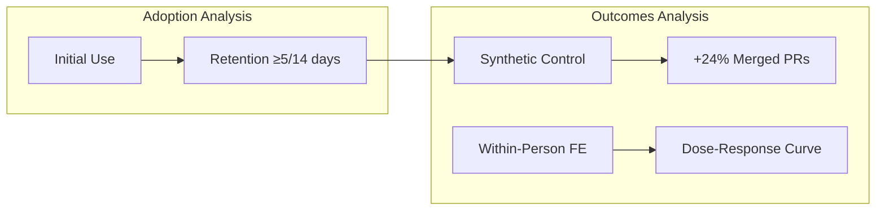
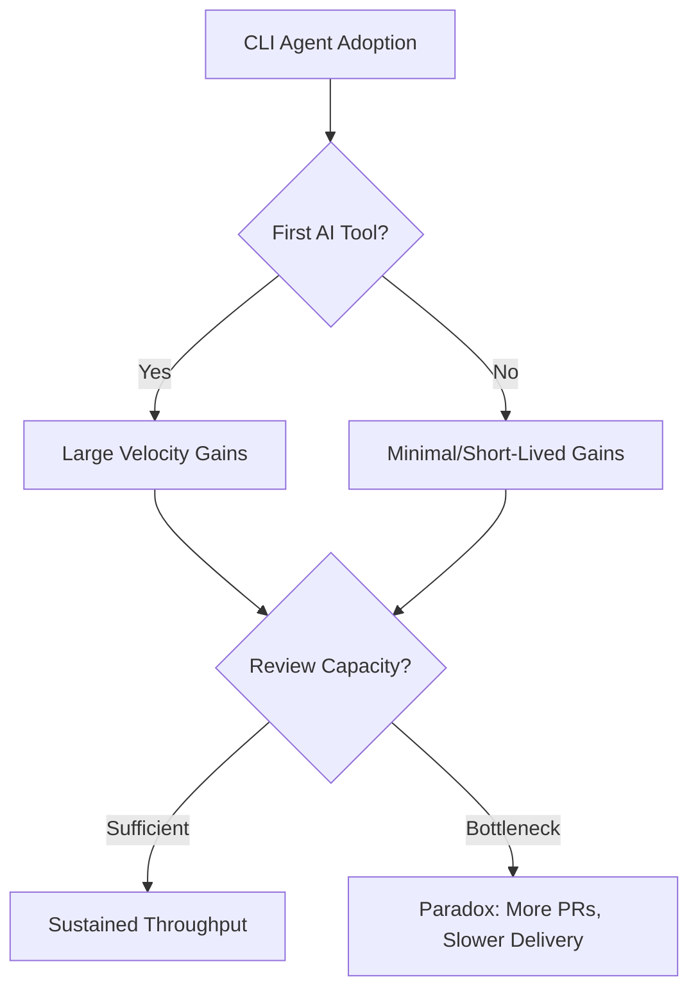
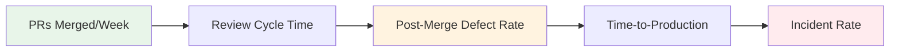

# CLI Coding Agent Adoption at Scale: What Microsoft's 24% PR Lift Reveals About Peer-Driven Rollout — and How to Apply It to Your Codex CLI Deployment


---

Most enterprise rollouts of coding agents start with a mandate and a wiki page. Microsoft's largest study of command-line coding agents suggests this gets the causal chain backwards: adoption spreads through social networks, not org charts, and the engineers who stick with the tools are the ones who were already shipping code — not those who attended the training session.

A paper published on 3 July 2026 by Murphy-Hill, Butler, and Savelieva (arXiv:2607.01418) examined tens of thousands of Microsoft engineers during the early-2026 deployment of Claude Code and GitHub Copilot CLI [^1]. The headline number — a 24% lift in merged pull requests — is interesting. The mechanism behind it is more interesting still.

## The Study Design

The research spanned a 115-day post-deployment window (5 January – 29 April 2026), with a matched pre-period from October 2025 through early January 2026 [^1]. Two complementary analyses were run:

**Adoption analysis (Copilot CLI only):** Discrete-time logistic regression examining what predicts first use and what predicts retention (defined as activity on five or more of the first 14 days) [^1].

**Outcomes analysis (both tools):** A Bayesian synthetic control method (CausalImpact) comparing observed merged PRs against a counterfactual constructed from non-adopters, plus a within-person fixed-effects Poisson regression treating each engineer as their own control across varying usage weeks [^1].



## Three Findings That Matter

### 1. Peer Influence Dominates

The strongest predictor of initial adoption was skip-level peer usage: when more than 25% of an engineer's broader peer group used the tool, odds of adoption rose by 216% [^1]. Direct manager usage added 82%, and reviewer peer usage contributed 54% [^1].

Career stage, tenure, and demographics were negligible predictors. This challenges the common enterprise pattern of targeting senior engineers first under the assumption that adoption will trickle down. The data suggests it spreads sideways.

### 2. Retention Tracks Coding Activity, Not Demographics

Engineers who were already merging two or more PRs per week showed 31% higher retention [^1]. Prior IDE-based Copilot usage — counterintuitively — predicted 12–15% *lower* retention, suggesting that CLI agents serve a different workflow niche from autocomplete-style assistants [^1].

### 3. The Throughput Gain Is Real but Dose-Dependent

The overall 24.0% lift (95% CI: +14.5%, +33.7%) held across the full four-month window with no statistically distinguishable decay [^1]. But the dose-response curve reveals a steeper story:

| Usage Frequency | PR Lift |
|-----------------|---------|
| 3 days/week | +15.0% |
| ≥5 days/week | +50.1% |

Copilot CLI showed a 2.2× lift versus Claude Code in this specific enterprise context, though the authors note this reflects Microsoft's internal tooling integration rather than inherent model quality [^1].

## The Productivity Paradox Context

These results sit inside a broader tension. Faros AI's 2025 study of over 10,000 developers across 1,255 teams found that heavy AI tool adoption produced 98% more PRs per developer — but PR review time ballooned 91%, average PR size increased 154%, and bugs per developer rose 9% [^2]. The Microsoft study, by its own admission, examines throughput only: "quality remains unexamined" [^1].

Agarwal, He, and Vasilescu's longitudinal causal study (arXiv:2601.13597) adds another wrinkle: autonomous coding agents produce large velocity gains only when they are the *first* observable AI tool in a project. Repositories with prior AI IDE usage experience minimal or short-lived throughput increases [^3].



The implication for Codex CLI deployments: throughput gains are available, but only if your review pipeline can absorb them. Otherwise you are paying for a wider pipe that empties into the same narrow drain.

## Mapping to Codex CLI Rollout Strategy

### Seed the Social Network, Not the Org Chart

The Microsoft data shows 216% odds increase from skip-level peer usage [^1]. For Codex CLI, this means:

1. **Identify high-connectivity engineers** — those who review across multiple teams — and equip them first.
2. **Make usage visible.** Codex CLI's `--json` output and JSONL traces can feed team dashboards that surface who is using the tool and on what.
3. **Do not gate behind mandatory training.** The retention data shows coding activity, not training completion, predicts sustained adoption.

### Configure for the Dose-Response Curve

The 3× throughput gap between 3 days/week and 5+ days/week usage [^1] suggests that intermittent use captures minimal value. Codex CLI's profile system lets you lower friction for daily use:

```toml
# ~/.codex/config.toml

# Default profile for everyday work
model = "o3"
model_reasoning_effort = "medium"
approval_policy = "unless-allow-listed"
rollout_token_budget = 200000

[profiles.deep-work]
model = "o3"
model_reasoning_effort = "xhigh"
rollout_token_budget = 500000

[profiles.triage]
model = "o4-mini"
model_reasoning_effort = "low"
rollout_token_budget = 50000
```

Engineers start with `codex` and graduate to `codex --profile deep-work` as familiarity grows. The triage profile gives a low-cost entry point for engineers still evaluating whether CLI agents fit their workflow.

### Address the Review Bottleneck Before It Forms

The Faros data showing 91% longer review times and 154% larger PRs [^2] means that scaling Codex CLI adoption without scaling review capacity produces a bottleneck. Three Codex CLI mechanisms help:

**Guardian auto-review subagent:** Configure a secondary review agent that pre-screens agent-generated diffs before human review:

```toml
# AGENTS.md excerpt
## Auto-Review Policy
All agent-generated changes MUST pass automated review before human PR assignment.
Review checks: lint, type-check, test suite, diff size < 500 lines.
```

**PostToolUse hooks for quality gates:** Enforce quality checks at generation time rather than review time:

```json
{
  "post_tool_use": {
    "on": "write_file",
    "run": "npx eslint --max-warnings 0 ${file} && npx tsc --noEmit",
    "on_fail": "reject"
  }
}
```

**Rollout token budgets for diff size control:** The `rollout_token_budget` configuration directly constrains how much code an agent can generate per session [^4]. Smaller budgets naturally produce smaller, more reviewable diffs — matching Bloomberg's Pomona finding that 10-line median diffs achieved an 88.2% merge rate [^5].

### Handle the First-Tool Effect

If your team already uses IDE-based assistants, expect the CLI agent velocity lift to be smaller [^3]. Codex CLI's value proposition shifts from raw throughput to workflow types that IDE assistants cannot serve:

- **Non-interactive batch operations** via `codex exec` — CI/CD pipelines, automated migrations, scheduled maintenance
- **Multi-file refactoring** with full sandbox isolation
- **Long-running sessions** with `rollout_token_budget` controls and persistent `/goal` objectives
- **Custom agent definitions** in `.codex/agents/` for domain-specific workflows

```toml
# .codex/agents/migration-agent.toml
name = "migration-agent"
model = "o3"
model_reasoning_effort = "high"
instructions = """
You are a database migration specialist.
Follow the migration checklist in AGENTS.md.
Run all migration tests before marking complete.
"""
```

### Measure What Matters

The Microsoft study measured merged PRs [^1]. Faros measured bugs, incidents, and review time [^2]. Neither measured what engineers actually care about: whether the shipped feature works. For Codex CLI deployments, instrument the full pipeline:



Codex CLI's JSONL trace output (`codex exec --json`) provides the per-session telemetry needed to correlate agent usage with downstream quality metrics. Pipe traces into your existing engineering analytics platform rather than treating agent adoption as a separate measurement domain.

## What the Study Does Not Tell You

The authors are transparent about limitations worth noting [^1]:

- **Single company.** Microsoft's internal tooling, culture, and Azure DevOps ecosystem may not generalise.
- **Merged PRs ≠ value.** Heavy CLI users may tackle smaller, more frequent changes — the throughput gain could reflect task decomposition rather than genuine velocity.
- **Quality is unexamined.** The 24% lift says nothing about defect rates, technical debt, or maintainability.
- **Peer influence or homophily?** Cross-sectional adoption data cannot distinguish between "I adopted because my peers did" and "teams with similar traits adopt simultaneously."

These limitations do not invalidate the findings. They bound them. A 24% PR lift sustained over four months, with a clear dose-response curve, is evidence worth acting on — provided you instrument quality alongside throughput.

## The Practical Takeaway

Enterprise Codex CLI deployments should:

1. **Start with connectors, not champions.** Equip engineers who review across teams, not the loudest advocates.
2. **Lower daily friction.** Pre-configure profiles, set sensible defaults, and ensure `codex doctor` passes out of the box.
3. **Target five-day-a-week usage.** The 3.3× gap between casual and committed usage means intermittent pilots understate ROI.
4. **Scale review capacity in parallel.** Auto-review subagents, PostToolUse quality hooks, and diff size budgets prevent the Faros paradox.
5. **Measure the full pipeline.** PRs merged is a leading indicator. Defect rate is the lagging one that determines whether the investment pays off.

The Microsoft study provides the strongest causal evidence to date that CLI coding agents produce measurable throughput gains at enterprise scale. The challenge is not whether they work. It is whether your organisation can absorb their output without drowning in review debt.

## Citations

[^1]: Murphy-Hill, E., Butler, J., & Savelieva, A. (2026). "Adoption and Impact of Command-Line AI Coding Agents: A Study of Microsoft's Early 2026 Rollout of Claude Code and GitHub Copilot CLI." arXiv:2607.01418. [https://arxiv.org/abs/2607.01418](https://arxiv.org/abs/2607.01418)

[^2]: Faros AI. (2025). "The AI Productivity Paradox Research Report." Study of over 10,000 developers across 1,255 teams. [https://www.faros.ai/blog/ai-software-engineering](https://www.faros.ai/blog/ai-software-engineering)

[^3]: Agarwal, S., He, H., & Vasilescu, B. (2026). "AI IDEs or Autonomous Agents? Measuring the Impact of Coding Agents on Software Development." arXiv:2601.13597. MSR 2026. [https://arxiv.org/abs/2601.13597](https://arxiv.org/abs/2601.13597)

[^4]: OpenAI. (2026). "Codex CLI Configuration Basics." [https://developers.openai.com/codex/config-basic](https://developers.openai.com/codex/config-basic)

[^5]: Williams, D., et al. (2026). "Pomona: Continuous Code Quality Improvement via Small, Automated Changes at Bloomberg." arXiv:2606.06752. [https://arxiv.org/abs/2606.06752](https://arxiv.org/abs/2606.06752)
