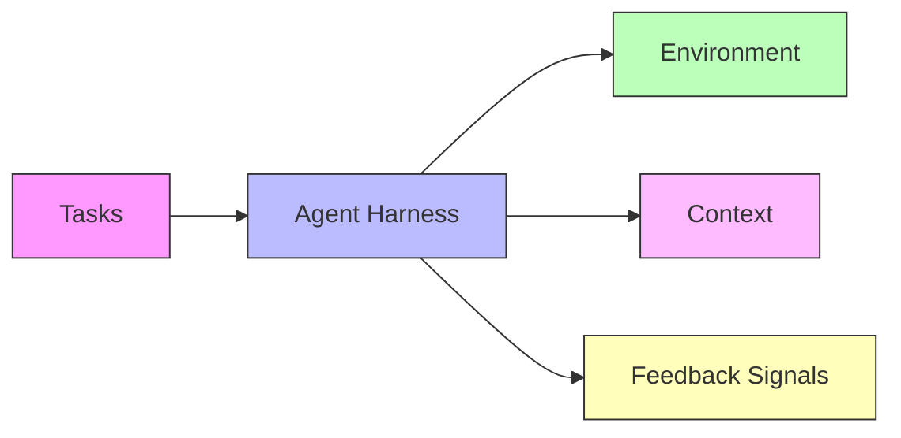
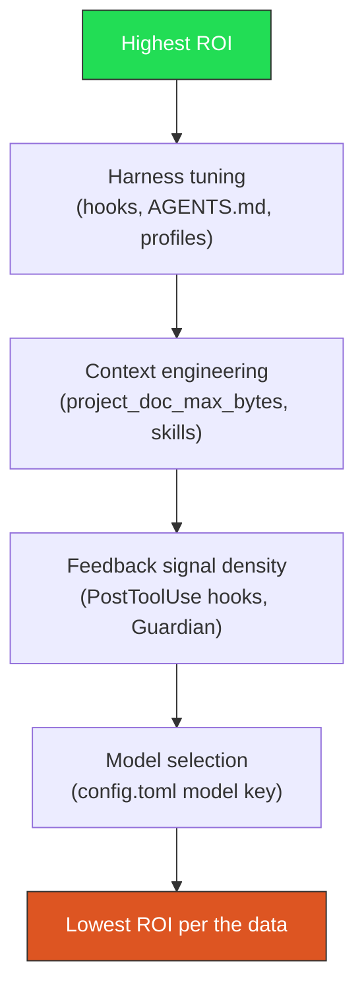

# Coding Benchmarks Are Misaligned with Agentic Software Engineering: What the Harness Component Gap Means for Codex CLI Developers


---

A position paper from Tessl, published in June 2026, makes an argument that most senior engineers already suspect but few have seen quantified: coding agent benchmarks do not measure what we think they measure [^1]. The scores we use to compare agents collapse model, harness, and environment into a single number — and that number is largely a property of the system wrapping the model, not the model itself.

This article unpacks the Tessl findings, cross-references them with supporting empirical research, and maps the paper's five-component system harness framework directly onto Codex CLI's configuration surface. If you are investing engineering effort in model selection rather than harness engineering, the data suggests you are optimising the wrong variable.

## The Three Symptoms of Misalignment

Gorinova et al. identify three structural problems with current coding benchmarks [^1]:

1. **Component conflation.** End-to-end scores attribute system performance to the model. On Terminal-Bench, Claude Opus 4.6 ranges from 58.0% (Claude Code) to 79.8% (ForgeCode) — a 21.8 percentage point swing driven entirely by the harness, not the weights [^1].

2. **Single-reference anchoring.** Benchmarks like SWE-Bench grade patches against the original pull request's `FAIL_TO_PASS`/`PASS_TO_PASS` test sets. This penalises equally valid alternative implementations. The paper reports 7.8% of nominally "resolved" patches fail developer-written tests, and 29.6% diverge from gold-patch behaviour [^1].

3. **Absence of component-level signal.** No major benchmark tells you *which* component failed — whether it was context retrieval, tool selection, or the model's reasoning. You get a binary pass/fail with no decomposition.

## The Benchmark-to-Production Gap

The mismatch is not merely theoretical. Cross-referencing the Tessl data with empirical PR studies reveals a stark gap:

| Metric | Benchmark world | Production world |
|--------|----------------|-----------------|
| Headline resolve rate | >70% (SWE-Bench Verified) [^2] | 35–64% (456k PRs, 61k repos) [^1] |
| Solution leakage | 32.67% of SWE-Bench issues contain solution hints [^1] | N/A — real issues never contain the answer |
| Test sufficiency | 31.08% pass under insufficient tests [^1] | Human reviewers catch gaps 45.1% of the time [^3] |
| Score variance (same model) | 4–10pp from scaffold changes alone [^2] | Unknown — teams rarely A/B test harnesses |

The 200,000+ SWE-Bench runs analysed by the community show that "material pass-rate movement" comes from orchestration choices, container allocation, and evaluation seeds — not model upgrades [^1].

## The Five-Component System Harness

The paper proposes a framework of five recurring components that constitute an agentic system [^1]. Each maps directly onto Codex CLI configuration primitives:



### 1. Tasks — What you ask the agent to do

In benchmarks, tasks are fixed issue descriptions. In production, tasks emerge from goals, tickets, and conversational instructions.

**Codex CLI mapping:** The `/goal` command transforms single-turn tasks into persistent multi-turn objectives [^4]. Goal mode changes the evaluation unit from "did it resolve this patch?" to "did it achieve this outcome?" — precisely the shift the Tessl paper advocates.

### 2. Agent Harness — The configurable executor

This is where most benchmark variance lives. The harness encompasses model selection, prompt construction, tool definitions, and the agentic loop.

**Codex CLI mapping:** The harness is spread across several configuration layers:

```toml
# ~/.codex/config.toml — global harness defaults
model = "o3"
model_auto_compact_token_limit = 60000
rollout_token_budget = 500000

# Named profiles for harness variants
[profiles.review]
model = "o4-mini"
approval_policy = "unless-allow-listed"
```

Custom agent definitions in `.codex/agents/` encode role-specific harnesses as standalone TOML files, each with their own model, sandbox policy, MCP servers, and instructions [^5]. This is the *component isolation* the paper demands — you can A/B test the reviewer agent's harness independently of the implementer's.

### 3. Environment — Repository, runtime, external services

Benchmarks run in standardised containers. Production environments include CI pipelines, deployment targets, and external services.

**Codex CLI mapping:** The sandbox configuration (`full-auto`, `workspace-write`, `network-off`) and `writable_roots` settings define the environment boundary [^6]. The DigitalOcean plugin and Codex Remote GA extend this to cloud-provisioned workspaces [^7].

### 4. Context — The curated projection

Rombaut's scaffold taxonomy (arXiv:2604.03515) identifies context strategy as one of 12 architectural dimensions that distinguish agent systems [^8]. How much of the codebase the agent sees, and in what form, drives outcomes as much as the model.

**Codex CLI mapping:** Context flows through a cascading chain:

```
~/.codex/AGENTS.md          → global instructions
.codex/AGENTS.md             → project-level instructions
src/module/AGENTS.md          → directory-level overrides
SKILL.md                     → procedural skills
Plugin-bundled instructions   → ecosystem skills
```

The `project_doc_max_bytes` setting caps how much context is injected per file [^6]. The `tool_output_token_limit` controls how much tool output re-enters the context window [^6]. These are precisely the "context" component levers the Tessl framework identifies.

### 5. Feedback Signals — Tests, linters, human review

The paper introduces a three-tier feedback categorisation [^1]:

- **Inner-loop** (seconds–minutes): tests, types, lint, compile
- **Middle-loop** (minutes–hours): reviewer requests, simulation, maintenance agents
- **Outer-loop** (days–weeks): PR acceptance, revert rates, incident reports

**Codex CLI mapping:** Hooks implement all three tiers:

```json
{
  "hooks": [
    {
      "event": "PostToolUse",
      "match_tool": "write_file",
      "command": "npm run lint -- --fix ${file}",
      "description": "Inner-loop: lint on every file write"
    },
    {
      "event": "PostToolUse",
      "match_tool": "write_file",
      "command": "npm test -- --bail",
      "description": "Inner-loop: test on every file write"
    },
    {
      "event": "SessionStop",
      "command": "scripts/post-session-metrics.sh",
      "description": "Outer-loop: emit session telemetry"
    }
  ]
}
```

The Guardian auto-review subagent provides middle-loop feedback — a second model reviewing the first model's output before approval [^5].

## What This Means for Codex CLI Harness Investment

The Tessl data implies a clear prioritisation for engineering effort:



The 21.8pp harness-driven variance on Terminal-Bench dwarfs the typical 2–5pp gap between adjacent model generations [^1]. Spending a day writing PostToolUse hooks is likely to move your resolve rate more than upgrading from o3 to the next model release.

### Practical Harness Engineering Checklist

Based on the five-component framework, here is a concrete Codex CLI configuration audit:

**Tasks layer:**
- [ ] Use `/goal` for multi-step objectives rather than single-turn prompts
- [ ] Set `rollout_token_budget` per goal to prevent runaway sessions

**Harness layer:**
- [ ] Define named profiles in `config.toml` for distinct workflow types
- [ ] Create custom agent definitions (`.codex/agents/*.toml`) for specialised roles
- [ ] Pair model routing with task type — use stronger models for planning, cheaper models for implementation

**Environment layer:**
- [ ] Configure `writable_roots` to match your project's directory structure
- [ ] Set sandbox policy to `workspace-write` as the default; escalate only when needed

**Context layer:**
- [ ] Write per-directory AGENTS.md files for modules with distinct conventions
- [ ] Tune `project_doc_max_bytes` — the default may inject too much or too little
- [ ] Install domain-specific plugins for procedural skills

**Feedback layer:**
- [ ] Add PostToolUse hooks for linting and testing on every file write
- [ ] Enable Guardian auto-review for high-risk changes
- [ ] Emit OpenTelemetry traces for outer-loop measurement

## The Operationalisation Gap

The Tessl paper identifies a central open problem: "specifying what we want a coding system to do in terms that do not encode *how*" [^1]. Current benchmarks grade against reference implementations, which inherently encode one specific solution path.

For Codex CLI users, this has a practical implication: your AGENTS.md instructions should specify *invariants* (what must remain true) rather than *procedures* (how to achieve it). The empirical evidence from McMillan's factorial study — 16,050 observations showing that AGENTS.md structure does not affect compliance [^9] — reinforces this: the content of your constraints matters, their format does not.

PostToolUse hooks are the deterministic enforcement layer that converts prose invariants into executable checks. Where AGENTS.md says "all public functions must have JSDoc comments," a PostToolUse hook runs the linter and rejects violations before the model proceeds.

## Beyond Single-Reference Grading

The paper's recommendation to "replace single-reference-derived test sets with multi-shape behavioural verifiers — property tests, reference oracles, or differential tests" [^1] directly maps to how teams should evaluate their Codex CLI workflows in production.

Rather than checking whether the agent produced the exact patch you would have written, verify:

1. **Does it pass the existing test suite?** (inner-loop)
2. **Does it satisfy the specification?** (middle-loop, via Guardian or human review)
3. **Does it survive in production?** (outer-loop, via revert rate tracking)

This three-tier verification is precisely what the system harness framework proposes, and Codex CLI's hook pipeline can automate the first two tiers entirely.

## Conclusion

The Tessl position paper puts numbers behind what practitioners have observed: benchmark scores are system properties, not model properties. A 21.8pp variance from harness changes alone should redirect engineering investment away from model shopping and towards harness engineering.

For Codex CLI developers, the actionable takeaway is clear: your `config.toml`, AGENTS.md hierarchy, PostToolUse hooks, named profiles, and custom agent definitions *are* your harness — and they are the highest-leverage configuration surface you have. Tune them with the same rigour you would apply to any production system, and measure their effect with the same component-level decomposition the paper advocates.

---

## Citations

[^1]: Gorinova, M. I., Baker, M., Heineike, A., Shaposhnikov, M., Willoughby, R. & Knox, D. (2026). "Position: Coding Benchmarks Are Misaligned with Agentic Software Engineering." arXiv:2606.17799. [https://arxiv.org/abs/2606.17799](https://arxiv.org/abs/2606.17799)

[^2]: "SWE-bench in 2026: Benchmarks vs Scaffolding Reality." Digital Applied, June 2026. [https://www.digitalapplied.com/blog/swe-bench-verified-june-2026-benchmark-vs-scaffolding-analysis](https://www.digitalapplied.com/blog/swe-bench-verified-june-2026-benchmark-vs-scaffolding-analysis)

[^3]: Youssef, A. et al. (2026). "Comparing AI Coding Agents: A Task-Stratified Analysis of Pull Request Acceptance." arXiv:2602.08915. [https://arxiv.org/abs/2602.08915](https://arxiv.org/abs/2602.08915)

[^4]: "Using Goals in Codex." OpenAI Cookbook, 2026. [https://developers.openai.com/cookbook/examples/codex/using_goals_in_codex](https://developers.openai.com/cookbook/examples/codex/using_goals_in_codex)

[^5]: "Customization — Codex." OpenAI Developers, 2026. [https://developers.openai.com/codex/concepts/customization](https://developers.openai.com/codex/concepts/customization)

[^6]: "Configuration Reference — Codex." OpenAI Developers, 2026. [https://developers.openai.com/codex/config-reference](https://developers.openai.com/codex/config-reference)

[^7]: "Codex Remote GA: QR Relay, DigitalOcean Plugin, and the Phone as Your Agent's Control Plane." Codex Knowledge Base, 29 June 2026. [https://codex.danielvaughan.com/2026/06/29/codex-remote-ga-qr-relay-digitalocean-plugin-mobile-approval-workflow-phone-as-control-plane/](https://codex.danielvaughan.com/2026/06/29/codex-remote-ga-qr-relay-digitalocean-plugin-mobile-approval-workflow-phone-as-control-plane/)

[^8]: Rombaut, B. (2026). "Inside the Scaffold: A Source-Code Taxonomy of Coding Agent Architectures." arXiv:2604.03515. [https://arxiv.org/abs/2604.03515](https://arxiv.org/abs/2604.03515)

[^9]: McMillan (2026). "AGENTS.md Structure Doesn't Matter: A 16,050-Observation Factorial Study." arXiv:2605.10039. [https://arxiv.org/abs/2605.10039](https://arxiv.org/abs/2605.10039)
