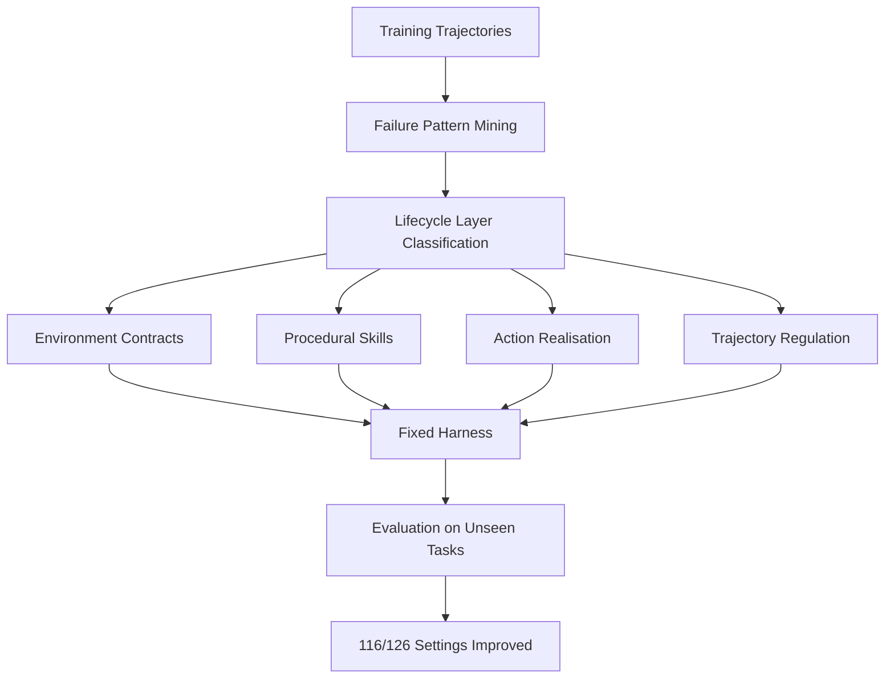
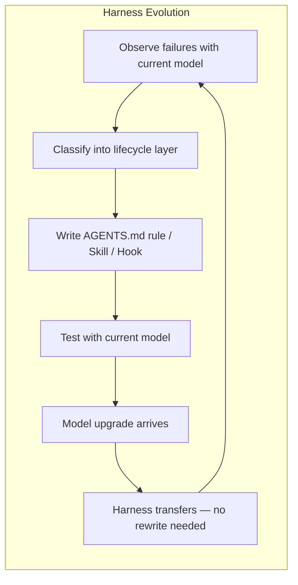

# Life-Harness and Runtime Harness Adaptation: What a 126-Setting Study Reveals About Improving Frozen LLM Agents Through Interface Engineering — and How Codex CLI Already Implements All Four Lifecycle Layers


---

## The Core Insight: Adapt the Interface, Not the Model

Most attempts to improve coding agent performance focus on the model — fine-tuning, prompting harder, switching to a more capable backbone. A May 2026 paper from Peking University flips that assumption entirely. Xu, Wen, and Li's "Adapting the Interface, Not the Model: Runtime Harness Adaptation for Deterministic LLM Agents" (arXiv:2605.22166) [^1] demonstrates that adapting the *runtime harness* — the software layer mediating between model and environment — improves performance in **116 out of 126** model-environment settings, with an average relative gain of 88.5%, all without touching model weights.

The paper's framework, **Life-Harness**, organises runtime adaptation into four lifecycle layers. For Codex CLI practitioners, these four layers map directly onto the configuration surfaces you already have: AGENTS.md, Skills, Hooks, and config.toml.

---

## What Life-Harness Actually Does

Life-Harness treats the harness as a first-class artefact that evolves from training trajectories. The key architectural decision: harnesses are evolved from a *single* model's traces (Qwen3-4B-Instruct) and then reused unchanged across 17 additional backbones [^1]. This suggests that effective harness interventions capture reusable **environment-side structure** rather than model-specific behaviour.



The evaluation spans seven deterministic environments across three benchmark suites: τ-bench, τ²-bench, and AgentBench [^1]. Individual gains range from +10% to +84% relative improvement — the largest on AgentBench's ALFWorld (41.1% → 75.7%) [^1].

---

## The Four Lifecycle Layers

### Layer 1: Environment Contracts

**What it does:** Calibrates tool descriptions and interface constraints *before* the model interacts with the environment. Reduces mismatches between generic tool-use priors and environment-specific contracts [^1].

**Codex CLI equivalent:** `AGENTS.md` and `config.toml`

Your AGENTS.md file is an environment contract. It tells the model what tools exist in this repository, what conventions apply, and what constraints are non-negotiable. OpenAI's own harness engineering guide explicitly frames AGENTS.md as a "table of contents" pointing to deeper sources of truth [^2].

```toml
# .codex/config.toml — environment contract layer
[project]
project_doc_max_bytes = 32768

[sandbox]
permissions = ["disk::read", "disk::write::./src", "disk::write::./tests"]
network_access = false
```

The sandbox permissions are a pure environment contract: they tell the runtime (not the model) what actions are physically possible. The model never needs to learn these constraints via prompt engineering — they're enforced deterministically [^3].

### Layer 2: Procedural Skills

**What it does:** Converts recurring interaction patterns into reusable techniques. Life-Harness extracts these from training trajectories where the model repeatedly fails at the same type of task [^1].

**Codex CLI equivalent:** Skills (`SKILL.md` files)

Codex CLI's skill system uses progressive disclosure: the model sees only skill names and descriptions until it decides to invoke one, at which point the full `SKILL.md` instructions load into context [^4]. This is precisely the procedural skill pattern — reusable, composable techniques that the model invokes when it recognises a matching situation.

```markdown
<!-- .codex/skills/migration/SKILL.md -->
# Database Migration Skill

## When to Use
When modifying database schema, creating migrations, or updating ORM models.

## Procedure
1. Check current migration state: `npx prisma migrate status`
2. Generate migration: `npx prisma migrate dev --name <descriptive-name>`
3. Verify generated SQL in prisma/migrations/
4. Run `npx prisma generate` to update client
5. Update seed data if schema changed
```

The critical insight from Life-Harness: skills evolved from a weaker model's failures transfer to stronger models. Your SKILL.md files written for GPT-5.1-Codex-Mini will likely improve GPT-5.5 sessions too — the environment-side structure is model-agnostic [^1].

### Layer 3: Action Realisation

**What it does:** Transforms model decisions into executable environment actions, handling format mismatches and edge cases between what the model outputs and what the environment accepts [^1].

**Codex CLI equivalent:** `PreToolUse` hooks

PreToolUse hooks intercept every tool call *before* execution [^5]. They can transform, validate, or block actions — exactly the action realisation layer's function.

```bash
#!/usr/bin/env bash
# .codex/hooks/pre-tool-use/normalise-paths.sh
# Action realisation: normalise relative paths to absolute

INPUT=$(cat)
COMMAND=$(echo "$INPUT" | jq -r '.tool_input.command // empty')

if [[ -n "$COMMAND" ]]; then
  # Normalise ./src/../lib to ./lib before execution
  NORMALISED=$(realpath --relative-to=. "$(echo "$COMMAND" | grep -oP '(?<=cd\s)\S+')" 2>/dev/null || echo "")
  if [[ -n "$NORMALISED" ]]; then
    echo '{"decision": "approve"}'
  else
    echo '{"decision": "approve"}'
  fi
else
  echo '{"decision": "approve"}'
fi
```

A more impactful example: blocking destructive commands regardless of what the model decides:

```bash
#!/usr/bin/env bash
# .codex/hooks/pre-tool-use/block-destructive.sh
INPUT=$(cat)
CMD=$(echo "$INPUT" | jq -r '.tool_input.command // empty')

if echo "$CMD" | grep -qE 'rm\s+-rf\s+/|git\s+push\s+--force\s+origin\s+main|DROP\s+DATABASE'; then
  echo '{"decision": "reject", "reason": "Blocked by action realisation layer: destructive command detected"}'
  exit 0
fi

echo '{"decision": "approve"}'
```

### Layer 4: Trajectory Regulation

**What it does:** Monitors and corrects the overall execution trajectory. Detects degenerate loops, excessive retries, and drift from the original objective [^1].

**Codex CLI equivalent:** `PostToolUse` hooks + `rollout_token_budget`

PostToolUse hooks fire after every tool execution and can inject corrective guidance into the model's context [^5]. Combined with the `rollout_token_budget` configuration, they form a complete trajectory regulation system.

```bash
#!/usr/bin/env bash
# .codex/hooks/post-tool-use/detect-loop.sh
INPUT=$(cat)
EXIT_CODE=$(echo "$INPUT" | jq -r '.tool_output.exit_code // 0')
OUTPUT=$(echo "$INPUT" | jq -r '.tool_output.stdout // empty')

# Track consecutive failures
FAIL_COUNT_FILE="/tmp/codex-fail-count-$$"
if [[ "$EXIT_CODE" != "0" ]]; then
  COUNT=$(cat "$FAIL_COUNT_FILE" 2>/dev/null || echo "0")
  COUNT=$((COUNT + 1))
  echo "$COUNT" > "$FAIL_COUNT_FILE"

  if [[ $COUNT -ge 3 ]]; then
    echo "{\"additional_context\": \"TRAJECTORY WARNING: 3 consecutive failures detected. Stop retrying the same approach. Step back, re-read the error messages, and try a fundamentally different strategy.\"}"
    echo "0" > "$FAIL_COUNT_FILE"
    exit 0
  fi
else
  echo "0" > "$FAIL_COUNT_FILE"
fi

echo '{}'
```

The `rollout_token_budget` enforces a hard ceiling on agent execution cost — a blunt but effective trajectory regulator [^6]:

```toml
# .codex/config.toml
[execution]
rollout_token_budget = 50000  # Hard stop after 50K tokens
```

---

## Why This Matters: The Transfer Result

The most striking finding in the Life-Harness paper is **cross-backbone transfer**. Harnesses evolved from Qwen3-4B-Instruct traces improved performance when applied to 17 other models, including models that are orders of magnitude more capable [^1].

This has a direct practical implication for Codex CLI users: **your harness investment compounds across model upgrades**. When OpenAI ships GPT-5.6 Sol or GPT-5.7, your AGENTS.md, hooks, and skills don't become obsolete — they likely become *more* effective because the stronger model can follow harness-provided structure more reliably.



---

## Complementary Evidence: The Harness Engineering Movement

Life-Harness isn't isolated. OpenAI's own "Harness Engineering" guide (published May 2026) explicitly frames the same approach: "Instead of treating the coding agent as a black box, you shape its harness: the instructions, tools, context, hooks, and integrations around the model, so correct behaviour becomes easier and more repeatable" [^2].

The Convergent AI Agent Framework (CAAF, arXiv:2604.17025) [^7] independently arrived at the same conclusion, introducing "harness as an asset" — the idea that deterministic enforcement layers accumulate value over time.

HarnessX (arXiv:2606.14249) [^8] takes this further with composable harness modules that can be mixed and matched across environments, echoing how Codex CLI plugins bundle skills, hooks, and MCP server configurations into distributable units.

---

## Implementing Life-Harness Principles in Your Repository

Here's a practical mapping for adopting Life-Harness thinking in your Codex CLI setup:

| Life-Harness Layer | Codex CLI Surface | Key Configuration |
|---|---|---|
| Environment Contracts | AGENTS.md + config.toml | Tool descriptions, sandbox permissions, project conventions |
| Procedural Skills | .codex/skills/*/SKILL.md | Reusable multi-step procedures loaded on demand |
| Action Realisation | PreToolUse hooks | Validate, transform, or reject tool calls before execution |
| Trajectory Regulation | PostToolUse hooks + rollout_token_budget | Detect loops, inject corrections, enforce budget ceilings |

### The Evolution Workflow

Life-Harness evolves harnesses from failure traces. You can do the same:

1. **Capture traces**: Enable `CODEX_TRACE=1` to log full session trajectories [^9]
2. **Mine failures**: Review traces where the agent looped, produced incorrect output, or exceeded budget
3. **Classify**: Determine which lifecycle layer the failure belongs to
4. **Intervene**: Write the appropriate AGENTS.md rule, skill, or hook
5. **Validate**: Run the same task again and confirm improvement
6. **Transfer**: Leave the harness in place when models upgrade — it transfers

---

## Limitations and Open Questions

Life-Harness was evaluated on deterministic, rule-governed environments (airline booking, retail, OS operations) [^1]. Software engineering is messier — requirements are ambiguous, "correct" is often subjective, and the action space is vastly larger. Whether the 88.5% average improvement translates to coding tasks remains an open empirical question. ⚠️

The paper also relies on a single model (Qwen3-4B-Instruct) for harness evolution [^1]. While transfer results are strong, it's unclear whether evolving from a *coding-specific* model's traces would produce qualitatively different harness interventions for software engineering tasks. ⚠️

Finally, Life-Harness harnesses are fixed after evolution — they don't adapt at runtime. Codex CLI's hook system shares this limitation: hooks are static shell scripts, not adaptive policies. Whether runtime-adaptive harnesses (as explored in HarnessForge, arXiv:2606.01779 [^10]) would further improve coding agent performance is an active research question.

---

## Conclusion

Life-Harness provides rigorous empirical evidence for what Codex CLI practitioners have been discovering through practice: the harness matters more than the model for deterministic improvements. The four lifecycle layers — environment contracts, procedural skills, action realisation, and trajectory regulation — map cleanly onto AGENTS.md, Skills, PreToolUse hooks, and PostToolUse hooks respectively.

The transfer result is the headline finding for working engineers: invest in your harness today, and the investment compounds with every model upgrade. Your hooks and skills aren't throwaway prompt engineering — they're durable engineering assets that capture environment-side structure.

---

## Citations

[^1]: Xu, T., Wen, H., & Li, M. (2026). "Adapting the Interface, Not the Model: Runtime Harness Adaptation for Deterministic LLM Agents." arXiv:2605.22166. https://arxiv.org/abs/2605.22166

[^2]: OpenAI. (2026). "Harness Engineering: Leveraging Codex in an Agent-First World." https://openai.com/index/harness-engineering/

[^3]: OpenAI. (2026). "Agent Approvals & Security — Codex." https://developers.openai.com/codex/agent-approvals-security

[^4]: OpenAI. (2026). "Agent Skills — Codex." https://developers.openai.com/codex/skills

[^5]: OpenAI. (2026). "Hooks — Codex." https://developers.openai.com/codex/hooks

[^6]: OpenAI. (2026). "Configuration Reference — Codex." https://developers.openai.com/codex/config-reference

[^7]: Anon. (2026). "Harness as an Asset: Enforcing Determinism via the Convergent AI Agent Framework (CAAF)." arXiv:2604.17025. https://arxiv.org/abs/2604.17025

[^8]: Anon. (2026). "HarnessX: A Composable, Adaptive, and Evolvable Agent Harness Foundry." arXiv:2606.14249. https://arxiv.org/abs/2606.14249

[^9]: OpenAI. (2026). "Non-interactive Mode — Codex." https://developers.openai.com/codex/noninteractive

[^10]: Anon. (2026). "HarnessForge: Joint Harness and Policy Evolution for Adaptive Agent Systems." arXiv:2606.01779. https://arxiv.org/abs/2606.01779
