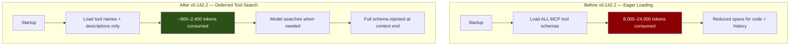
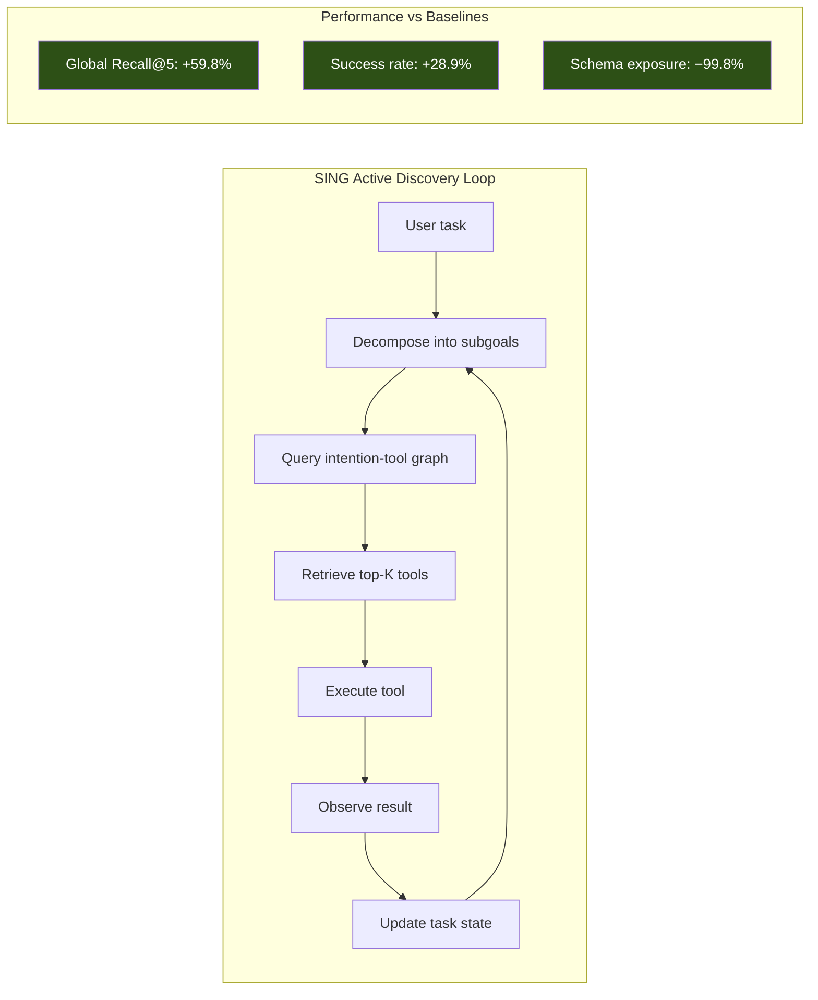
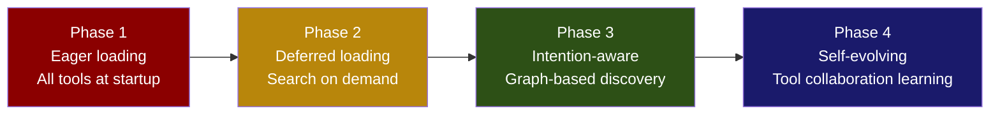

# MCP Tool Search Goes Default: What Smelly Descriptions, SING Active Discovery, and Deferred Loading Mean for Your Codex CLI Tool Stack


---

With Codex CLI v0.142.2, MCP tools now use tool search by default [^1]. The change sounds minor — a single changelog line — but it fundamentally alters how your agent discovers and loads tool definitions. Instead of injecting every MCP tool schema into the context window at startup, Codex CLI defers parameter schemas and loads them on demand when the model decides it needs a specific capability.

This matters because two independent research threads have exposed why the old approach was broken: Hasan et al. showed that 97.1% of MCP tool descriptions contain at least one quality defect [^2], and Xiao et al. demonstrated that intention-aware active discovery outperforms static retrieval by up to 59.8% on recall [^3]. Together with OpenAI's `defer_loading` API mechanism [^4], these findings explain both why tool search became necessary and how to configure Codex CLI to extract maximum benefit from it.

## The Problem: Tool Schema Bloat

Every MCP server you register in `config.toml` contributes tool definitions to your agent's context window. A modest setup — a database server, a documentation server, a CI/CD server — might expose 40–60 tools. At roughly 200–400 tokens per tool schema (name, description, parameter JSON Schema), that is 8,000–24,000 tokens consumed before the model processes your first prompt.

The cost is not merely financial. Context window consumption directly competes with the space available for your codebase, AGENTS.md instructions, conversation history, and tool outputs. The earlier GPT-5.4 release introduced tool search precisely to address this: the model sees tool names and brief descriptions upfront, but full parameter schemas load only when needed [^4].



## How Tool Search Works in the Responses API

OpenAI's tool search mechanism operates at the API level, and understanding it explains Codex CLI's behaviour [^4].

### Hosted Tool Search

When Codex CLI sends your MCP tools to the Responses API, it marks deferred tools with `defer_loading: true`. The model receives tool names and descriptions but not full parameter schemas. When the model determines it needs a specific tool, the API emits a `tool_search_call` event, resolves the match internally, and returns a `tool_search_output` containing the full schema — injected at the end of the context window to preserve the prompt cache [^4].

### The Cache Preservation Detail

This injection point is architecturally significant. By appending discovered tool schemas at the context tail rather than inserting them mid-context, OpenAI preserves the prefix cache across requests [^4]. For long-running Codex CLI sessions, this means that discovering a new tool does not invalidate the cached prefix containing your system prompt, AGENTS.md, and early conversation turns. The TokenPilot research from Xu et al. demonstrated that cache hit rates can swing from 38.7% to 79.2% when prefix stability is maintained [^5] — tool search contributes to that stability by design.

### Model Requirements

Tool search requires GPT-5.4 or later [^4]. Codex CLI's changelog notes that the feature "preserv[es] compatibility with older models and providers" [^1], meaning that if you configure a custom provider running an older model, Codex CLI falls back to eager loading automatically.

## 97.1% of Tool Descriptions Are Smelly

The deferred loading mechanism relies on one critical assumption: that tool names and descriptions are good enough for the model to decide what to search for. Hasan et al.'s empirical study of 856 tools across 103 MCP servers reveals why this assumption deserves scrutiny [^2].

Their scoring rubric identified six description components from the literature, then formalised "tool description smells" — quality defects that can misguide the agent [^2]:

| Smell | Prevalence | Impact |
|-------|-----------|--------|
| Missing purpose statement | 56% of tools | Model cannot determine when to invoke |
| Absent parameter constraints | High | Model supplies invalid arguments |
| No error handling guidance | High | Model cannot recover from failures |
| Missing return value description | Common | Model misinterprets tool output |
| Lack of usage examples | Common | Model guesses at parameter formats |
| Incomplete prerequisite specification | Common | Model calls tools out of sequence |

The aggregate finding: **97.1% of analysed tool descriptions contain at least one smell** [^2].

### The Augmentation Paradox

Hasan et al. found that augmenting all six description components improved task success by a median of 5.85 percentage points and partial goal completion by 15.12% [^2]. However, augmentation increased execution steps by 67.46% and caused performance regression in 16.67% of cases [^2]. More description is not uniformly better — compact variants that combine select components "often preserve behavioural reliability while reducing unnecessary token overhead" [^2].

This creates a direct tension with tool search. Richer descriptions help the model make better search decisions, but they also consume more of the context budget allocated to the deferred name-and-description inventory. The practical recommendation from OpenAI's own documentation aligns with Hasan et al.'s finding: keep namespace-level descriptions concise and push richer detail into the deferred parameter schemas that load only when needed [^4].

## SING: Intention-Aware Active Discovery at Scale

While Hasan et al. diagnose the quality problem, Xiao et al.'s SING framework addresses the discovery problem [^3]. As MCP ecosystems expand — their study collected 7,471 tools across 779 servers — static one-shot retrieval increasingly fails to align tool descriptions with the agent's evolving task intention [^3].

SING constructs an intention-tool graph that captures three relationships:

1. **User intentions → tool capabilities** — what each tool can accomplish
2. **Tool capabilities → collaboration patterns** — which tools work together
3. **Task decomposition → emerging subgoals** — what the agent discovers it needs mid-task



The results across three benchmarks using the full 7,471-tool corpus: **Global Recall@5 improved by up to 59.8%, downstream success rate by up to 28.9%, and full-corpus schema exposure dropped by 99.8%** [^3].

### What This Means for Codex CLI

Codex CLI's current tool search implementation uses OpenAI's hosted search — a simpler mechanism than SING's intention graph. But the research validates the architectural direction. As your MCP server count grows beyond a handful, static tool lists degrade in two ways: they waste context tokens, and they fail to surface the right tools for multi-step tasks where required capabilities emerge through execution rather than upfront planning.

The practical implication: organise your MCP servers into well-named, well-described namespaces rather than exposing flat lists of individual functions. OpenAI's guidance recommends fewer than 10 functions per namespace for optimal search efficiency [^4].

## Configuring Your Tool Stack for Search-First Discovery

### MCP Server Configuration

Structure your `config.toml` with descriptive server names that function as namespace labels:

```toml
[mcp_servers.project-database]
command = "npx"
args = ["-y", "@myorg/db-mcp-server"]
startup_timeout_sec = 15
tool_timeout_sec = 30

[mcp_servers.ci-pipeline]
command = "npx"
args = ["-y", "@myorg/ci-mcp-server"]

[mcp_servers.documentation-search]
url = "https://docs-mcp.internal.example.com/sse"
```

### Tool Allow-Lists and Deny-Lists

Use `enabled_tools` and `disabled_tools` to prune noisy tools that pollute search results [^6]:

```toml
[mcp_servers.project-database]
command = "npx"
args = ["-y", "@myorg/db-mcp-server"]
# Only expose the tools your workflow actually needs
enabled_tools = ["query", "schema_inspect", "migration_status"]
# Or block tools that cause confusion
disabled_tools = ["drop_table", "truncate"]
```

### Approval Modes for Discovered Tools

Because tool search means the model may invoke tools you did not anticipate at session start, configure approval modes defensively [^6]:

```toml
[mcp_servers.ci-pipeline]
command = "npx"
args = ["-y", "@myorg/ci-mcp-server"]
default_tools_approval_mode = "prompt"

[mcp_servers.ci-pipeline.tools.deploy_production]
approval_mode = "approve"
```

### Writing Search-Friendly Tool Descriptions

If you maintain your own MCP servers, apply Hasan et al.'s findings [^2]:

1. **Always include a purpose statement** — 56% of tools fail this basic requirement
2. **Keep the top-level description concise** — it is what the model sees during search; push parameter details into the schema
3. **Specify prerequisites** — "Requires an active database connection" prevents out-of-sequence calls
4. **Document return values** — the model needs to know what it will receive to plan subsequent steps
5. **Avoid jargon in the description** — the model matches on semantic similarity, not domain expertise

### The AutoMCP Warning

If you are auto-generating MCP servers from OpenAPI specifications — a practice examined by the REST-to-MCP study covering 116 official servers [^7] — be aware that 88.6% of those servers are fully or partially REST-backed with 92% implementing tools as bare API wrappers [^7]. Auto-generated descriptions inherit whatever quality (or lack thereof) exists in the source OpenAPI spec. Run Hasan et al.'s smell categories as a post-generation checklist before deploying to your Codex CLI configuration.

## The Broader Architecture: From Eager to Adaptive

Tool search as a default represents a broader shift in how coding agents manage their capability surface. The trajectory is clear:



Codex CLI v0.142.2 sits at Phase 2. SING demonstrates Phase 3 is viable. The CODESKILL research on self-evolving skill banks [^8] suggests Phase 4 is already being prototyped in academic settings.

For today's practice, the actionable advice is straightforward: audit your MCP tool descriptions against the six-component rubric, organise servers into semantic namespaces, use allow-lists aggressively, and let the default tool search do its job. Your context window — and your token budget — will thank you.

## Citations

[^1]: OpenAI, "Changelog — Codex," 25 June 2026, v0.142.2. [https://developers.openai.com/codex/changelog](https://developers.openai.com/codex/changelog)

[^2]: M. M. Hasan, H. Li, G. K. Rajbahadur, B. Adams, and A. E. Hassan, "Model Context Protocol (MCP) Tool Descriptions Are Smelly! Towards Improving AI Agent Efficiency with Augmented MCP Tool Descriptions," arXiv:2602.14878, February 2026. [https://arxiv.org/abs/2602.14878](https://arxiv.org/abs/2602.14878)

[^3]: Q. Xiao, H. Shi, Y. Gao, W. Hu, H. Jing, T. Zheng, B. Xu, Z. Zhang, W. Wang, H. Li, J. Bai, and Y. Song, "SING: Synthetic Intention Graph for Scalable Active Tool Discovery in LLM Agents," arXiv:2606.16591, June 2026. [https://arxiv.org/abs/2606.16591](https://arxiv.org/abs/2606.16591)

[^4]: OpenAI, "Tool search," OpenAI API Documentation, 2026. [https://developers.openai.com/api/docs/guides/tools-tool-search](https://developers.openai.com/api/docs/guides/tools-tool-search)

[^5]: L. Xu et al., "TokenPilot: Dual-Granularity Context Management for Cache-Efficient LLM Agents," arXiv:2606.17016, June 2026. [https://arxiv.org/abs/2606.17016](https://arxiv.org/abs/2606.17016)

[^6]: OpenAI, "Configuration Reference — Codex," OpenAI Developers, 2026. [https://developers.openai.com/codex/config-reference](https://developers.openai.com/codex/config-reference)

[^7]: M. Mastouri, E. Ksontini, A. Barrak, and W. Kessentini, "From REST to MCP: An Empirical Study of API Wrapping and Automated Server Generation for LLM Agents," arXiv:2507.16044, July 2025 (revised April 2026). [https://arxiv.org/abs/2507.16044](https://arxiv.org/abs/2507.16044)

[^8]: H. Li et al., "CODESKILL: Multi-Granularity Procedural Skill Extraction with RL-Trained Skill Management," arXiv:2605.25430, May 2026. [https://arxiv.org/abs/2605.25430](https://arxiv.org/abs/2605.25430)
