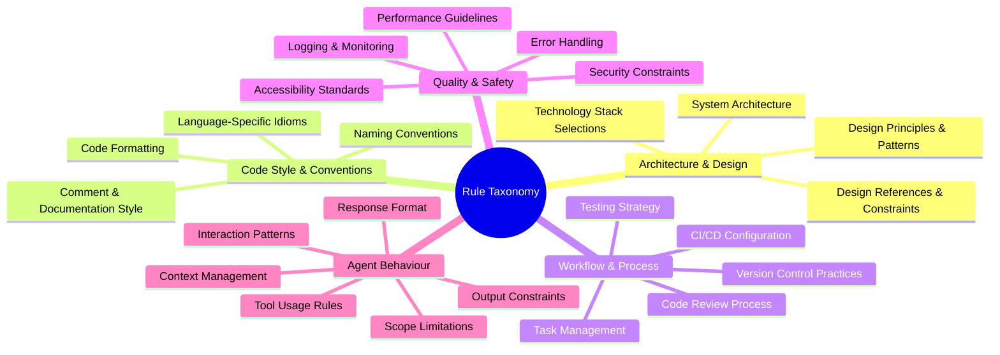
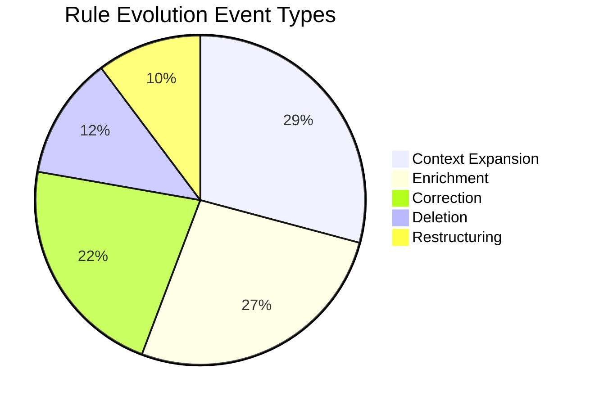
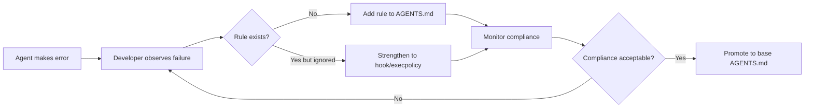

# Rule Taxonomy in AI IDEs: What 7,310 Mined Rules Reveal About the Gap Between Developer Intent and AGENTS.md Practice — and How to Close It in Codex CLI


---

## The Rules We Write Are Not the Rules We Need

Every team that adopts Codex CLI eventually faces the same question: what should go in our `AGENTS.md`? A new empirical study offers the first large-scale answer — and it reveals a structural mismatch between what developers say matters and what they actually write down.

Cai et al. mined 83 open-source projects, extracted 7,310 individual rules from AI IDE configuration files, surveyed 99 practitioners, and tracked 1,540 rule evolution events [^1]. The result is a five-category, 25-subcategory taxonomy that maps the full landscape of rules developers give their coding agents. The headline finding: developers rate architectural constraints as their highest priority, yet their actual rule files are dominated by low-level formatting and workflow directives [^1].

This matters for Codex CLI users because `AGENTS.md` is the primary mechanism through which you inject project-specific context into the agent's instruction chain [^2]. If you fill it with the wrong kind of rules — or miss enforcing the right ones — you are wasting context budget on suggestions the agent may ignore while leaving critical constraints unarticulated.

## The Five-Category Taxonomy

The taxonomy identifies five primary categories spanning 25 secondary categories [^1]:



The distribution is heavily skewed. Code Style & Conventions and Workflow & Process together account for the majority of mined rules, whilst Architecture & Design — the category developers themselves rate as most important — is comparatively sparse in actual files [^1].

## The Intent–Practice Gap

The study's survey data exposes a consistent disconnect:

| Dimension | Developer Priority (Survey) | Actual Rule Prevalence (Mining) |
|---|---|---|
| Architecture & Design | Highest rated | Underrepresented |
| Code Style & Conventions | Moderate | Dominant |
| Agent Behaviour | Growing concern | Emerging |

This gap has a practical explanation. Low-level rules are easy to write: "use single quotes", "indent with two spaces", "prefix interfaces with I". Architectural constraints require more thought: articulating dependency boundaries, specifying which patterns apply where, and encoding cross-cutting concerns in natural language [^1].

The companion study by Rao & Kumar on 34 publicly available `AGENTS.md` files found that 37% scored below their structural completeness threshold, with data classification criteria and assessment rubrics most frequently absent [^3]. Taken together, these findings suggest that most teams are writing the easy rules and leaving the hard ones — the ones that actually prevent architectural drift — unwritten.

## Rule Evolution: How Rules Change Over Time

The longitudinal analysis of 1,540 rule evolution events reveals three key patterns [^1]:

**1. Rules grow by accretion, not refinement.**
Constructive context expansions (29.17%) and enrichments (26.59%) dominate evolution events. Teams add new rules far more often than they revise or remove existing ones. Over time, this produces bloated instruction files that consume context budget without proportional benefit.

**2. Error-driven modification dominates.**
When surveyed about why they modify rules, 77.78% of practitioners cited correcting AI errors as the primary trigger [^1]. This reactive pattern means rules accumulate negative constraints ("do NOT use `any` type", "never import from legacy/") rather than positive architectural guidance.

**3. Compliance improves — but from a low baseline.**
Post-update compliance rose by an average of 22.99%, from 49.14% to 72.13% [^1]. This is encouraging, but the pre-update baseline of ~49% means that roughly half of all rules were being ignored before developers intervened to strengthen them.



## What This Means for Codex CLI Configuration

Codex CLI's `AGENTS.md` system maps directly onto this taxonomy, but the research suggests most teams are using it suboptimally. Here is how to apply the findings.

### 1. Audit Your Rule Distribution

Examine your `AGENTS.md` files across the five categories. If more than half your rules are formatting directives, you are in the majority — and you are wasting context. Codex CLI enforces a `project_doc_max_bytes` limit (default 32 KiB) [^2], and every formatting rule you include displaces an architectural constraint that could prevent a far more costly error.

The rule is straightforward: if a linter, formatter, or type checker already enforces it, remove it from `AGENTS.md` [^4]. Prettier handles your quote style. ESLint handles your import order. Your `AGENTS.md` should handle what those tools cannot: dependency boundaries, migration strategies, and domain-specific invariants.

### 2. Front-Load Architectural Rules

Codex CLI's instruction chain concatenates files from the Git root downward to the current working directory [^2]. Place your most important architectural constraints in the root `AGENTS.md` where they are always loaded first and always present:

```markdown
# AGENTS.md (project root)

## Architecture Constraints
- This is a hexagonal architecture. Domain logic in `core/` MUST NOT import from `adapters/` or `infrastructure/`.
- All external service calls go through the ports defined in `core/ports/`. No direct HTTP calls from domain code.
- Database access is restricted to repository implementations in `infrastructure/persistence/`.

## Migration Rules
- We are migrating from Express to Fastify. New endpoints MUST use Fastify. Do not create new Express routes.
- Legacy code in `src/legacy/` is frozen. Modifications require explicit approval.
```

Reserve nested `AGENTS.md` files for genuinely module-specific context:

```markdown
# backend/api/AGENTS.md

## API-Specific Rules
- All new endpoints require OpenAPI schema definitions in `schemas/`.
- Rate limiting configuration lives in `config/rate-limits.toml`, not in handler code.
```

### 3. Use Override Files for Temporal Rules

The study found that rule evolution is dominated by reactive additions after AI errors [^1]. Codex CLI's `AGENTS.override.md` mechanism is purpose-built for this pattern [^2]. When the agent makes a repeated error, add a targeted override rather than polluting your base `AGENTS.md`:

```markdown
# AGENTS.override.md (temporary)

## Current Sprint Constraints
- The payments module is under active refactoring. Do NOT modify files in `src/payments/legacy/`.
- PR #2847 introduced a regression in date parsing. Use `dayjs` not `moment` for all new date handling.
```

Override files take precedence at each directory level, and can be removed once the constraint is no longer relevant — preventing the accretion problem the study identifies [^1].

### 4. Enforce Deterministically Where Possible

The complementary dataset study by Ahmed et al. catalogued 15,591 configuration artefacts across 4,738 repositories using five AI coding tools [^5]. A key finding from the broader ecosystem research is that instructions without verification commands are suggestions, not rules [^4]. Codex CLI offers multiple deterministic enforcement layers:

```toml
# config.toml — deterministic enforcement

# Sandbox restricts file system access
sandbox = "workspace-write"

# Approval policy forces human review of risky operations
approval_policy = "on-request"
```

For rules that must be enforced absolutely, use Codex CLI's `PreToolUse` and `PostToolUse` hooks rather than relying solely on `AGENTS.md` prose [^6]:

```bash
#!/bin/bash
# .codex/hooks/post-tool-use.sh
# Deterministic check: no imports from legacy/ in new files
if git diff --cached --name-only | grep -v 'legacy/' | xargs grep -l 'from.*legacy/' 2>/dev/null; then
  echo "ERROR: New code imports from legacy/ — architectural violation"
  exit 1
fi
```

### 5. Track and Prune Rule Growth

Given the 29.17% expansion rate and reactive accumulation pattern, schedule periodic rule audits. A practical approach for Codex CLI projects:

```bash
# Count rules by category in your AGENTS.md
codex -q "Categorise every rule in AGENTS.md using these categories:
Architecture & Design, Code Style & Conventions, Workflow & Process,
Quality & Safety, Agent Behaviour. Output a count per category and
flag any Code Style rules that duplicate linter/formatter enforcement."
```

Target a distribution where Architecture & Design and Quality & Safety rules together exceed Code Style & Conventions rules. If they do not, your `AGENTS.md` is likely optimised for the wrong failure mode.

## The Compliance Feedback Loop

The study's compliance trajectory — 49.14% rising to 72.13% after updates [^1] — suggests a maturation pattern for `AGENTS.md` files. Early versions are aspirational. Effective versions emerge through iterative tightening driven by observed agent failures. Codex CLI's layered architecture supports this loop:



The key insight from the taxonomy research is that this loop should not be purely reactive. Teams that proactively encode architectural constraints — even before the agent violates them — achieve higher baseline compliance and spend less time in the correction cycle [^1].

## Practical Takeaways

The rule taxonomy study provides empirical grounding for five practices every Codex CLI team should adopt:

1. **Audit rule distribution** across the five categories — most teams over-index on formatting
2. **Relocate deterministic rules** from `AGENTS.md` to linters, hooks, and `execpolicy` — free context budget for what only natural language can express
3. **Front-load architectural constraints** in root `AGENTS.md` — they prevent the costliest errors
4. **Use `AGENTS.override.md` for temporal rules** — prevent accretion from reactive error correction
5. **Schedule quarterly rule pruning** — the 29.17% expansion rate means your file doubles in roughly seven quarters without intervention

The gap between developer intent and actual rule practice is not a failure of tooling. It is a failure of discipline. The taxonomy gives you a framework to measure the gap; Codex CLI gives you the enforcement layers to close it.

## Citations

[^1]: Cai, G., Li, R., Liang, P., Li, Z., & Shahin, M. (2026). "Rule Taxonomy and Evolution in AI IDEs: A Mining and Survey Study." arXiv:2606.12231. [https://arxiv.org/abs/2606.12231](https://arxiv.org/abs/2606.12231)

[^2]: OpenAI. (2026). "Custom instructions with AGENTS.md — Codex CLI." OpenAI Developers. [https://developers.openai.com/codex/guides/agents-md](https://developers.openai.com/codex/guides/agents-md)

[^3]: Rao, A. & Kumar, S. (2026). "Structural Quality Gaps in Practitioner AI Governance Prompts: An Empirical Study Using a Five-Principle Evaluation Framework." arXiv:2604.21090. [https://arxiv.org/abs/2604.21090](https://arxiv.org/abs/2604.21090)

[^4]: Augment Code. (2026). "Harness Engineering for AI Coding Agents: Constraints That Ship Reliable Code." [https://www.augmentcode.com/guides/harness-engineering-ai-coding-agents](https://www.augmentcode.com/guides/harness-engineering-ai-coding-agents)

[^5]: Ahmed, T. et al. (2026). "A Dataset of Agentic AI Coding Tool Configurations." arXiv:2605.08435. [https://arxiv.org/abs/2605.08435](https://arxiv.org/abs/2605.08435)

[^6]: OpenAI. (2026). "Best practices — Codex CLI." OpenAI Developers. [https://developers.openai.com/codex/learn/best-practices](https://developers.openai.com/codex/learn/best-practices)
