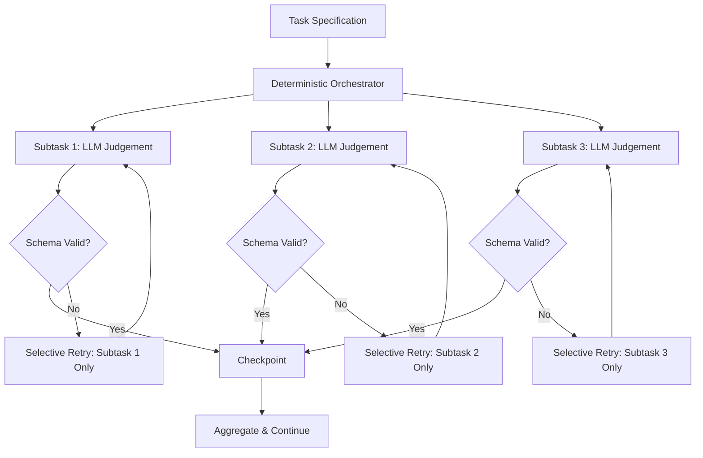

# Runtime-Structured Task Decomposition: What RSTD Reveals About Escaping the Monolithic Prompt Trap — and How Codex CLI's Architecture Already Implements It


---

## The Monolithic Prompt Problem

Most developers using coding agents start the same way: dump the entire task description into a single prompt and hope for the best. For trivial changes this works. For anything involving multiple files, conditional logic, or validation checkpoints, it produces what Asthana et al. call "brittle behaviour, limited debuggability, and high retry costs" [^1].

When a monolithic prompt fails halfway through a ten-step task, you have two options: retry the entire thing (burning tokens and time) or manually extract whatever partial progress the agent made. Neither scales.

The Runtime-Structured Task Decomposition (RSTD) pattern, published at the ACM Conference on AI and Agentic Systems 2026 [^1], formalises what experienced Codex CLI users have been discovering empirically: separate orchestration from judgement, validate at every boundary, and isolate failures to the smallest retryable unit.

---

## RSTD: The Core Pattern

RSTD externalises task structure into executable control flow. Rather than encoding steps, branches, and error handling inside a prompt, the pattern delegates orchestration to deterministic code and reserves LLM invocations for narrowly scoped judgement calls with schema-validated outputs [^1].



Three configurations were evaluated across 10 runs each on the Mellea generative computing framework [^1]:

| Configuration | Retry Cost (tokens) | Failure Isolation |
|---|---|---|
| Monolithic | 904 ± 17 | None — full rerun |
| Static Decomposition | 1,632 ± 145 | Partial — downstream cascade |
| RSTD (Runtime-Structured) | 436 ± 132 | Complete — subtask-level |

The runtime-structured approach achieved **up to 51.7% lower retry cost** than monolithic systems [^1]. Static decomposition actually performed *worse* than monolithic under failure conditions because failures cascaded through fixed downstream subtasks without the ability to reroute.

---

## Why This Matters: The Harness Thesis

The "Code as Agent Harness" survey (42 researchers, arXiv:2605.18747) identifies four properties every code-centric agent system needs: **executable**, **inspectable**, **stateful**, and **governed** [^2]. RSTD satisfies all four:

- **Executable**: subtask outputs are schema-validated and runnable
- **Inspectable**: each subtask's input/output pair is logged independently
- **Stateful**: checkpoints persist progress across context resets
- **Governed**: orchestration code enforces sequencing, budget limits, and permission boundaries

This frames RSTD not as a novel invention but as the natural consequence of treating code — not prompts — as the orchestration substrate.

---

## How Codex CLI Already Implements RSTD

Codex CLI's architecture maps almost perfectly onto RSTD's three-layer separation. Here is how each RSTD principle translates to concrete Codex CLI configuration:

### 1. Deterministic Orchestration via `codex exec`

The `codex exec` command is a single-shot, non-interactive invocation designed for scripts and CI pipelines [^3]. It streams progress to stderr, prints the final agent message to stdout, and exits with a meaningful exit code. This is your deterministic orchestrator — the code that sequences subtasks:

```bash
#!/usr/bin/env bash
set -euo pipefail

# Subtask 1: Analyse the change
codex exec --json --output-schema schema/analysis.json \
  "Analyse the diff in feature-branch and identify affected modules" \
  > /tmp/analysis.jsonl

# Subtask 2: Generate tests (only if analysis found untested paths)
if jq -e '.untested_paths | length > 0' /tmp/analysis.jsonl; then
  codex exec --sandbox workspace-write \
    "Generate tests for the untested paths identified in /tmp/analysis.jsonl"
fi

# Subtask 3: Validate
codex exec --sandbox read-only \
  "Run the test suite and report pass/fail with coverage delta"
```

Each invocation is independent. If Subtask 2 fails, you retry *only* Subtask 2 — the orchestrating shell script handles isolation automatically.

### 2. Narrow LLM Judgement with Schema Validation

The `--output-schema` flag forces Codex to produce structured JSON conforming to a declared schema [^3]. This is RSTD's "schema-validated outputs" principle made concrete:

```bash
codex exec --output-schema '{"type":"object","properties":{"risk_level":{"enum":["low","medium","high"]},"affected_files":{"type":"array","items":{"type":"string"}},"recommendation":{"type":"string"}},"required":["risk_level","affected_files","recommendation"]}' \
  "Assess the security risk of this PR"
```

If the model's response doesn't conform, the invocation fails with a non-zero exit code — no silent corruption.

### 3. Subagent Delegation with Per-Agent Model Routing

Custom agents defined as TOML files under `.codex/agents/` provide RSTD's subtask specialisation [^4]. Each subagent can specify its own model, sandbox mode, and constraints:

```toml
# .codex/agents/test-generator.toml
name = "test-generator"
model = "o4-mini"
model_reasoning_effort = "medium"
sandbox_mode = "workspace-write"

[instructions]
content = """
You are a test generation specialist. Generate tests for the specified
modules. Use pytest. Achieve branch coverage > 80%. Do not modify
production code.
"""
```

```toml
# .codex/agents/security-reviewer.toml
name = "security-reviewer"
model = "o3"
model_reasoning_effort = "high"
sandbox_mode = "read-only"

[instructions]
content = """
You are a security reviewer. Analyse the diff for CWE-class vulnerabilities.
Report findings as structured JSON. Never suggest fixes — only identify issues.
"""
```

The parent thread spawns these as subagents, each operating in isolation with its own token budget and sandbox permissions [^4]. This is selective retry at the agent level — if the security reviewer hallucinates, you re-run only that agent without touching the test generator's completed work.

### 4. PostToolUse Hooks as Checkpoint Validators

RSTD requires "validated intermediate signals" at subtask boundaries. Codex CLI's hook system provides exactly this [^5]:

```toml
# .codex/config.toml
[[hooks.post_tool_use]]
event = "post_tool_use"
command = "python .codex/hooks/validate_checkpoint.py"
```

```python
#!/usr/bin/env python3
# .codex/hooks/validate_checkpoint.py
import json, sys

event = json.loads(sys.stdin.read())
tool_name = event.get("tool_name", "")
output = event.get("output", "")

# Validate that file writes conform to project schema
if tool_name == "write_file" and event.get("path", "").endswith(".json"):
    try:
        json.loads(output)
    except json.JSONDecodeError:
        print(json.dumps({"action": "reject", "reason": "Invalid JSON written"}))
        sys.exit(0)

print(json.dumps({"action": "allow"}))
```

Each hook invocation is a checkpoint in the RSTD sense — a deterministic gate that validates the LLM's output before orchestration proceeds.

---

## RSTD in CI: The `codex-action` Integration

The `openai/codex-action@v1` GitHub Action [^6] brings RSTD patterns into CI pipelines. A decomposed workflow might look like:


```yaml
# .github/workflows/rstd-review.yml
name: RSTD Code Review
on: [pull_request]

jobs:
  analyse:
    runs-on: ubuntu-latest
    outputs:
      analysis: ${{ steps.analyse.outputs.result }}
    steps:
      - uses: actions/checkout@v4
      - uses: openai/codex-action@v1
        id: analyse
        with:
          prompt: "Analyse this PR diff. Output affected modules and risk assessment."
          sandbox: read-only
          output-schema: .codex/schemas/pr-analysis.json

  review:
    needs: analyse
    runs-on: ubuntu-latest
    if: fromJSON(needs.analyse.outputs.analysis).risk_level != 'low'
    steps:
      - uses: actions/checkout@v4
      - uses: openai/codex-action@v1
        with:
          prompt-file: .codex/prompts/security-review.md
          sandbox: read-only

  suggest-fixes:
    needs: [analyse, review]
    runs-on: ubuntu-latest
    steps:
      - uses: actions/checkout@v4
      - uses: openai/codex-action@v1
        with:
          prompt: "Based on the review findings, suggest minimal fixes."
          sandbox: workspace-write
```


Each job is an independent, retryable subtask. GitHub Actions handles the orchestration deterministically. Failures in `review` don't force re-running `analyse`.

---

## Configuration Recipe: RSTD-Aligned Profile

```toml
# ~/.codex/config.toml

[profiles.rstd]
model = "o3"
model_reasoning_effort = "medium"
sandbox_mode = "read-only"
rollout_token_budget = 50000

[profiles.rstd.agents]
max_threads = 4
max_depth = 1

# Subtask-specific overrides via custom agents
# Each agent gets its own budget slice
```

```markdown
<!-- AGENTS.md -->
## Task Decomposition Rules

1. Never attempt multi-file refactoring in a single turn
2. For tasks touching > 3 files, decompose into per-module subtasks
3. Each subtask must produce a schema-validated checkpoint before proceeding
4. If a subtask fails twice, escalate to the parent thread with a structured error report
5. Do not retry downstream subtasks when an upstream subtask has been modified
```

---

## When RSTD Costs More Than It Saves

RSTD is not free. The orchestration overhead — spawning subagents, validating schemas, managing checkpoints — adds latency and token cost for simple tasks. The RSTD paper's own data shows that for tasks with zero failures, the monolithic approach is cheaper because there is nothing to retry [^1].

The breakeven point is roughly: **if your task has > 20% failure probability at any step, RSTD's isolation pays for itself within two runs**. For CI pipelines running against every PR, this threshold is almost always met.

---

## Key Takeaways

| RSTD Principle | Codex CLI Implementation |
|---|---|
| Deterministic orchestration | Shell scripts + `codex exec` |
| Schema-validated LLM output | `--output-schema` flag |
| Subtask specialisation | Custom agents in `.codex/agents/` |
| Selective retry | Independent `codex exec` invocations |
| Checkpoint validation | PostToolUse hooks |
| Budget isolation | Per-agent `rollout_token_budget` |

The monolithic prompt is the coding agent equivalent of a 2,000-line function. RSTD — and Codex CLI's architecture — gives you the tools to decompose it into testable, retryable, governed units. The research confirms what production usage demonstrates: structure your agent work like you structure your code.

---

## Citations

[^1]: Asthana, S., Zhang, B., DeLuca, C., Patel, H., & Mahindru, R. (2026). "Runtime-Structured Task Decomposition for Agentic Coding Systems." arXiv:2605.15425. ACM Conference on AI and Agentic Systems, Agentic Software Engineering Workshop. https://arxiv.org/abs/2605.15425

[^2]: Ning, X. et al. (2026). "Code as Agent Harness." arXiv:2605.18747. https://arxiv.org/abs/2605.18747

[^3]: OpenAI. (2026). "Non-interactive mode — Codex CLI." OpenAI Developers. https://developers.openai.com/codex/noninteractive

[^4]: OpenAI. (2026). "Subagents — Codex." OpenAI Developers. https://developers.openai.com/codex/subagents

[^5]: OpenAI. (2026). "Agent approvals & security — Codex." OpenAI Developers. https://developers.openai.com/codex/agent-approvals-security

[^6]: OpenAI. (2026). "GitHub Action — Codex." OpenAI Developers. https://developers.openai.com/codex/github-action
