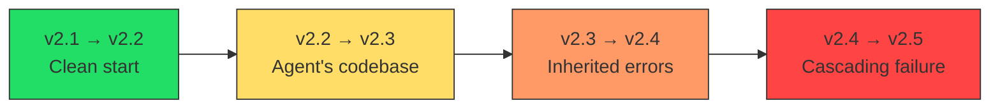
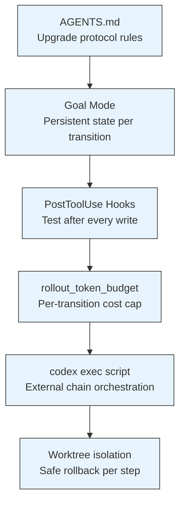

# SWE-Chain and the Chained Upgrade Problem: Why Your Agent Breaks at Version Three — and How Codex CLI's Goal Mode Keeps the Chain Intact


---

## The Real Maintenance Problem Nobody Benchmarked

Most coding-agent benchmarks test isolated tasks: fix one bug, implement one feature, resolve one issue. Real software maintenance looks nothing like this. When you upgrade a package from v2.1 to v2.4, you pass through v2.2 and v2.3 first — and each transition inherits the agent's prior changes. A mistake at step two poisons every subsequent step.

Until May 2026, no benchmark captured this cascading dependency. SWE-Chain [^1] fills that gap by evaluating coding agents on **chained release-level package upgrades**, where each version transition builds on the agent's own prior codebase rather than a clean reference.

## What SWE-Chain Measures

SWE-Chain contains 12 upgrade chains across 9 real Python packages, totalling 155 version transitions and 1,660 grounded upgrade requirements [^1]. The packages span the difficulty spectrum:

| Difficulty | Packages | Avg Resolve Rate |
|-----------|----------|-----------------|
| Easier | PyJWT, Jinja2 | < 70% |
| Harder | conan, xarray | < 30% |

The benchmark's synthesis pipeline aligns release notes with code diffs for each version transition, ensuring requirements are grounded in actual code changes rather than invented scenarios [^1].

### The Build+Fix Regime

SWE-Chain introduces the **Build+Fix** evaluation regime to prevent over-penalisation from incompatible environment setups. Under this regime, agents that encounter build failures receive a fix opportunity before scoring, leaving genuine capability gaps intact while removing environmental noise [^1].

## The Results: Cascading Degradation

Across nine frontier agent-model configurations [^1]:

| Agent | Resolving | Precision | F1 |
|-------|-----------|-----------|-----|
| Claude-Opus-4.7 (Claude Code) | 60.8% | 80.6% | 68.5% |
| GPT-5.5 | ~55% | ~72% | ~62% |
| Average (all 9) | 44.8% | 65.4% | 50.2% |

The critical finding: **open-weight models remain competitive on easier chains but degrade sharply on harder ones** [^1]. This degradation is not random — it follows a pattern. Errors compound across transitions because the agent operates on its own modified codebase, not a clean reference. A partially-correct upgrade at step N becomes a corrupted starting point for step N+1.



## Why Single-Shot Agents Fail at Chains

Three failure modes emerge from the SWE-Chain results:

1. **State amnesia** — the agent cannot recall what it changed two transitions ago, leading to conflicting modifications
2. **Regression blindness** — without running the full test suite after each step, the agent silently breaks previously-working functionality
3. **Specification drift** — release notes describe changes relative to the *official* prior version, but the agent's codebase has diverged from official, making requirements ambiguous

These failures map directly to architectural limitations in how most agents handle sequential work: no persistent state, no checkpointing, no intermediate validation.

## Codex CLI's Architecture for Chained Work

Codex CLI provides several mechanisms that directly address SWE-Chain's identified failure modes. Here is how to configure them for a multi-version upgrade chain.

### Goal Mode: Persistent Objectives Across Transitions

The `/goal` command (introduced in v0.128 [^2]) creates a persisted, stateful objective that survives across sessions. Unlike single-turn prompts, goals maintain completion conditions, success checks, and constraint invariants across the entire chain [^2].

```bash
codex goal "Upgrade flask from 2.3.0 through 2.3.1, 2.3.2, to 2.3.3 sequentially. \
  After each transition: run full test suite, commit passing state, \
  only proceed if all tests green."
```

The goal's state machine checkpoints after each transition, meaning a failure at v2.3.2 does not require restarting from v2.3.0 [^2]. This directly addresses **state amnesia** — the goal's memory file persists what was changed and why.

### Chained Goals for Sequential Enforcement

Codex CLI supports chained goals where completing one objective automatically triggers the next [^3]. For package upgrades, this enforces strict ordering:

```bash
# Define the chain in AGENTS.md
codex goal "Upgrade to v2.3.1 per UPGRADE-2.3.1.md requirements"
# On completion, automatically triggers:
codex goal "Upgrade to v2.3.2 per UPGRADE-2.3.2.md requirements"
```

Each goal in the chain has its own token budget via `rollout_token_budget`, preventing a single difficult transition from exhausting the entire session's allocation [^4].

### PostToolUse Hooks: Intermediate Validation

To address **regression blindness**, configure PostToolUse hooks that enforce test execution after every file write during an upgrade:

```toml
# .codex/config.toml
[hooks.post_tool_use]
command = "pytest tests/ --tb=short -q"
trigger_on = ["write_file", "apply_patch"]
abort_on_failure = true
```

This ensures the agent cannot proceed past a broken state. In SWE-Chain terms, it converts the Build+Fix regime into Build+Test+Fix — catching regressions at the point of introduction rather than at chain's end [^5].

### AGENTS.md: Encoding Upgrade Discipline

The AGENTS.md file provides deterministic constraints that address **specification drift**:

```markdown
# Upgrade Protocol

## Sequential Upgrade Rules
1. Never skip a version transition — upgrade one minor version at a time
2. After each transition, run `pytest` AND `mypy --strict` before proceeding
3. If tests fail, fix within the current transition before moving forward
4. Commit after each successful transition with message: "upgrade: vX.Y.Z → vX.Y.W"
5. Read the CHANGELOG.md diff between versions before starting each transition

## Regression Prevention
- Never remove existing test files during an upgrade
- If a deprecated API is removed, grep the entire codebase for usage first
- Maintain a UPGRADE-LOG.md tracking what changed at each step
```

This encoding forces the agent to treat each transition as a discrete, validated step — exactly the discipline that SWE-Chain reveals most agents lack [^6].

### codex exec: Scripted Chain Orchestration

For CI environments or fully automated upgrade pipelines, `codex exec` provides non-interactive execution that integrates with shell scripting [^7]:

```bash
#!/bin/bash
set -e

VERSIONS=("2.3.1" "2.3.2" "2.3.3")
PREV="2.3.0"

for VERSION in "${VERSIONS[@]}"; do
  echo "Upgrading from $PREV to $VERSION..."

  codex exec \
    --sandbox workspace-write \
    --model gpt-5.5 \
    "Upgrade this package from v$PREV to v$VERSION. \
     Follow AGENTS.md upgrade protocol. \
     Run tests after changes. Report pass/fail." \
    2>/dev/null

  # Verify tests pass before proceeding
  pytest tests/ --tb=short -q || exit 1

  git add -A && git commit -m "upgrade: v$PREV → v$VERSION"
  PREV=$VERSION
done
```

This script provides the external orchestration that prevents the agent from skipping steps or proceeding past failures — the deterministic harness around the LLM's probabilistic execution [^7].

### Worktree Isolation for Safe Experimentation

For upgrades where a transition might fail catastrophically, Codex CLI's worktree support lets you attempt each transition in isolation [^8]:

```bash
# Attempt upgrade in isolated worktree
git worktree add ../upgrade-attempt-v2.3.2 HEAD
cd ../upgrade-attempt-v2.3.2

codex exec "Upgrade to v2.3.2 per requirements"

# Only merge back if successful
if pytest tests/ -q; then
  cd ../main-repo
  git merge ../upgrade-attempt-v2.3.2
fi
```

## The Configuration Stack

Putting it all together, a complete Codex CLI configuration for SWE-Chain-style chained upgrades:



## Practical Implications

SWE-Chain demonstrates that the gap between isolated-task performance and chained-task performance is substantial — even the best agent drops from SWE-bench Verified scores above 75% to 60.8% when tasks are chained [^1]. This ~15 percentage point degradation represents real maintenance failures that would ship broken code.

The lesson for Codex CLI practitioners: **never run multi-version upgrades as a single monolithic prompt**. Instead:

1. Decompose into one goal per version transition
2. Gate progression on test suite passage
3. Checkpoint state after each successful transition
4. Budget tokens per transition, not per chain
5. Use deterministic AGENTS.md rules to prevent drift

The agents that perform best on SWE-Chain are those with the strongest harness discipline — precisely the layered configuration that Codex CLI's architecture enables.

## Citations

[^1]: Lam, M.H., Wang, C., Liu, H., Xiao, J., Li, H., Huang, J., Zhuo, T.Y., & Lyu, M.R. (2026). *SWE-Chain: Benchmarking Coding Agents on Chained Release-Level Package Upgrades*. arXiv:2605.14415. https://arxiv.org/abs/2605.14415

[^2]: OpenAI. (2026). *Using Goals in Codex*. OpenAI Developers Cookbook. https://developers.openai.com/cookbook/examples/codex/using_goals_in_codex

[^3]: OpenAI. (2026). *Features — Codex CLI*. OpenAI Developers. https://developers.openai.com/codex/cli/features

[^4]: OpenAI. (2026). *Changelog — Codex*. OpenAI Developers. https://developers.openai.com/codex/changelog

[^5]: OpenAI. (2026). *CLI — Codex*. OpenAI Developers. https://developers.openai.com/codex/cli

[^6]: Crosley, B. (2026). *Codex CLI Guide 2026: Setup, Sandbox, AGENTS.md & MCP*. https://blakecrosley.com/guides/codex

[^7]: OpenAI. (2026). *Non-interactive mode — Codex*. OpenAI Developers. https://developers.openai.com/codex/noninteractive

[^8]: Vaughan, D. (2026). *Worktree-Based Parallel Development with Codex CLI*. Codex Knowledge Base. https://codex.danielvaughan.com/2026/03/26/codex-cli-worktree-parallel-development/
