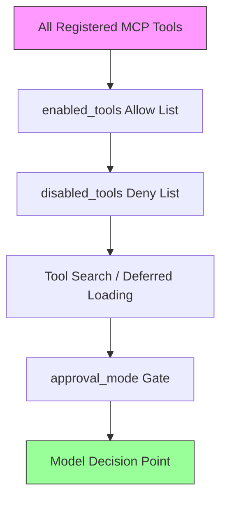
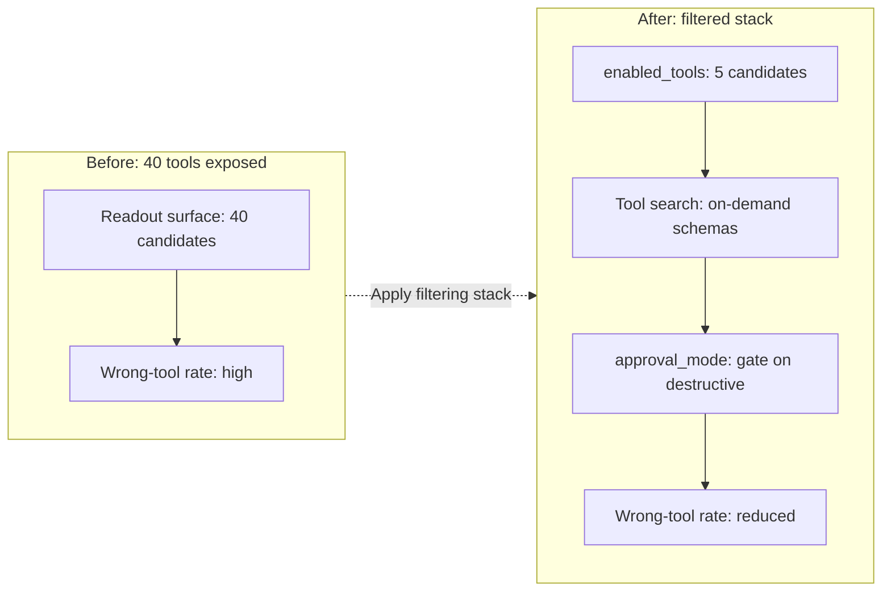

# Tool-Selection Failures and the Readout Bottleneck: Why Your Agent Sees the Right Tool but Picks the Wrong One — and How Codex CLI's Filtering Stack Closes the Gap


---

Your agent has forty MCP tools registered, a crisp system prompt, and a well-structured `AGENTS.md`. It still calls `update_issue` when it should call `create_issue`. The instinct is to blame the prompt — maybe the tool descriptions are ambiguous, maybe the context window is too crowded. Three recent research papers converge on a different diagnosis: the model *attends* to the correct tool most of the time but fails at the moment it commits to an output token. The bottleneck is at readout, not retrieval.

This article unpacks what those papers reveal, why their findings matter for anyone running tool-heavy Codex CLI workflows, and how to configure Codex CLI's layered tool-filtering stack to shrink the failure surface before the model's readout layer ever gets involved.

## The Readout Bottleneck: Looking Is Not Picking

Chen's "Looking Is Not Picking" (arXiv:2606.16364, June 2026) [^1] presents an attention-segment analysis of tool-selection failures across ten models spanning 3–32B parameters. The headline result is striking: on 198 real failures from the Berkeley Function Calling Leaderboard (BFCL), the model's attention mechanism correctly identifies the gold tool as the most-attended segment 80% of the time, against a 21% random baseline [^1]. The gold tool is genuinely under-attended in only 10% of failure cases.

The failure happens later, during output generation. Chen demonstrates this with a clean experimental separation:

| Intervention type | Failure recovery rate |
|---|---|
| Prompt reorder (gold-first) | 18.2% |
| Prompt duplicate | 16.7% |
| Attention-logit bias (readout) | 90.9% |
| Residual-stream steering (readout) | 90.9% |
| Output logit bias | 59.1% |

Input-side prompt engineering — reordering tools, duplicating definitions — recovers at most 23% of failures [^1]. Readout-side interventions recover 59–91%. The two readout interventions (attention-logit bias and residual-stream steering) overlap with Jaccard similarity 0.865, confirming the bottleneck is localised to the same mechanism regardless of representation [^1].

A training-free, gold-free confidence-gated selector using per-segment attention closes 11.9 points on BFCL and 14.9 points on Seal-Tools, with only ~15ms overhead against 226–283ms baseline generation [^1]. The effect is concentrated in the final quarter of transformer layers — boosting attention in earlier layers actually degrades performance.

### What This Means for Practitioners

Prompt engineering your tool descriptions has diminishing returns once descriptions are clear enough to attract attention. The model's readout mechanism is the bottleneck, and reducing the number of candidate tools presented at decision time is a more effective lever than rewriting descriptions.

## Selectivity Collapse: The 99% Success Paradox

Repantis et al.'s "The 99% Success Paradox" (arXiv:2605.18857, ICLR 2026 Blog Track) [^2] formalises why large tool sets create problems even for near-perfect selectors. The core insight: when all tool definitions are injected simultaneously into context, even a perfect tool selector achieves approximately 0.02 bits of selectivity over random chance [^2]. The collapse boundary is reached much faster for tools than for document retrieval because N (the number of candidates) is small enough that even marginal confusion compounds.

The most common failures the authors identify — wrong tool selection and incorrect parameters, especially among tools with similar names — are precisely the failure mode predicted by selectivity collapse [^2]. This dovetails with Chen's readout bottleneck: the model attends correctly but cannot reliably *commit* to the right output when multiple plausible candidates compete at the logit level.

## Causal Minimal Tool Filtering: Exposing Only What Is Needed

Suresh Babu and Ganesh Iyer's ToolChoiceConfusion (arXiv:2606.06284, June 2026) [^3] attacks the problem from the supply side. Their Causal Minimal Tool Filtering (CMTF) method uses lightweight precondition-effect contracts to expose only the minimal next-step tool frontier needed to advance from the current state towards the user's goal.

Across 102 tasks, 100 tools, four LLM backends, and 2,448 total runs [^3]:

- Visible tools per step reduced from 100 to 1
- Token usage reduced by approximately 90% relative to all-tools exposure
- Task success matched the strongest causal baseline

The key distinction from semantic retrieval: a tool may be *related* to the task whilst still being unnecessary or premature at the current step [^3]. CMTF filters by causal sufficiency rather than relevance, eliminating the "plausible distractor" problem that drives selectivity collapse.

## How These Findings Map to Codex CLI

Codex CLI provides a layered tool-management architecture that implements several of these principles — not at the attention-weight level, but at the architectural level where practitioners can act. The stack operates in three tiers:



### Tier 1: Static Filtering with `enabled_tools` and `disabled_tools`

The most direct application of the CMTF principle is Codex CLI's per-server tool filtering [^4]. For each MCP server, you can declare an explicit allow list:

```toml
[mcp_servers.github]
enabled = true
command = "npx"
args = ["-y", "@modelcontextprotocol/server-github"]
env = { "GITHUB_PERSONAL_ACCESS_TOKEN" = "${GITHUB_TOKEN}" }
enabled_tools = ["create_issue", "list_issues", "get_file_contents"]
disabled_tools = ["delete_repository"]
```

The `enabled_tools` array acts as a causal frontier filter: only the tools the agent genuinely needs for its assigned workflow are exposed [^4]. The `disabled_tools` deny list is applied after `enabled_tools`, providing defence-in-depth against tools that should never be callable regardless of context [^4].

This directly addresses the selectivity collapse problem. An agent that sees three GitHub tools instead of thirty has a readout decision surface three candidates wide rather than thirty. Chen's data shows that readout failures scale with candidate count [^1]; reducing candidates is the highest-leverage intervention available without white-box model access.

### Tier 2: Deferred Loading and Tool Search

Since v0.142.2 (June 2026), Codex CLI uses MCP tool search by default when supported [^5]. Instead of injecting every tool schema into the system prompt upfront, the model receives a lightweight index of names and brief descriptions. Full definitions are retrieved on demand when the model determines it needs a specific tool.

This implements a form of temporal CMTF: the model sees the full schema only at the moment of use, not throughout the entire conversation. The prompt prefix remains stable — which matters for prompt cache efficiency [^6] — and the readout decision surface at any given step contains only the tools the model has actively requested.

```toml
# Tool search is default as of v0.142.2
# To disable for a specific server:
[mcp_servers.legacy_server]
tool_search = false
```

### Tier 3: Approval Mode as a Decision Gate

Even after filtering and deferred loading, Codex CLI's `approval_mode` configuration adds a final gate [^4]:

```toml
[mcp_servers.database]
default_tools_approval_mode = "prompt"

[mcp_servers.database.tools.read_query]
approval_mode = "auto"

[mcp_servers.database.tools.write_query]
approval_mode = "prompt"
```

This is not a tool-selection intervention in the Chen sense — it does not change which tool the model picks. But it catches the *consequences* of readout failures before they execute. For high-stakes tools where a wrong selection could be destructive, `prompt` mode converts a silent failure into a visible one.

### Tier 4: `tool_output_token_limit` as Context Hygiene

A subtler contributor to tool-selection failures is context pollution from previous tool outputs [^6]. A single `cat` of a large log file can consume tens of thousands of tokens, crowding the context window and degrading the model's ability to discriminate between tools on subsequent calls.

```toml
tool_output_token_limit = 12000
```

This caps per-tool-call output in history, keeping the context window clean for accurate tool selection on later turns. It addresses the "lost in the middle" effect that Chen identifies as a secondary factor: gold tools in middle positions are attended with coefficient 0.0271 versus 0.0449 in first position [^1].

## A Practical Filtering Strategy

Combining the research findings with Codex CLI's configuration surface, here is a four-step strategy for reducing tool-selection failures:

### Step 1: Audit Your Tool Surface

Count the tools your agent sees. If a single MCP server exposes more than 15 tools and your workflow uses fewer than 5, you are in selectivity-collapse territory [^2].

```bash
codex mcp list --tools
```

### Step 2: Apply Static Filters

For each MCP server, declare `enabled_tools` containing only the tools your workflow requires. This is the single highest-impact change — it reduces the readout candidate surface before the model processes anything.

### Step 3: Rely on Tool Search for Discovery Workflows

For exploratory tasks where the needed tools are not known in advance, ensure tool search is enabled (the default since v0.142.2) [^5]. This avoids upfront schema injection whilst still allowing the agent to discover tools as needed.

### Step 4: Gate Destructive Tools

Apply `approval_mode = "prompt"` to any tool where a selection error would have irreversible consequences. This is your safety net for the residual 10% of failures where even good filtering cannot prevent a readout error [^1].



## Enterprise Considerations

For organisations using Codex CLI's managed configuration (`requirements.toml`), tool filtering can be enforced fleet-wide [^7]. The `mcp_servers` allowlist in `requirements.toml` ensures that only approved servers and tool identities are enabled across the organisation:

```toml
# requirements.toml (admin-managed)
[mcp_servers]
allowlist = ["github", "jira", "datadog"]
```

This prevents individual developers from registering arbitrary MCP servers that inflate the tool surface beyond what the readout mechanism can reliably handle. Combined with per-server `enabled_tools` in the project-level `config.toml`, it creates a two-tier governance model: organisational server approval and project-level tool curation.

## The Limits of Architectural Filtering

It is worth noting what these interventions cannot fix. Chen's confidence-gated selector achieves 90.9% failure recovery but still breaks 2.7% of previously successful calls [^1]. The selector does not transfer to multi-turn scenarios, where the readout dynamics change [^1]. And argument-level errors — calling the right tool with wrong parameters — are outside the scope of tool-name selection entirely.

Codex CLI's `PostToolUse` hooks can catch some argument errors after execution, but the readout bottleneck for argument generation is a separate and less-studied problem. Chen's hard name-forcing protocol shows that even with the correct tool name constrained, AST (argument) scores drop 19.1 points below free generation [^1] — the model generates better arguments when it selects the tool name itself.

## Conclusion

The convergence of "Looking Is Not Picking," the 99% Success Paradox, and ToolChoiceConfusion points to a clear architectural principle: **reduce the candidate set before the readout layer, not after**. Prompt engineering tool descriptions is necessary but insufficient; the readout bottleneck means that fewer, well-chosen candidates outperform many, well-described ones.

Codex CLI's `enabled_tools`/`disabled_tools` filtering, default tool search with deferred loading, and per-tool approval modes implement this principle at the configuration level. The practical takeaway is straightforward: audit your tool surface, filter aggressively, and reserve prompt mode for the tools where a readout error would hurt most.

---

## Citations

[^1]: Chen, S. (2026). "Looking Is Not Picking: An Attention-Segment Account of Tool-Selection Failures in LLM Agents." arXiv:2606.16364. [https://arxiv.org/abs/2606.16364](https://arxiv.org/abs/2606.16364)

[^2]: Repantis, V., Singh, H., Joseph, T., Zhang, C., Vishwakarma, A., Karslioglu, S., Thot, M. W., & Gawde, A. (2026). "The 99% Success Paradox: When Near-Perfect Retrieval Equals Random Selection." arXiv:2605.18857. ICLR 2026 Blog Track. [https://arxiv.org/abs/2605.18857](https://arxiv.org/abs/2605.18857)

[^3]: Suresh Babu, R. & Ganesh Iyer, L. (2026). "ToolChoiceConfusion: Causal Minimal Tool Filtering for Reliable LLM Agents." arXiv:2606.06284. [https://arxiv.org/abs/2606.06284](https://arxiv.org/abs/2606.06284)

[^4]: OpenAI. (2026). "Model Context Protocol — Codex CLI." OpenAI Developers. [https://developers.openai.com/codex/mcp](https://developers.openai.com/codex/mcp)

[^5]: OpenAI. (2026). "Changelog — Codex CLI." OpenAI Developers. [https://developers.openai.com/codex/changelog](https://developers.openai.com/codex/changelog)

[^6]: OpenAI. (2026). "Configuration Reference — Codex CLI." OpenAI Developers. [https://developers.openai.com/codex/config-reference](https://developers.openai.com/codex/config-reference)

[^7]: OpenAI. (2026). "Managed Configuration — Codex CLI." OpenAI Developers. [https://developers.openai.com/codex/enterprise/managed-configuration](https://developers.openai.com/codex/enterprise/managed-configuration)
