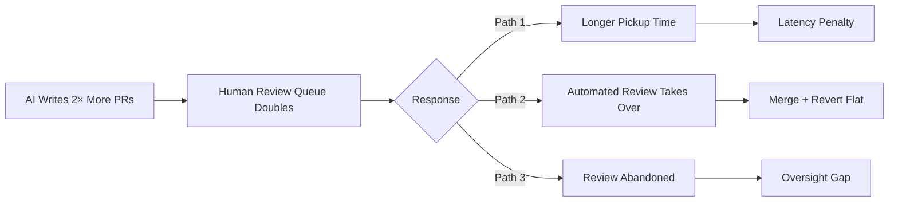
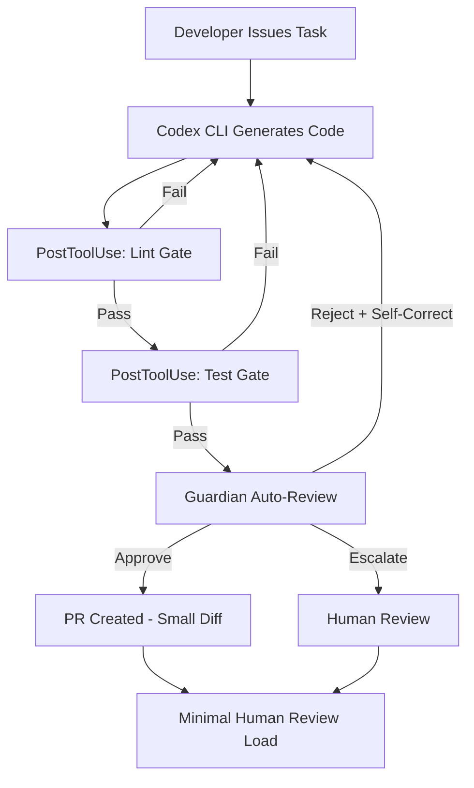

# AI Writes Faster Than Humans Can Review: What an Enterprise 2× Mandate Reveals About the Review Bottleneck — and How Codex CLI's Guardian Architecture Absorbs the Load


---

## The Throughput-Review Asymmetry

When an enterprise doubles its code output through AI tooling, something downstream must absorb the load. A longitudinal study published on 2 July 2026 — "AI Writes Faster Than Humans Can Review" by He, Agarwal, Denisov-Blanch, Azaletskiy, Koyejo and Vasilescu (arXiv:2607.01904) — presents the first instrumented evidence of what happens when a mid-sized B2B software company publicly mandates a 2× productivity target and actually hits it [^1]. The finding that matters for Codex CLI practitioners: **per-reviewer load roughly doubled and automated review overtook human review**, while merge and revert rates held steady. Code now ships under automated review without a measurable short-horizon quality penalty — but the human oversight signal has thinned to the point where review metrics no longer mean what they once did.

This article dissects the study's findings, contextualises them against concurrent research on AI-generated PR review quality, and maps the organisational response directly to Codex CLI's Guardian auto-review subagent, PostToolUse hooks, and diff-size control configuration.

---

## The Study: 802 Developers, 196,212 Pull Requests, 28 Months

He et al. secured research access to a company that publicly committed in June 2025 to doubling merged PRs per engineer per month [^1]. The dataset spans January 2024 to April 2026, covering 802 developers across 364 repositories. Key characteristics:

- **Tools observed:** Cursor (pre-mandate, deprecated Feb 2026) and Claude Code (from July 2025 onwards) [^1]
- **Model generations spanned:** Sonnet 4.5 (Sep 2025), Opus 4.5 (Nov 2025), Opus 4.6 (Feb 2026) [^1]
- **AI-authored PR share:** Climbed from near zero to ~90% by end of study window [^1]
- **Methodology:** Staggered difference-in-differences with developer fixed effects, standard errors clustered by developer [^1]

---

## Three Core Findings

### 1. The Doubling Is Real — but Gradual

Per-capita throughput rose from 21.2 PRs/month (baseline Jan–Apr 2025) to 44.3 in April 2026 — a 2.09× increase [^1]. Decomposition reveals two channels:

| Channel | Coefficient | Contribution (log pts) |
|---------|------------|----------------------|
| Adoption jump (β₁) | +0.143*** | +0.14 |
| Accumulating use (β) | +0.041*** | +0.45 |
| Residual mandate (θ) | −0.05 | −0.05 |
| **Total** | | **+0.54** |

The conservative estimate absorbing all monthly shocks yields 1.46× within-developer, reaching 1.99× at nine months on tool [^1]. The accumulating-use channel — not the initial adoption jump — supplies the larger share.

### 2. Broadly Shared but Concentrated in New Code

The gain is statistically indistinguishable across the seniority ladder (IC +27%, Senior +42%, Staff +39%, Principal +38%) [^1]. However, it concentrates sharply in newer repositories (+44%) versus legacy code (+12%, non-significant) [^1]. Management showed the largest effect at +86%, likely reflecting delegation of PR-authoring to agents [^1].

### 3. Review Restructured Around Automation

This is the finding with direct operational implications:

- **Per-reviewer load roughly doubled** as volume grew 3.1× company-wide [^1]
- **Automated review overtook human review** — AI review bots and policy bots account for ~38% of review rows even before the surge [^1]
- **Merge rate unchanged** (+0.006, non-significant) [^1]
- **Revert rate unchanged** (−0.004, marginal) [^1]
- **Per-PR AI penalty is review latency** — the within-author, within-month premium for AI-authored PRs manifests as longer time-to-first-human-review [^1]



The company's observed response was primarily Path 2: automated review absorbed the load while coarse quality metrics held steady. But the authors explicitly warn that "interpreting review metrics as indicators of human oversight" becomes unreliable once automation dominates [^1].

---

## Corroborating Evidence: The Wider Review Crisis

The He et al. findings align with concurrent research:

- **Khazanchi et al. (arXiv:2605.02273)** found that most AI-generated PRs on GitHub receive no human review at all, and when reviewed, interactions are "automation-mediated" rather than direct human feedback [^2]
- **The Faros AI 22,000-developer study** reported 98% more PRs but 91% longer review times and 54% more bugs in organisations aggressively adopting AI coding tools [^3]
- **Storey (2026)** introduced the concept of "cognitive and intent debt" — when code outpaces a team's capacity to absorb its meaning, technical debt compounds invisibly [^4]

The pattern is consistent: AI-driven throughput gains are achievable but they relocate rather than remove work, concentrating it in the review and maintenance phases.

---

## Mapping to Codex CLI's Review-Bottleneck Defences

Codex CLI's architecture provides a layered response to each failure mode the study identifies. The relevant configuration surfaces are:

### Guardian Auto-Review Subagent

The Guardian delegates approval decisions to an independent reviewer LLM instance [^5]. Set `approvals_reviewer = "guardian_subagent"` in `config.toml`:

```toml
[auto_review]
approvals_reviewer = "guardian_subagent"
```

In auto-review mode, sessions stop for human approval ~200× less often than in manual mode, while still catching actions humans would want stopped [^5]. For the ~1% of actions requiring review, Guardian approves ~99% — and when it rejects, Codex often self-corrects by finding a safer path [^5].

This directly addresses the He et al. finding: when per-reviewer load doubles, you need a reviewer that scales with throughput without introducing latency.

### PostToolUse Hooks for Review-Quality Gates

Rather than relying on post-merge metrics, encode review criteria as deterministic gates that fire on every tool invocation:

```toml
[[hooks]]
event = "PostToolUse"
match_tool = "write_file"
command = "scripts/lint-and-test.sh $FILEPATH"
blocking = true
timeout_ms = 30000
```

This implements the equivalent of the company's bot-review layer but at the agent level — before code ever reaches a PR. Each PostToolUse hook enforces a specific quality dimension (linting, test passage, security scanning) without relying on downstream human reviewers who are already overloaded [^6].

### Diff-Size Control via rollout_token_budget

The study shows AI-authored PRs are systematically larger (Table I: +0.317*** log points on average PR size after adoption) [^1]. Larger diffs are harder to review, compounding the bottleneck. Codex CLI provides direct control:

```toml
[features.rollout_budget]
limit_tokens = 50000
reminder_interval_tokens = 5000
```

Combined with `tool_output_token_limit` to cap context consumption:

```toml
[model]
tool_output_token_limit = 12000
```

These settings bound diff accumulation at the source, producing smaller, more reviewable units of work — the same "tiny diff" pattern that Bloomberg's Pomona agent found merges 88.2% of the time with median time-to-close under two hours [^7].

### AGENTS.md Review Contracts

Encode review expectations directly into the agent's instruction chain:

```markdown
# Review Standards

- Maximum 200 lines changed per PR
- Every PR must include a test that exercises the changed path
- Security-sensitive changes require human approval regardless of Guardian verdict
- Changes to authentication, billing, or data-deletion code are NEVER auto-approved
```

This implements what the study calls "the division of labor" — explicitly routing high-risk changes to human review while letting automation handle the volume [^1].

---

## A Configuration Recipe: Review-Bottleneck Defence Profile

Combining these layers into a named profile for review-conscious workflows:

```toml
[profile.review-safe]
model = "o4-mini"
approval_policy = "on-request"
approvals_reviewer = "guardian_subagent"

[profile.review-safe.features.rollout_budget]
limit_tokens = 40000
reminder_interval_tokens = 4000

[profile.review-safe.model]
tool_output_token_limit = 10000
model_auto_compact_token_limit = 80000
```

Invoke with:

```bash
codex --profile review-safe "Implement the login rate-limiter per JIRA-4521"
```



---

## The Organisational Implication

He et al. conclude that "an enterprise AI mandate is a process-redesign problem, not a tooling deployment" [^1]. The gain grows with accumulated use rather than arriving overnight, and it relocates work downstream rather than removing it. For teams using Codex CLI, this means:

1. **Instrument your review pipeline before scaling throughput** — Guardian and PostToolUse hooks must be configured before you turn agents loose on production code.
2. **Target intensity of use, not mere adoption** — the accumulating-use channel (+0.041 log points per unit of cumulative AI use) dominates the one-time adoption jump [^1].
3. **Bound diff size at the source** — every excess line generated is a line a human must eventually comprehend. Token budgets are review budgets.
4. **Separate high-risk from routine** — explicit AGENTS.md contracts route security-critical changes to human reviewers while letting Guardian handle the 99% that need no human intervention.

The review bottleneck is not an argument against AI-driven throughput gains. It is an argument for building the review architecture before you need it. Codex CLI's layered Guardian + hooks + budget system is precisely that architecture.

---

## Citations

[^1]: H. He, S. Agarwal, Y. Denisov-Blanch, P. Azaletskiy, S. Koyejo, and B. Vasilescu, "AI Writes Faster Than Humans Can Review: A Longitudinal Study of an Enterprise '2×' Mandate," arXiv:2607.01904, 2 July 2026. [https://arxiv.org/abs/2607.01904](https://arxiv.org/abs/2607.01904)

[^2]: M. Khazanchi et al., "These Aren't the Reviews You're Looking For: How Humans Review AI-Generated Pull Requests," arXiv:2605.02273, May 2026. [https://arxiv.org/abs/2605.02273](https://arxiv.org/abs/2605.02273)

[^3]: Faros AI, "The AI Coding Paradox: 22,000-Developer Study," 2026. ⚠️ Specific URL unverifiable at time of writing; figures cited from He et al. related-work contextualisation.

[^4]: M.-A. Storey, "Cognitive and Intent Debt in AI-Assisted Software Development," referenced in He et al. [^1] as [53]. ⚠️ Primary source not independently verified.

[^5]: OpenAI, "Auto-review — Codex," OpenAI Developers Documentation, 2026. [https://developers.openai.com/codex/concepts/sandboxing/auto-review](https://developers.openai.com/codex/concepts/sandboxing/auto-review)

[^6]: OpenAI, "Configuration Reference — Codex," OpenAI Developers Documentation, 2026. [https://developers.openai.com/codex/config-reference](https://developers.openai.com/codex/config-reference)

[^7]: D. Williams et al., "Pomona: A Kaizen-Inspired Agent for Continuous Code Quality Improvement," arXiv:2606.06752, June 2026. [https://arxiv.org/abs/2606.06752](https://arxiv.org/abs/2606.06752)
