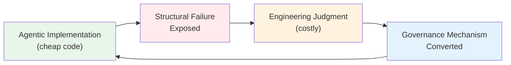
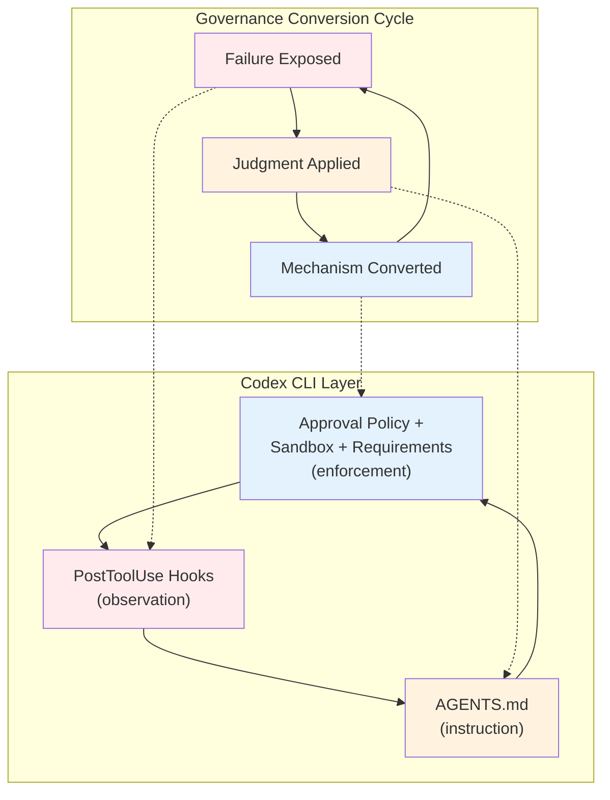

# Cheap Code, Costly Judgment: What a 420 KLOC Case Study Reveals About Governance Conversion — and How Codex CLI's Hook Architecture Operationalises It


---

## The Judgment Bottleneck

Generative AI has inverted the economics of software engineering. Code production, historically the scarce resource that shaped team structures, sprint cadences, and hiring plans, is now cheap. What remains expensive — and is growing more so — is the judgment required to decide whether that code belongs in production.

Davis et al. formalise this observation in *Cheap Code, Costly Judgment* (arXiv:2607.01087), a first-person case study in which a single expert engineer used frontier coding agents to build a document-accessibility remediation system over twelve weeks[^1]. The empirical record is substantial: 88 contemporaneous field notes, 420 KLOC of production code, and 1.16 MLOC of tests, lints, documentation, and agent tooling[^1]. From this record the authors develop a *governance conversion* process model — a candidate middle-range theory explaining how high-velocity agentic implementation becomes governable.

This article unpacks the governance conversion model, maps its stages to Codex CLI's configuration primitives, and shows how practitioners can wire the theory into their own workflows.

---

## The Governance Conversion Model

The core insight is that governance in agentic engineering is not imposed top-down from a compliance checklist. Instead, it is *discovered* bottom-up from the recurring structural failures that high-velocity code generation exposes[^1]. Davis et al. describe a cyclical process:



Each cycle converts a failure class into a reusable governance mechanism — an automated check, a review gate, a configuration constraint — that prevents recurrence without requiring the same judgment expenditure again. The model predicts that mature agentic codebases accumulate layers of converted governance, progressively narrowing the surface area where costly human judgment is still required.

### Failure Classes Identified

The case study catalogues several distinct failure patterns that recur across agentic sessions[^1]:

| Failure Class | Description | Governance Response |
|---|---|---|
| Accessibility violations | Generated code lacks WCAG 2.1 / ADA compliance | Automated scanning gates |
| Integration failures | Code incompatible with existing system contracts | Pre-merge validation hooks |
| Logic errors | Functionally incorrect despite syntactic validity | Test-driven acceptance criteria |
| Performance degradation | Unintended computational overhead | Runtime monitoring and budget limits |
| Security vulnerabilities | Exploitable weaknesses introduced silently | Static analysis and review gates |

The critical observation is that these failures are *not random*. They cluster around areas where the agent lacks domain context that the developer carries implicitly — accessibility standards, performance budgets, integration contracts. The governance conversion model predicts exactly these clusters: they are the residual judgment that cannot yet be automated.

---

## Governance Conversion in Context

Davis et al.'s work does not exist in isolation. Two companion papers published in the same period reinforce the framework:

**Governed AI-Assisted Engineering (GAIE)** by Kang (arXiv:2606.22484) proposes a three-tier graduated oversight model for regulated domains[^2]. The Oversight Classification Model routes tasks through human-in-the-loop, human-over-the-loop, or automated-with-monitoring tiers based on regulatory impact, customer proximity, reversibility, and data sensitivity. GAIE estimates that graduated oversight preserves 84–97% of agentic coding velocity (central estimate: 91%) while maintaining compliance coverage[^2].

**The Enterprise 2x Mandate study** by He et al. (arXiv:2607.01904) documents the consequences when governance conversion does not keep pace: at a mid-sized B2B company, per-reviewer load roughly doubled as AI-authored PR share approached 90%, and automated review overtook human review[^3]. Review latency became the binding constraint — precisely the "costly judgment" bottleneck that Davis et al. theorise.

Together, these papers converge on a single conclusion: the engineering problem is no longer whether AI can generate useful code, but how teams organise architectures, tools, evidence, and feedback loops so that AI-mediated development remains inspectable, correctable, and maintainable.

---

## Mapping Governance Conversion to Codex CLI

Codex CLI's configuration architecture maps remarkably well onto the governance conversion model. Each stage of the cycle — failure exposure, judgment application, mechanism conversion — has a corresponding CLI primitive.

### Stage 1: Failure Exposure via PostToolUse Hooks

PostToolUse hooks fire after every tool execution, capturing stdout, stderr, and exit codes[^4]. This is the observation layer that exposes structural failures. A governance-oriented PostToolUse hook inspects outputs for known failure signatures:

```json
{
  "hooks": {
    "PostToolUse": [
      {
        "matcher": "apply_patch",
        "hooks": [
          {
            "type": "command",
            "command": "scripts/governance/accessibility-scan.sh",
            "statusMessage": "Scanning for WCAG violations",
            "timeout": 30
          }
        ]
      }
    ]
  }
}
```

When the hook detects a violation, it returns a `block` decision with reasoning, injecting feedback into the agent's context. The agent sees the failure and can self-correct — converting what would have been a review-time discovery into a generation-time correction[^4].

### Stage 2: Judgment Encoding via AGENTS.md

AGENTS.md is the instruction layer where domain-specific judgment is encoded as natural-language constraints[^5]. Davis et al.'s accessibility requirements, integration contracts, and performance budgets translate directly:

```markdown
# AGENTS.md — Governance Contracts

## Accessibility
All generated HTML must pass WCAG 2.1 AA. Use semantic markup.
Never use colour alone to convey information. Every image requires alt text.

## Integration Contracts
Do not modify public API signatures without updating the OpenAPI spec.
All database migrations must be reversible.

## Performance
No single API endpoint may exceed 200ms p95 latency.
Bundle size increases above 5KB require justification in the PR description.
```

Research from McMillan (arXiv:2605.10039) shows that AGENTS.md structure does not significantly affect compliance — signal density matters more than file organisation[^6]. Keep instructions concrete, testable, and close to the failure classes the team has actually observed.

### Stage 3: Mechanism Conversion via Approval Policies and Sandbox

The third stage converts judgment into enforcement. Codex CLI offers three enforcement layers:

**Approval policies** control when human review is required[^7]. The `on-request` policy requires explicit approval for side-effecting operations, whilst `untrusted` demands approval for every tool call. For governance conversion, the key insight is to start at `on-request` and progressively relax as automated checks mature:

```toml
# config.toml — graduated oversight
approval_policy = "on-request"

[sandbox]
mode = "workspace-write"
```

**Sandbox isolation** (`workspace-write`) constrains the blast radius of agent actions to the project workspace[^7]. This maps directly to GAIE's reversibility criterion: operations within the sandbox are inspectable and reversible; those outside require escalation.

**Managed requirements** (`requirements.toml`) let enterprise administrators enforce floor constraints that individual developers cannot override[^8]:

```toml
# requirements.toml — organisation-wide governance floor
[constraints]
approval_policy_minimum = "on-request"
sandbox_mode_minimum = "workspace-write"
allow_managed_hooks_only = true
```

This three-layer stack — hooks for observation, AGENTS.md for instruction, approval policies and sandbox for enforcement — mirrors the governance conversion cycle: expose failures, encode judgment, convert to mechanisms.

---

## The Governance Conversion Stack in Practice

The following diagram shows how the governance conversion model maps to Codex CLI's layered architecture:



### A Worked Example: Accessibility Governance

Consider a team building a public-facing web application. During the first week of agentic development, PostToolUse hooks flag repeated WCAG violations in generated HTML — missing alt text, insufficient colour contrast, non-semantic heading hierarchies.

**Week 1 — Failure exposure:** The PostToolUse hook runs `axe-core` against every HTML file the agent touches. Violations are logged and fed back as context.

**Week 2 — Judgment encoding:** The team adds accessibility constraints to AGENTS.md. The agent begins self-correcting before hooks fire. Violation rate drops but does not reach zero.

**Week 3 — Mechanism conversion:** The team adds a PreToolUse hook that injects a brief accessibility checklist into every `apply_patch` call targeting HTML files. A Stop hook prevents turn completion if any `axe-core` violations remain unresolved. The approval policy stays at `on-request` for HTML modifications but relaxes to automated approval for non-UI code.

This progression — observe, instruct, enforce — is exactly the governance conversion cycle that Davis et al. describe. Each iteration narrows the judgment surface area whilst preserving development velocity.

---

## Cost and Velocity Implications

Davis et al.'s case study produced 420 KLOC of production code and 1.16 MLOC of supporting material in twelve weeks — a ratio that would be extraordinary for a single engineer without agent assistance[^1]. But the authors are careful to note that raw output velocity is misleading without accounting for governance overhead.

Codex CLI's `rollout_token_budget` provides one mechanism for cost control at the turn level[^9]. Combined with PostToolUse hooks that track cumulative token spend, teams can implement the cost-awareness that Davis et al. recommend:

```toml
# Per-task token budget
rollout_token_budget = 50000
```

Kang's GAIE framework suggests that well-implemented graduated oversight preserves 84–97% of baseline velocity[^2]. The critical variable is not the governance itself but how quickly the team converts judgment into automated mechanisms. Teams that leave governance as manual review do not scale. Teams that convert governance into hooks and constraints compound their velocity advantage over time.

---

## Practical Recommendations

Drawing from Davis et al.'s field notes and the Codex CLI configuration surface:

1. **Start with observation, not restriction.** Deploy PostToolUse hooks in logging mode before adding enforcement. Let failure patterns emerge from real agent behaviour rather than anticipated risks.

2. **Write AGENTS.md from failures, not aspirations.** Every constraint should trace to an observed failure class. Aspirational rules that the agent cannot verify create false confidence.

3. **Graduate oversight deliberately.** Begin with `approval_policy = "on-request"` and relax per-tool or per-file-type as automated checks mature. Never jump to fully automated approval without an observation period.

4. **Track the judgment-to-mechanism ratio.** If the same failure class requires human judgment more than three times, it is a candidate for hook conversion. If a hook catches fewer than one violation per week, consider whether it is still necessary.

5. **Use managed requirements for floor constraints.** Organisation-wide governance floors (`requirements.toml`) prevent individual developers from inadvertently weakening the governance stack[^8].

6. **Budget tokens per task.** Use `rollout_token_budget` to bound the cost of any single agent turn, forcing the agent to work within resource constraints rather than generating unbounded output[^9].

---

## Conclusion

The shift from scarce code to abundant code is real and accelerating. Davis et al.'s governance conversion model provides the theoretical framework for managing this shift: observe failures, apply judgment, convert to mechanisms, repeat. Codex CLI's hook architecture, AGENTS.md instruction layer, and approval policy enforcement provide the operational toolkit.

The teams that thrive in the age of cheap code will not be those that generate the most output. They will be those that convert costly judgment into durable governance mechanisms fastest — compounding their ability to absorb agent velocity without sacrificing inspectability, correctability, and maintainability.

---

## Citations

[^1]: Davis, J.C., Amusuo, P.C., Singla, T., Cakar, B. & Davis, K.A. (2026). *Cheap Code, Costly Judgment: A Case Study on Governable Agentic Software Engineering*. arXiv:2607.01087. [https://arxiv.org/abs/2607.01087](https://arxiv.org/abs/2607.01087)

[^2]: Kang, R. (2026). *Governed AI-Assisted Engineering: Graduated Human Oversight for Agentic Code Generation in Regulated Domains*. arXiv:2606.22484. [https://arxiv.org/abs/2606.22484](https://arxiv.org/abs/2606.22484)

[^3]: He, S., Agarwal, A., Denisov-Blanch, D., Azaletskiy, P., Koyejo, S. & Vasilescu, B. (2026). *AI Writes Faster Than Humans Can Review*. arXiv:2607.01904. [https://arxiv.org/abs/2607.01904](https://arxiv.org/abs/2607.01904)

[^4]: OpenAI. (2026). *Hooks — Codex CLI*. OpenAI Developers. [https://developers.openai.com/codex/hooks](https://developers.openai.com/codex/hooks)

[^5]: OpenAI. (2026). *Custom instructions with AGENTS.md — Codex*. OpenAI Developers. [https://developers.openai.com/codex/guides/agents-md](https://developers.openai.com/codex/guides/agents-md)

[^6]: McMillan, D. (2026). *AGENTS.md Structure Doesn't Matter: A 16,050-Observation Factorial Study*. arXiv:2605.10039. [https://arxiv.org/abs/2605.10039](https://arxiv.org/abs/2605.10039)

[^7]: OpenAI. (2026). *Agent approvals & security — Codex*. OpenAI Developers. [https://developers.openai.com/codex/agent-approvals-security](https://developers.openai.com/codex/agent-approvals-security)

[^8]: OpenAI. (2026). *Managed configuration — Codex*. OpenAI Developers. [https://developers.openai.com/codex/enterprise/managed-configuration](https://developers.openai.com/codex/enterprise/managed-configuration)

[^9]: OpenAI. (2026). *Configuration Reference — Codex*. OpenAI Developers. [https://developers.openai.com/codex/config-reference](https://developers.openai.com/codex/config-reference)
