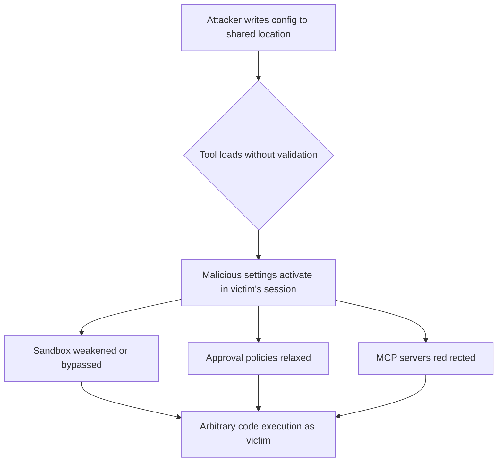
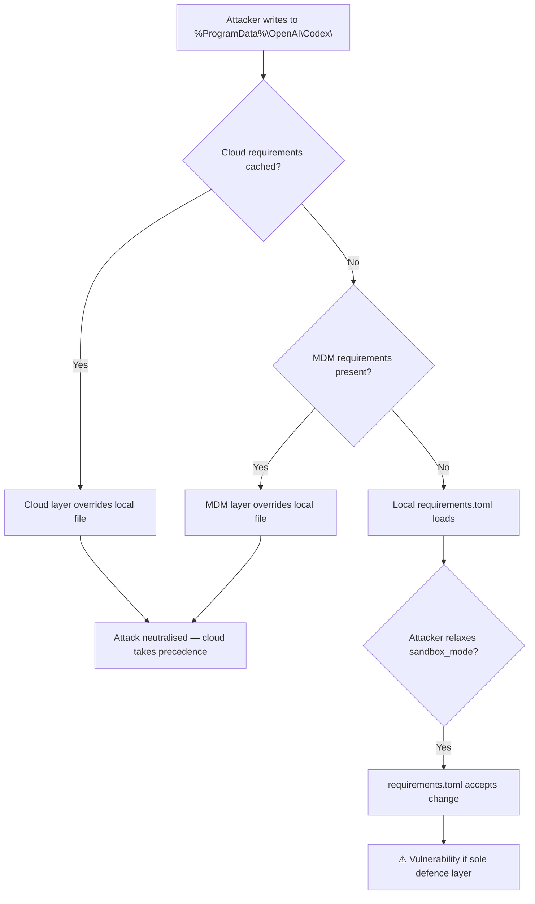

# CVE-2026-35603 and the Configuration Trust Problem: Why AI Coding Tools Need Layered Enforcement — and How Codex CLI's Managed Requirements Architecture Delivers It


---

## The One Writable Folder That Compromised Every User

In April 2026, Cymulate Research Labs disclosed CVE-2026-35603: a privilege escalation vulnerability in Claude Code on Windows that turned a default-permissive directory into a silent attack vector[^1]. The mechanism was devastatingly simple. Claude Code loaded system-wide managed settings from `C:\ProgramData\ClaudeCode\managed-settings.json` without validating directory ownership or access permissions[^2]. Because `ProgramData` is writable by non-administrative users by default, and the `ClaudeCode` subdirectory was not pre-created or access-restricted, any low-privileged local user could drop a configuration file that would execute within the session of the next user to launch the tool — including administrators[^2].

The result: local privilege escalation with persistence. Every subsequent launch by any user re-triggered the attacker's configuration[^1].

This is not a novel attack class. Configuration trust failures have plagued system software for decades. What makes CVE-2026-35603 significant is that it demonstrates how AI coding agents inherit the classic privilege escalation surface whilst adding new dimensions: the configuration they trust can influence not just their own behaviour but the behaviour of the code they generate and execute.

## The Configuration Trust Attack Surface in AI Coding Tools

AI coding agents load configuration from multiple locations to support enterprise management, project-specific customisation, and user preferences. This creates a hierarchy where each layer must be protected against injection from less-privileged contexts.

The attack pattern generalises across three vectors:



Any AI coding tool that loads configuration from a world-writable or user-writable system path without ownership validation is vulnerable. The impact is amplified because these tools routinely execute code, manage credentials, and interact with production systems.

## How Codex CLI's Architecture Addresses Configuration Trust

Codex CLI implements a four-layer configuration hierarchy with explicit trust boundaries at each transition[^3][^4]:

### Layer 1: Cloud-Managed Requirements (Highest Priority)

For ChatGPT Business and Enterprise plans, administrators define requirements via the Codex managed-config page[^5]. These are signed, cached locally, and take precedence over everything — including local system files that an attacker might modify[^5].

```toml
# Cloud-managed requirements example
[approvals]
reviewer = "auto_review"
sandbox_mode = "workspace-write"

[mcp_servers]
allowed = ["approved-server-1", "approved-server-2"]
```

Group assignment allows different policies for different user groups, with a fallback default. The first matching group rule applies[^5].

### Layer 2: MDM-Delivered Requirements (macOS)

On macOS, requirements are delivered via the managed preferences domain `com.openai.codex` using the key `requirements_toml_base64`[^5]. This leverages platform-native tamper protection — MDM profiles cannot be modified by non-administrative users without device management credentials.

### Layer 3: System requirements.toml

On Unix systems, `/etc/codex/requirements.toml` provides local enforcement. On Windows, this lives at `%ProgramData%\OpenAI\Codex\requirements.toml`[^5].

This is the layer most analogous to where CVE-2026-35603 struck. The critical difference: Codex CLI's cloud requirements take precedence even if the system file is compromised, and the combination of cloud signing plus MDM delivery provides defence-in-depth that no single filesystem path can undermine[^5].

### Layer 4: Project Trust Gates

Project-scoped configuration (`.codex/config.toml`) loads **only when the project is explicitly trusted**[^4]. If the project is untrusted, Codex ignores project `.codex/` layers entirely — including hooks, rules, and local config[^4].

Furthermore, project config **cannot override security-sensitive settings**. The following keys are blocked at the project level[^4]:

- `openai_base_url`, `chatgpt_base_url` — prevents provider redirection
- `model_provider`, `model_providers` — prevents credential theft
- `profile`, `profiles` — prevents config profile hijacking
- `notify`, `otel` — prevents telemetry exfiltration
- `experimental_realtime_ws_base_url` — prevents connection routing attacks

Codex prints a startup warning when it encounters these keys in project files[^4].

## The Enforcement vs Defaults Distinction

A critical architectural decision in Codex CLI is the separation between **requirements** (non-negotiable constraints) and **managed defaults** (starting values users may modify during a session)[^5]:

| Aspect | requirements.toml | managed_config.toml |
|--------|-------------------|---------------------|
| Purpose | Constraints users cannot override | Defaults reapplied at launch |
| Enforcement | Codex rejects conflicting values | Users can change during session |
| Scope | Sandbox mode, approvals, MCP servers, permissions | General preferences |
| Persistence | Always active | Reset on next launch |

This separation matters because it allows enterprise security teams to lock down the attack surface (sandbox mode, approval policies, allowed MCP servers) whilst giving developers flexibility on preferences that do not affect security posture.

## Enforceable Security Controls

The `requirements.toml` mechanism can enforce[^5]:

```toml
# Approval policies — prevent relaxation
[approvals]
sandbox_mode = "workspace-write"
reviewer = "auto_review"

# MCP server allowlist — prevent rogue servers
[mcp_servers.stdio]
allowed_commands = [
  { command = "npx", args = ["@approved/mcp-server"] }
]

# Command rules — block dangerous patterns
[[command_rules]]
pattern = { type = "prefix", value = "rm -rf /" }
decision = "deny"

# Network isolation — restrict egress
[network]
allowed_domains = ["github.com", "registry.npmjs.org"]
```

## Defence Comparison: CVE-2026-35603 Applied to Codex CLI

Consider the same attack scenario against Codex CLI on Windows:



Without cloud or MDM layers, Codex CLI's system-level `requirements.toml` on Windows faces the same filesystem trust issue as CVE-2026-35603. The defence-in-depth model assumes that enterprise deployments use at least two layers: cloud-managed requirements plus either MDM or system-level enforcement[^5].

For standalone installations without enterprise management, the mitigation is filesystem hardening: pre-creating the `%ProgramData%\OpenAI\Codex\` directory with restricted ACLs during installation, or using requirements delivered via the user profile at `~/.codex/` where each user's directory is protected by standard NTFS permissions.

## Lessons for AI Coding Tool Security

CVE-2026-35603 crystallises three principles that any AI coding tool's configuration architecture must satisfy:

1. **Never trust a shared filesystem path without ownership validation.** If a directory can be written by unprivileged users, it cannot be a trusted configuration source.

2. **Layer enforcement with independent trust roots.** A single compromised layer must not collapse the entire security posture. Codex CLI's cloud → MDM → system → user → project hierarchy ensures that compromising one layer leaves others intact[^5].

3. **Separate enforcement from preferences.** Security-critical settings (sandbox mode, approval policies, allowed tools) must be non-negotiable constraints, not defaults that users — or attackers impersonating configuration — can override during a session[^5].

## Practical Recommendations for Codex CLI Deployments

For teams deploying Codex CLI in environments where CVE-2026-35603-class attacks are a concern:

```toml
# ~/.codex/config.toml — minimum security baseline
[approvals]
sandbox_mode = "workspace-write"

# For enterprise: deploy via cloud-managed requirements
# to prevent local file tampering from weakening policy
```

- **Enable cloud-managed requirements** if on Business or Enterprise plans — this is the strongest defence against local filesystem attacks[^5]
- **Pre-create system directories** with restricted permissions during provisioning
- **Audit project trust** — review which repositories have been marked as trusted and what project-local configs they ship
- **Monitor for requirements drift** — compare local `requirements.toml` against expected baselines using endpoint management tools

## Conclusion

CVE-2026-35603 is a reminder that AI coding tools are system software with system software attack surfaces. The configuration they load can influence code generation, sandbox policies, network access, and tool execution. Codex CLI's layered architecture — cloud requirements, MDM delivery, system enforcement, project trust gates, and blocked security-sensitive keys — provides a defence model that no single filesystem path can undermine. But defence-in-depth only works when multiple layers are actually deployed. A standalone Codex CLI installation relying solely on system-level `requirements.toml` faces the same class of risk that CVE-2026-35603 exploited.

The fix is not to avoid configuration hierarchies — they are necessary for enterprise management. The fix is to ensure that the hierarchy's trust assumptions match the platform's actual access control reality.

---

## Citations

[^1]: Cymulate Research Labs, "CVE-2026-35603: One Writable Folder, Every User Compromised: Exploiting Configuration Trust in AI Coding Tools," cymulate.com/blog/cve-2026-35603-ai-coding-tools-privilege-escalation/, April 2026.

[^2]: SentinelOne Vulnerability Database, "CVE-2026-35603: Claude Code Privilege Escalation Flaw," sentinelone.com/vulnerability-database/cve-2026-35603/, April 2026.

[^3]: OpenAI, "Config basics – Codex," developers.openai.com/codex/config-basic, 2026.

[^4]: OpenAI, "Advanced Configuration – Codex," developers.openai.com/codex/config-advanced, 2026.

[^5]: OpenAI, "Managed configuration – Codex," developers.openai.com/codex/enterprise/managed-configuration, 2026.
