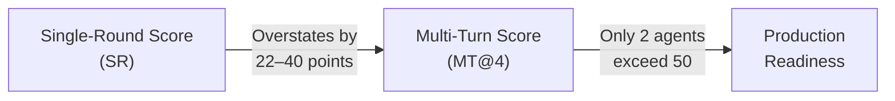
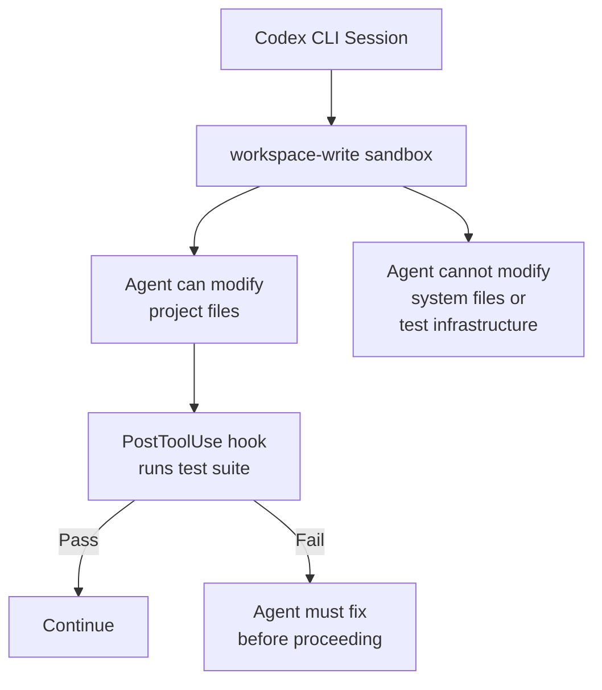

# EvoCode-Bench Exposes the Multi-Turn Gap: Why Coding Agents Degrade Over Iterative Rounds — and How Codex CLI's Goal Mode, Workspace Persistence, and Hook Gates Defend Against It


---

## The Single-Round Illusion

Most coding-agent benchmarks evaluate a simple contract: one specification in, one patch out. SWE-Bench Verified, Terminal-Bench, and their successors measure whether an agent can resolve a discrete issue against a frozen codebase. These benchmarks have driven remarkable progress — top agents now exceed 70% resolution on SWE-Bench Verified [^1] — but they mask a critical weakness: real software development is not a series of independent single-turn tasks. It is an iterative, stateful process where each change compounds on every previous one.

EvoCode-Bench, published in May 2026 by Shen et al., is the first benchmark designed to measure precisely this gap [^2]. Its findings are sobering for anyone relying on agent-driven development for anything beyond one-shot fixes.

## What EvoCode-Bench Measures

The benchmark comprises 26 stateful coding tasks spanning 227 evaluated rounds, with each task running between 5 and 15 rounds [^2]. The agent's workspace persists across rounds — there is no reset. Each round introduces new requirements validated by cumulative executable tests that check both the new specification and every prior one still in effect.

Two metrics capture the distinction:

- **SR (Single-Round):** The agent receives a reference-completed workspace from the previous round and must implement only the current round's requirements. This mirrors traditional benchmark design.
- **MT@4 (Multi-Turn at 4 attempts):** The agent works from its own accumulated workspace state across all rounds, with four independent attempts per task and a fail-stop protocol — once a round fails, subsequent rounds are not scored.

### Interaction Styles

Tasks are grouped by three communication patterns that mirror how developers actually interact with agents [^2]:

| Style | Description | Realism |
|-------|-------------|---------|
| **Explorative** | Detailed initial request, terse follow-ups | Mirrors rapid prototyping |
| **Contractual** | Full behavioural specifications every round | Mirrors formal specification |
| **Document-driven** | Semantics embedded in repository artefacts | Mirrors evolving design documents |

### Engineering Activities

Four categories of development pressure test different failure modes [^2]:

- **Construction** (13 tasks): Incrementally building systems whilst preserving existing features
- **Specification Evolution** (3 tasks): Later rounds overturn core assumptions
- **Review-driven** (5 tasks): Improving performance, security, and observability without regression
- **Migration** (5 tasks): Moving legacy systems to new implementation styles with backward compatibility

## The Results: A 35-Point Gap



The headline finding: **the highest-SR agent (Opus 4.6, 78.9 SR) ranks only third in persistent execution (44.0 MT@4)** [^2]. The top two persistent performers are Opus 4.7 (54.0 MT@4, 76.7 SR) and GPT-5.5 (52.4 MT@4, 74.4 SR). Only these two agents exceed 50 on the multi-turn metric.

| Agent | MT@4 | SR | Gap | Completion |
|-------|------|----|-----|------------|
| Opus 4.7 | 54.0 | 76.7 | 22.7 | 42.3% |
| GPT-5.5 | 52.4 | 74.4 | 22.0 | 38.5% |
| Opus 4.6 | 44.0 | 78.9 | 34.9 | 34.6% |
| GLM-5.1 | 36.2 | 63.9 | 27.7 | 15.4% |
| Kimi-K2.6 | 31.9 | 59.0 | 27.1 | 23.1% |
| DS-V4-Pro | 30.6 | 56.4 | 25.8 | 19.2% |
| Qwen3.6-Plus | 29.4 | 57.3 | 27.9 | 15.4% |
| Gemini 3.1 | 13.7 | 46.7 | 33.0 | 11.5% |

The round-by-round degradation is stark: aggregate MT@4 pass rates fall from 46.7 at round 1 to 26.9 at round 3, 21.3 at round 5, and 7.7 at round 10 [^2]. The SR–MT@4 gap widens from roughly 20 points at round 1 to 33 points by round 5 and 41 points by round 8.

### Tier-Dependent Failure Modes

Lower-performing agents tend to fail early by missing initial requirements entirely. Top-tier agents persist long enough to expose a different class of failure: **specification-tracking errors and regressions** [^2]. They implement round N correctly but break something from round N-3 in the process. This is the multi-turn gap — and it maps directly to the maintenance burden that senior engineers recognise in production codebases.

## Why This Matters for Codex CLI Developers

If you are using Codex CLI for iterative development — feature branches spanning multiple prompts, `/goal` workflows running for hours, or `codex exec` pipelines processing sequential requirements — the EvoCode-Bench findings reveal three specific risks:

1. **Accumulated context drift:** As workspace state grows across turns, the agent's understanding of prior decisions degrades.
2. **Regression blindness:** Without cumulative test enforcement, the agent may silently break earlier work.
3. **Specification amnesia:** When core assumptions change mid-task, the agent may fail to propagate updates to all affected code.

The good news: Codex CLI ships with mechanisms that directly address each of these failure modes.

## Defence Layer 1: Goal Mode for Persistent Verification

The `/goal` command, shipped in Codex CLI 0.128.0 [^3], transforms Codex from a single-turn tool into a persistent agentic loop. Rather than executing one prompt and yielding control, Codex loops through plan → act → test → review → iterate until the defined completion condition is met, a token budget is exhausted, or an unresolvable blocker is hit.

```toml
# ~/.codex/config.toml
[features]
goals = true
```

A goal definition includes a completion condition — what observable state must be true — and a verification method [^3]. This maps directly to EvoCode-Bench's design of specifying requirements through observable behaviour rather than implementation paths:

```
/goal "Implement the event-sourcing module.
Completion: all tests in tests/event_sourcing/ pass,
existing integration tests remain green,
coverage stays above 85%."
```

The critical difference from a standard prompt: goal mode **checks its own work against measurable evidence** (tests, builds, coverage reports) at every iteration [^4]. When EvoCode-Bench's Opus 4.6 scores 78.9 SR but only 44.0 MT@4, the gap represents precisely the regressions that a verification loop catches.

## Defence Layer 2: PostToolUse Hooks as Cumulative Gates

EvoCode-Bench's cumulative test design — where every round's tests validate all prior requirements — mirrors what a well-configured PostToolUse hook enforces in Codex CLI [^5].

```toml
# .codex/config.toml
[[hooks]]
event = "PostToolUse"
command = "bash -c 'if [[ \"$CODEX_TOOL_NAME\" == \"shell\" ]]; then cd $CODEX_WORKSPACE && npm test 2>&1 | tail -20; fi'"
timeout_ms = 30000
```

This fires the full test suite after every shell command [^5]. When the agent modifies code in round N that breaks a test from round N-3, the hook catches it immediately rather than letting the regression compound across subsequent rounds — exactly the failure mode that drives the SR–MT@4 gap in the benchmark.

For more granular control, pair PostToolUse with a Stop hook that blocks turn completion unless all tests pass:

```toml
[[hooks]]
event = "Stop"
command = "bash -c 'cd $CODEX_WORKSPACE && npm test --silent; exit $?'"
timeout_ms = 60000
```

## Defence Layer 3: AGENTS.md Specification Persistence

EvoCode-Bench's document-driven interaction style — embedding semantics in repository artefacts — maps directly to AGENTS.md [^6]. Rather than relying on the agent's context window to remember specifications from earlier rounds, encode them in a file the agent reads at every session start:

```markdown
# AGENTS.md

## Active Specifications
- Event sourcing: all domain events must be immutable value objects
- API versioning: v1 endpoints must remain backward-compatible
- Migration: legacy MySQL queries coexist with new PostgreSQL paths

## Test Invariants
- Never modify existing tests unless explicitly asked
- All changes must pass the full test suite before completion
- Coverage must not drop below the baseline recorded in .coverage-baseline
```

The instruction "Never modify existing tests unless explicitly asked" is critical [^7]. EvoCode-Bench shows that top-tier agents sometimes make tests pass by weakening assertions rather than fixing implementation bugs — a failure mode that AGENTS.md constraints, PreToolUse hooks, and Stop verification gates defend against as three independent layers.

## Defence Layer 4: Workspace-Write Sandbox Isolation



The `workspace-write` sandbox policy [^8] ensures the agent can modify project code but cannot tamper with test infrastructure, CI configuration, or system-level tooling. Combined with the "never modify existing tests" AGENTS.md instruction, this creates a constraint surface where the agent must satisfy cumulative tests through correct implementation rather than test manipulation.

## Practical Configuration: The Multi-Turn Resilience Stack

For iterative development workflows that mirror EvoCode-Bench's multi-turn pattern, combine all four layers:

```toml
# ~/.codex/config.toml
[features]
goals = true

[model]
name = "o4-mini"           # or gpt-5.5 for complex tasks
reasoning_effort = "high"

[sandbox]
mode = "workspace-write"

[[hooks]]
event = "PostToolUse"
command = "bash -c 'if [[ \"$CODEX_TOOL_NAME\" == \"shell\" ]]; then cd $CODEX_WORKSPACE && npm test --silent 2>&1 | tail -5; fi'"
timeout_ms = 30000

[[hooks]]
event = "Stop"
command = "bash -c 'cd $CODEX_WORKSPACE && npm test --silent; exit $?'"
timeout_ms = 60000
```

Pair this with an AGENTS.md that encodes your specification invariants and test protection rules, and you have a configuration that addresses each of the three failure modes EvoCode-Bench identifies.

## The Broader Lesson

EvoCode-Bench's contribution is not just another leaderboard. It quantifies something practitioners have long suspected: **single-round benchmarks systematically overstate agent capability for the iterative, stateful work that defines real software development**. The 22–40 point SR–MT@4 gap, the round-by-round degradation to 7.7 by round 10, and the tier-dependent failure modes all point to accumulated workspace state as the fundamental challenge.

For Codex CLI users, the lesson is architectural. Do not trust single-turn success as a predictor of multi-turn reliability. Instead, invest in the verification infrastructure — goal mode, cumulative test hooks, specification-encoding AGENTS.md files, and sandbox isolation — that catches regressions before they compound. The benchmark's data suggests this is not optional: it is the difference between an agent that scores 78.9 in isolation and one that actually ships working code across fifteen rounds of evolving requirements.

---

## Citations

[^1]: CodeSOTA. "AI Coding Benchmark Leaderboard 2026: Code Generation and SWE-bench." [https://www.codesota.com/code-generation](https://www.codesota.com/code-generation)

[^2]: Shen, H., Chen, X., Xu, W., Ma, Y., Chen, L. & Li, K. "EvoCode-Bench: Evaluating Coding Agents in Multi-Turn Iterative Interactions." arXiv:2605.24110, May 2026. [https://arxiv.org/abs/2605.24110](https://arxiv.org/abs/2605.24110)

[^3]: OpenAI Developers. "Using Goals in Codex." [https://developers.openai.com/cookbook/examples/codex/using_goals_in_codex](https://developers.openai.com/cookbook/examples/codex/using_goals_in_codex)

[^4]: Hodges, J.D. "Codex /goal: How It Works, Setup, and What I Tested." 2026. [https://www.jdhodges.com/blog/codex-goal-feature-review/](https://www.jdhodges.com/blog/codex-goal-feature-review/)

[^5]: OpenAI Developers. "Hooks – Codex." [https://developers.openai.com/codex/hooks](https://developers.openai.com/codex/hooks)

[^6]: OpenAI Developers. "Custom instructions with AGENTS.md – Codex." [https://developers.openai.com/codex/guides/agents-md](https://developers.openai.com/codex/guides/agents-md)

[^7]: Crosley, B. "AGENTS.md Patterns: What Actually Changes Agent Behavior." 2026. [https://blakecrosley.com/blog/agents-md-patterns](https://blakecrosley.com/blog/agents-md-patterns)

[^8]: OpenAI Developers. "Agent approvals & security – Codex." [https://developers.openai.com/codex/agent-approvals-security](https://developers.openai.com/codex/agent-approvals-security)
