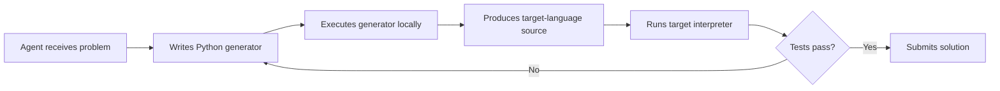
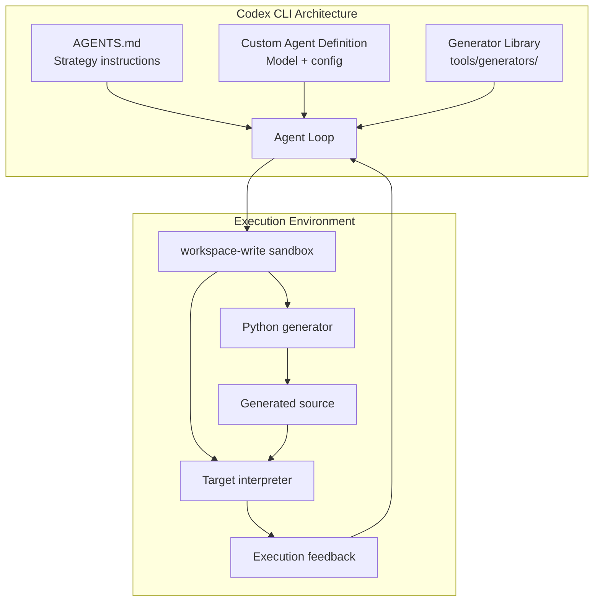

# Frontier Coding Agents Use Metaprogramming to Escape Unfamiliar Languages — What EsoLang-Bench Reveals and How Codex CLI's Sandbox Makes It Work


When a senior developer encounters an unfamiliar language, they reach for the tools they already know. They write a code generator, test it locally, iterate. Frontier coding agents do exactly the same thing — and the evidence now quantifies just how much that strategy matters.

Sharma, Thorat & Chopra's *EsoLang-Bench* study (June 2026) evaluated six coding agents across four esoteric programming languages and found that the strongest agents — Claude Opus 4.6 and GPT-5.4 xhigh — routinely avoid writing the target language directly [^1]. Instead, they write Python programs that generate target-language code, then debug those generators using local execution. Forbidding this metaprogramming strategy causes performance to collapse by up to 63 percentage points.

This article unpacks the findings, explains why the result matters beyond esoteric languages, and maps the underlying capability requirements to Codex CLI's sandbox and execution architecture.

## The EsoLang-Bench Protocol

The benchmark comprises 80 problems per language across four esoteric targets: Brainfuck (BF), Befunge-98 (B98), Whitespace (WS), and Shakespeare (Sh) [^1]. Each problem allows up to three hidden-test submissions, with six hidden tests per problem, unlimited local interpreter calls, and a 32k-token output budget per turn [^1]. Agents operate in isolated workspaces with sequential file editing and local execution — a setup that closely mirrors how Codex CLI operates in `workspace-write` sandbox mode [^2].

Six agents were evaluated: Claude Opus 4.6, Claude Sonnet 4.6, Claude Haiku 4.5, GPT-5.4 xhigh, GPT-5.4 mini, and Kimi K2.5 [^1].

## The Performance Spread Mainstream Benchmarks Hide

The headline finding is not the absolute scores but the *spread*. On SWE-Bench Verified, the six agents span just 6.6 percentage points (SD 2.9) [^1]. On Terminal-Bench 2.0, the spread widens to 33.3pp (SD 11.5) [^1]. On EsoLang-Bench, it explodes to 88.4pp (SD 36.0) — twelve times wider than SWE-Bench [^1].

| Agent | WS | Sh | B98 | BF | Mean |
|-------|-----|-----|-----|-----|------|
| GPT-5.4 xhigh | 100% | 100% | 100% | 98.8% | 99.7% |
| Claude Opus 4.6 | 100% | 87.5% | 80% | 80% | 86.9% |
| Claude Sonnet 4.6 | 100% | 70% | 80% | 15% | 66.3% |
| GPT-5.4 mini | 88.8% | 21.3% | 13.8% | 6.3% | 32.5% |
| Claude Haiku 4.5 | 81.3% | 7.5% | 5% | 5% | 24.7% |
| Kimi K2.5 | 31.3% | 2.5% | 6.3% | 5% | 11.3% |

*Table: EsoLang-Bench pass rates, 80 problems per language [^1]*

The practical implication is stark: if your benchmark compresses agent capability into a narrow band, you cannot distinguish agents that *adapt* from agents that merely *recall*. Any team selecting a model for non-mainstream work — legacy DSLs, proprietary configuration languages, domain-specific grammars — should treat EsoLang-Bench's spread as a warning that SWE-Bench scores alone are insufficient for model selection.

## The Metaprogramming Strategy

On Brainfuck and Befunge-98, the two strongest agents independently discovered the same strategy: write a Python program that generates the target-language source, execute the generator locally, run the generated code through the target interpreter, inspect the output, and iterate [^1].



This is not prompt engineering or chain-of-thought reasoning. It is *tool use* — the agent constructs an intermediate artefact (the generator), tests it in the local environment, and refines it through execution feedback. The strategy requires three capabilities that the weaker agents lack in combination:

1. **File creation and editing** — writing and modifying the generator script
2. **Local command execution** — running both the generator and the target interpreter
3. **Feedback interpretation** — parsing execution output to guide the next iteration

## What Happens When You Forbid It

The ablation results are dramatic. When metaprogramming is forbidden — agents must write Brainfuck or Befunge-98 directly — performance collapses [^1]:

- **Opus 4.6 on Brainfuck:** 80% → 33.75% (−46.25pp)
- **GPT-5.4 xhigh on Brainfuck:** 98.8% → 36.25% (−62.55pp)

Even the strongest agent in the study cannot reliably write Brainfuck by hand. The metaprogramming strategy is not a convenience — it is the *primary mechanism* through which these agents solve problems in unfamiliar domains.

## Strategy Transfer: Sharing the Generator Library

A second experiment tested whether Opus-derived helper code could improve weaker agents. The researchers provided Python generator libraries (with no solved benchmark answers) to Sonnet 4.6, GPT-5.4 mini, and Haiku 4.5 [^1].

The results on Brainfuck (out of 80 problems):

| Agent | Baseline | +Text description | +Library code |
|-------|----------|-------------------|---------------|
| Sonnet 4.6 | 12 | 12 | 64 |
| GPT-5.4 mini | 5 | 8 | 53 |
| Haiku 4.5 | 4 | 3 | 7 |

*Table: Strategy transfer on Brainfuck [^1]*

Sonnet jumps from 12 to 64 solved problems — a 5.3× improvement — simply by receiving a reusable generator library. GPT-5.4 mini shows a similar leap. Haiku barely improves, suggesting a capability floor below which even good tooling cannot compensate [^1].

The practical lesson: **reusable generator libraries are a force multiplier**, but only for agents above a minimum capability threshold.

## Cross-Host Language Results

The study also tested whether the *host language* of the generator matters. On Brainfuck, Opus was tested generating via Python, JavaScript, and Rust [^1]:

- **Python:** 64/80
- **JavaScript:** 63/80
- **Rust:** 55/80

The host language matters less than the strategy itself. Python's slight edge likely reflects training-data density rather than any fundamental advantage, reinforcing that the key capability is *the ability to construct and iterate on generators*, not fluency in a specific host language.

## Why This Matters Beyond Esoteric Languages

Esoteric languages are a controlled experimental proxy, but the underlying pattern — agents bootstrapping unfamiliar tasks through familiar tools — applies broadly:

- **Legacy DSLs:** Mainframe JCL, proprietary ETL configurations, vendor-specific scripting languages
- **Infrastructure-as-Code:** Terraform HCL, Pulumi YAML, CloudFormation templates where the agent has weaker training coverage
- **Domain grammars:** ANTLR definitions, protocol buffer extensions, custom template languages
- **Hardware description:** VHDL, Verilog, or SystemVerilog where training data is sparse

The complementary study by Acher & Jézéquel (arXiv:2606.13763) confirms this pattern at scale: prompting Claude and Codex to build chess engines across 17 languages, they found agents produced working engines in every language — including LaTeX — but "strong playing strength is only reachable in mainstream compiled languages" [^3]. Language choice shifts from a *capability* question to an *optimisation* question.

## Mapping to Codex CLI's Architecture

The metaprogramming strategy depends on three infrastructure capabilities. Codex CLI provides all three through its sandbox and execution model.

### 1. Local Execution in the Sandbox

Codex CLI's `workspace-write` sandbox mode permits the agent to create files and execute commands within the working directory [^2]. This is precisely the capability that enables the generate-execute-inspect loop. The agent can:

- Write a Python generator to `/workspace/generator.py`
- Execute it via `python generator.py > output.bf`
- Run the target interpreter via a locally installed tool
- Read and parse the output

Without local execution, the metaprogramming strategy is impossible. This is why the EsoLang-Bench protocol explicitly provides "unlimited local interpreter calls" [^1] — the researchers recognised that execution feedback is the critical enabler.

### 2. Approval Policy for Iterative Execution

In `on-request` approval mode, Codex CLI allows routine workspace commands without interrupting the developer [^4]. For an iterative generate-and-test workflow, this is essential. An agent that must pause for human approval on every interpreter invocation would lose the rapid feedback loop that makes metaprogramming viable.

For teams deploying this pattern, the recommended configuration in `config.toml`:

```toml
sandbox_mode = "workspace-write"
approval_policy = "on-request"

[sandbox_workspace_write]
writable_roots = ["/workspace"]
```

### 3. Strategy Transfer via AGENTS.md and Custom Agents

The strategy transfer result — where Opus-derived libraries boosted Sonnet from 12 to 64 problems — maps directly to Codex CLI's instruction and agent architecture. Teams can encode reusable generator strategies in two ways:

**AGENTS.md for inline guidance:**

```markdown
## Unfamiliar Language Strategy

When working with languages where training data is sparse:
1. Write a Python generator that produces the target-language source
2. Test the generator locally before submitting
3. Use the generator library at `tools/generators/` if available
4. Iterate on the generator, not the target source directly
```

**Custom agent definitions for model routing:**

```toml
[agents.polyglot]
description = "Handles unfamiliar or esoteric language tasks using metaprogramming"
config_file = "~/.codex/agents/polyglot.config.toml"
```

With the polyglot agent's config selecting a stronger model:

```toml
model = "o4-mini"
model_reasoning_effort = "xhigh"

[instructions]
text = """
When the target language is unfamiliar, write a Python generator
that produces the target source. Test locally before submitting.
"""
```

This mirrors the study's finding: the combination of a capable model *plus* reusable strategy artefacts produces the strongest results [^1].



## Practical Recommendations

**For model selection:** If your team works with non-mainstream languages, DSLs, or proprietary grammars, do not rely on SWE-Bench scores alone. The 88.4pp spread on EsoLang-Bench versus 6.6pp on SWE-Bench means that mainstream benchmarks systematically understate capability differences for your use case [^1].

**For workspace setup:** Ensure local interpreters for your target language are installed in the Codex CLI workspace. The metaprogramming strategy requires both the host language runtime (Python) and the target interpreter. Without the target interpreter, the feedback loop breaks.

**For strategy reuse:** Build and maintain generator libraries as shared project artefacts. The 5.3× improvement from strategy transfer is too large to leave on the table [^1]. Store these in a `tools/generators/` directory referenced by AGENTS.md.

**For approval policy:** Use `on-request` rather than `untrusted` for iterative generation workflows. The generate-test-refine loop may require dozens of execution cycles per problem; manual approval on each would eliminate the speed advantage.

**For profile-based routing:** Create a dedicated profile for unfamiliar-language work that selects a stronger model with higher reasoning effort. The capability floor demonstrated by Haiku (barely improved even with library transfer) means model choice is not optional — it is the primary determinant of whether the strategy works at all [^1].

## Conclusion

The EsoLang-Bench results reveal that frontier coding agents do not merely generate code — they *construct strategies*. The metaprogramming pattern, where agents write generators in familiar languages to produce unfamiliar-language output, is an emergent capability that depends entirely on local execution and iterative feedback. Codex CLI's sandbox architecture provides exactly the infrastructure this strategy requires: file creation, command execution, and rapid iteration without approval friction.

The broader lesson for engineering teams is that agent capability is not a fixed property of the model. It is a function of the model *plus* the execution environment *plus* reusable strategy artefacts. Investing in workspace tooling and generator libraries produces returns that rival upgrading the model itself.

## Citations

[^1]: Sharma, A., Thorat, S. & Chopra, P. (2026). "Frontier Coding Agents Use Metaprogramming to Adapt to Unfamiliar Programming Languages." arXiv:2606.10933. [https://arxiv.org/abs/2606.10933](https://arxiv.org/abs/2606.10933)

[^2]: OpenAI. (2026). "Sandbox — Codex CLI." OpenAI Developer Documentation. [https://developers.openai.com/codex/concepts/sandboxing](https://developers.openai.com/codex/concepts/sandboxing)

[^3]: Acher, M. & Jézéquel, J-M. (2026). "Do programming languages still matter to your AI coding agent teammate? Evidence at scale from chess engines." arXiv:2606.13763. [https://arxiv.org/abs/2606.13763](https://arxiv.org/abs/2606.13763)

[^4]: OpenAI. (2026). "Agent approvals & security — Codex CLI." OpenAI Developer Documentation. [https://developers.openai.com/codex/agent-approvals-security](https://developers.openai.com/codex/agent-approvals-security)
