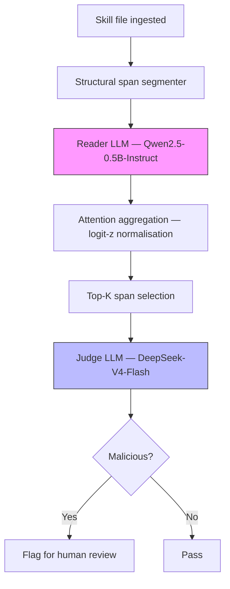
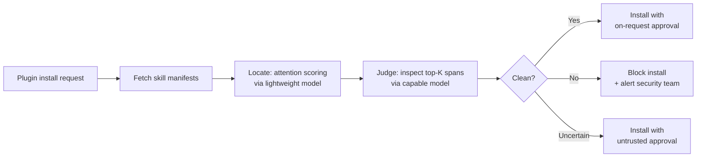

# Locate-and-Judge: How Attention-Based Detection Finds Malicious Agent Skills at Marketplace Scale — and How to Harden Your Codex CLI Plugin Stack


---

The agent skill ecosystem now has its own malware scanners — and the most effective one does not read skills the way you would expect. In June 2026, researchers at the University of Luxembourg published *Locate-and-Judge*, a two-stage detection system that uses instruction-following attention patterns to surface the most suspicious spans of a skill before a judge LLM inspects them[^1]. Deployed across 134,934 skills from three public marketplaces, it confirmed 131 malicious skills — nearly twice the number caught by scanning full skill content — at a cost of \$34 total[^1]. For Codex CLI teams installing third-party plugins from Lobehub, ClawHub, or Skills.sh, this article explains what the research found, why attention-based detection works, and how to build equivalent defences into your plugin governance stack.

## The Problem: Skills Are Instructions, Not Data

Traditional prompt-injection defences assume a clean boundary between *instructions* (trusted) and *data* (untrusted). Agent skills break that assumption. A SKILL.md file is itself an instruction body — it tells the agent what to do, which tools to call, and how to handle results[^1]. A malicious skill does not need to inject anything; it simply provides instructions that the agent faithfully follows. This means keyword filters and regex scanners struggle: the malicious intent is often expressed in natural language indistinguishable from legitimate instructions[^1].

MalSkillBench, a companion benchmark released in June 2026, quantified this gap across 3,944 malicious skills labelled along a 108-cell taxonomy[^2]. Its key finding: the strongest detector reached 98.4% recall on code-level attacks but collapsed on instruction-level attacks, confirming that the hybrid surface — part code, part natural language — defeats single-strategy scanners[^2].

## How Locate-and-Judge Works

The system operates in two stages, separated by a critical insight: a small language model's attention patterns reveal which structural spans of a skill draw the most instruction-following weight — and malicious payloads consistently attract disproportionate attention[^1].



### Stage 1: Locate

A lightweight reader model (Qwen2.5-0.5B-Instruct) processes the skill and its structural spans — sections, code blocks, inline instructions[^1]. The system aggregates post-softmax attention across the last four layers using logit-z normalisation (log transform followed by z-score), which empirically outperforms raw attention summation[^1]. Only the top-K spans by attention score are retained.

### Stage 2: Judge

A larger judge model (DeepSeek-V4-Flash) examines only the retained spans in a zero-shot, unprompted pass[^1]. By concentrating computational budget on the most suspicious fragments, the pipeline achieves higher recall than scanning the full skill content — because full-content scanning dilutes the signal.

### Why It Outperforms Full-Content Scanning

This is the counterintuitive finding. Giving the judge *less* context produces *better* detection. On the marketplace deployment, Locate-and-Judge detected 62 out of 65 confirmed malicious skills (95.4% recall, 89.9% precision), whilst the full-content baseline caught only 37% of credential-theft skills and 0% of C2/remote-tunnel skills[^1]. Hidden malicious skills — those disguised behind legitimate functionality — accounted for 90% of the detections unique to Locate-and-Judge[^1].

## Marketplace Deployment: The Numbers

The researchers scanned skills from three live marketplaces[^1]:

| Marketplace | Skills scanned | Flagged | Confirmed malicious |
|-------------|---------------|---------|-------------------|
| Lobehub | 102,194 | 258 | 83 |
| ClawHub | 30,228 | 101 | 48 |
| Skills.sh | 2,512 | 0 | 0 |
| **Total** | **134,934** | **359** | **131** |

The 131 confirmed malicious skills broke down into six attack categories[^1]:

| Category | Count | % of total |
|----------|-------|-----------|
| Credential/secret theft | 35 | 43% |
| Malicious installer (RCE) | 34 | 41% |
| Conversation surveillance | 4 | 5% |
| Sandbox/safety bypass | 4 | 5% |
| C2 and remote tunnel | 3 | 4% |
| Prompt injection | 2 | 2% |

Five coordinated campaigns sharing infrastructure were identified across the flagged skills[^1]. The total API cost for scanning all 134,934 skills was \$34 — roughly \$0.00025 per skill[^1].

## Comparison with Existing Scanners

Against 65 confirmed malicious skills, Locate-and-Judge dominated the field[^1]:

| System | True positives | Precision | Recall |
|--------|---------------|-----------|--------|
| Locate-and-Judge | 62 | 0.899 | 0.954 |
| SkillSpector | 13 | 0.929 | 0.200 |
| Cisco Skill Scanner | 10 | 1.000 | 0.154 |
| Attention Tracker (prior work) | — | — | AUROC 0.564 |

SkillSpector and Cisco Skill Scanner achieve high precision but abysmal recall — they catch only the obviously malicious skills and miss the hidden ones[^1].

## Mapping to Codex CLI Plugin Governance

Codex CLI's plugin system installs bundles of skills, MCP servers, and app connectors from configured marketplaces[^3]. The July 2026 `/plugins` command organises remote plugins into OpenAI Curated, Workspace, and Shared with me sections[^4]. But marketplace curation is not the same as malicious-skill detection — and the Locate-and-Judge findings demonstrate that even curated ecosystems harbour threats. Here is how to build layered defences.

### Layer 1: Approval Policy as First Gate

Set your approval policy to gate all plugin-originated tool calls through human review until trust is established:

```toml
# ~/.codex/config.toml
approval_policy = "on-request"
```

This ensures that even after a plugin is installed, every tool invocation it triggers requires explicit approval[^5]. For high-security environments, use `untrusted` mode which automatically approves only read operations[^5].

### Layer 2: PreToolUse Hooks for Behavioural Detection

The Locate-and-Judge research shows that credential theft (43%) and malicious installers (41%) are the dominant attack vectors[^1]. You can catch both with PreToolUse hooks that inspect commands before execution:

```json
{
  "hooks": {
    "PreToolUse": [
      {
        "matcher": "Bash",
        "hooks": [
          {
            "type": "command",
            "command": "/usr/local/bin/skill-policy-check.py",
            "statusMessage": "Checking for credential exfiltration patterns",
            "timeout": 10
          }
        ]
      }
    ]
  }
}
```

A PreToolUse hook returning exit code 2 blocks the tool call entirely[^6]. The hook receives the full tool invocation as JSON on stdin, including the command string and arguments, enabling pattern matching against known exfiltration techniques[^6].

### Layer 3: Sandbox Isolation

Codex CLI's `workspace-write` sandbox mode blocks network access by default[^5]. This is critical for neutralising C2/remote-tunnel attacks (4% of detections) and credential exfiltration that requires outbound connectivity[^1]:

```toml
[sandbox_workspace_write]
network_access = false
```

If a plugin requires network access, constrain it to specific domains:

```toml
[features.network_proxy]
enabled = true
domains = { "api.github.com" = "allow", "*" = "deny" }
```

### Layer 4: Plugin-Level Disablement

When a plugin is flagged or untrusted, disable it without uninstalling:

```toml
[plugins."suspicious-plugin@community"]
enabled = false
```

This preserves the plugin definition for audit whilst preventing execution[^3].

### Layer 5: Enterprise Managed Hooks

For organisations deploying Codex CLI fleet-wide, `requirements.toml` enforces hooks that individual users and project configs cannot override[^6]:

```toml
allow_managed_hooks_only = true

[features]
hooks = true

[[hooks.PreToolUse]]
matcher = ".*"

[[hooks.PreToolUse.hooks]]
type = "command"
command = "python3 /enterprise/hooks/skill-scanner.py"
timeout = 30
```

Setting `allow_managed_hooks_only = true` disables user, project, and plugin hooks — ensuring only centrally vetted governance hooks execute[^6].

## Building Your Own Locate-and-Judge Pipeline

The research suggests a practical integration pattern for teams running their own plugin marketplaces or governance workflows:



The key economics make this viable at any scale: at \$0.00025 per skill, scanning a 10,000-skill marketplace costs \$2.50[^1]. The K=5 configuration offers the best cost-recall trade-off at 458 tokens per skill and 0.940 F1[^1].

## Known Limitations

The Locate-and-Judge system has a documented failure mode: inline base64-encoded installers that bypass the structural span segmenter, accounting for 22 of the missed detections[^1]. This gap matters because base64-encoded payloads are a common obfuscation technique in supply-chain attacks.

Additionally, the MalSkillBench findings show that no single detector covers the full hybrid attack surface — instruction-level attacks defeat code-focused scanners, and vice versa[^2]. Defence in depth remains essential.

## The Broader Pattern

The progression from SkillSpector's 20% recall to Locate-and-Judge's 95.4% recall mirrors what happened in traditional malware detection: signature-based scanning gives way to behavioural analysis[^1]. For Codex CLI teams, the practical takeaway is that marketplace curation and keyword filtering are necessary but insufficient. The real defence is layered: approval policy gates → PreToolUse behavioural hooks → sandbox isolation → enterprise-managed enforcement → continuous scanning of installed skills.

The \$34 scan of 134,934 skills proves that comprehensive vetting is no longer a cost problem. It is an integration problem — and Codex CLI's hook architecture provides the integration points.

## Citations

[^1]: Etteib, B., Lunghi, D. & Bissyandé, T. F. (2026). "Detecting Malicious Agent Skills in the Wild using Attention." arXiv:2606.23416. University of Luxembourg. https://arxiv.org/abs/2606.23416

[^2]: Guo, W. et al. (2026). "MalSkillBench: A Runtime-Verified Benchmark of Malicious Agent Skills." arXiv:2606.07131. https://arxiv.org/abs/2606.07131

[^3]: OpenAI (2026). "Plugins — Codex." OpenAI Developers. https://developers.openai.com/codex/plugins

[^4]: OpenAI (2026). "Codex Updates — July 2026." Releasebot. https://releasebot.io/updates/openai/codex

[^5]: OpenAI (2026). "Agent Approvals & Security — Codex." OpenAI Developers. https://developers.openai.com/codex/agent-approvals-security

[^6]: OpenAI (2026). "Hooks — Codex." OpenAI Developers. https://developers.openai.com/codex/hooks
