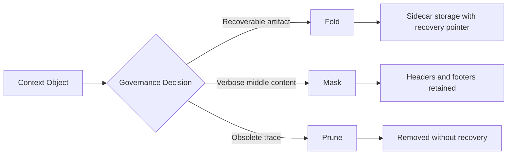
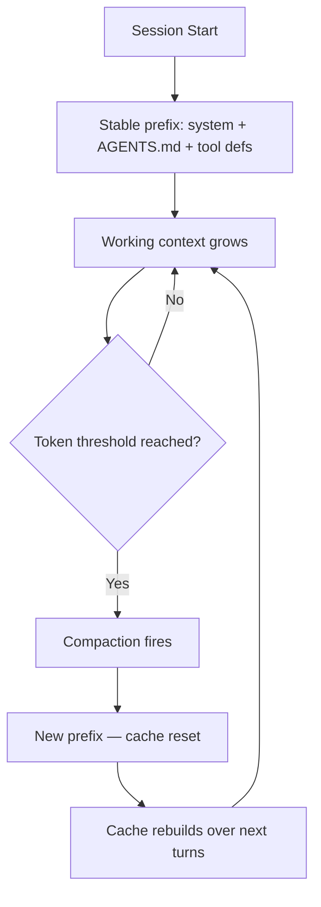

# Self-GC and the Object Lifecycle Model: Why Chronological Pruning Destroys Future Dependencies — and How to Configure Codex CLI's Compaction for Structured Context Governance


---

## The Problem Chronological Pruning Cannot Solve

Every long-horizon coding session follows the same arc: early turns establish URLs, file paths, port numbers, and architectural decisions that later turns depend on. When context pressure arrives, the agent must shed tokens — but the oldest turns are precisely the ones carrying the grounding evidence that downstream tool calls need to succeed.

Hao et al. formalised this tension in Self-GC (arXiv:2607.00692, July 2026), a framework that reframes context management as **runtime lifecycle control over indexed, recoverable objects** rather than post-hoc text cleanup [^1]. Their controlled evaluation demonstrates that fixed heuristics — oldest-turn deletion, tool-output blanking — achieve adequate pruning rates but destroy future dependencies at significantly higher rates than a structured governance approach.

The findings map directly to Codex CLI's compaction pipeline. Understanding what Self-GC gets right — and where Codex CLI's existing configuration already supports similar patterns — lets you configure sessions that survive long horizons without silently losing the evidence your agent needs.

---

## What Self-GC Changes

### Object Indexing

Self-GC assigns stable identifiers to two context object types [^1]:

- **`conversation:user:k`** — user requests paired with their execution spans
- **`function:tool:n`** — individual tool-result spans

These lightweight XML tags replace fuzzy text matching with precise targeting. Assistant turns remain implicit, preserved by the harness when adjacent objects change.

### Three Governance Operations

Rather than a binary keep-or-drop decision, Self-GC introduces three graduated operations [^1]:



- **Fold** moves the exact payload to sidecar storage, leaving a compact recovery pointer. Byte-exact recoverability is preserved for artifacts that future turns may quote or edit.
- **Mask** retains structural boundaries whilst eliding repetitive middle content — suitable for log-like tool outputs where headers and footers matter but verbose middle sections are redundant.
- **Prune** removes content without recovery guarantees, reserved for truly obsolete trace such as failed command logs.

### Side-Channel Planner

When token pressure triggers governance, the harness forks the current prefix, appends planner-only instructions exposing indexed objects, and receives a structured XML plan over existing identifiers [^1]. The planner uses an object-action contract emphasising six rules: preserve live handles, exact evidence, editable bodies, behavioural contracts, verbatim source, and recovery routing. Plans commit only at safe turn boundaries.

---

## Quantitative Evidence: Why This Matters

Self-GC was evaluated against two baselines — oldest-turn deletion and tool-output pruning — across a 33-session Hard Set and a 332-session production suite [^1].

### Hard Set Results

| Method | Prune Rate | No-Impact Rate | 95% CI |
|--------|-----------|---------------|--------|
| Self-GC | 43.95% | **84.85%** | [69.08, 93.35] |
| Oldest-turn | 63.45% | 66.67% | [49.61, 80.25] |
| Tool-prune | 67.93% | 69.70% | [52.66, 82.62] |

Self-GC pruned fewer tokens but left **84.85% of future continuations unaffected**, compared with 66–70% for the heuristic baselines [^1]. The fixed heuristics pruned aggressively but destroyed dependencies that the agent needed downstream.

### Production Suite Results

Across three planner backbones (Qwen3.6-Plus, Qwen3.7-Max, GLM-5.1), Self-GC achieved no-impact rates of **91.27–94.58%** versus a baseline range of 77.71–87.46% [^1]. In live deployment, daytime average input tokens dropped by 10–15%, with peaks near 20%.

### The Commit Benefit Formula

Self-GC uses a cost model before committing any plan [^1]:

```
CommitBenefit ≈ N_future × (C − C') − L_cache_break − L_GC
```

Where `C` and `C'` are context costs before and after governance, `N_future` is expected reuse, and the latter terms account for cache disruption and planner overhead. Deployment data indicates positive value once pruning exceeds roughly 30%.

---

## Failure Mode Taxonomy

The paper identifies six categories of dependency destruction caused by fixed heuristics [^1]:

1. **Evidence details** — exact row values, extracted data points, computed checksums
2. **Locators** — file paths, URLs, port numbers, API endpoints
3. **Behavioural contracts** — agreed constraints, user-specified rules, workflow decisions
4. **Verbatim source** — quoted text that future edits must reference exactly
5. **Live state** — active handles, running process identifiers, open connections
6. **Recovery routing** — error messages and retry context needed for fallback paths

This taxonomy explains why Codex CLI sessions that rely solely on automatic compaction can fail unpredictably: the compaction model summarises prose but may lose the exact anchors that subsequent tool calls require.

---

## Mapping Self-GC to Codex CLI Configuration

Codex CLI does not implement Self-GC's object-indexing scheme directly, but its existing configuration surface supports several of the same principles. The goal is to configure compaction that respects structured dependencies rather than treating context as a disposable text buffer.

### 1. Tune the Compaction Threshold

```toml
# config.toml
model_auto_compact_token_limit = 160000
model_context_window = 200000
```

Setting the threshold at roughly 80% of the context window (rather than the default 90% ceiling) provides headroom for post-compaction replay and reduces cascading compaction loops [^2]. The Self-GC commit benefit formula suggests governance pays off once pruning exceeds 30% — aligning the threshold to trigger before the window is saturated gives the compaction model more room to make selective decisions.

### 2. Cap Tool Output at Source

```toml
tool_output_token_limit = 12000
```

Self-GC's mask operation targets verbose tool-output middles. Codex CLI's `tool_output_token_limit` achieves the same effect at ingestion time, preventing log-like outputs from flooding the context before compaction even fires [^3]. A 12,000-token cap captures meaningful output whilst preventing runaway accumulation.

### 3. Write a Structured Compaction Prompt

Self-GC's planner uses an object-action contract rather than a generic "summarise the conversation" instruction. Apply the same principle to Codex CLI's compaction prompt:

```toml
compact_prompt = """
Summarise focusing on:
1. Active file paths, URLs, and port numbers (preserve exactly)
2. Architectural decisions and constraints agreed with the user
3. Current task state, blockers encountered, and next steps
4. Verbatim error messages needed for debugging
Do NOT discard: exact paths, URLs, row values, process IDs, or quoted source text.
"""
```

For longer prompts, use the experimental file-based option [^4]:

```toml
experimental_compact_prompt_file = "~/.codex/prompts/compaction.md"
```

### 4. Stabilise the Prompt Prefix for Cache Efficiency

Self-GC's commit boundary logic accounts for cache disruption costs. Codex CLI's prompt caching relies on exact prefix matching — every compaction resets the cache [^5]. The practical implication:



Trigger compaction at natural task boundaries (using `/compact` manually) rather than letting automatic compaction fire mid-chain, which disrupts prefix cache during the most token-intensive phase of work [^5].

### 5. Use AGENTS.md as a Persistent Evidence Layer

Self-GC folds recoverable artefacts to sidecar storage. AGENTS.md serves an analogous function: it persists across compaction boundaries and survives context resets [^6]. Encode critical constraints and architectural decisions in AGENTS.md rather than relying on conversational context:

```markdown
<!-- AGENTS.md -->
## Architecture Decisions
- API base URL: https://api.example.com/v3
- Database port: 5432 (do not change)
- Auth token format: Bearer JWT, RS256 signed

## Active Constraints
- All new endpoints must include OpenAPI annotations
- Test coverage threshold: 85% per module
```

This ensures that even aggressive compaction cannot destroy the grounding evidence your agent needs.

### 6. Profile-Based Context Strategies

Different workloads benefit from different context governance strategies. Use named profiles to encode these:

```toml
[profile.exploration]
model_auto_compact_token_limit = 120000
tool_output_token_limit = 8000
compact_prompt = "Focus on file structure discovered and navigation decisions."

[profile.implementation]
model_auto_compact_token_limit = 180000
tool_output_token_limit = 16000
compact_prompt = "Preserve all file paths, function signatures, and test results exactly."
```

The exploration profile mirrors Self-GC's aggressive fold-and-mask approach for read-heavy discovery phases, whilst the implementation profile preserves more raw context for write-heavy phases where exact evidence matters [^1].

---

## What Codex CLI Still Lacks

Self-GC highlights three capabilities that Codex CLI's compaction does not yet provide:

1. **Object-level targeting** — Codex CLI's compaction operates on the full conversation prefix, not on individually addressable objects. There is no mechanism to fold a specific tool result whilst preserving an adjacent one.

2. **Recoverable sidecar storage** — folded objects in Self-GC remain byte-exact recoverable. Codex CLI's compaction produces a summary that replaces the original — there is no recovery path. ⚠️

3. **Governance-aware planner** — Self-GC's side-channel planner reasons about future dependencies before deciding what to shed. Codex CLI's compaction prompt can approximate this with careful instruction, but lacks the structured object-action contract and validation step.

These gaps suggest that future Codex CLI releases could benefit from a more structured compaction architecture — particularly object-level fold with sidecar recovery and a governance-aware planner that considers downstream tool dependencies before committing.

---

## Related Context Compression Research

Self-GC sits within a broader research landscape addressing the context management challenge for long-horizon agents:

- **ACON** (arXiv:2510.00615, revised June 2026) optimises context compression through iterative guideline refinement based on failure analysis, achieving 26–54% peak token reduction whilst preserving over 95% accuracy [^7].
- **TokenPilot** (arXiv:2606.17016, June 2026) introduces dual-granularity context management with ingestion-aware compaction and lifecycle-aware eviction, improving cache hit rates from 38.7% to 79.2% [^8].
- **AgentDiet** and **AgentFold** reduce trajectory length but lack harness-enforced recoverability — precisely the gap Self-GC addresses [^1].

The convergence of these approaches suggests that context management is evolving from a simple token-budget problem into a structured governance discipline — one where the question is not "how much can we prune?" but "what are the downstream costs of pruning this specific object?"

---

## Practical Recommendations

For senior developers configuring Codex CLI for long-horizon sessions:

1. **Write a dependency-aware compaction prompt** that explicitly preserves paths, URLs, identifiers, and quoted source — do not rely on the default summarisation behaviour.
2. **Trigger compaction manually at task boundaries** using `/compact` rather than letting automatic compaction fire mid-chain, preserving prefix cache stability.
3. **Encode critical grounding evidence in AGENTS.md** as a persistent sidecar that survives compaction.
4. **Cap tool output at ingestion** with `tool_output_token_limit` to prevent verbose outputs from consuming context before governance can act.
5. **Use profiles** to match context strategy to workload phase — aggressive compression for exploration, conservative preservation for implementation.

The Self-GC research demonstrates that the difference between an 85% no-impact rate and a 67% no-impact rate is not about pruning less — it is about pruning smarter. Codex CLI's configuration surface already supports most of the underlying principles; the gap is in applying them with the structured discipline that Self-GC formalises.

---

## Citations

[^1]: Hao, X., Meng, H., Yin, X., Zhu, J. & Cao, C. (2026). "Self-GC: Self-Governing Context for Long-Horizon LLM Agents." arXiv:2607.00692. [https://arxiv.org/abs/2607.00692](https://arxiv.org/abs/2607.00692)

[^2]: "Codex CLI Context Compaction: Architecture, Configuration, and Managing Long Sessions." Codex Knowledge Base, 31 March 2026. [https://codex.danielvaughan.com/2026/03/31/codex-cli-context-compaction-architecture/](https://codex.danielvaughan.com/2026/03/31/codex-cli-context-compaction-architecture/)

[^3]: "Codex CLI Performance Optimisation: Token Overhead, Hidden Costs and Tuning Tactics." Codex Knowledge Base, 8 April 2026. [https://codex.danielvaughan.com/2026/04/08/codex-cli-performance-optimization/](https://codex.danielvaughan.com/2026/04/08/codex-cli-performance-optimization/)

[^4]: "Configuration Reference — Codex CLI." OpenAI Developers. [https://developers.openai.com/codex/config-reference](https://developers.openai.com/codex/config-reference)

[^5]: "Prompt Caching in Codex CLI: How the Agent Loop Stays Linear and How to Maximise Cache Hits." Codex Knowledge Base, 21 April 2026. [https://codex.danielvaughan.com/2026/04/21/codex-cli-prompt-caching-maximise-cache-hits-cost-reduction/](https://codex.danielvaughan.com/2026/04/21/codex-cli-prompt-caching-maximise-cache-hits-cost-reduction/)

[^6]: "The Model Context Window Budget: Practical Token Management for Large Codebases." Codex Knowledge Base, 20 April 2026. [https://codex.danielvaughan.com/2026/04/20/codex-cli-context-window-budget-token-management-large-codebases/](https://codex.danielvaughan.com/2026/04/20/codex-cli-context-window-budget-token-management-large-codebases/)

[^7]: Kang, M. et al. (2026). "ACON: Optimizing Context Compression for Long-horizon LLM Agents." arXiv:2510.00615, revised June 2026. [https://arxiv.org/abs/2510.00615](https://arxiv.org/abs/2510.00615)

[^8]: Xu, J. et al. (2026). "TokenPilot: Dual-Granularity Context Management for Prompt Cache Efficiency." arXiv:2606.17016. [https://arxiv.org/abs/2606.17016](https://arxiv.org/abs/2606.17016)
