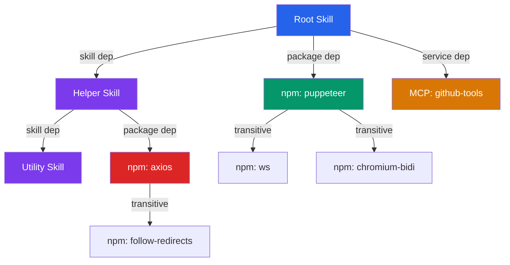

# Skills Are Not Islands: What 1.43 Million Agent Skills Reveal About Hidden Dependency Risk — and How to Harden Your Codex CLI Plugin Stack


---

When your Codex CLI plugin installs a skill that references another skill that pulls three npm packages that each transitively import axios — and axios was compromised in March 2026 [^1] — how would you know? If you are like 63.77 per cent of the skill roots in a new 1.43-million-skill study, you would not: the dangerous dependency is invisible at the surface layer [^2].

Jia, Zhao, He and Zhou's *Skills Are Not Islands* (arXiv:2607.01136, July 2026) introduces the concept of **Agent Skill Supply Chains** (ASSCs) and builds **SkillDepAnalyzer**, a four-stage pipeline that models skills as dependency-bearing artefacts across three simultaneous channels — skill, package, and service [^2]. The findings are stark and directly applicable to anyone managing a Codex CLI plugin stack at scale.

## The Problem: Skills Look Standalone but Are Not

Agent skills — the SKILL.md files that extend Codex CLI with reusable instructions [^3] — appear self-contained. Codex's progressive-disclosure model loads only the skill's name and description until invocation [^3]. But beneath that clean interface, skills carry implicit dependencies: they call other skills, import npm or PyPI packages, and invoke MCP services.

The study analysed **1,434,046 skills** downloaded from the SkillsMP registry on 6 June 2026 (87.4 per cent of the 1.64 million listed) [^2]. The headline numbers are sobering:

| Dependency channel | Prevalence across roots |
|---|---|
| Service-use | 22.25% |
| Package | 15.48% |
| Skill-to-skill | 8.92% |
| **Any channel** | **36.60%** |

More than a third of all skills carry dependencies in at least one channel, yet only **1.40 per cent** include any dependency declaration in their front-matter metadata [^2]. The governance gap is vast.

## Three-Channel Dependency Graphs

The paper's core contribution is modelling ASSCs as mixed graphs spanning three distinct channels simultaneously:



SkillDepAnalyzer (SDA) processes each skill through four stages [^2]:

1. **Structure-Aware Parsing** — separates YAML front matter from the skill body and extracts dependency clues across three document sections.
2. **Evidence-Calibrated Analysis** — classifies candidates into the three channels with confidence scoring; retains low-confidence matches as annotations.
3. **Incremental BOM Construction** — recursively resolves skills and packages, queries local environments then registries, and applies cycle detection.
4. **SkillBOM Output** — produces a validated bill of materials compatible with SPDX and CycloneDX standards.

SDA achieves **0.95 F1** overall on the SKILL-DEP benchmark (500 single-layer + 100 multi-layer skills with 1,586 adjudicated dependency records), substantially outperforming both traditional SBOM generators like Syft and Cdxgen, and LLM-based baselines [^2].

## The Amplification Problem

The most alarming finding is **dependency amplification**. When SDA recursively resolves the full transitive graph, the hidden package inventory explodes:

- **Median amplification**: 0.5× (a typical skill adds half as many hidden packages as declared)
- **p99 amplification**: 130.5×
- **Maximum observed**: 1,754× package amplification [^2]

And **71.87 per cent** of npm packages and **73.33 per cent** of PyPI packages in the resolved graphs are inherited through skill reuse — completely invisible at the root layer [^2].

The concentration is extreme: the package-reuse normalised Gini coefficient is **0.944**, exceeding npm's own benchmark of 0.87 [^2]. A narrow core of heavily-reused packages forms a critical bottleneck — exactly the pattern that made the March 2026 axios compromise so devastating [^1].

## Security Signals Propagate Transitively

The study cross-referenced resolved dependency graphs against known-malicious skill registries, compromised npm packages, and vulnerable MCP services. The results expose a fundamental inspection gap:

| Signal type | Dependency-only exposure |
|---|---|
| Remote payload execution | 63.77% |
| Dangerous code patterns | 78.43% |
| Malicious skill copies | 13.40% of roots inherit transitively |
| Axios compromise exposure | 98.01% dependency-only |
| Vulnerable MCP services | 93.10% dependency-only [^2] |

The message is clear: **inspecting a skill in isolation misses the majority of its security-relevant signals**. The researchers confirmed this by discovering live malicious skill copies persisting in active repositories [^2].

## What This Means for Codex CLI

Codex CLI's plugin system bundles skills, MCP servers, and app connectors into installable packages [^3]. The skill discovery hierarchy scans six scopes — from the current working directory up through repository root, user home, admin, and system built-ins [^3]. This layered discovery is powerful but creates exactly the multi-channel dependency surface the paper describes.

### Current Defences

Codex CLI already provides several mechanisms that partially address the risk:

**Approval policy gates.** The `approval_policy` configuration (with `untrusted`, `on-request`, and `auto-approve` tiers) ensures that plugin-installed tools still require explicit approval before execution [^4]. This is a runtime safety net, not a dependency-time control.

**Sandbox isolation.** The `workspace-write` sandbox prevents skills from modifying files outside the project directory, and network access is disabled by default [^4]. Even if a transitive dependency contains malicious code, execution-time containment limits blast radius.

**Plugin enable/disable.** Skills and plugins can be disabled in `~/.codex/config.toml` without uninstallation [^3]:

```toml
[[skills.config]]
path = "/path/to/suspicious-skill/SKILL.md"
enabled = false
```

**MCP tool filtering.** The `enabled_tools` and `disabled_tools` configuration restricts which MCP tools are available, providing a coarse allowlist at the service-dependency channel [^5].

### The Governance Gap

What Codex CLI **lacks** — and what the paper's recommendations directly address — is dependency-time governance:

1. **No dependency manifest standard.** The `agents/openai.yaml` metadata file supports a `dependencies.tools` field for MCP servers [^3], but there is no typed manifest distinguishing `skillDependencies`, `packageDependencies`, and `serviceDependencies` as the paper recommends [^2].

2. **No transitive resolution.** When you install a plugin, Codex does not recursively resolve or audit the skills, packages, and services that plugin's skills depend upon. The plugin manifest (`plugin.json`) does not declare sub-skill dependencies [^6].

3. **No lockfile or pinning.** Skills reference other skills by path or name, not by version-pinned hash. The paper recommends lockfile-like records preserving pinned versions, source repositories, and paths [^2].

4. **No `codex audit` command.** npm has `npm audit`; pip has `pip-audit`; Codex CLI has no equivalent that scans installed skills for known-vulnerable transitive dependencies.

## A Practical Hardening Strategy

Until Codex CLI gains native dependency governance, you can layer defences using existing primitives and external tooling:

### Step 1: Enumerate Your Skill Graph

Use the `/skills` command to list all active skills, then manually trace their references. For each skill, check whether its SKILL.md references other skills by name or invokes packages:

```bash
# List installed skills and their paths
codex --list-skills

# Search for cross-skill references
grep -r '\$\|/skills\|require\|import' ~/.agents/skills/*/SKILL.md
```

### Step 2: Pin Plugin Versions

When cloning plugins from Git repositories, pin to a specific commit hash rather than tracking a branch:

```bash
git clone --depth 1 https://github.com/org/codex-plugin.git \
  ~/.codex/plugins/org-plugin
cd ~/.codex/plugins/org-plugin
git checkout abc123def  # pin to audited commit
```

### Step 3: Audit Package Dependencies

If a skill's scripts directory contains a `package.json` or `requirements.txt`, run standard supply-chain tooling:

```bash
cd ~/.agents/skills/my-skill/scripts
npm audit --production
# or
pip-audit -r requirements.txt
```

### Step 4: Restrict MCP Service Access

Use Codex CLI's `enabled_tools` configuration to allowlist only the MCP tools you have vetted [^5]:

```toml
[mcp_servers.github-tools]
command = "npx"
args = ["-y", "@anthropic/mcp-server-github"]
enabled_tools = ["get_file_contents", "create_pull_request"]
```

### Step 5: Gate with PreToolUse Hooks

Write a PreToolUse hook that rejects tool calls from skills that have not passed your audit. The hook can check a local allowlist file before permitting execution [^4]:

```bash
#!/usr/bin/env bash
# .codex/hooks/pre-tool-use.sh
SKILL_NAME="$1"
if ! grep -q "^${SKILL_NAME}$" .codex/audited-skills.txt; then
  echo "BLOCKED: skill ${SKILL_NAME} not in audited-skills.txt" >&2
  exit 1
fi
```

### Step 6: Run SkillDepAnalyzer

The paper's tool is open-source. Run SDA against your installed skills to generate a SkillBOM, then cross-reference against vulnerability databases [^2]:

```bash
skilldepanalyzer scan ~/.agents/skills/ --output skillbom.json --format spdx
```

## The Broader Ecosystem Response

The paper's recommendations align with a broader maturation of the agent-skill ecosystem in 2026:

- **SkillsVote** (arXiv:2605.18401) introduces lifecycle governance with evidence-gated updates, profiling a million-scale corpus for environment requirements, quality, and verifiability [^7].
- **Sonatype's 2026 report** counted over 1.23 million malicious packages cumulatively blocked, a 75 per cent year-over-year increase [^8].
- **Codex CLI v0.142.2** made MCP tool search the default, adding deferred loading that reduces context exposure from untrusted tool descriptions [^5].

The convergence is clear: agent skills are becoming the new packages, and they need the same dependency-management rigour that took the npm and PyPI ecosystems a decade to develop. The difference is that skill supply chains span three channels simultaneously — making the attack surface broader and the governance harder.

## Conclusion

*Skills Are Not Islands* provides the first large-scale empirical evidence that the agent-skill ecosystem has already replicated — and in some dimensions exceeded — the dependency-management failures of traditional package registries. With 36.60 per cent of skills carrying hidden dependencies, 1.40 per cent declaring them, and security signals propagating transitively to the majority of roots, the gap between what developers see and what they run is dangerously wide.

Codex CLI's existing sandbox isolation and approval-policy gates provide meaningful runtime containment, but they operate too late in the pipeline. The next step — for both OpenAI's plugin infrastructure and for teams managing their own skill stacks — is dependency-time governance: typed manifests, recursive resolution, lockfile pinning, and audit commands. Until that arrives, the six-step hardening strategy above narrows the gap.

Your skills are not islands. Treat them accordingly.

---

## Citations

[^1]: ArmorCode, "The March 2026 Axios NPM Supply Chain Attack: Detection with ArmorCode," March 2026. [https://www.armorcode.com/blog/the-march-2026-axios-npm-supply-chain-attack-detection-with-armorcode](https://www.armorcode.com/blog/the-march-2026-axios-npm-supply-chain-attack-detection-with-armorcode)

[^2]: Jia, C., Zhao, T., He, R. & Zhou, M., "Skills Are Not Islands: Measuring Dependency and Risk in Agent Skill Supply Chains," arXiv:2607.01136, July 2026. [https://arxiv.org/abs/2607.01136](https://arxiv.org/abs/2607.01136)

[^3]: OpenAI, "Agent Skills — Codex," OpenAI Developers, 2026. [https://developers.openai.com/codex/skills](https://developers.openai.com/codex/skills)

[^4]: OpenAI, "Agent Approvals and Security — Codex," OpenAI Developers, 2026. [https://developers.openai.com/codex/agent-approvals-security](https://developers.openai.com/codex/agent-approvals-security)

[^5]: OpenAI, "Model Context Protocol — Codex," OpenAI Developers, 2026. [https://developers.openai.com/codex/mcp](https://developers.openai.com/codex/mcp)

[^6]: OpenAI, "Plugins — Codex," OpenAI Developers, 2026. [https://developers.openai.com/codex/plugins](https://developers.openai.com/codex/plugins)

[^7]: Liu, H. et al., "SkillsVote: Lifecycle Governance of Agent Skills from Collection, Recommendation to Evolution," arXiv:2605.18401, May 2026. [https://arxiv.org/abs/2605.18401](https://arxiv.org/abs/2605.18401)

[^8]: Shattered.io, "npm Supply Chain Attacks: 1.2M Malicious Packages [2026]," 2026. [https://shattered.io/npm-supply-chain-attacks-2026/](https://shattered.io/npm-supply-chain-attacks-2026/)
