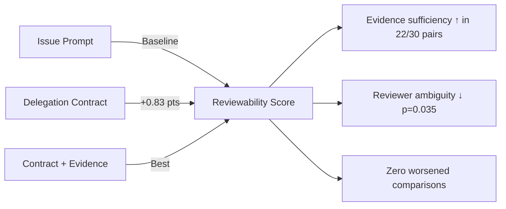
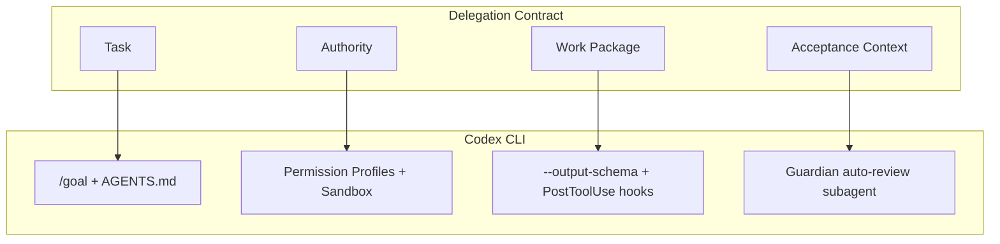

# Software Delegation Contracts: What Reviewability Research Reveals About Trusting Coding Agent Output — and How Codex CLI's Guardian Architecture Delivers It


---

## The Reviewability Problem

Every team that adopts a coding agent eventually hits the same wall: the agent produces work faster than humans can verify it. The bottleneck is no longer generation — it is *review*. A diff that took seconds to produce can take twenty minutes to understand, and without structured evidence of what was changed and why, reviewers default to either rubber-stamping or rejecting wholesale.

Müller, Hess and Koziolek formalised this problem in their June 2026 paper *Software Delegation Contracts: Measuring Reviewability in AI Coding-Agent Work* [^1]. Their controlled study of 64 agent executions across two model tiers demonstrates that explicit delegation contracts — structured agreements covering task scope, authority boundaries, expected evidence, and acceptance criteria — buy measurable reviewability gains even when they do not improve correctness.

This article examines the paper's findings, maps them onto Codex CLI's existing architecture, and provides a practical configuration stack for teams who want reviewable agent output by default.

---

## What the Research Found

### Study Design

The researchers built a dependency-free TypeScript API task environment with seeded defects and documentation gaps [^1]. Ten tasks across five families were executed under three conditions:

1. **Issue-style prompt** — a realistic but unstructured task description
2. **Explicit delegation contract** — structured scope, authority, and deliverables
3. **Contract + evidence bundle** — the contract plus a required evidence package (changed-file lists, known limitations, residual-risk sections, reviewer checklists)

Each of the 64 runs was scored against hidden acceptance tests, mutation checks, and scope analysis, then reviewed by three condition-blinded model-based reviewers using a fixed rubric (192 reviews total) [^1].

### Key Findings



| Metric | Improvement | Significance |
|--------|-------------|--------------|
| Evidence sufficiency | +0.83 on 5-point scale | p < 0.0001, Cliff's δ = 0.66 |
| Reviewer ambiguity | Decreased | p = 0.035 |
| Changed-file lists | Present only with contract | — |
| Known-limitations sections | Present only with contract | — |
| Residual-risk disclosure | Present only with contract | — |

Critically, all 64 runs passed hidden acceptance checks with zero scope violations [^1]. The contracts did not improve correctness — they improved the human's ability to *trust and verify* that correctness.

### The Cost

Contracts cost +13% agent tokens and +38% wall-clock time, with larger effects for the weaker model tier [^1]. This is the central trade-off: reviewability is not free, but the alternative — unverifiable output that blocks merge queues — is more expensive.

---

## Mapping Delegation Contracts to Codex CLI

The delegation contract framework decomposes into four components: **Task** (what to do), **Authority** (what the agent may touch), **Work Package** (what comes back), and **Acceptance Context** (how the reviewer decides) [^1]. Codex CLI's architecture maps to each:



### Task: Goals and AGENTS.md

The `/goal` command encodes persistent objectives with structured completion criteria [^2]. Combined with `AGENTS.md` constraint encoding, this serves as the task portion of the delegation contract — explicit scope that survives compaction and session interruptions.

```toml
# .codex/config.toml — Goal mode with structured completion
[goal]
require_verification = true
verification_strategy = "test_and_review"
```

### Authority: Permission Profiles

Codex CLI's permission profiles implement authority boundaries at the OS level [^3]. The `:workspace` profile restricts writes to active workspace roots; custom profiles can further narrow filesystem and network access:

```toml
[permissions.review-safe]
extends = ":workspace"
filesystem.deny_write = ["*.lock", "package.json", ".env*"]
network.allow = ["registry.npmjs.org"]
```

This is the authority boundary the paper calls for — explicit, machine-enforced, and visible to the reviewer.

### Work Package: Structured Output and Evidence

The `codex exec --output-schema` flag forces structured JSON output that can include changed-file manifests, rationale, and known limitations [^4]:

```bash
codex exec \
  --output-schema '{"changed_files": ["string"], "rationale": "string", "known_limitations": ["string"], "residual_risks": ["string"]}' \
  --prompt-file .github/codex/prompts/feature-task.md
```

PostToolUse hooks can enforce that every file-write operation is accompanied by structured metadata:

```toml
[[hooks]]
event = "PostToolUse"
match_tool = "file_write"
command = "scripts/evidence-collector.sh"
```

The hook script accumulates a `CHANGES.md` evidence bundle as the agent works, producing exactly the artefact the paper found most improves reviewability.

### Acceptance Context: Guardian Auto-Review

Codex CLI's Guardian subagent — an architecturally distinct reviewer running the purpose-built `codex-auto-review` model [^5] — evaluates each boundary-crossing request against a security policy. This maps to the acceptance context: an independent assessor that produces structured verdicts with risk level, authorisation decision, and human-readable rationale.

```toml
# Enable Guardian with escalation for high-risk operations
[approvals]
approvals_reviewer = "auto_review"
escalate_on = ["network_write", "file_delete", "exec_unknown"]
```

The Guardian catches 96.1% of malicious behaviour while reducing human interruptions by approximately 200× [^5] — a concrete implementation of the paper's finding that structured contracts reduce reviewer ambiguity.

---

## Practical Configuration: The Delegation Contract Stack

Combining the research findings with Codex CLI's feature set, here is a production-ready configuration that implements delegation contracts:

```toml
# .codex/config.toml — Delegation Contract Configuration

# 1. Task: Structured goals with verification
[goal]
require_verification = true

# 2. Authority: Bounded permissions
default_permissions = "review-safe"

[permissions.review-safe]
extends = ":workspace"
filesystem.deny_write = ["*.lock", ".env*", "infrastructure/"]

# 3. Work Package: Token budget controls diff size
rollout_token_budget = 50000

# 4. Acceptance: Guardian review with escalation
[approvals]
approvals_reviewer = "auto_review"

# PostToolUse hook to build evidence bundle
[[hooks]]
event = "PostToolUse"
match_tool = "file_write"
command = "scripts/build-evidence-bundle.sh"

# Stop hook to enforce evidence completeness
[[hooks]]
event = "Stop"
command = "scripts/verify-evidence-bundle.sh"
```

### The Evidence Bundle Script

```bash
#!/usr/bin/env bash
# scripts/build-evidence-bundle.sh
# Accumulates structured evidence as the agent works

INPUT=$(cat)
FILE=$(echo "$INPUT" | jq -r '.tool_call.arguments.path // empty')

if [[ -n "$FILE" ]]; then
  echo "$FILE" >> .codex/evidence/changed-files.txt
fi

echo '{"continue": true}'
```

### The Verification Gate

```bash
#!/usr/bin/env bash
# scripts/verify-evidence-bundle.sh
# Blocks completion if evidence bundle is incomplete

CHANGES=$(wc -l < .codex/evidence/changed-files.txt 2>/dev/null || echo 0)

if [[ "$CHANGES" -eq 0 ]]; then
  echo '{"continue": false, "stopReason": "No evidence bundle generated"}'
else
  echo '{"continue": true}'
fi
```

---

## The +13% Token Cost Is Worth It

The paper's finding that contracts cost +13% tokens but produce measurably reviewable output [^1] aligns with production experience. The `rollout_token_budget` setting in Codex CLI [^6] provides the lever: teams can allocate a portion of their token budget explicitly to evidence generation, knowing the downstream review time savings exceed the upstream generation cost.

For a typical feature task consuming 40,000 tokens without contracts, the +13% overhead adds approximately 5,200 tokens — roughly £0.03 at current GPT-5.1-Codex-Mini pricing [^7]. The alternative is a 20-minute reviewer session that could have been reduced to 5 minutes with proper evidence.

---

## When Contracts Matter Most

The paper studied small, bounded tasks where all runs achieved correctness regardless of condition [^1]. In production, tasks are larger, more ambiguous, and more likely to fail. The reviewability benefits compound as:

- **Diff size grows** — larger changes are exponentially harder to review without a changed-file manifest
- **Multiple agents collaborate** — subagent delegation creates nested work packages that need their own evidence chains
- **Compliance requires audit trails** — regulated industries need provable scope adherence, not just passing tests
- **Model tiers vary** — the paper found weaker models benefit more from contracts, and mixed-model workflows (using `gpt-5.1-codex-mini` for routine tasks) are standard practice [^8]

---

## Limitations and Open Questions

The study has acknowledged constraints that practitioners should note:

- **Scale**: Ten tasks across five families in a single TypeScript environment is a pilot, not a population study [^1]
- **Correctness ceiling**: All runs passed — the interaction between contracts and failure-prone tasks remains unstudied
- **Model-based reviewers**: The 192 reviews used model-based assessors, not human developers; calibration with human judgement is assumed but unvalidated ⚠️
- **Evidence overhead at scale**: Whether the +38% wall-clock cost holds for 500-line diffs versus the study's smaller tasks is unknown ⚠️

---

## Conclusion

The delegation contract framework provides the first empirical evidence that *how* you ask an agent to work changes *how reviewable* the output becomes — independent of correctness. Codex CLI's architecture already implements each contract component through permission profiles (authority), `/goal` + AGENTS.md (task), `--output-schema` + PostToolUse hooks (work package), and Guardian auto-review (acceptance context).

The practical implication is clear: configure the evidence-generation stack, accept the +13% token overhead, and transform the review bottleneck from "can I understand this diff?" to "does the evidence bundle match the contract?"

---

## Citations

[^1]: Müller, S., Hess, T. & Koziolek, H. (2026). *Software Delegation Contracts: Measuring Reviewability in AI Coding-Agent Work*. arXiv:2606.17099. https://arxiv.org/abs/2606.17099

[^2]: OpenAI. (2026). *Goal Mode — Codex CLI Features*. https://developers.openai.com/codex/cli/features

[^3]: OpenAI. (2026). *Permissions — Codex*. https://developers.openai.com/codex/permissions

[^4]: OpenAI. (2026). *Non-interactive mode — Codex*. https://developers.openai.com/codex/noninteractive

[^5]: OpenAI. (2026). *Auto-review — Codex*. https://developers.openai.com/codex/concepts/sandboxing/auto-review

[^6]: OpenAI. (2026). *Configuration Reference — Codex*. https://developers.openai.com/codex/config-reference

[^7]: OpenAI. (2026). *Codex Rate Card*. https://help.openai.com/en/articles/20001106-codex-rate-card

[^8]: Murphy-Hill, E., Butler, S. & Savelieva, A. (2026). *CLI Coding Agent Adoption at Scale*. arXiv:2607.01418. https://arxiv.org/abs/2607.01418
