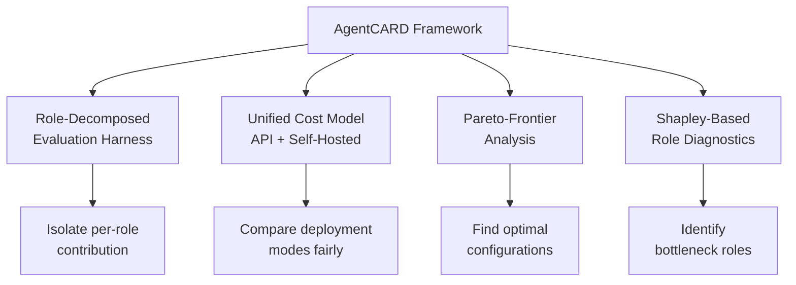
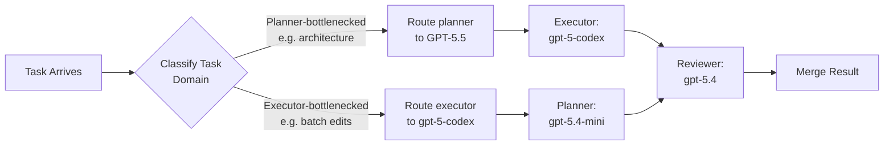
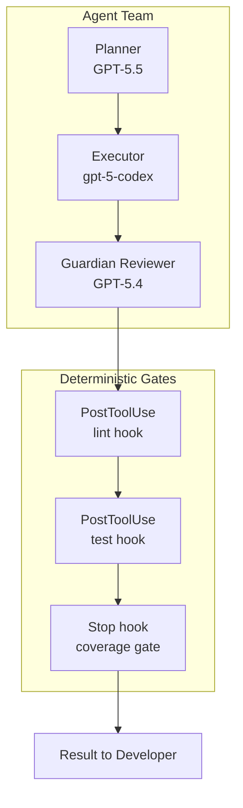

# Specialize Roles, Mix Deployments: What AgentCARD Reveals About Heterogeneous Agent Teams — and How Codex CLI's Custom Agent Definitions Deliver It


---

Should every agent in your pipeline run the same model? A new benchmark from the University of Edinburgh and Microsoft Research says no — emphatically. Jiang et al.'s *Specialize Roles, Mix Deployments* (arXiv:2606.20629) introduces **AgentCARD**, a role-aware benchmark that proves heterogeneous agent teams consistently dominate the cost-accuracy Pareto frontier [^1]. The findings map directly onto a feature set that Codex CLI has been shipping since spring 2026: custom agent definitions, per-role model routing, and hybrid deployment controls.

This article unpacks the research, extracts the engineering lessons, and shows how to apply them in your Codex CLI configuration today.

## The Homogeneous Team Fallacy

Most coding-agent deployments default to a single model for every role. You pick GPT-5.4, or Claude Opus 4.7, or whatever your organisation has access to, and every subagent — planner, executor, reviewer — inherits it. The AgentCARD results expose why this is suboptimal.

Across eight benchmarks — AgentBench, TAU-Bench, MultiAgentBench, HAL, MedAgentBench, FinanceBench, SWE-Bench, and IMO-Bench — heterogeneous teams (different models assigned to different roles) achieved **up to 44% accuracy gains** over cost-equivalent homogeneous teams [^1]. Alternatively, heterogeneous configurations could **match the strongest homogeneous team at up to 12× lower per-task cost** by using hybrid deployment (mixing API and self-hosted models) [^1].

The key insight is that role bottlenecks are domain-dependent. AgentCARD's Shapley-based diagnostic reveals that some domains are **planner-bottlenecked** — you need a frontier model doing the reasoning — while others are **executor-bottlenecked**, where raw code generation throughput matters more than planning depth [^1]. Throwing a frontier model at every role wastes budget on positions where a smaller model would perform identically.

## AgentCARD's Four-Component Framework

The benchmark contributes four components that together form a principled approach to agent team composition [^1]:



1. **Role-decomposed evaluation harness** — isolates each role's contribution rather than evaluating the team as a black box.
2. **Unified cost model** — normalises costs across API pricing, self-hosted GPU-hours, and hybrid configurations so comparisons are fair.
3. **Pareto-frontier analysis** — identifies configurations that cannot be improved on one axis without regressing on the other.
4. **Shapley-based diagnostics** — attributes marginal contribution to each role, revealing which position is the bottleneck worth investing in.

## Mapping AgentCARD Roles to Codex CLI

Codex CLI's multi-agent architecture maps cleanly onto the role decomposition that AgentCARD evaluates. The CLI ships four built-in agent types — `default`, `worker`, `explorer`, and `monitor` — but the real power lies in custom agent definitions [^2].

### Defining Role-Specialised Agents

Custom agents live as standalone TOML files under `~/.codex/agents/` (personal) or `.codex/agents/` (project-scoped) [^2]. Each file specifies its own model, sandbox policy, and behavioural instructions — precisely the per-role configuration that AgentCARD demonstrates matters:

```toml
# .codex/agents/planner.toml
name = "planner"
description = "High-reasoning architectural planning agent"
model = "gpt-5.5"
model_reasoning_effort = "high"
sandbox_mode = "read-only"
developer_instructions = """
Decompose tasks into subtasks. Output a structured plan
with dependencies, estimated complexity, and model
recommendations per subtask. Never write code directly.
"""
```

```toml
# .codex/agents/executor.toml
name = "executor"
description = "Fast code generation and implementation"
model = "gpt-5-codex"
model_reasoning_effort = "medium"
sandbox_mode = "workspace-write"
developer_instructions = """
Implement the plan provided. Write code, run tests,
fix failures. Do not redesign the architecture.
"""
```

```toml
# .codex/agents/reviewer.toml
name = "reviewer"
description = "Security and quality review agent"
model = "gpt-5.4"
model_reasoning_effort = "high"
sandbox_mode = "read-only"
developer_instructions = """
Review diffs for security issues, logic errors, and
style violations. Reference AGENTS.md constraints.
Output structured findings with severity ratings.
"""
```

This three-agent configuration mirrors the planner–executor–verifier triad that AgentCARD identifies as the dominant team structure [^1].

### Concurrency and Orchestration

The `[agents]` section in `config.toml` controls the orchestration layer [^2]:

```toml
[agents]
max_threads = 6        # concurrent open agent threads
max_depth = 1          # nesting depth (root = 0)
job_max_runtime_seconds = 300
```

Codex exposes spawning as a tool suite — `spawn_agent`, `send_input`, `resume_agent`, `wait`, and `close_agent` — giving the LLM full control over delegation timing [^2]. The parent session decides when to spawn, what to assign, and when to collect results, which aligns with AgentCARD's finding that orchestration quality matters as much as individual role capability.

## Cost Optimisation Through Model Routing

AgentCARD's 12× cost reduction through hybrid deployment [^1] has a direct analogue in Codex CLI's named profiles and model routing [^3].

### Profile-Based Routing

Named profiles in `~/.codex/config.toml` let you wire per-task model routing so different task types hit different models automatically [^3]:

```toml
[profiles.fast]
model = "gpt-5.1-codex-mini"
model_reasoning_effort = "low"

[profiles.deep]
model = "gpt-5.5"
model_reasoning_effort = "high"
```

A worked example from the Codex documentation demonstrates that routing 14 tasks to `gpt-5.1-codex-mini` and 6 tasks to `gpt-5.4` achieves a **35% cost saving** compared to running all tasks on GPT-5.4 [^3]. Adding `service_tier = "flex"` pushes that to a **44% saving** [^3].

### The AgentCARD-Informed Routing Strategy

Combining the research findings with Codex CLI's capabilities suggests a concrete workflow:



The critical insight from AgentCARD is that the optimal assignment is **domain-dependent** [^1]. For architectural planning tasks, invest your budget in the planner role. For bulk implementation tasks, invest in the executor. The Shapley diagnostics tell you where the marginal dollar has the highest return.

## Applying Shapley Diagnostics to Your Pipeline

AgentCARD's Shapley-based diagnostic decomposes team accuracy into per-role marginal contributions [^1]. You can approximate this in Codex CLI without formal Shapley computation by running controlled experiments:

1. **Baseline** — run your standard three-agent pipeline on a representative task set. Record accuracy and cost.
2. **Downgrade one role at a time** — swap each role's model for a cheaper alternative while keeping the others fixed. Measure the accuracy delta.
3. **The role with the largest delta is your bottleneck** — that role justifies a frontier model. The others can run cheaper models with minimal accuracy loss.

This maps to Codex CLI's `rollout_token_budget` for per-task cost control [^4] and `codex exec` with `--output-schema` for structured batch evaluation [^5]:


```bash
# Run batch evaluation with structured output
codex exec \
  --model gpt-5-codex \
  --output-schema '{"result": "string", "tests_passed": "number"}' \
  --prompt "Implement and test: {{task}}" \
  --input tasks.csv
```


## Beyond Two Roles: The Verifier Position

AgentCARD extends beyond planner–executor pairs to include verification roles [^1]. This maps to Codex CLI's Guardian auto-review subagent, which performs automated review of agent-generated changes before they are presented to the developer [^6].

The Guardian operates as a specialised verifier agent with its own model assignment. Combined with `PostToolUse` hooks for deterministic validation gates [^7], you get a three-layer verification architecture:



The deterministic hooks handle what no LLM should be trusted with — binary pass/fail checks on linting, test execution, and coverage thresholds. The LLM-based reviewer handles what deterministic tools cannot — semantic review, architectural coherence, and security reasoning. This division of labour is itself a form of role specialisation.

## Practical Configuration: A Complete Heterogeneous Setup

Bringing it all together, here is a complete `config.toml` fragment that implements AgentCARD-informed role specialisation:

```toml
[model]
model = "gpt-5.4"  # default for interactive sessions

[agents]
max_threads = 6
max_depth = 1

[profiles.plan]
model = "gpt-5.5"
model_reasoning_effort = "high"

[profiles.implement]
model = "gpt-5-codex"
model_reasoning_effort = "medium"
service_tier = "flex"

[profiles.review]
model = "gpt-5.4"
model_reasoning_effort = "high"

[profiles.batch]
model = "gpt-5.1-codex-mini"
model_reasoning_effort = "low"
service_tier = "flex"
```

Combined with the three custom agent TOML files shown earlier, this gives you:

- **Frontier reasoning** where the Shapley diagnostics say it matters (planning).
- **Purpose-built code generation** for implementation at a quarter of the cost of GPT-5.5 [^3].
- **Strong review capability** without frontier pricing.
- **Minimum-cost batch processing** for routine tasks at roughly 44% below standard pricing [^3].

## Key Takeaways

1. **Homogeneous teams are suboptimal.** AgentCARD proves this across eight benchmarks with up to 44% accuracy gains from heterogeneous role assignment [^1].
2. **Role bottlenecks are domain-dependent.** Use Shapley-style diagnostics to find which role deserves your frontier model budget.
3. **Codex CLI already supports this.** Custom agent definitions, named profiles, per-role model assignment, and `service_tier` routing give you the configuration surface the research calls for.
4. **Combine LLM roles with deterministic gates.** The most robust architecture uses specialised LLM agents for reasoning tasks and `PostToolUse` hooks for binary validation — role specialisation at every layer.
5. **Measure before optimising.** Downgrade one role at a time and measure the accuracy delta. The role with the largest drop is your bottleneck.

---

## Citations

[^1]: Jiang, Y., Cheng, L., Huang, Y., Zhao, Y., Lu, Z., Dong, L., Li, W., Ponti, E. & Mai, L. (2026). *Specialize Roles, Mix Deployments: Pushing the Cost-Accuracy Frontier of LLM Agent Teams*. arXiv:2606.20629. [https://arxiv.org/abs/2606.20629](https://arxiv.org/abs/2606.20629)

[^2]: OpenAI. (2026). *Subagents — Codex CLI Documentation*. [https://developers.openai.com/codex/subagents](https://developers.openai.com/codex/subagents)

[^3]: Vaughan, D. (2026). *Codex CLI Model Routing in May 2026: GPT-5.5, GPT-5.4, Codex-Spark, and When to Use Each*. Codex Knowledge Base. [https://codex.danielvaughan.com/2026/05/07/codex-cli-model-routing-may-2026-gpt55-gpt54-spark-decision-framework/](https://codex.danielvaughan.com/2026/05/07/codex-cli-model-routing-may-2026-gpt55-gpt54-spark-decision-framework/)

[^4]: OpenAI. (2026). *Advanced Configuration — Codex CLI Documentation*. [https://developers.openai.com/codex/config-advanced](https://developers.openai.com/codex/config-advanced)

[^5]: OpenAI. (2026). *CLI — Codex CLI Documentation*. [https://developers.openai.com/codex/cli](https://developers.openai.com/codex/cli)

[^6]: OpenAI. (2026). *Changelog — Codex CLI*. [https://developers.openai.com/codex/changelog](https://developers.openai.com/codex/changelog)

[^7]: OpenAI. (2026). *Configuration Reference — Codex CLI*. [https://developers.openai.com/codex/config-reference](https://developers.openai.com/codex/config-reference)
