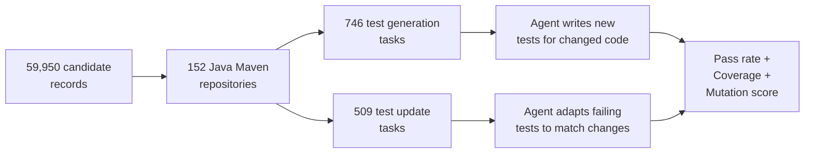
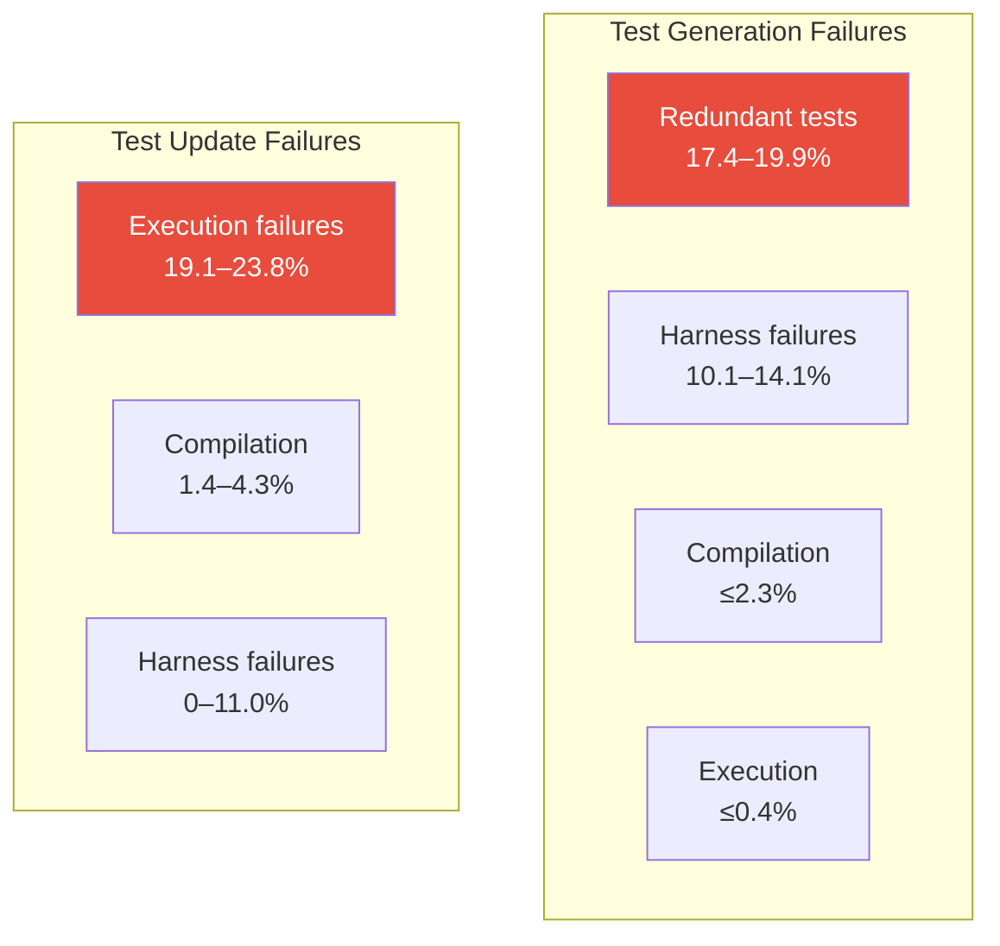

# TestEvo-Bench and the Test Co-Evolution Problem: Why Agents That Generate Tests Cannot Update Them — and How Codex CLI's Hook Pipeline Closes the Gap


---

Software tests are not static artefacts. Production code changes, tests must follow — and when they do not, your test suite becomes a liability rather than a safety net. Wang, Wang, and Nie's TestEvo-Bench (arXiv:2607.02469, July 2026) [^1] is the first executable benchmark to evaluate coding agents on *both* sides of this co-evolution: writing new tests for changed behaviour *and* adapting existing tests that now fail against modified code. The results expose a structural weakness in frontier agents — and point directly at configuration patterns available in Codex CLI today.

## The Benchmark: Two Tracks, One Repository History

TestEvo-Bench mines 59,950 candidate co-evolution records from 152 open-source Java Maven repositories [^1]. From these, the authors curate 746 test generation tasks (spanning 1,961 methods) and 509 test update tasks (covering 1,138 methods). Each task is anchored to a real commit, packaged with the project's build environment, and verified to be executable.



The benchmark evaluates three metrics: pass rate (do the tests compile and pass?), code coverage, and mutation score (do the tests actually detect faults?). A "live" component periodically mines fresh tasks from ongoing repository development, reducing the risk of training data leakage that has plagued earlier benchmarks like SWE-Bench [^2].

## Four Agents, Two Failure Profiles

The authors evaluate four agent configurations combining strong harnesses (Claude Code, Gemini CLI, SWE-Agent) with frontier models (Claude Opus 4.7, Gemini 3.1 Pro) [^1].

### Test Generation Results

| Agent | Pass Rate | Coverage | Mutation Score |
|-------|-----------|----------|----------------|
| Claude Code + Opus 4.7 | 77.5% | 78.0% | 57.1% |
| Gemini CLI + Gemini 3.1 Pro | 77.5% | 74.3% | 55.0% |
| SWE-Agent + Gemini 3.1 Pro | 68.6% | 76.1% | 56.2% |
| SWE-Agent + Opus 4.7 | 66.1% | 77.5% | 55.6% |

### Test Update Results

| Agent | Pass Rate | Coverage | Mutation Score |
|-------|-----------|----------|----------------|
| Gemini CLI + Gemini 3.1 Pro | 74.6% | 79.4% | 46.0% |
| Claude Code + Opus 4.7 | 74.4% | 79.1% | 44.6% |
| SWE-Agent + Gemini 3.1 Pro | 73.9% | 79.3% | 45.6% |
| SWE-Agent + Opus 4.7 | 65.6% | 79.2% | 44.8% |

The headline numbers mask a critical divergence in *how* agents fail across the two tracks.

## The Redundancy Trap vs. the Compilation Wall

In test generation, the dominant failure mode is **redundancy**: 17.4–19.9% of generated tests pass on both the old and new code revisions, meaning the agent failed to perceive the behavioural difference introduced by the commit [^1]. Compilation and execution failures are negligible (≤2.3% and ≤0.4% respectively). The agent can write syntactically correct Java — it simply does not understand *what changed*.

In test update, the picture inverts. Redundancy is not the problem — the agent has the original failing test as a starting point. Instead, **execution failures** dominate at 19.1–23.8%, with compilation failures contributing a further 1.4–4.3% [^1]. The agent understands the intent but fumbles the implementation — wrong method signatures, stale imports, mismatched assertion types.



This asymmetry has direct implications for how you configure an agent. A test generation workflow needs guards against *semantic* redundancy. A test update workflow needs guards against *syntactic* breakage.

## The Mutation Score Gap: Passing Is Not Protecting

Even when agents succeed, test quality is suspect. Mutation scores — measuring whether tests detect injected faults — hover at 55.0–57.1% for generation and drop to 44.6–46.0% for update [^1]. Roughly half of all passing agent-written tests would miss a real bug.

This aligns with the broader "benchmark tests are not strong enough" finding from Liu et al. (arXiv:2604.01518) [^3], who showed that mutation-guided augmentation can expose weaknesses in regression suites that agents produce. It also echoes the adversarial test generation approach of Chowdary et al. (arXiv:2602.08146) [^4], where pitting a test-writing agent against a mutation-generating agent produced significantly more robust test suites.

## Budget Sensitivity: Gemini Shrugs, Claude Collapses

The cost analysis is the most operationally relevant finding. At the default \$3 per-task budget, Claude Code achieves 70.6% (generation) and 86.1% (update). At \$1, it drops to 44.2% and 54.8%. At \$0.50, it collapses to 21.6% generation [^1].

Gemini CLI, by contrast, is "markedly more robust": at \$1 it retains 69.8% generation and 85.8% update. SWE-Agent + Claude is the most fragile, collapsing to 3.0% generation and 1.1% update at \$0.50 [^1].

| Budget | Claude Code Gen | Claude Code Upd | Gemini CLI Gen | Gemini CLI Upd |
|--------|----------------|-----------------|----------------|----------------|
| \$3.00 | 70.6% | 86.1% | 71.3% | 86.6% |
| \$1.00 | 44.2% | 54.8% | 69.8% | 85.8% |
| \$0.50 | 21.6% | — | — | — |

This means budget decisions are not merely cost optimisation — they are correctness decisions. An enterprise running test co-evolution at scale needs to know where the performance cliff lives for its chosen model.

## Temporal Degradation: Newer Code Is Harder

Test generation performance shows "a gradual drop as the data gets more recent" [^1]. Agents trained on historical code patterns perform worse on newer commits, likely because recent libraries, frameworks, and API surfaces have less representation in training data. Test update performance, by contrast, remains stable across time segments — the mechanical task of fixing a broken test assertion is less sensitive to code novelty.

This temporal effect means a benchmark that freezes its task set will overstate agent capability within months. TestEvo-Bench's live mining pipeline addresses this directly, and it is a design pattern worth watching.

## Mapping to Codex CLI: A Four-Layer Defence

Codex CLI's configuration surface maps cleanly to the four failure modes TestEvo-Bench exposes. Here is a practical configuration stack for a test co-evolution workflow.

### Layer 1: AGENTS.md — Encoding the Co-Evolution Protocol

Your `AGENTS.md` should encode the distinction between generation and update tasks, specifying which diff context the agent must read before writing tests:

```markdown
## Test Co-Evolution Rules

When generating NEW tests for changed code:
1. Read the full diff between the two revisions before writing any test
2. Each test must exercise behaviour that DIFFERS between revisions
3. Run the test against BOTH revisions — it must pass on new and FAIL on old
4. Never produce a test that passes on both revisions (redundancy)

When updating FAILING tests:
1. Read the compilation/execution error output first
2. Check import statements against the current API surface
3. Verify method signatures match the post-change codebase
4. Run the updated test — it must compile and pass
```

This directly attacks the redundancy problem in generation and the compilation/execution failure modes in update.

### Layer 2: PostToolUse Hooks — Mutation Validation Gates

A `PostToolUse` hook can enforce mutation-aware quality checks after every test file write [^5]:

```toml
# .codex/config.toml
[hooks.post_tool_use]
command = ".codex/hooks/validate-test-quality.sh"
```

```bash
#!/usr/bin/env bash
# .codex/hooks/validate-test-quality.sh
# Runs mutation testing on newly written/updated test files

CHANGED_TESTS=$(git diff --name-only --diff-filter=AM -- '*.java' | grep -i test)
if [ -z "$CHANGED_TESTS" ]; then
  echo '{"decision": "approve"}'
  exit 0
fi

# Run PIT mutation testing on changed test classes
mvn org.pitest:pitest-maven:mutationCoverage \
  -DtargetTests="$(echo "$CHANGED_TESTS" | sed 's|src/test/java/||;s|/|.|g;s|\.java||' | tr '\n' ',')" \
  -DmutationThreshold=60 2>/dev/null

if [ $? -ne 0 ]; then
  echo '{"decision": "reject", "reason": "Mutation score below 60% threshold — tests pass but do not detect faults"}'
  exit 0
fi

echo '{"decision": "approve"}'
```

This catches the mutation score gap (44.6–57.1%) before the agent declares completion. The 60% threshold is deliberately above the benchmark mean — raise it as your codebase matures.

### Layer 3: rollout_token_budget — Cost-Aware Task Routing

TestEvo-Bench's budget sensitivity data maps directly to Codex CLI's `rollout_token_budget` configuration [^6]. Rather than applying a blanket budget, use named profiles to route tasks by expected cost sensitivity:

```toml
# .codex/profiles/test-generation.toml
[model]
name = "o4-mini"  # Cost-efficient for generation tasks

[budget]
rollout_token_budget = 150000  # ~$1 equivalent

[hooks.stop]
command = ".codex/hooks/verify-test-not-redundant.sh"
```

```toml
# .codex/profiles/test-update.toml
[model]
name = "o3"  # Stronger model for update's compilation challenges

[budget]
rollout_token_budget = 300000  # ~$3 equivalent — update needs headroom

[hooks.stop]
command = ".codex/hooks/verify-test-compiles.sh"
```

The rationale follows directly from TestEvo-Bench: test update tasks have higher execution failure rates and benefit from more capable models with larger budgets, whilst test generation tasks are more cost-elastic with Gemini-class efficiency [^1].

### Layer 4: codex exec — Batch Co-Evolution Pipeline

For CI integration, `codex exec` with `--output-schema` structures the output for downstream processing [^7]:

```bash
#!/usr/bin/env bash
# Run test co-evolution across all changed files in a PR

CHANGED_FILES=$(git diff --name-only origin/main...HEAD -- 'src/main/**/*.java')

for file in $CHANGED_FILES; do
  TEST_FILE=$(echo "$file" | sed 's|src/main|src/test|;s|\.java|Test.java|')

  if [ -f "$TEST_FILE" ]; then
    # Test update: existing test may need adaptation
    codex exec --profile test-update \
      --sandbox workspace-write \
      "The file $file has changed. Update $TEST_FILE to pass against the new implementation. Do not weaken assertions."
  else
    # Test generation: write new tests
    codex exec --profile test-generation \
      --sandbox workspace-write \
      "Generate tests for the changes in $file. Each test must exercise new behaviour introduced in the latest commit."
  fi
done
```

This pipeline distinguishes generation from update at the routing layer, applying different profiles, budgets, and models to each — exactly the distinction TestEvo-Bench demonstrates matters.

## What TestEvo-Bench Does Not Measure

The benchmark is Java-only and Maven-only [^1]. Extrapolating to TypeScript, Python, or Go requires caution — dependency resolution, test runner semantics, and assertion library conventions differ substantially. The live mining approach also creates a moving target for reproducibility, trading benchmark stability for freshness. Both are reasonable design choices for a first-generation co-evolution benchmark, but practitioners should validate against their own stack.

The mutation scores also depend on PIT (the Java mutation testing framework) [^3], and mutation testing tooling varies dramatically across ecosystems. The 44–57% scores may reflect PIT's mutation operator set as much as agent capability.

## Practical Takeaways

1. **Separate your test generation and test update workflows.** They fail differently and need different configurations.
2. **Pass rate is necessary but not sufficient.** Enforce mutation score thresholds via PostToolUse hooks to catch the 43–55% of passing tests that would miss real bugs.
3. **Budget your test tasks explicitly.** Claude-class models show steep performance cliffs below \$1/task; Gemini-class models degrade gracefully. Use `rollout_token_budget` to enforce limits and named profiles to route accordingly.
4. **Expect temporal degradation.** Agent-written tests for recently shipped code will be weaker. Plan for human review on the newest surfaces.
5. **Use AGENTS.md to encode the redundancy check.** The single highest-impact intervention for test generation is requiring the agent to verify its test fails on the pre-change revision.

## Citations

[^1]: Wang, J.A., Wang, K., & Nie, P. (2026). "TestEvo-Bench: An Executable and Live Benchmark for Test and Code Co-Evolution." arXiv:2607.02469. [https://arxiv.org/abs/2607.02469](https://arxiv.org/abs/2607.02469)

[^2]: Gorinova, M. et al. (2026). "Coding Benchmarks Are Misaligned with Agentic Software Engineering." arXiv:2606.17799. [https://arxiv.org/abs/2606.17799](https://arxiv.org/abs/2606.17799)

[^3]: Liu, Y. et al. (2026). "Are Benchmark Tests Strong Enough? Mutation-Guided Diagnosis and Augmentation of Regression Suites." arXiv:2604.01518. [https://arxiv.org/abs/2604.01518](https://arxiv.org/abs/2604.01518)

[^4]: Chowdary, P. et al. (2026). "Test vs Mutant: Adversarial LLM Agents for Robust Unit Test Generation." arXiv:2602.08146. [https://arxiv.org/abs/2602.08146](https://arxiv.org/abs/2602.08146)

[^5]: OpenAI. (2026). "Hooks — Codex CLI." OpenAI Developer Documentation. [https://developers.openai.com/codex/hooks](https://developers.openai.com/codex/hooks)

[^6]: OpenAI. (2026). "Configuration Reference — Codex CLI." OpenAI Developer Documentation. [https://developers.openai.com/codex/config-reference](https://developers.openai.com/codex/config-reference)

[^7]: OpenAI. (2026). "Non-interactive mode — Codex CLI." OpenAI Developer Documentation. [https://developers.openai.com/codex/noninteractive](https://developers.openai.com/codex/noninteractive)
