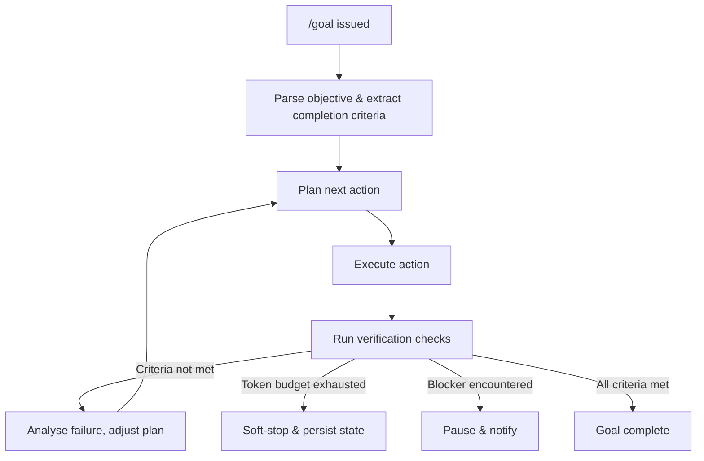
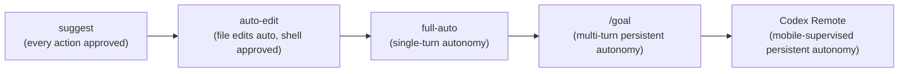

# The /goal Command and the Verification Problem: Long-Running Autonomous Agents in Codex CLI


---

The `/goal` command, shipped in Codex CLI 0.128.0 on 30 April 2026 and graduated to general availability in 0.133.0 on 21 May 2026[^1], fundamentally changes what it means to use a coding agent. Instead of a single prompt-response exchange, you state an objective and walk away. The agent loops — plan, act, test, review, iterate — until it either finishes, exhausts its token budget, or hits a blocker it cannot resolve autonomously[^2].

This is powerful. It is also dangerous. The longer an agent runs unsupervised, the harder it is to verify what it actually did. This article examines the `/goal` lifecycle, the verification techniques that make autonomous runs trustworthy, and the configuration levers Codex CLI provides to keep costs and blast radius under control.

## How /goal Works

Goal mode transforms Codex CLI from a reactive assistant into a persistent autonomous agent. The execution model operates as a continuation loop: after each turn, the agent re-enters its planning cycle, checks a verifiable completion condition, and decides whether to continue or stop[^2].



State persists across sessions. You can pause a goal mid-run, close your terminal, and resume it later — the agent picks up where it left off[^3]. The lifecycle commands are:

| Command | Effect |
|---------|--------|
| `/goal <objective>` | Create or replace the active goal |
| `/goal pause` | Suspend the current goal loop |
| `/goal resume` | Continue a paused goal |
| `/goal clear` | Abandon the active goal |

Internally, goal state is managed through app-server APIs using three model tools: `get_goal`, `create_goal`, and `update_goal`, which were merged behind the `goals` feature flag[^4].

## Enabling Goal Mode

On current stable (0.142.5), goal mode is enabled by default. On older versions, activate it explicitly:

```bash
codex features enable goals
```

For full autonomy, pair it with full-auto approval:

```bash
codex --approval-mode full-auto
```

Or set it in `~/.codex/config.toml`:

```toml
approval_policy = "never"   # equivalent to full-auto

[features]
goals = true
```

## The Verification Problem

Here is the tension: a `/goal` run that operates for 15 hours can touch hundreds of files across dozens of subsystems[^5]. The developer who returns to review the output faces an asymmetry — the agent knows exactly what it did, but the human must reconstruct that knowledge from diffs alone.

This is not a theoretical concern. Community reports document runs where vague objectives produced extensive backend changes the author could not easily verify[^5]. The agent filled in ambiguous requirements with its own assumptions, and those assumptions compounded across iterations.

Three failure modes dominate:

1. **Specification drift** — the agent interprets an underspecified goal in ways that diverge from the developer's intent, but each individual step looks reasonable in isolation.
2. **Silent quality degradation** — tests pass but the implementation introduces technical debt, unnecessary abstractions, or architectural patterns inconsistent with the existing codebase.
3. **Verification theatre** — the agent writes tests that confirm its own output without exercising the edge cases a human reviewer would probe.

## The Three-File Trust Architecture

The emerging community consensus centres on three companion files that transform blind faith into auditable evidence[^6]:

### GOAL.md — Defining Completion

```markdown
## Objective
Migrate the authentication module from Express middleware to Hono middleware.

## Requirements
1. All existing auth tests pass against the new middleware
2. Session handling preserves backward compatibility with v2 API clients
3. No new dependencies beyond hono/middleware
4. OpenAPI spec updated to reflect changed response headers

## Stop Conditions
- If migration requires changes to the database schema, STOP and report
- If any v2 API contract test fails, STOP and report

## Definition of Done
`npm run test:auth && npm run test:api:v2 && npm run lint`
```

The critical design choice is making the definition of done a runnable command, not a subjective judgement. "Make the code more elegant" is unverifiable; "all tests pass and no lint errors" is not[^2].

### VERIFY.md — Mapping Requirements to Evidence

```markdown
| # | Requirement | Check command | Expected |
|---|-------------|---------------|----------|
| 1 | Auth tests pass | `npm run test:auth` | Exit 0 |
| 2 | v2 API compat | `npm run test:api:v2` | Exit 0, no deprecation warnings |
| 3 | No new deps | `diff <(git show HEAD~1:package.json) package.json \| grep '+'` | No new entries |
| 4 | OpenAPI updated | `npx openapi-diff old-spec.yaml openapi.yaml` | Breaking: 0 |
```

The key insight: a green terminal is not proof if the check does not map back to a specific requirement[^6]. VERIFY.md creates that mapping explicitly, and each check uses real project commands rather than agent-invented assertions.

### PROGRESS.md — Recording What Happened

The agent maintains a structured execution log:

```markdown
## Run 1 — 2026-07-06 09:00–11:45

### Completed
- [x] Migrated 14 route handlers to Hono middleware
- [x] Updated session serialisation for v2 compat

### Verification
| Check | Result | Evidence |
|-------|--------|----------|
| Auth tests | PASS | 142/142 passed |
| v2 API | PASS | 89/89 passed, 0 deprecation warnings |
| No new deps | PASS | package.json unchanged |
| OpenAPI diff | PASS | 0 breaking changes |

### Files Modified
- src/middleware/auth.ts (rewritten)
- src/routes/*.ts (14 files, import changes)
- openapi.yaml (response header updates)
```

Together, these three files create traceability: any requirement can be traced from GOAL through its corresponding check in VERIFY to the documented outcome in PROGRESS[^6].

## Configuring Cost Guardrails

Long-running goals consume tokens. A 12-hour run on a Pro plan can consume over 70% of the weekly quota[^7]. Codex CLI 0.142.0 introduced configurable rollout token budgets as the primary cost-control lever[^8]:

```toml
[features.rollout_budget]
enabled = true
limit_tokens = 500000
sampling_token_weight = 1.0
prefill_token_weight = 1.0
reminder_interval_tokens = 50000
```

When the budget is exhausted, the goal soft-stops — it persists state and pauses rather than terminating[^8]. The `reminder_interval_tokens` setting injects periodic budget warnings into the agent's context, defaulting to 10% of `limit_tokens`[^9].

For enterprise teams, pair this with managed `requirements.toml` to enforce organisation-wide limits:

```toml
[features.rollout_budget]
enabled = true
limit_tokens = 1000000
```

## The Separate Verifier Pattern

The most robust verification architecture uses a dedicated verifier subagent that never sees the goal agent's reasoning[^2]:


Configure this in `config.toml`:

```toml
# Verifier subagent profile
[profiles.verifier]
sandbox_mode = "read-only"
model_reasoning_effort = "high"
approval_policy = "untrusted"
```

The verifier operates in a read-only sandbox with elevated reasoning effort, ensuring it cannot modify the code it reviews and has sufficient reasoning capacity to catch subtle issues[^2]. This separation prevents the maker from grading its own work — the single most common failure mode in autonomous verification.

## What Goals Are Not Good For

Goal mode excels at well-specified, mechanically verifiable tasks: codebase migrations, test suite generation, multi-file refactoring with clear acceptance criteria[^10]. It struggles with:

- **Ambiguous design work** requiring subjective aesthetic judgement
- **Architecture decisions** not yet finalised — the agent will finalise them for you, often badly
- **Tasks requiring iterative human feedback** — goal mode optimises for autonomous completion, not collaboration[^10]

The meta-prompting community has converged on a useful heuristic: if you cannot write a runnable definition-of-done command before starting the goal, the task is not ready for `/goal`[^10].

## Goal Mode and the Broader Autonomy Spectrum

Goal mode sits at one end of a spectrum that Codex CLI now spans comprehensively:



The June 2026 Codex Remote GA release[^8] added a supervision layer for goal mode: you can start a `/goal` on your development machine, pair your phone via QR code, and monitor or intervene from the ChatGPT mobile app. This addresses a genuine gap — autonomous does not have to mean unmonitored.

## Practical Recommendations

1. **Always use a separate Git branch.** Goal mode should never operate on `main`. Use worktrees for isolation.
2. **Write GOAL.md, VERIFY.md, and PROGRESS.md before invoking `/goal`.** Front-load the verification design.
3. **Set a rollout token budget.** Even generous budgets prevent runaway costs from looping failures.
4. **Deploy a verifier subagent.** The maker should never grade its own work.
5. **Prefer concrete objectives.** "Migrate auth to Hono with all existing tests passing" beats "refactor the auth system."
6. **Review PROGRESS.md first, diffs second.** The execution log tells you what the agent intended; the diffs tell you what it actually did. Discrepancies are where bugs hide.

## Citations

[^1]: [OpenAI Codex CLI Changelog — Goal Mode GA in v0.133.0](https://developers.openai.com/codex/changelog), May 2026. Goal mode shipped experimentally in 0.128.0 (30 April 2026) and graduated to GA on 21 May 2026.

[^2]: [Goal Mode in Codex CLI: Persistent Objectives, Token Budgets, and the Shift to Agentic Loops](https://codex.danielvaughan.com/2026/05/03/codex-cli-goal-mode-persistent-objectives-token-budgets-agentic-loops/), Codex Knowledge Base, May 2026.

[^3]: [OpenAI Codex /goal vs Claude Code Agents — Architecture Comparison](https://devtoolpicks.com/blog/codex-goal-command-vs-claude-code-agents-2026), DevToolPicks, 2026.

[^4]: [Add goal model tools (3/5) — Pull Request #18075](https://github.com/openai/codex/pull/18075), openai/codex, 2026. Implements `get_goal`, `create_goal`, and `update_goal` tool specifications behind the goals feature flag.

[^5]: [Codex CLI New Feature Just CHANGED EVERYTHING](https://www.youtube.com/watch?v=mAchIVnEqf0), Income stream surfers, May 2026. Documents a 15+ hour autonomous /goal run producing extensive backend changes difficult to verify.

[^6]: [3 Files That Make Codex Goal Command Trustworthy](https://www.nathanonn.com/codex-goal-command-three-files/), Nathan Onn, 2026.

[^7]: [Feedback: /goal mode usage consumes too much weekly limit — Issue #28688](https://github.com/openai/codex/issues/28688), openai/codex, 2026. Reports a 12-hour goal task consuming over 70% of Pro weekly quota.

[^8]: [Codex CLI Changelog — v0.142.0](https://developers.openai.com/codex/changelog), June 2026. Introduced configurable rollout token budgets and Codex Remote GA.

[^9]: [Codex Configuration Reference](https://developers.openai.com/codex/config-reference), OpenAI Developers, 2026. Documents `features.rollout_budget` settings including `reminder_interval_tokens` defaulting to 10% of `limit_tokens`.

[^10]: [Codex /goal: How to Meta Prompt It For Days of Autonomous Work](https://www.adityabawankule.io/blog/codex-goal-meta-prompting), Aditya Bawankule, 2026.
