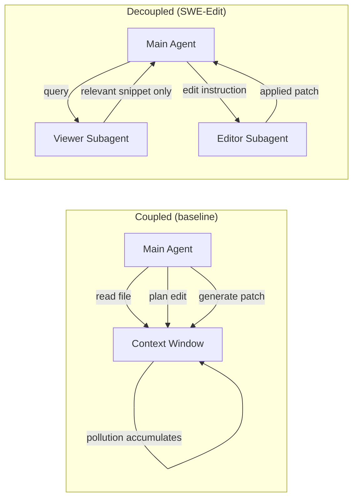
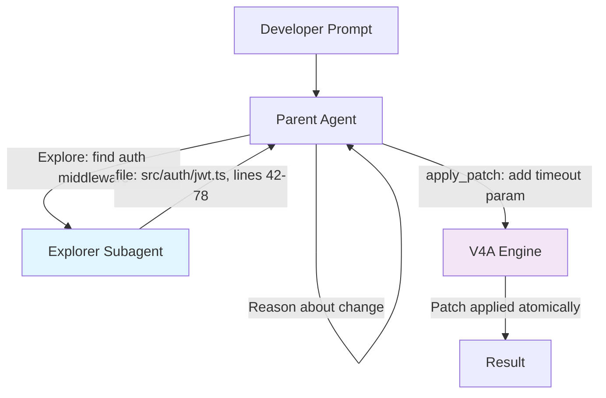

# The Context Coupling Problem: Why Your Coding Agent's Editing Interface Is Its Biggest Bottleneck — and How Codex CLI's Subagent Architecture Solves It


---

Every coding agent — Codex CLI included — faces a tension that no amount of model intelligence can paper over: exploration and precision are fundamentally at odds inside a single context window. Microsoft Research's SWE-Edit paper [^1] names this the *context coupling problem*, and the numbers behind it explain a class of editing failures that most teams attribute to "the model being stupid."

This article unpacks the problem, examines SWE-Edit's viewer–editor decomposition, and maps the same architectural insight onto Codex CLI's existing subagent delegation and V4A patch pipeline — showing how to configure your agent stack so exploration never poisons your edits.

## The Context Coupling Problem, Defined

Standard agent editing interfaces conflate three distinct cognitive tasks inside one context window [^1]:

1. **Code inspection** — reading files, tracing dependencies, understanding structure.
2. **Modification planning** — deciding *what* to change and *where*.
3. **Edit execution** — producing syntactically correct, format-sensitive patches.

The trouble is that inspection is inherently broad. Debugging a test failure might require reading a dozen files across four packages. Each file snippet persists in context regardless of whether it turns out to be relevant. By the time the agent knows *where* to edit, its context window is polluted with irrelevant code that degrades both reasoning accuracy and edit-format reliability [^1].

SWE-Edit's measurements quantify this: in a baseline SWE-bench Verified run, the main agent consumed 276.7K non-cached input tokens per instance [^1]. Much of that budget was spent on file contents the agent viewed once and never referenced again.



## SWE-Edit's Viewer–Editor Decomposition

SWE-Edit [^1] splits the editing interface into two purpose-built subagents, each operating in a clean, isolated context:

### The Viewer

The Viewer receives a file path and a natural-language query — *"show me the authentication middleware that validates JWT tokens"* — and returns only the task-relevant code snippet. It filters out 60.3% of file content on average whilst maintaining 93.8% recall on the PR-Edit benchmark [^1]. The main agent sees precisely what it needs without accumulating dead context.

### The Editor

The Editor receives a file path and a natural-language edit instruction — *"add a timeout parameter with a default of 30 seconds to the retry loop"* — and produces the concrete modification. This decouples high-level reasoning ("what to change") from low-level code generation ("properly formatted patches"). Edit success rates rose from 93.4% to 96.1% with this separation alone [^1].

### Combined Results

On SWE-bench Verified (500 instances), the combined viewer–editor architecture delivered [^1]:

| Metric | Baseline | SWE-Edit | Delta |
|--------|----------|----------|-------|
| Resolve rate | 69.9% | 72.0% | +2.1 pp |
| Total cost | \$243.70 | \$200.10 | −17.9% |
| Edit success | 93.4% | 96.9% | +3.5 pp |
| Non-cached input tokens | 276.7K | 181.3K | −34.5% |

The gains held across Kimi-K2, MiniMax-M2.1, and GLM-4.7 — evidence that the benefit is architectural, not model-specific [^1].

## The Find-Replace Fragility Problem

SWE-Edit also exposed a deeper issue: no single editing format is optimal across all modification types [^1]. Find-and-replace is token-efficient for localised changes but demands exact string matching, including whitespace. Full-file rewriting avoids matching errors but wastes tokens on large files. The paper trained a Qwen3-8B editor using GRPO to adaptively select between modes, improving format success from 76.8% to 90.4% [^1].

This resonates directly with Codex CLI's editing story. Codex uses the V4A diff format [^2] — a context-anchored patch grammar where hunks are matched by surrounding code rather than brittle line numbers. V4A's progressive fuzzy matching (exact → line-ending normalisation → whitespace variation) [^2] addresses exactly the same class of failures that SWE-Edit's adaptive strategy targets, but at the format level rather than the model-selection level.

## How Codex CLI Already Implements This Pattern

Codex CLI's architecture maps onto the viewer–editor separation through three mechanisms that are already shipping:

### 1. Subagent Delegation for Exploration

Codex CLI's subagent system [^3] allows you to delegate read-heavy exploration to a purpose-built child agent that operates in its own isolated context window. Configuration lives in `config.toml`:

```toml
[agents]
max_threads = 6      # concurrent agent threads
max_depth = 1        # nesting depth (prevents runaway fan-out)
```

A custom exploration agent defined in `.codex/agents/explorer.toml` can use a cheaper, faster model for file traversal:

```toml
name = "explorer"
description = "Read-only codebase explorer. Returns only relevant code paths."
model = "gpt-5.3-codex-spark"

developer_instructions = """
You are a read-only code explorer. When asked to find code related to a topic:
1. Search broadly using grep and file listing tools
2. Read candidate files
3. Return ONLY the relevant functions/classes with file paths and line ranges
4. Never modify any files
"""
```

This mirrors SWE-Edit's Viewer: the explorer agent accumulates context pollution in its *own* window, then returns a filtered summary to the parent agent [^3]. The parent's context stays clean for reasoning and editing.

### 2. V4A Patch Format for Reliable Edits

Once the parent agent knows what to change, Codex CLI's `apply_patch` tool generates V4A diffs [^2]. The format's design choices directly address SWE-Edit's findings about edit fragility:

- **Context anchoring** over line numbers eliminates the hallucinated-line-number failure mode [^2].
- **Progressive fuzzy matching** handles whitespace drift without requiring exact string reproduction [^2].
- **Native model fluency** — OpenAI's models are specifically trained to produce V4A, giving generation reliability that generic find-replace prompting cannot match [^2].

The V4A pipeline runs internally rather than via shell subprocess, meaning validation, path rejection (no absolute paths, no traversal), and atomic rollback are handled at the engine level [^2].

### 3. Context Compaction as a Safety Net

When context pollution does occur — inevitable in long sessions — Codex CLI's `model_auto_compact_token_limit` triggers automatic compaction [^4]. This is the fallback that SWE-Edit's architecture makes less necessary: if your subagent exploration pattern keeps the parent context lean, compaction fires less frequently, preserving reasoning continuity.

```toml
[model]
model_auto_compact_token_limit = 80000  # trigger compaction at 80K tokens
```

## Practical Configuration: The Exploration–Editing Split

Combining these mechanisms, a well-configured Codex CLI setup separates exploration from editing at the architectural level:



The key insight from SWE-Edit is that this separation is not merely a performance optimisation — it is an *architectural requirement* for reliable editing at scale. Agents that explore and edit in the same context window will always face a trade-off between exploration breadth and edit precision [^1]. Subagent delegation eliminates that trade-off.

### Token Budget Implications

SWE-Edit demonstrated a 34.5% reduction in non-cached input tokens [^1]. In Codex CLI terms, this translates directly to lower `rollout_budget` consumption [^5]. If you are running `/goal` mode with a capped token budget, delegating exploration to subagents extends how far that budget reaches:

```toml
[features]
rollout_budget = 500000           # total token ceiling

[agents]
max_threads = 4                   # exploration + editing concurrency
```

Each subagent's token consumption counts against the rollout budget [^5], but the *parent's* context stays small, meaning fewer compaction cycles and more reasoning headroom where it matters most.

## When to Apply This Pattern

The exploration–editing split pays off most in scenarios where:

- **Multi-file changes** span three or more files across different packages.
- **Debugging sessions** require reading many candidate files before identifying the root cause.
- **Large codebases** where naive file reading fills the context window before editing begins.
- **Cost-sensitive pipelines** where token efficiency directly affects CI/CD budgets.

For simple, localised edits — a single function in a known file — the overhead of spawning a subagent outweighs the benefit. Codex CLI's default single-agent flow with V4A patching is already well-optimised for that case [^2].

## The Broader Trend: Separation of Concerns for Agent Interfaces

SWE-Edit is part of a broader movement toward decomposing monolithic agent loops into specialised components. CodeDelegator [^6] applies similar role-separation principles to code-as-action agents. Microsoft Research's FastContext [^7] proposes delegating exploration to a purpose-trained subagent, reporting up to 60% token reduction with 5.5 percentage-point resolution gains. The pattern is converging: the agent that *thinks* about what to change should not be the same agent that *reads* the codebase or *writes* the patch.

Codex CLI's architecture — with its configurable subagent delegation, purpose-built V4A editing format, and context compaction safety net — already provides the building blocks for this separation. The gap is not in the tooling but in how most developers configure it: defaulting to single-agent mode when a two-agent exploration–editing split would produce better results at lower cost.

## Citations

[^1]: Zhang, Y. et al. (2026). *SWE-Edit: Rethinking Code Editing for Efficient SWE-Agent*. arXiv:2604.26102. [https://arxiv.org/abs/2604.26102](https://arxiv.org/abs/2604.26102)

[^2]: Vaughan, D. (2026). *The V4A Diff Format: How Codex CLI's apply_patch Actually Edits Your Code*. Codex Knowledge Base. [https://codex.danielvaughan.com/2026/03/31/codex-cli-apply-patch-v4a-diff-format/](https://codex.danielvaughan.com/2026/03/31/codex-cli-apply-patch-v4a-diff-format/)

[^3]: OpenAI (2026). *Subagents — Codex CLI*. OpenAI Developers. [https://developers.openai.com/codex/subagents](https://developers.openai.com/codex/subagents)

[^4]: OpenAI (2026). *Features — Codex CLI*. OpenAI Developers. [https://developers.openai.com/codex/cli/features](https://developers.openai.com/codex/cli/features)

[^5]: OpenAI (2026). *Changelog — Codex*. OpenAI Developers. [https://developers.openai.com/codex/changelog](https://developers.openai.com/codex/changelog)

[^6]: *CodeDelegator: Mitigating Context Pollution via Role Separation in Code-as-Action Agents*. arXiv:2601.14914. [https://arxiv.org/abs/2601.14914](https://arxiv.org/abs/2601.14914)

[^7]: Vaughan, D. (2026). *FastContext: What Microsoft's Repository Explorer Means for Codex CLI Exploration Strategy*. Codex Knowledge Base. [https://codex.danielvaughan.com/2026/06/20/fastcontext-repository-explorer-coding-agents-codex-cli-exploration-subagent-token-reduction/](https://codex.danielvaughan.com/2026/06/20/fastcontext-repository-explorer-coding-agents-codex-cli-exploration-subagent-token-reduction/)
