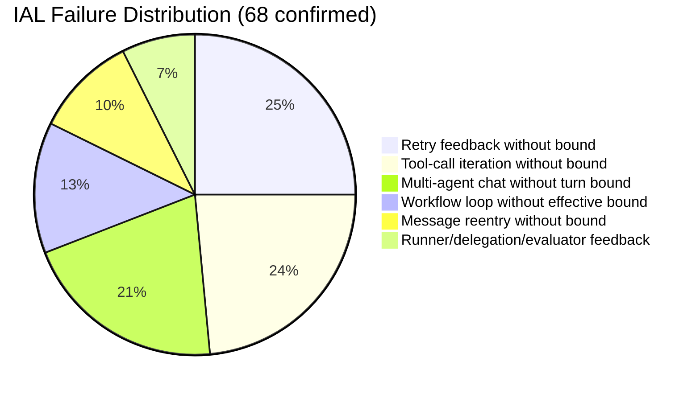
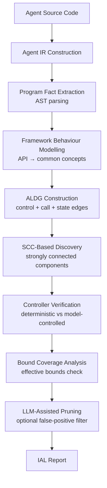

# Infinite Agentic Loops: What IAL-Scan's 68-Failure Audit Reveals About Unbounded Feedback Paths — and How Codex CLI's Budget and Compaction Stack Stops Them


---

## The Loop Nobody Planned For

Every agentic coding workflow is, at its core, a feedback loop: plan, invoke a tool, inspect the result, decide whether to continue. That loop is the engine of agent autonomy — and its most dangerous failure mode. When the termination condition is missing, misconfigured, or model-dependent, the engine runs until something external breaks: the API rate limit, the token budget, or your monthly bill.

Hou et al.'s "When Agents Do Not Stop: Uncovering Infinite Agentic Loops in LLM Agents" (arXiv:2607.01641, July 2026) [^1] provides the first large-scale empirical evidence of how widespread this problem is. Their static analysis tool, IAL-Scan, examined 6,549 LLM agent repositories and confirmed 68 infinite agentic loop (IAL) failures across 47 projects — with 91.9% detection precision [^1]. The failures span every major orchestration framework, from LangGraph and AutoGen to the OpenAI Agents SDK and Google ADK.

This article unpacks the taxonomy, maps each failure class to Codex CLI's defence layers, and provides configuration recipes for teams that want deterministic loop bounds rather than hope.

---

## The Six Failure Patterns

IAL-Scan's analysis produced a six-category taxonomy of infinite agentic loops [^1]:



### 1. Retry Feedback Without Bound (25.0%)

The most common pattern: a `while True` loop retrying an LLM call when parsing or validation fails. When the model consistently produces malformed output — a common occurrence with complex structured-output schemas — the loop never terminates. The LiteRAG project exemplified this: nested while loops calling `self.llm.invoke(...)` with no retry cap, timeout, or token budget [^1].

### 2. Tool-Call Iteration Without Bound (23.5%)

An agent invokes tools in a loop, appending corrective prompts on empty or malformed results. NVIDIA-AI-Blueprints contained an unbounded `while True` loop where tool-binding failures triggered message-state growth and another model call, creating "a feedback path from model output to message state growth and then back to another model call" [^1].

### 3. Multi-Agent Chat Without Turn Bound (20.6%)

Two or more agents converse without an iteration ceiling. Each agent's response triggers the other's next turn. Without an explicit turn limit, the conversation runs until context exhaustion or API denial.

### 4. Workflow Loop Without Effective Bound (13.2%)

Graph-based orchestrators (LangGraph, ADK) define state-machine transitions. When edges form cycles and the exit condition depends on model judgment rather than a deterministic guard, the workflow loops indefinitely.

### 5. Message Reentry Without Bound (10.3%)

Every iteration appends to the message history. The context grows monotonically — no compaction, no pruning. Eventually the context window fills, the model's output quality degrades, and the degraded output triggers yet another iteration.

### 6. Runner/Delegation/Evaluator Feedback (7.4%)

An outer evaluator rejects an inner agent's output, which triggers re-execution, which produces similar output, which the evaluator rejects again. Without coverage tracking or attempt limits, the cycle persists.

---

## The Damage Is Real

The consequences of IAL failures are not theoretical. Across the 68 confirmed cases [^1]:

| Consequence | Affected (%) |
|---|---|
| API cost exhaustion | 95.6 |
| Model denial of service | 95.6 |
| Context window exhaustion | 27.9 |
| External tool rate-limit exhaustion | 7.4 |

Nearly every infinite loop drains API credits and risks triggering provider-side rate limits or service denial. The 27.9% that also exhaust the context window create a secondary failure: as the window fills, model output quality drops, which paradoxically makes the loop *less likely* to terminate.

## Framework Distribution

No framework is immune. LangGraph and AutoGen accounted for two-thirds of confirmed failures [^1]:

| Framework | Failures | Share |
|---|---|---|
| LangGraph | 23 | 33.8% |
| AutoGen AgentChat | 22 | 32.4% |
| LlamaIndex | 6 | 8.8% |
| LangChain AgentExecutor | 5 | 7.4% |
| CrewAI | 4 | 5.9% |
| OpenAI Agents SDK | 4 | 5.9% |
| Google ADK | 3 | 4.4% |
| Semantic Kernel | 1 | 1.5% |

---

## IAL-Scan's Detection Architecture

The paper's core contribution is the Agentic Loop Dependence Graph (ALDG) — a static representation that captures feedback paths across heterogeneous framework abstractions [^1].



The key insight is the distinction between *local* bounds and *effective* bounds. A retry loop might have a local `max_retries` parameter, but if the outer workflow loop re-enters the same code path without tracking cumulative attempts, the local bound provides no effective protection [^1]. IAL-Scan checks whether bounds cover the entire repeated feedback path, not just individual scopes.

---

## Codex CLI's Defence Stack

Codex CLI does not use LangGraph, AutoGen, or any of the eight frameworks in the study. Its agentic loop runs inside `codex-rs`, a single-threaded Rust runtime that enforces budget accounting at the process level [^2]. This architectural choice sidesteps several IAL categories by design, but the principles from the taxonomy still apply. Here is how Codex CLI's configuration maps to each failure pattern.

### Defence 1: Rollout Token Budget (Retry + Tool-Call Loops)

The `features.rollout_budget` configuration provides a hard ceiling on cumulative token consumption across all turns and subagent threads [^2][^3]:

```toml
[features.rollout_budget]
enabled = true
limit_tokens = 200000
reminder_interval_tokens = 20000
sampling_token_weight = 1.0
prefill_token_weight = 1.0
```

When cumulative tokens approach `limit_tokens`, the runtime injects a `budget_limit.md` reminder. The agent receives explicit notification that the budget is nearly exhausted and is expected to wrap up gracefully [^3]. This is a *soft stop* — the agent finishes its current turn rather than aborting mid-edit — but it provides the token-level bound that 95.6% of the IAL failures lacked.

The `sampling_token_weight` and `prefill_token_weight` multipliers allow cost-proportional accounting: if sampled (output) tokens cost 4× prefill (input) tokens, setting `sampling_token_weight = 4.0` makes the budget track actual spend rather than raw token count [^3].

### Defence 2: Auto-Compaction (Message Reentry)

The message-reentry pattern — unbounded context growth — is addressed by `model_auto_compact_token_limit` [^2]:

```toml
model_auto_compact_token_limit = 120000
```

When the conversation history exceeds this threshold, Codex hands the entire context to an LLM to produce a handoff summary, then replaces the original history with that summary [^2]. This breaks the monotonic growth that drives the reentry loop. The default is typically 85–90% of the model's context window minus output tokens [^2].

### Defence 3: Subagent Depth and Thread Limits (Delegation Loops)

The runner/delegation/evaluator pattern maps directly to subagent spawning. Codex CLI bounds this with two configuration keys [^2]:

```toml
[agents]
max_threads = 6
max_depth = 1
```

`max_depth = 1` means a subagent cannot spawn its own subagents — eliminating recursive delegation chains entirely. `max_threads = 6` caps concurrent agent threads, preventing fan-out explosions [^2]. Together these provide the structural bound that 7.4% of IAL failures needed.

### Defence 4: Tool Output Truncation (Tool-Call State Growth)

When tool output drives context growth — the mechanism behind tool-call iteration loops — `tool_output_token_limit` caps the tokens stored from each tool invocation [^2]:

```toml
tool_output_token_limit = 16000
```

This prevents a single tool call from consuming a disproportionate share of the context window, limiting the state-growth rate that feeds back into subsequent model calls.

### Defence 5: PreToolUse Hooks (Deterministic Guards)

For teams that need *deterministic* loop protection — guards that cannot be overridden by model behaviour — Codex CLI's hook system provides `PreToolUse` events [^4]:

```toml
# .codex/hooks.toml
[[hooks]]
event = "PreToolUse"
tool_name = "shell"
command = "python scripts/loop_guard.py"
timeout_ms = 5000
```

A `loop_guard.py` script can track invocation counts per tool per session, returning a non-zero exit code to block execution when a threshold is crossed. Unlike model-controlled termination, hook-based guards are framework-level — they fire regardless of what the model decides [^4].

---

## Configuration Profiles for Loop Defence

The IAL taxonomy suggests three risk tiers. Here are ready-to-use Codex CLI profile configurations:

```toml
# ~/.codex/profiles/loop-safe.toml
# Conservative: tight bounds for untested workflows
[features.rollout_budget]
enabled = true
limit_tokens = 100000
reminder_interval_tokens = 10000

model_auto_compact_token_limit = 80000
tool_output_token_limit = 8000

[agents]
max_threads = 3
max_depth = 0  # No subagents at all
```

```toml
# ~/.codex/profiles/loop-balanced.toml
# Balanced: production default
[features.rollout_budget]
enabled = true
limit_tokens = 300000
reminder_interval_tokens = 30000

model_auto_compact_token_limit = 120000
tool_output_token_limit = 16000

[agents]
max_threads = 6
max_depth = 1
```

```toml
# ~/.codex/profiles/loop-permissive.toml
# Permissive: trusted long-horizon /goal sessions
[features.rollout_budget]
enabled = true
limit_tokens = 1000000
reminder_interval_tokens = 100000
sampling_token_weight = 4.0

model_auto_compact_token_limit = 200000
tool_output_token_limit = 32000

[agents]
max_threads = 8
max_depth = 2
```

Apply a profile per session:

```bash
codex --profile loop-safe "refactor the auth module"
codex --profile loop-permissive /goal "migrate the database layer to v3"
```

---

## What IAL-Scan Means for the Ecosystem

The paper's most important finding is not the bug count — it is the *structural* nature of the problem. Infinite agentic loops emerge from interactions between agent logic, framework design, runtime conditions, and termination mechanisms [^1]. They are categorically different from traditional infinite loops because the continuation condition is partially or wholly determined by a language model — a non-deterministic component that cannot be statically verified for termination.

This has three implications for Codex CLI users:

1. **Never rely solely on the model to terminate a loop.** The model's judgment is the least reliable termination mechanism. Use token budgets, depth limits, and hook guards as structural bounds.

2. **Bound the entire feedback path, not just local scopes.** A retry limit inside a function is worthless if the calling workflow re-enters the function without tracking cumulative attempts. Codex CLI's rollout budget operates at the session level, covering all nested calls.

3. **Monitor context growth as a leading indicator.** If your session's token consumption is climbing linearly without progress, you are likely in a loop. The `reminder_interval_tokens` setting surfaces this signal before the budget is exhausted.

---

## Citations

[^1]: Hou, X., Wang, S., Zhao, Y., & Wang, H. (2026). "When Agents Do Not Stop: Uncovering Infinite Agentic Loops in LLM Agents." arXiv:2607.01641. [https://arxiv.org/abs/2607.01641](https://arxiv.org/abs/2607.01641)

[^2]: OpenAI. (2026). "Configuration Reference — Codex CLI." OpenAI Developers. [https://developers.openai.com/codex/config-reference](https://developers.openai.com/codex/config-reference)

[^3]: OpenAI. (2026). "Advanced Configuration — Codex CLI." OpenAI Developers. [https://developers.openai.com/codex/config-advanced](https://developers.openai.com/codex/config-advanced)

[^4]: OpenAI. (2026). "Hooks — Codex CLI." OpenAI Developers. [https://developers.openai.com/codex/hooks](https://developers.openai.com/codex/hooks)

[^5]: OpenAI. (2026). "Changelog — Codex CLI." OpenAI Developers. [https://developers.openai.com/codex/changelog](https://developers.openai.com/codex/changelog)
