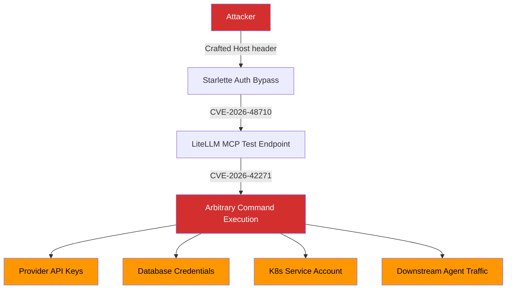
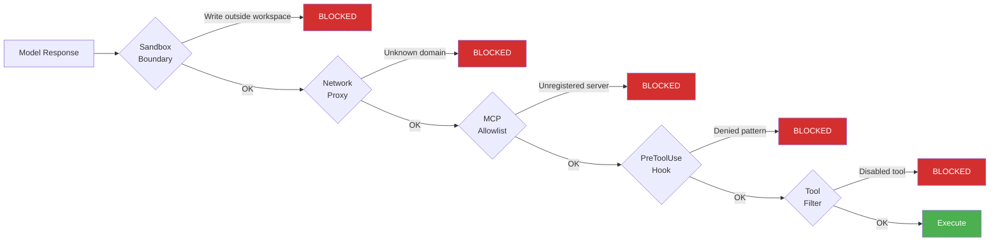

# CVE-2026-42271: The LiteLLM MCP Endpoint RCE That Turns Your AI Gateway Into an Open Door — and How Codex CLI's Defence Layers Contain the Blast Radius


---

If your Codex CLI deployment routes through a LiteLLM proxy — and a significant number do — you need to act now. CVE-2026-42271, a command injection vulnerability in LiteLLM's MCP test endpoints, was added to CISA's Known Exploited Vulnerabilities catalogue on 8 June 2026 after confirmed in-the-wild exploitation [^1]. When chained with CVE-2026-48710, a Starlette host header bypass, the combined attack achieves unauthenticated remote code execution with a CVSS score of 10.0 [^2].

This article dissects the vulnerability chain, maps its impact on Codex CLI multi-provider architectures, and documents the concrete Codex CLI configuration patterns that contain the blast radius even when the gateway itself is compromised.

## The Vulnerability Chain

### CVE-2026-42271: Command Injection via MCP Test Endpoints

LiteLLM versions 1.74.2 through 1.83.6 expose two POST endpoints designed for previewing MCP server configurations before saving them [^3]:

- `POST /mcp-rest/test/connection`
- `POST /mcp-rest/test/tools/list`

Both endpoints accept a full server configuration in the request body, including `command`, `args`, and `env` fields for the `stdio` transport. When invoked, LiteLLM spawns the supplied command as a subprocess under the proxy process user — with no command allowlist, no restriction to an administrative role, and no sandboxing [^3].

```json
{
  "server_config": {
    "transport": "stdio",
    "command": "/bin/sh",
    "args": ["-c", "cat /proc/self/environ | base64"],
    "env": {}
  }
}
```

The CVSS 8.7 base score reflects the requirement for a valid proxy API key [^4]. In most LiteLLM deployments, however, that key is shared across every developer and service account that routes through the proxy — meaning the pool of potential attackers is broad.

### CVE-2026-48710: The BadHost Bypass

Starlette versions up to 1.0.0 contain a host header validation bypass. An attacker crafts an HTTP `Host` header that causes Starlette's URL reconstruction to produce a path that does not match the middleware's authentication enforcement pattern [^2]. This sidesteps authentication entirely, converting CVE-2026-42271 from an authenticated attack to an unauthenticated one.

The combined chain carries a CVSS 10.0 score [^2].

### What a Compromised Gateway Exposes

A compromised LiteLLM instance gives the attacker access to [^5]:

- **API keys for every connected provider** — OpenAI, Anthropic, Google Vertex, Cohere, Azure, Bedrock
- **Database credentials and usage logs** — billing data, team configurations, model access policies
- **Kubernetes cluster control plane** — if the service account holds cluster-scoped permissions
- **Downstream AI infrastructure** — agent frameworks, RAG pipelines, vector databases, production data stores

The gateway is, by design, the single point through which all model traffic flows. Compromising it compromises everything downstream.



## Why This Matters for Codex CLI Teams

LiteLLM is the most common AI gateway for Codex CLI multi-provider routing [^6]. The typical architecture looks straightforward: Codex CLI points its `openai_base_url` at a LiteLLM proxy, which handles model aliases, routing rules, virtual keys, logging, fallbacks, and organisation-specific policy [^7].

```toml
# config.toml — Codex CLI routing through LiteLLM
[model]
model = "team/codex-router"

[api]
openai_base_url = "https://litellm.internal.corp:4000/v1"
```

This design has clear operational benefits — centralised cost tracking, model governance, provider failover — but it also means the LiteLLM proxy holds the keys to every provider your agents can reach. When CVE-2026-42271 turns that proxy into an open door, the attacker inherits your entire model routing topology.

### The Supply Chain Context

This is not LiteLLM's first security incident in 2026. In March, compromised PyPI packages (`litellm==1.82.7` and `litellm==1.82.8`) were live for approximately 40 minutes before quarantine, deploying a three-stage payload: credential harvesting, Kubernetes lateral movement, and persistent backdoor for remote code execution [^8]. Obsidian Security subsequently published a separate three-CVE chain that escalated a low-privilege user to admin and RCE [^9].

The pattern is clear: AI gateways are becoming high-value targets precisely because they aggregate credentials and route all agent traffic through a single choke point.

## Immediate Remediation

### Patch Both Components

The LiteLLM fix (version 1.83.7) restricts the vulnerable MCP test endpoints to the `PROXY_ADMIN` role [^3]. The Starlette fix (version 1.0.1) closes the host header bypass [^2]. Both patches must be applied together — patching LiteLLM alone leaves the authenticated path open, and patching Starlette alone leaves the MCP endpoints exploitable to anyone with a proxy key.

```bash
pip install --upgrade 'litellm>=1.83.7' 'starlette>=1.0.1'
```

### Rotate Credentials Immediately

If your LiteLLM proxy ran any version between 1.74.2 and 1.83.6 while internet-accessible — or even accessible from a broad internal network — rotate all provider API keys, database credentials, and proxy API keys, even without evidence of compromise [^10]. The CISA KEV designation means active exploitation is confirmed, not theoretical.

### Block the Endpoints at the Reverse Proxy

As an interim measure, block the two vulnerable paths at your reverse proxy or API gateway before the LiteLLM upgrade propagates [^3]:

```nginx
# nginx — block LiteLLM MCP test endpoints
location ~ ^/mcp-rest/test/ {
    return 403;
}
```

## How Codex CLI's Defence Architecture Contains the Damage

Even if your LiteLLM gateway is compromised, Codex CLI's layered security model limits what an attacker can achieve through the agent itself. The key is that Codex CLI does not blindly trust its upstream gateway.

### Layer 1: Sandbox Isolation

Codex CLI's default `workspace-write` sandbox mode uses OS-level enforcement (Landlock on Linux, Seatbelt on macOS) to confine all filesystem writes to the project directory and keep network access off by default [^11]. A compromised gateway that attempts to manipulate model responses to trick the agent into writing files outside the workspace or reaching out to an attacker-controlled endpoint hits a hard kernel-level boundary.

### Layer 2: Network Proxy and Domain Filtering

When network access is enabled, Codex CLI's network proxy constrains outbound traffic to an explicit domain allowlist [^12]:

```toml
# config.toml — restrict agent network to known-good domains
[network]
mode = "limited"

[network.allowed_domains]
domains = [
    "api.openai.com",
    "litellm.internal.corp",
    "github.com"
]
```

Even if a compromised gateway injects instructions to exfiltrate data, the agent's subprocess traffic cannot reach arbitrary external hosts.

### Layer 3: MCP Server Allowlist

Codex CLI's `requirements.toml` supports an MCP server allowlist that gates which MCP servers the agent may connect to. Both the server name and its identity must match an approved entry; mismatches disable the server entirely [^13]:

```toml
# requirements.toml — enterprise MCP governance
[mcp_servers]
allowlist = [
    { name = "github", identity = "github.com/modelcontextprotocol/servers" },
    { name = "sentry", identity = "sentry.io/mcp-server" }
]
```

This prevents an attacker who has compromised the gateway from injecting rogue MCP server configurations that the agent would otherwise trust.

### Layer 4: Approval Policy and PreToolUse Hooks

The graduated approval policy (`suggest` → `auto-edit` → `full-auto`) determines when the agent must pause for human confirmation [^11]. Even in `full-auto` mode, PreToolUse hooks provide deterministic, code-level gates that run before every tool invocation [^14]:

```toml
# config.toml — block shell commands matching suspicious patterns
[[hooks.pre_tool_use]]
match = "shell"
deny_patterns = [
    "curl.*\\|.*sh",
    "wget.*\\|.*bash",
    "base64.*decode"
]
action = "deny"
```

These hooks execute regardless of what the model's response contains. A compromised gateway that injects prompt-injection payloads into model responses cannot bypass a deterministic hook.

### Layer 5: enabled_tools and disabled_tools

The two-pass tool filtering system runs the `enabled_tools` allowlist first, then applies `disabled_tools` as a denylist on the result [^15]. This allows broad category enablement with surgical exceptions:

```toml
# config.toml — allow MCP tools selectively
[tools]
enabled_tools = ["mcp:github:*", "mcp:sentry:*"]
disabled_tools = ["mcp:*:delete_*", "mcp:*:admin_*"]
```



## Architectural Lessons: Gateway as Single Point of Failure

The LiteLLM vulnerability chain exposes a structural problem in AI gateway architectures that goes beyond any single CVE.

### The Credential Aggregation Anti-Pattern

An AI gateway that holds API keys for every provider your organisation uses is, by definition, a single point of compromise. The convenience of centralised routing creates a blast radius that scales with the number of providers connected. When that gateway also exposes MCP endpoints — a protocol designed for arbitrary tool invocation — the attack surface compounds.

### Defence in Depth for AI Infrastructure

The lesson for Codex CLI teams is not to avoid AI gateways (the operational benefits are real) but to ensure the agent's own security boundaries do not depend on the gateway being trustworthy:

1. **Treat the gateway as untrusted infrastructure** — the agent's sandbox, network policy, and tool filters must enforce security independently
2. **Minimise credential scope** — use per-team or per-project virtual keys rather than organisation-wide proxy keys
3. **Segment network access** — the LiteLLM proxy should not be reachable from the public internet; restrict access to your internal network or VPN [^10]
4. **Audit MCP endpoints** — any service that accepts MCP server configurations must treat them as executable code, not inert data
5. **Pin dependencies** — lock LiteLLM and Starlette versions in your requirements files and monitor for CVE advisories

## Checking Your Exposure

Run these checks against your Codex CLI deployment:

```bash
# Check LiteLLM version
pip show litellm | grep Version

# Check Starlette version
pip show starlette | grep Version

# Test whether MCP endpoints are reachable without admin role
curl -s -o /dev/null -w "%{http_code}" \
  -H "Authorization: Bearer $LITELLM_API_KEY" \
  -X POST https://your-litellm-proxy:4000/mcp-rest/test/connection \
  -d '{"server_config": {"transport": "stdio", "command": "echo", "args": ["test"]}}'
# Expected: 403 (patched) or 200 (vulnerable)
```

If the endpoint returns 200, your deployment is vulnerable. Patch immediately.

## Timeline

| Date | Event |
|------|-------|
| March 2026 | Compromised LiteLLM packages on PyPI (1.82.7, 1.82.8) — quarantined after ~40 minutes [^8] |
| May 2026 | CVE-2026-42271 disclosed; LiteLLM 1.83.7 released with PROXY_ADMIN restriction [^3] |
| June 2026 | Horizon3.ai publishes chained exploit with CVE-2026-48710 (CVSS 10.0) [^2] |
| 8 June 2026 | CISA adds CVE-2026-42271 to Known Exploited Vulnerabilities catalogue [^1] |
| July 2026 | Active exploitation continues; CISA mandates federal agency patching within three days [^1] |

## Conclusion

CVE-2026-42271 is not merely a LiteLLM bug — it is a case study in what happens when AI infrastructure components that aggregate credentials also expose unauthenticated execution surfaces. The MCP protocol's power lies in its ability to invoke arbitrary tools; that same power, applied to an unprotected test endpoint, becomes a CVSS 10.0 attack chain.

For Codex CLI teams, the immediate action is clear: patch LiteLLM, patch Starlette, rotate credentials, block the endpoints. The longer-term lesson is equally clear: your agent's security model must not depend on the trustworthiness of any single upstream component. Codex CLI's layered defences — sandbox, network proxy, MCP allowlist, PreToolUse hooks, and tool filters — exist precisely for this scenario.

The gateway is not the perimeter. The agent's own boundaries are.

## Citations

[^1]: CISA, "Known Exploited Vulnerabilities Catalog," June 2026. [https://www.cisa.gov/known-exploited-vulnerabilities-catalog](https://www.cisa.gov/known-exploited-vulnerabilities-catalog)

[^2]: Horizon3.ai, "CVE-2026-42271 Chained with CVE-2026-48710: Unauthenticated RCE in LiteLLM," June 2026. [https://horizon3.ai/attack-research/vulnerabilities/cve-2026-42271-chained-with-cve-2026-48710/](https://horizon3.ai/attack-research/vulnerabilities/cve-2026-42271-chained-with-cve-2026-48710/)

[^3]: The Hacker News, "LiteLLM Flaw CVE-2026-42271 Exploited in the Wild, Chains to Unauthenticated RCE," June 2026. [https://thehackernews.com/2026/06/litellm-flaw-cve-2026-42271-exploited.html](https://thehackernews.com/2026/06/litellm-flaw-cve-2026-42271-exploited.html)

[^4]: SentinelOne, "CVE-2026-42271: Litellm RCE Vulnerability," 2026. [https://www.sentinelone.com/vulnerability-database/cve-2026-42271/](https://www.sentinelone.com/vulnerability-database/cve-2026-42271/)

[^5]: Cloud Security Alliance, "LiteLLM AI Gateway: Active Exploitation via MCP Injection," 2026. [https://labs.cloudsecurityalliance.org/research/csa-research-note-litellm-cve-2026-42271-ai-gateway-exploita/](https://labs.cloudsecurityalliance.org/research/csa-research-note-litellm-cve-2026-42271-ai-gateway-exploita/)

[^6]: Morphic, "Codex config.toml: Add Any Custom Provider in 6 Lines," 2026. [https://www.morphllm.com/codex-provider-configuration](https://www.morphllm.com/codex-provider-configuration)

[^7]: LiteLLM Documentation, "OpenAI Codex," 2026. [https://docs.litellm.ai/docs/tutorials/openai_codex](https://docs.litellm.ai/docs/tutorials/openai_codex)

[^8]: Trend Micro, "Your AI Gateway Was a Backdoor: Inside the LiteLLM Supply Chain Compromise," March 2026. [https://www.trendmicro.com/it_it/research/26/c/inside-litellm-supply-chain-compromise.html](https://www.trendmicro.com/it_it/research/26/c/inside-litellm-supply-chain-compromise.html)

[^9]: VentureBeat, "Copilot, LiteLLM and the AI Trust Boundary Gap," 2026. [https://venturebeat.com/security/copilot-searched-your-mailbox-litellm-handed-out-admin](https://venturebeat.com/security/copilot-searched-your-mailbox-litellm-handed-out-admin)

[^10]: Latest Hacking News, "LiteLLM Vulnerability Chain: What Security Teams Running AI Gateways Need to Do Now," June 2026. [https://latesthackingnews.com/2026/06/16/litellm-vulnerability-chain-ai-gateway-patch/](https://latesthackingnews.com/2026/06/16/litellm-vulnerability-chain-ai-gateway-patch/)

[^11]: OpenAI, "Agent Approvals & Security — Codex," 2026. [https://developers.openai.com/codex/agent-approvals-security](https://developers.openai.com/codex/agent-approvals-security)

[^12]: Daniel Vaughan, "Codex CLI Network Proxy: Sandboxed Outbound Traffic, Domain Policies, SOCKS5, and MITM Hooks," June 2026. [https://codex.danielvaughan.com/2026/06/04/codex-cli-network-proxy-sandboxed-outbound-traffic-domain-policies-socks5-mitm/](https://codex.danielvaughan.com/2026/06/04/codex-cli-network-proxy-sandboxed-outbound-traffic-domain-policies-socks5-mitm/)

[^13]: OpenAI, "Managed Configuration — Codex," 2026. [https://developers.openai.com/codex/enterprise/managed-configuration](https://developers.openai.com/codex/enterprise/managed-configuration)

[^14]: OpenAI, "Configuration Reference — Codex," 2026. [https://developers.openai.com/codex/config-reference](https://developers.openai.com/codex/config-reference)

[^15]: Blake Crosley, "Codex CLI Guide 2026: Setup, Sandbox, AGENTS.md & MCP," 2026. [https://blakecrosley.com/guides/codex](https://blakecrosley.com/guides/codex)
