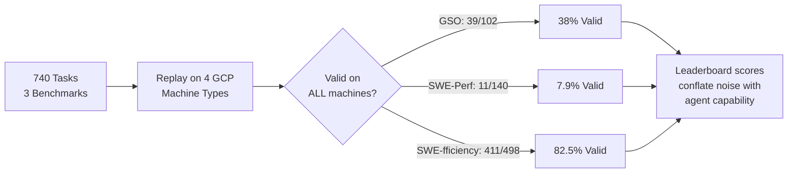
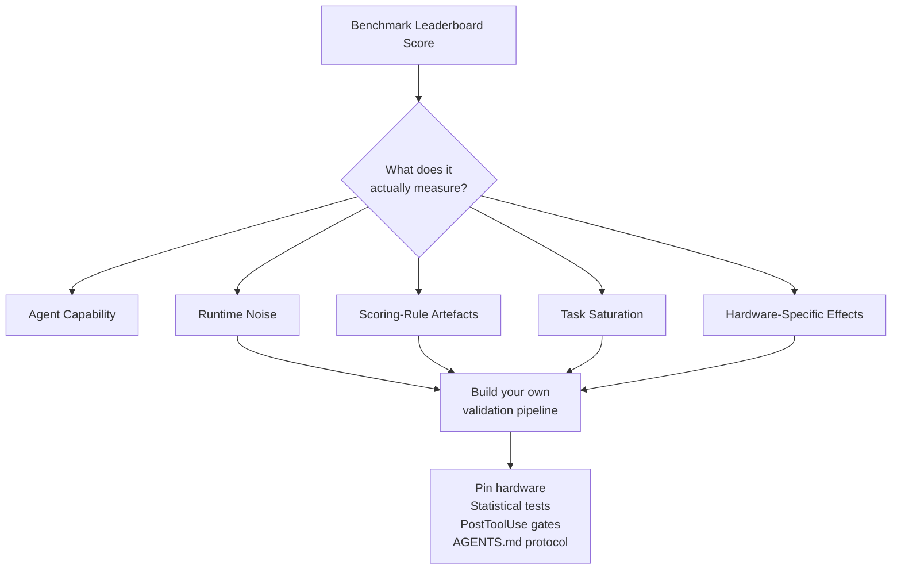

# Performance-Optimisation Benchmarks Are Unreliable: What a 740-Task Audit Reveals About Measurement Noise — and How to Build Trustworthy Profiling Workflows in Codex CLI


---

Leaderboard scores on performance-optimisation benchmarks are increasingly cited as evidence that coding agents can do serious performance engineering. A new audit says: slow down.

Chen et al. replayed the official reference patches for 740 code-optimisation tasks across four Google Cloud machine types and found that measurement noise, scoring-rule artefacts, and task-coverage saturation make headline rankings unreliable [^1]. Only 39 of 102 GSO tasks, 11 of 140 SWE-Perf tasks, and 411 of 498 SWE-fficiency tasks maintained validity across every cross-machine replay [^1]. If the reference patch cannot reliably beat the baseline on different hardware, the benchmark cannot reliably score the agent.

This article unpacks what went wrong, why it matters for anyone using coding agents for real performance work, and how to configure Codex CLI for profiling workflows that produce trustworthy results.

## The Three Benchmarks Under Audit

All three benchmarks follow the same pattern: give the agent a repository, a workload, and an unoptimised baseline; measure runtime after the agent's patch; compare against a human-authored reference patch.

| Benchmark | Tasks | Focus | Reference |
|-----------|-------|-------|-----------|
| GSO | 102 | Multi-language optimisation across 10 codebases | [^2] |
| SWE-Perf | 140 | Python performance patches across 9 major projects | [^3] |
| SWE-fficiency | 498 | Pass-to-pass runtime optimisation across 9 repositories | [^4] |

GSO includes a hack detector (upgraded to GPT-5.4 in April 2026) that penalises deceptive optimisations such as memoisation and harness hijacking [^2]. SWE-Perf focuses on algorithmic and data-structure improvements in widely used Python libraries like scikit-learn [^3]. SWE-fficiency uses harmonic-mean aggregation across tasks, which — as the audit reveals — creates severe score-weight concentration [^1].

## Finding 1: Cross-Machine Validity Collapse

The researchers replayed reference patches across four machine architectures [^1]:

- **Intel Cascade Lake** (n2-standard-64, 2019)
- **AMD Milan** (n2d-standard-64, 2021)
- **Intel Emerald Rapids** (n4-standard-64, 2024)
- **AMD Turin** (n4d-standard-64, 2025)

SWE-Perf's collapse is the most severe. The median runtime change for its reference patches was just −0.03%, with a standard-deviation-to-signal ratio of 43.23× [^1]. In plain terms: the noise is forty-three times larger than the signal. CPU scheduling, cache-line contention, memory bandwidth jitter, and microarchitectural differences between generations are enough to erase the entire measured improvement.



The practical implication: if you run a benchmark on one machine type and claim your agent "achieves 2× speedup," that claim may not reproduce on the hardware your production code actually runs on.

## Finding 2: Scoring Rules Distort Rankings

Among eight submissions shared between GSO and SWE-fficiency, the official rankings disagreed on 9 of 28 pairwise comparisons, yielding a Spearman correlation of just 0.452 [^1]. Two benchmarks, same tasks, different winners.

SWE-fficiency's harmonic-mean aggregation with a floor of 0.001 means the worst ten tasks carry between 58.5% and 82.8% of the total score weight [^1]. A single near-zero task can dominate the entire leaderboard position. When the researchers raised the penalty floor to 0.5 (a bounded-penalty diagnostic), six of eight ranks moved and eight of twenty-eight pairwise orders flipped [^1].

This is not a minor statistical footnote. It means the difference between "first place" and "fourth place" on a leaderboard can be entirely an artefact of how the scoring function handles outlier tasks.

## Finding 3: The Saturation Problem

Looking across ten public submissions per task, 384 of 450 replay-valid tasks were matched or exceeded by at least one public submission, and 449 of 450 beat the unoptimised baseline [^1]. Only 66 tasks remained below reference speed, with the median best-public speedup at 85.3% (GSO) and 87.9% (SWE-fficiency) of the reference [^1].

This means aggregate leaderboard scores increasingly reflect *which remaining hard tasks an agent happens to solve* rather than general optimisation capability. The benchmarks are measuring a shrinking frontier, not broad competence.

## Why This Matters for Real Performance Work

FormulaCode (Chen et al., March 2026) independently highlighted similar issues, proposing fine-grained multi-objective metrics across 957 performance bottlenecks mined from 70 scientific Python repositories, with an average of 264.6 community-maintained workloads per task [^5]. The common thread: binary pass/fail and aggregate scores are inadequate for performance engineering, where the margin between "faster" and "measurement noise" is often razor-thin.

For teams using Codex CLI to tackle real optimisation work — profiling hotspots, reducing latency, improving throughput — these findings translate directly into workflow requirements:

1. **Pin your measurement environment.** Runtime comparisons must use identical hardware, identical OS configuration, and identical load conditions.
2. **Require statistical significance.** A single timing run proves nothing. Repeated measurements with confidence intervals are the minimum.
3. **Validate on target hardware.** Optimisations validated on GCP n2-standard may not hold on your production AMD EPYC fleet.
4. **Separate functional correctness from performance improvement.** An agent patch that passes all tests but shows no statistically significant speedup is not an optimisation.

## Configuring Codex CLI for Trustworthy Profiling Workflows

### PostToolUse Hooks for Benchmark Gating

Codex CLI's `PostToolUse` hooks fire after every tool call [^6]. For performance work, wire them to reject patches that lack statistical evidence:

```toml
# config.toml — performance validation hook
[[hooks.post_tool_use]]
command = "bash scripts/perf-gate.sh"
description = "Reject patches without statistically significant speedup"
```

The gate script should:
- Run the benchmark workload N times (minimum 30 for parametric tests)
- Compute a confidence interval for the speedup
- Reject if the lower bound of the 95% CI crosses 1.0 (no improvement)

```bash
#!/usr/bin/env bash
# scripts/perf-gate.sh — simplified performance gate
set -euo pipefail

RUNS=30
BASELINE_TIMES=$(hyperfine --runs "$RUNS" --export-json /tmp/base.json "python bench.py --baseline" 2>/dev/null)
PATCH_TIMES=$(hyperfine --runs "$RUNS" --export-json /tmp/patch.json "python bench.py --patched" 2>/dev/null)

# Extract means and check statistical significance
python3 -c "
import json, sys
base = json.load(open('/tmp/base.json'))['results'][0]
patch = json.load(open('/tmp/patch.json'))['results'][0]
speedup = base['mean'] / patch['mean']
ci_lower = (base['mean'] - base['stddev']) / (patch['mean'] + patch['stddev'])
print(f'Speedup: {speedup:.2f}x (CI lower: {ci_lower:.2f}x)')
if ci_lower < 1.05:
    print('FAIL: No statistically significant speedup (>5% with CI)')
    sys.exit(1)
print('PASS: Speedup is statistically significant')
"
```

### AGENTS.md Performance Constraints

Encode your measurement protocol directly in `AGENTS.md` so the agent follows it without prompting:

```markdown
## Performance Optimisation Rules

1. Before claiming any speedup, run the benchmark workload at least 30 times
2. Report mean, median, std dev, and 95% confidence interval
3. Compare against the SAME hardware and OS configuration
4. Never use wall-clock time from a single run as evidence
5. If the confidence interval overlaps with baseline, the patch is not an optimisation
6. Profile before optimising — identify the hotspot with py-spy or perf before writing code
```

### codex exec for Batch Validation

Use `codex exec` with `--json` output to build reproducible profiling pipelines [^6]:

```bash
# Run optimisation task with structured output
codex exec \
  --model gpt-5.3-codex \
  --json \
  "Profile the sort function in lib/core.py using py-spy, \
   identify the top hotspot, propose an optimisation, \
   and validate with 30 hyperfine runs" \
  2>&1 | tee /tmp/optimisation-run.jsonl
```

### Named Profiles for Performance Engineering

```toml
# config.toml — performance engineering profile
[profiles.perf-eng]
model = "gpt-5.3-codex"
model_reasoning_effort = "high"
approval_policy = "unless-allow-listed"

[profiles.perf-eng.hooks]
[[profiles.perf-eng.hooks.post_tool_use]]
command = "bash scripts/perf-gate.sh"
```

The `high` reasoning effort is deliberate here. Mehta's study of 90 agent runs found that reasoning investment is the dominant factor in first-try reliability — moving from `high` to `xhigh` improved perfect outcomes from 28% to 89% — whilst testing tools added 42–68% cost with no functional score improvement [^7]. For performance work, invest reasoning tokens in understanding the algorithm rather than in running more test iterations within the agent loop.

## The Broader Lesson: Benchmarks Measure Benchmarks



The audit's recommendations for benchmark designers — validate that workloads stress the optimised path, ensure reference patches have clear margins over runtime noise, include hotspot localisation rather than pre-specified stress tests [^1] — are equally good advice for anyone commissioning performance work from a coding agent.

The leaderboard tells you an agent can produce patches. It does not tell you those patches will make your code faster on your hardware under your workloads. That validation is your job, and Codex CLI's hook architecture, structured output, and AGENTS.md constraint system give you the tools to make it rigorous.

## Citations

[^1]: Chen, Z., Sun, Z., Shi, Y., Lo, D. & Jiang, L. (2026). "Are Performance-Optimization Benchmarks Reliably Measuring Coding Agents?" arXiv:2607.01211. [https://arxiv.org/abs/2607.01211](https://arxiv.org/abs/2607.01211)

[^2]: GSO Benchmark — Challenging Software Optimization Tasks for Evaluating SWE-Agents. [https://gso-bench.github.io/](https://gso-bench.github.io/)

[^3]: SWE-Perf — "Can Language Models Optimize Code Performance on Real-World Repositories?" arXiv:2507.12415. [https://arxiv.org/abs/2507.12415](https://arxiv.org/abs/2507.12415)

[^4]: SWE-fficiency — "Can Language Models Optimize Real-World Repositories on Real Workloads?" arXiv:2511.06090. [https://arxiv.org/abs/2511.06090](https://arxiv.org/abs/2511.06090)

[^5]: Sehgal, A. et al. (2026). "FormulaCode: Evaluating Agentic Optimization on Large Codebases." arXiv:2603.16011. [https://arxiv.org/abs/2603.16011](https://arxiv.org/abs/2603.16011)

[^6]: OpenAI. (2026). "CLI — Codex." OpenAI Developers. [https://developers.openai.com/codex/cli](https://developers.openai.com/codex/cli)

[^7]: Mehta, R. (2026). "Reasoning Effort, Not Tool Access, Buys First-Try Reliability." arXiv:2607.02436. [https://arxiv.org/abs/2607.02436](https://arxiv.org/abs/2607.02436)
