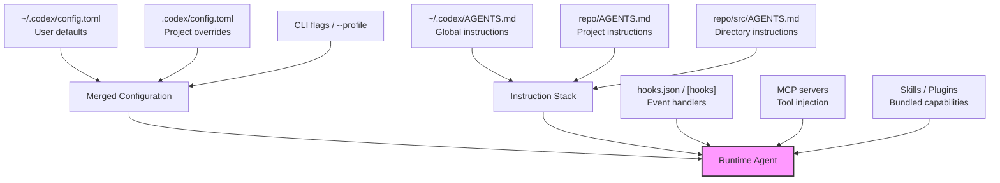
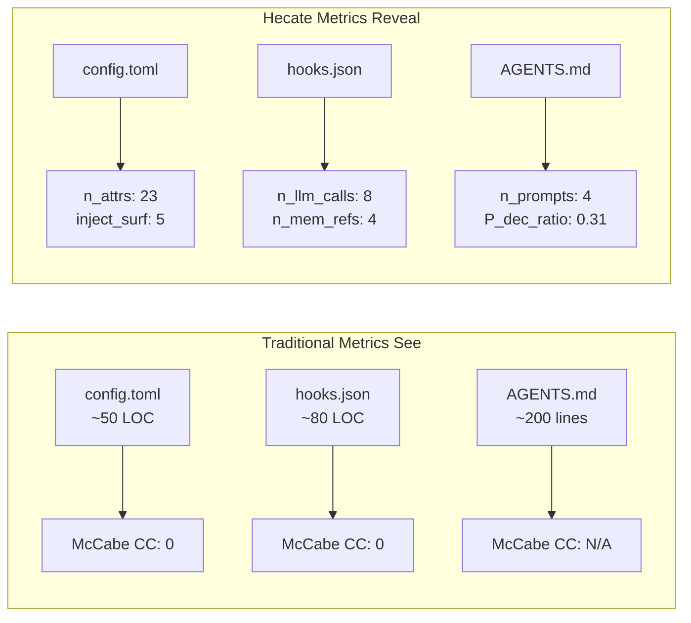

# Prompt-Layer Complexity: What Hecate's 52 Metrics Reveal About the Maintenance Burden Traditional Tools Miss — and How to Measure Your Codex CLI Configuration Stack


---

Your `AGENTS.md` has grown to 400 lines. You have 15 hook definitions across three config files. Five MCP servers inject tools at startup. A rotating cast of skills and plugins shapes every session. Traditional code-quality tooling — McCabe cyclomatic complexity, Halstead volume, the CK suite — sees none of it. A new paper from Xu et al. explains why that blindness matters, and hands you the first empirical toolkit for measuring what it misses.

## The Invisible Layer

On 2 July 2026, Xu, Li, Deng, Liu, and Xing published *Rethinking Complexity Metrics for LLM-Integrated Applications: Beyond Source Code* [^1]. Their central argument is blunt: in LLM-integrated applications, a substantial share of runtime behaviour originates in the prompt layer — conditional instructions, tool-routing rules, output format constraints — yet every established complexity metric targets code exclusively [^1].

They analysed 118 components drawn from 18 open-source repositories (including MetaGPT, autogen, aider, SWE-agent, and adk-python) with a median component size of 200 lines of code [^1]. They generated 52 candidate metrics grounded in 25 complexity dimensions from published taxonomies, then tested each against maintenance activity extracted from version history [^1].

The headline result: **only 10 of 52 metrics survived statistical significance testing after controlling for code size** [^1]. Of those ten, seven were novel metrics measuring structurally distinct elements such as LLM call sites, memory attributes, and prompt templates — things `pylint` and `radon` never touch [^1].

## Prompt-as-Specification: Hoare Logic for Natural Language

The paper's theoretical foundation is *Prompt-as-Specification*, a Hoare-logic-inspired formalism that decomposes every prompt into three components [^1]:

- **Behavioural rules**: individual instructions with conditions, actions, and output constraints
- **Global invariants**: constraints applying across all rules (e.g., "never modify the database without approval")
- **State-predicate vocabulary**: context predicates that the component conditions on

A worked example from gpt-pilot decomposes a single prompt into 3 conditional rules, 2 invariants, and 4 state predicates [^1]. This framing elevates prompt analysis from ad-hoc keyword counting to principled measurement.

For Codex CLI practitioners, this formalism maps directly onto the `AGENTS.md` instruction hierarchy. Consider a typical project-level file:

```markdown
# AGENTS.md

## Constraints
- Never add production dependencies without explicit approval
- Always run `npm test` after modifying any `.ts` file
- Do not read files matching `secrets/**`

## Patterns
- Use the validation helper at `src/utils/validate.ts` for all input checks
- Background jobs must follow the pattern in `src/jobs/base.ts`

## Conditional Rules
- If modifying API routes, regenerate OpenAPI spec with `npm run openapi`
- If adding a database migration, run `npm run migrate:check` before committing
```

Under Prompt-as-Specification, this file contains 2 global invariants (the "never" and "do not" constraints), 4 conditional behavioural rules, and at least 3 state predicates (file type, directory path, modification target) [^1]. That is measurable complexity that McCabe cyclomatic complexity reports as zero.

## The Ten Metrics That Survive

The full list of statistically significant metrics, after partial Spearman correlation controlling for log(LOC) [^1]:

| Metric | Layer | Avg ρ | What It Counts |
|--------|-------|-------|----------------|
| `n_mem_refs` | Code | +0.40 | Distinct memory/state attribute references |
| `n_llm_calls` | Code | +0.38 | Distinct LLM invocation points |
| `n_attrs` | Code | +0.33 | Component attribute count |
| `RFC` | Traditional | +0.30 | Response for a class |
| `inject_surf` | Code–NL Interface | +0.27 | Channels injecting runtime values into prompts |
| `P_dec_ratio` | NL | +0.27 | Proportion of conditional prompt instructions |
| `Halstead N` | Traditional | +0.25 | Program length |
| `Halstead V` | Traditional | +0.24 | Program volume |
| `n_prompts` | NL | +0.23 | Distinct prompt templates |
| `P_ev` | NL | +0.22 | Prompt effort volume |

Eight of the ten survivors count the number of **distinct entities** rather than aggregate size — what the authors call "structural breadth" [^1]. The implication: maintenance burden grows with how many different things a component orchestrates, not with how long it is.

McCabe cyclomatic complexity, the metric most teams reach for first, dropped from ρ = +0.39 (raw) to ρ = +0.06 (size-controlled) [^1]. It is, as prior research suspected and this study confirms, "effectively a proxy for size" [^1].

## The Codex CLI Configuration Stack as a Complexity Surface

Codex CLI's customisation layers compose into what the official documentation calls a unified system: AGENTS.md sets the rules, skills encode workflows, MCP connects external context, subagents provide parallel execution, and plugins bundle everything for distribution [^2]. Each layer adds prompt-layer complexity that traditional tooling ignores.



Mapping Hecate's metrics onto a typical Codex CLI project reveals the measurement gap:

### `n_llm_calls` — LLM Invocation Points

In a Codex CLI context, each subagent spawn, each MCP tool that triggers a model call, and each hook that invokes `codex exec` constitutes a distinct LLM call site. A project with three subagent definitions, two MCP servers, and a `PostToolUse` hook that runs a verification prompt has at least six LLM invocation points — none visible to `pylint`.

### `n_prompts` — Distinct Prompt Templates

The AGENTS.md discovery mechanism loads files from `~/.codex` plus each directory from repository root to the current working directory [^3]. A monorepo with AGENTS.md files at root, `packages/api/`, `packages/web/`, and `packages/shared/` contributes four distinct prompt templates before skills or plugins add more. Each template carries its own conditional rules and invariants.

### `P_dec_ratio` — Conditional Instruction Density

The proportion of prompt instructions that are conditional ("if modifying X, then do Y") directly maps to the conditional rules in AGENTS.md files. As these files grow, `P_dec_ratio` rises, and with it the maintenance burden: every conditional rule is a branch the agent might take, and every branch needs testing [^1].

### `inject_surf` — Runtime Value Injection

Codex CLI's hook system injects runtime values into prompts through multiple channels. The `tool_output_token_limit` gates ingestion volume [^4]. The `compact_prompt` reshapes context during compaction [^4]. Plugin configurations inject tool definitions at startup. Each injection channel is a surface where prompt behaviour can change based on runtime state.

## A Practical Complexity Audit

Hecate is not yet packaged for Codex CLI projects specifically, but its dimensions can be applied manually. Here is a lightweight audit protocol:

```bash
# Count distinct AGENTS.md files (n_prompts proxy)
find . -name "AGENTS.md" -o -name "AGENTS.override.md" | wc -l

# Count hook event handlers (n_llm_calls proxy)
grep -c '"event"' .codex/hooks.json 2>/dev/null || \
  grep -c '\[hooks\.' ~/.codex/config.toml 2>/dev/null

# Count MCP server definitions (tool injection surface)
grep -c '\[mcp_servers\.' .codex/config.toml 2>/dev/null

# Count conditional rules in AGENTS.md files (P_dec_ratio proxy)
grep -rci '\bif\b.*\bthen\b\|\bwhen\b.*\brun\b\|\bonly\b.*\bwhen\b' \
  $(find . -name "AGENTS.md") 2>/dev/null
```

For a more structured approach, count the Hecate dimensions across your configuration stack:

```toml
# Example: complexity-audit.toml
# Track these counts per sprint/release

[audit]
agents_md_files = 4          # n_prompts
conditional_rules = 12       # P_dec_ratio numerator
global_invariants = 6        # constraint count
hook_definitions = 8         # event handler count
mcp_servers = 3              # tool injection surfaces
skills_installed = 5         # bundled prompt templates
subagent_definitions = 2     # delegation points
inject_channels = 7          # inject_surf
```

## Why This Matters: The RoleZero Warning

The paper's most striking example is the `RoleZero` component from MetaGPT: 439 lines of code, 27 re-fix commits [^1]. Traditional metrics see a moderately complex module. Hecate reveals 12 distinct LLM invocation points, 15 prompt templates, a `P_dec_ratio` of 0.27 (27% of instructions conditional), and 12 injection channels [^1].

The parallel to a mature Codex CLI configuration is uncomfortable. A team that has accumulated AGENTS.md files across a monorepo, added hooks for test validation and security scanning, wired up MCP servers for Jira and Slack, installed a handful of plugins, and defined subagent delegation patterns has built exactly the kind of high-structural-breadth system that Hecate predicts will demand disproportionate maintenance [^1].



## Codex CLI Defence: Configuration Governance

Codex CLI already provides mechanisms to manage configuration complexity, even if they were not designed with Hecate's framework in mind:

**Managed requirements.toml** — Enterprise administrators can distribute a `requirements.toml` that locks hooks, sandbox settings, and approval policies [^5]. The `allow_managed_hooks_only = true` flag makes user and project hooks no-ops, reducing `n_llm_calls` to a governed set [^5].

**Profile-based configuration** — The `--profile` flag loads `~/.codex/<name>.config.toml` as an overlay [^4]. Teams can maintain complexity budgets per profile: a `ci` profile with minimal hooks, a `review` profile with security scanning, a `dev` profile with full tooling.

**In-TUI hook browser** — Since v0.129.0, `/hooks` in the TUI shows active hooks and lets you toggle them without editing config files [^6]. This is a runtime complexity dial.

**AGENTS.md hierarchy pruning** — The discovery mechanism walks from root to CWD, including at most one file per directory [^3]. Consolidating per-directory files into a single project-level AGENTS.md reduces `n_prompts` at the cost of a longer single template.

## Implications for the Broader Ecosystem

The Hecate findings extend beyond Codex CLI. Claude Code's `CLAUDE.md`, Cursor's `.cursor/rules/*.mdc`, and Kiro's `.kiro/steering/` all constitute prompt-layer complexity surfaces [^7]. ⚠️ Whether the specific correlation coefficients transfer across tools is untested — the study's 18 repositories were general LLM-integrated applications, not exclusively coding-agent configurations.

The practical takeaway is clear: **if you maintain a Codex CLI configuration stack, you are maintaining a system whose complexity your existing tooling cannot measure**. Hecate provides the first empirical evidence that this unmeasured complexity predicts maintenance burden. Traditional metrics retained only 43% of their raw signal after size control, versus 71% for Hecate's proposed metrics [^1].

Until Hecate or a successor ships as a `codex exec` one-liner, the manual audit protocol above gives you a directional read. Track the counts over time. When `n_prompts` and `inject_surf` start climbing, you are accumulating exactly the structural breadth that correlates with re-fix recurrence.

## Citations

[^1]: Xu, Z., Li, Y., Deng, G., Liu, Y., & Xing, Z. (2026). *Rethinking Complexity Metrics for LLM-Integrated Applications: Beyond Source Code*. arXiv:2607.01903v1. [https://arxiv.org/abs/2607.01903](https://arxiv.org/abs/2607.01903)

[^2]: OpenAI. (2026). *The Codex CLI Customisation Stack*. Codex Knowledge Base. [https://codex.danielvaughan.com/2026/04/12/codex-cli-customisation-stack-unified-system/](https://codex.danielvaughan.com/2026/04/12/codex-cli-customisation-stack-unified-system/)

[^3]: OpenAI. (2026). *Custom instructions with AGENTS.md*. OpenAI Developers. [https://developers.openai.com/codex/guides/agents-md](https://developers.openai.com/codex/guides/agents-md)

[^4]: OpenAI. (2026). *Configuration Reference*. OpenAI Developers. [https://developers.openai.com/codex/config-reference](https://developers.openai.com/codex/config-reference)

[^5]: OpenAI. (2026). *Advanced Configuration*. OpenAI Developers. [https://developers.openai.com/codex/config-advanced](https://developers.openai.com/codex/config-advanced)

[^6]: OpenAI. (2026). *Hooks*. OpenAI Developers. [https://developers.openai.com/codex/hooks](https://developers.openai.com/codex/hooks)

[^7]: Xu, Z. et al. (2026). *A Dataset of Agentic AI Coding Tool Configurations*. arXiv:2605.08435. [https://arxiv.org/abs/2605.08435](https://arxiv.org/abs/2605.08435)
