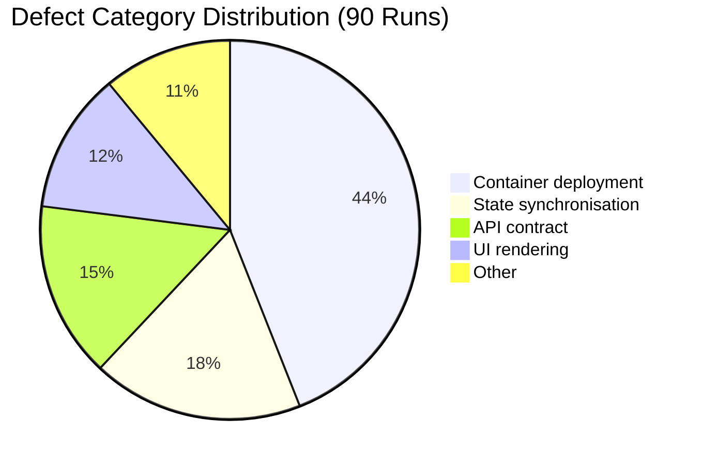
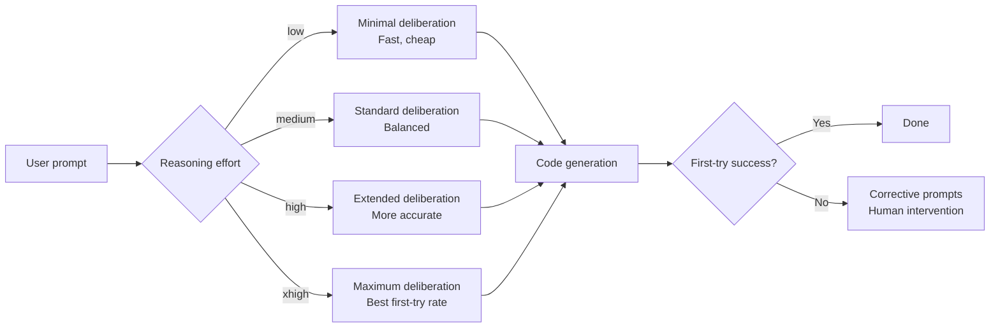

# Reasoning Effort, Not Tool Access, Buys First-Try Reliability: What 90 Agent Runs Reveal — and How to Configure Codex CLI's Reasoning Levels


---

The instinct when a coding agent fails is to give it more tools — a test runner, a linter, a type checker. Mehta's observational study of 90 independent agent runs building a real-time retrospective board application demonstrates that this instinct is expensive and wrong [^1]. The dominant lever for first-attempt reliability is not tool access but reasoning effort: the cognitive budget allocated to the model before it emits its first token of code. This finding maps directly to Codex CLI's `model_reasoning_effort` configuration, offering practitioners a concrete, measurable dial they can turn today.

## The Study: 90 Runs, One Application, 14 Criteria

Mehta constructed a controlled experiment around a single non-trivial task — a real-time retrospective board — and evaluated 90 independent agent runs across multiple model generations, two agent frameworks, varying reasoning levels, and optional testing tools [^1]. Each run was scored against a 14-criterion functional rubric with a maximum score of 42 points [^1].

The design isolates variables that practitioners typically conflate: model capability, reasoning depth, tool availability, and prompt strategy.

### Key Findings

| Factor | Effect | Cost Impact |
|--------|--------|-------------|
| **Frontier model vs local model** | Near-maximum (≈42) vs 24–37 points | Varies by provider |
| **Reasoning: High → xHigh** | Perfect first-run outcomes: 28% → 89% | +9–29% cost |
| **Testing tool added** | No functional score improvement | +42–68% cost |
| **Design-focused prompts** | Visual quality: 3.0 → 4.5 (of 5) | No functional change |

The most striking result: raising reasoning effort from "High" to "xHigh" improved perfect first-run outcomes from 28% to 89% and reduced corrective prompts by approximately five-fold, at a cost increase of just 9–29% [^1]. By contrast, adding a testing tool increased operational costs by 42–68% without improving functional scores or first-attempt reliability [^1].

## Why Tools Fail to Move the Needle

The testing tool's failure to improve outcomes is counterintuitive until you examine the failure mode distribution. Container deployment emerged as the dominant defect category, failing on first attempt in 44% of runs [^1]. These are configuration and orchestration errors — Docker Compose service ordering, port binding, environment variable threading — that a unit test runner cannot catch because they manifest only at integration time.



The pattern is clear: the bottleneck is not whether the agent can verify its work, but whether it reasons correctly about the deployment topology before generating code. More thinking tokens spent up front prevent the category of errors that tools were supposed to catch downstream.

## The Reasoning Effort Mechanism

When a model receives a higher reasoning effort setting, it allocates more internal "thinking tokens" before producing visible output [^2]. This is not chain-of-thought prompting — it is a parameter that controls the model's internal deliberation budget, distinct from the user-visible response.

OpenAI's Responses API exposes this through the `reasoning` parameter, which accepts values from `low` through `high` and, for supported models, `xhigh` [^2]. The `xhigh` setting is model-dependent: GPT-5.4 and GPT-5.5 support it; earlier models may not [^3].



## Configuring Reasoning in Codex CLI

Codex CLI exposes three reasoning-related configuration keys [^4]:

### `model_reasoning_effort`

Controls reasoning depth for the primary model during normal operation.

```toml
# ~/.codex/config.toml
model_reasoning_effort = "high"
```

Valid values: `minimal`, `low`, `medium`, `high`, `xhigh` [^4]. The `xhigh` value is model-dependent — it works with GPT-5.4 and GPT-5.5 but may not be available on all providers [^3].

### `plan_mode_reasoning_effort`

Overrides reasoning effort specifically for Plan mode, where the agent analyses a task before executing.

```toml
plan_mode_reasoning_effort = "xhigh"
```

Valid values: `none`, `minimal`, `low`, `medium`, `high`, `xhigh` [^4]. When unset, Plan mode uses its built-in preset default. This is the most cost-effective place to apply `xhigh` reasoning: the planning phase is where architectural and deployment decisions are made, and Mehta's data shows these are precisely the decisions that determine first-try success [^1].

### `model_reasoning_summary`

Controls the verbosity of reasoning summaries exposed to the user.

```toml
model_reasoning_summary = "detailed"
```

Valid values: `auto`, `concise`, `detailed`, `none` [^4]. Setting this to `detailed` when debugging reasoning failures gives visibility into the model's deliberation process — useful for understanding why a particular deployment topology was chosen.

## A Practical Reasoning Strategy

Mehta's data, combined with Codex CLI's per-mode configuration, suggests a graduated approach:

### Profile: Cost-Conscious Daily Work

```toml
# ~/.codex/config.toml
model = "gpt-5.4-mini"
model_reasoning_effort = "medium"
plan_mode_reasoning_effort = "high"
```

Use `gpt-5.4-mini` for responsive iteration [^3]. Elevate reasoning in Plan mode where architectural decisions matter most. This balances cost against the finding that reasoning effort — not model size alone — drives first-try success [^1].

### Profile: High-Stakes First-Try

```toml
# ~/.codex/config.toml
model = "gpt-5.5"
model_reasoning_effort = "high"
plan_mode_reasoning_effort = "xhigh"
model_reasoning_summary = "detailed"
```

For tasks where corrective prompts are expensive — CI/CD pipeline generation, infrastructure-as-code, Docker Compose orchestration — invest in maximum reasoning up front [^1]. The 9–29% cost increase is trivially offset by avoiding the five-fold increase in corrective prompts that Mehta observed at lower reasoning levels [^1].

### Profile: Subagent Delegation

```toml
# .codex/agents/reviewer.toml
model = "gpt-5.4"
model_reasoning_effort = "xhigh"
```

When using Codex CLI's custom agent definitions for specialised roles, the reviewer agent benefits disproportionately from high reasoning effort [^5]. Review is inherently a reasoning task — the agent must model the consequences of code changes across files, exactly the kind of deployment-topology reasoning that Mehta's study identifies as the bottleneck [^1].

## The Container Deployment Problem

The 44% first-attempt failure rate on container deployment deserves special attention because it maps directly to a common Codex CLI use case: generating Docker Compose configurations, Kubernetes manifests, and multi-service orchestrations [^1].

These failures are not syntax errors. They are reasoning failures about:

- **Service dependency ordering** — a web server starting before its database is ready
- **Port binding conflicts** — two services claiming the same host port
- **Environment variable threading** — a secret defined in one service but not propagated to its consumer
- **Volume mount semantics** — confusing bind mounts with named volumes in production configurations

Higher reasoning effort addresses these because the model spends more internal tokens modelling the interaction between services before generating any configuration. This is precisely the class of error that downstream testing tools cannot economically catch — you would need a full integration test environment, not a unit test runner [^1].

## Reasoning Effort vs Token Budget

Reasoning effort is distinct from Codex CLI's `rollout_token_budget` feature, though practitioners sometimes conflate them [^6]. The token budget limits total output across an agent session — it is a cost ceiling. Reasoning effort controls how much the model thinks before each response — it is a quality floor.

The two interact: higher reasoning effort consumes more tokens per turn, so a tight rollout budget may force the agent to stop before completing a task when reasoning is set to `xhigh`. The practical recommendation is to increase the rollout budget proportionally when raising reasoning effort:

```toml
model_reasoning_effort = "xhigh"

[features.rollout_budget]
enabled = true
limit_tokens = 500000  # Increased from default to accommodate xhigh reasoning
```

## Design Prompts: Orthogonal but Valuable

Mehta's finding that design-focused prompts improved visual quality (4.5 vs 3.0 on a 5-point scale) without affecting functional outcomes [^1] has a practical implication for `AGENTS.md` configuration. Design instructions belong in the agent's system prompt, not as a substitute for reasoning effort:

```markdown
<!-- AGENTS.md -->
## Visual Standards
- Use a consistent design system with 4px border radius
- Apply the project's colour palette from tailwind.config.ts
- Ensure WCAG 2.1 AA contrast ratios on all text
```

These instructions improve aesthetic output without replacing the reasoning investment needed for functional correctness. They are additive, not substitutive.

## What This Means for Model Selection

The study's finding that frontier models scored near-maximum while a low-cost local model achieved only 24–37 points confirms what Codex CLI's model tiering already implies [^1] [^3]: model capability sets the ceiling, reasoning effort determines how often you reach it.

With Codex CLI's current model lineup — GPT-5.5 as the flagship, GPT-5.4-mini for fast iteration, and GPT-5.3-codex-spark for real-time pairing[^3] — the optimal strategy is not to always use the largest model, but to match model capability to task complexity and then maximise reasoning effort for the planning phase.

The data supports a clear hierarchy of investment:

1. **Reasoning effort** — highest return per unit cost
2. **Model capability** — sets the quality ceiling
3. **Prompt engineering** — orthogonal improvements (visual quality, style)
4. **Testing tools** — last resort, not first instinct

## Citations

[^1]: Mehta, A. (2026). "Reasoning effort, not tool access, buys first-try reliability in agentic code generation: an observational study." arXiv:2607.02436. Data available at Zenodo DOI: 10.5281/zenodo.21134406.

[^2]: OpenAI. (2026). "Reasoning models guide." OpenAI API Documentation. [https://developers.openai.com/api/docs/guides/reasoning](https://developers.openai.com/api/docs/guides/reasoning)

[^3]: OpenAI. (2026). "Models — Codex." OpenAI Developers. [https://developers.openai.com/codex/models](https://developers.openai.com/codex/models)

[^4]: OpenAI. (2026). "Configuration Reference — Codex." OpenAI Developers. [https://developers.openai.com/codex/config-reference](https://developers.openai.com/codex/config-reference)

[^5]: OpenAI. (2026). "CLI — Codex." OpenAI Developers. [https://developers.openai.com/codex/cli](https://developers.openai.com/codex/cli)

[^6]: OpenAI. (2026). "Changelog — Codex." OpenAI Developers. [https://developers.openai.com/codex/changelog](https://developers.openai.com/codex/changelog)
