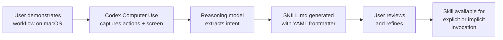
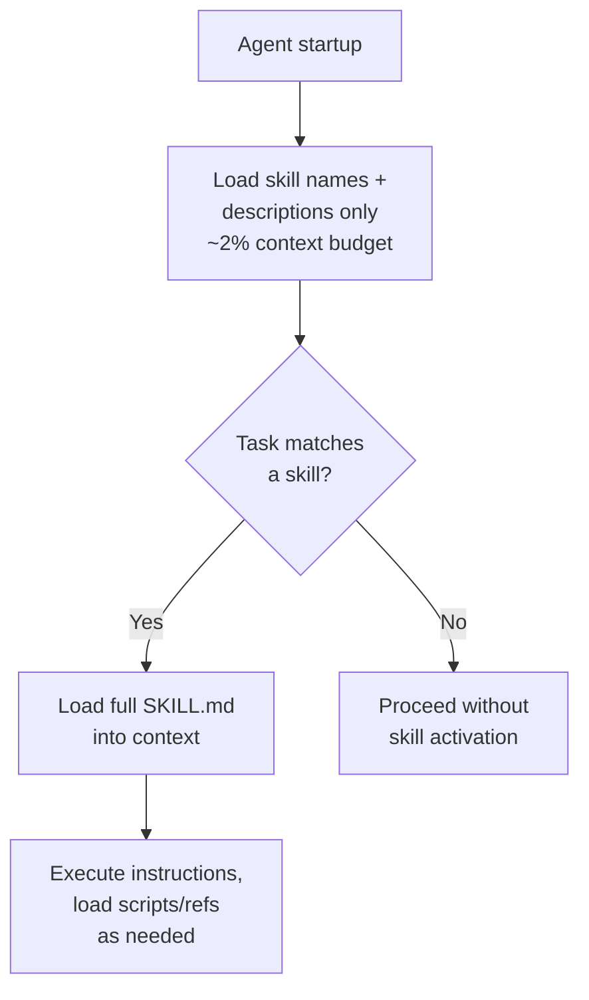

# Record and Replay: Programming by Demonstration Comes to Codex — and What It Means for the Open Agent Skills Standard


---

## The Idea That Took Forty Years

Programming by demonstration (PBD) — the notion that you should be able to show a computer what to do rather than describe it in code — has been a research ambition since the mid-1980s. Allen Cypher's *Watch What I Do* (1993) and Henry Lieberman's *Your Wish Is My Command* (2001) mapped the territory: capture user actions, generalise them into reusable procedures, and let non-programmers automate their own workflows[^1][^2]. The idea was elegant. The implementations were brittle. Macro recorders produced literal click-by-click replays that broke the moment a dialogue box moved three pixels to the left.

On 18 June 2026, Codex app 26.616 shipped Record & Replay — a feature that finally delivers on the PBD promise by replacing mechanical replay with natural-language skill generation[^3]. You demonstrate a workflow on your Mac. Codex watches. It produces a `SKILL.md` file that describes the *logic* of what you did, not the coordinates of where you clicked. That skill then runs across any tool that speaks the Open Agent Skills Standard[^4].

This article examines how Record & Replay works, how the generated skills fit into the broader agent skills ecosystem, and what this means for developer workflows.

---

## How Record & Replay Works

The recording flow is deliberately simple[^3]:

1. **Start recording** — open the Plugins menu and select "Record a skill". Codex activates Computer Use to observe your screen.
2. **Demonstrate the workflow** — perform the task as you normally would. Codex captures window content and user actions throughout.
3. **Stop recording** — use the menu bar, overlay, or a verbal instruction. Codex drafts a skill from the captured demonstration.
4. **Review and refine** — the generated `SKILL.md` appears for inspection. Edit the natural-language instructions before saving.

Critically, Codex does not produce a click-by-click macro. It inspects the captured workflow and generates a skill that explains[^3]:

- **When** to use the workflow (trigger conditions)
- **What inputs** it needs (parameters that vary between executions)
- **What steps** to follow (the procedure in natural language)
- **How to verify** the result (success criteria)

This is the key architectural difference from every prior PBD system. Classical macro recorders generalised through pattern-matching heuristics — and failed when the pattern shifted. Record & Replay offloads generalisation to a reasoning model, producing instructions that are robust to surface-level UI changes.



---

## The SKILL.md Format

The output of Record & Replay is a standard `SKILL.md` file conforming to the Open Agent Skills Standard[^4][^5]. At minimum, the frontmatter requires two fields:

```yaml
---
name: deploy-staging
description: >
  Deploy the current branch to the staging environment,
  run smoke tests, and post the preview URL to Slack.
---

## When to use

Use this skill when the user asks to deploy to staging,
push to preview, or test a branch on the staging server.

## Inputs

- **branch**: The Git branch to deploy (default: current branch)
- **channel**: The Slack channel for the preview URL

## Steps

1. Run `make build` in the project root.
2. Deploy the build artefact to the staging bucket...
3. Run the smoke test suite...
4. Post the preview URL to the specified Slack channel.

## Verification

Confirm the smoke test suite passes with zero failures
and the preview URL returns HTTP 200.
```

A complete skill directory may include additional resources[^5]:

```
deploy-staging/
├── SKILL.md          # Required: metadata + instructions
├── scripts/          # Optional: executable automation
├── references/       # Optional: documentation
├── assets/           # Optional: templates, configs
└── agents/
    └── openai.yaml   # Optional: UI metadata, dependencies
```

The optional `openai.yaml` file controls Codex-specific behaviour[^5]:

```yaml
interface:
  display_name: "Deploy to Staging"
  short_description: "Build, deploy, smoke-test, and notify"
  icon_small: "./assets/deploy-icon.svg"
  brand_color: "#3B82F6"

policy:
  allow_implicit_invocation: false

dependencies:
  tools:
    - type: "mcp"
      value: "slack-mcp-server"
```

Setting `allow_implicit_invocation: false` prevents Codex from auto-selecting the skill based on task description — users must invoke it explicitly via `$deploy-staging`.

---

## Progressive Disclosure: How Skills Stay Cheap

A reasonable objection: if you accumulate dozens of skills, won't they consume the entire context window? The Open Agent Skills Standard addresses this through a three-stage progressive disclosure pattern[^4][^5]:

1. **Discovery** — at startup, the agent loads only the `name` and `description` of each available skill. Codex caps this at approximately 2% of context or 8,000 characters[^5].
2. **Activation** — when a task matches a skill's description, the agent reads the full `SKILL.md` instructions into context.
3. **Execution** — the agent follows the instructions, optionally loading bundled scripts or reference files.

This means you can have hundreds of skills installed with negligible context overhead. Only the relevant skill's full instructions enter the window when needed.



---

## Skills vs AGENTS.md: Complementary, Not Competing

A common point of confusion: how do skills relate to `AGENTS.md`? They serve different purposes[^6]:

| Aspect | AGENTS.md | SKILL.md |
|--------|-----------|----------|
| **Activation** | Always loaded | On-demand, when task matches |
| **Scope** | Project-wide context and rules | Task-specific procedures |
| **Portability** | Codex-specific | Cross-agent (Open Standard) |
| **Content** | Coding conventions, architecture, constraints | Step-by-step workflows with inputs and verification |
| **Typical size** | Hundreds of lines | Tens to hundreds of lines per skill |

`AGENTS.md` tells the agent *how your project works*. Skills tell the agent *how to perform specific tasks*. Use both: `AGENTS.md` for always-on project context, skills for repeatable procedures that should activate only when relevant[^6].

---

## The Open Agent Skills Standard: Cross-Tool Portability

The most significant aspect of Record & Replay is not the recording — it is the output format. The `SKILL.md` format was originally developed by Anthropic, released as an open standard via agentskills.io, and has now been adopted by over 30 agent products[^4]. The same skill file works without modification across:

- **OpenAI Codex** (app and CLI)[^5]
- **Claude Code** and **Claude** (Anthropic)[^4]
- **Gemini CLI** (Google)[^4]
- **GitHub Copilot** and **VS Code**[^4]
- **Cursor**, **Kiro**, **Junie** (JetBrains)[^4]
- **Roo Code**, **OpenHands**, **Goose**, **Factory**, and many others[^4]

This is a genuine interoperability story. A skill you record in Codex on macOS can be committed to your repository and used by a teammate running Claude Code on Linux or Cursor on Windows. The skill travels with the codebase, not the tool.

For enterprise teams, this portability means skills become organisational knowledge assets rather than tool-specific configurations. Record a deployment procedure once, refine it, commit it, and every agent in the stack can execute it.

---

## Practical Guidance: Recording Effective Skills

OpenAI's documentation offers several best practices for producing high-quality skills from demonstrations[^3]:

1. **Keep demonstrations short and complete** — record one workflow from start to finish. Don't wander into unrelated tasks after completion.
2. **State your objective before recording** — tell Codex what you're about to do and which inputs might vary between executions.
3. **Use realistic but non-sensitive data** — the recording captures screen content; avoid credentials, API keys, or customer data.
4. **Refine after recording** — the generated `SKILL.md` is a first draft. Edit it to surface hidden preferences, add edge-case handling, and tighten verification criteria.
5. **Scale via plugins, not raw skills** — for team-wide deployment with multiple skills, MCP servers, and integrations, package workflows as standalone plugins rather than loose skill directories[^3].

### Enterprise Controls

Organisation-managed Codex deployments can disable Record & Replay entirely via `requirements.toml`[^3]:

```toml
[features]
computer_use = false
```

This is a sensible default for environments where screen capture poses data-handling risks.

---

## Current Limitations

Record & Replay is not yet universally available[^3]:

- **macOS only** — no Windows or Linux support at launch. Computer Use on Windows shipped separately (29 May 2026), but Record & Replay has not yet been extended to it[^7].
- **Regional restrictions** — initial availability excludes the European Economic Area, the United Kingdom, and Switzerland.
- **Codex app only** — the recording interface requires the Codex desktop app; the CLI does not have a recording mode. However, CLI users can invoke skills generated by the app, and can author `SKILL.md` files manually.
- **Computer Use dependency** — Record & Replay requires Computer Use to be available and enabled. If your organisation disables it, recording is unavailable.

⚠️ The regional restriction timeline for EEA/UK expansion has not been publicly announced as of July 2026.

---

## From Demonstration to Standard: Why This Matters

Record & Replay is interesting as a feature. It is significant as a distribution mechanism for the Open Agent Skills Standard.

The classic chicken-and-egg problem for any standard is content: nobody adopts the format if there are no skills, and nobody writes skills if there are no adopters. Record & Replay collapses the authoring cost to near zero. A non-developer can demonstrate a workflow and produce a standards-compliant skill that works across 30+ agent products. That changes the adoption dynamics fundamentally.

For senior developers, the implication is architectural. Skills are becoming a first-class artefact in the codebase — version-controlled, reviewed, tested, and shared like any other code. The question is no longer whether to adopt them, but how to govern them: who can create skills, how are they reviewed before team-wide deployment, and how do you prevent skill sprawl from creating maintenance burden.

The forty-year journey from Cypher's *Watch What I Do* to Codex's Record & Replay is, ultimately, a story about the right abstraction layer. Macro recorders failed because they captured mechanism. Record & Replay succeeds — or at least has the structural conditions to succeed — because it captures intent.

---

## Citations

[^1]: Cypher, A. et al. (1993). *Watch What I Do: Programming by Demonstration*. MIT Press. [Amazon](https://www.amazon.com/Watch-What-Do-Programming-Demonstration/dp/0262032139)

[^2]: Lieberman, H. (2001). *Your Wish Is My Command: Programming By Example*. Morgan Kaufmann. [Semantic Scholar](https://www.semanticscholar.org/paper/Your-Wish-is-My-Command%3A-Programming-By-Example-Lieberman/a255db1dede34e20a2872c435adf33cd810505b2)

[^3]: OpenAI (2026). "Record & Replay — Codex". OpenAI Developers. [developers.openai.com/codex/record-and-replay](https://developers.openai.com/codex/record-and-replay)

[^4]: Agent Skills (2026). "Agent Skills Overview". agentskills.io. [agentskills.io/home](https://agentskills.io/home)

[^5]: OpenAI (2026). "Agent Skills — Codex". OpenAI Developers. [developers.openai.com/codex/skills](https://developers.openai.com/codex/skills)

[^6]: Agensi (2026). "Codex CLI Skills & AGENTS.md Setup Guide 2026". [agensi.io](https://www.agensi.io/learn/codex-cli-agents-md-complete-guide)

[^7]: OpenAI (2026). "Changelog — Codex". OpenAI Developers. [developers.openai.com/codex/changelog](https://developers.openai.com/codex/changelog)
