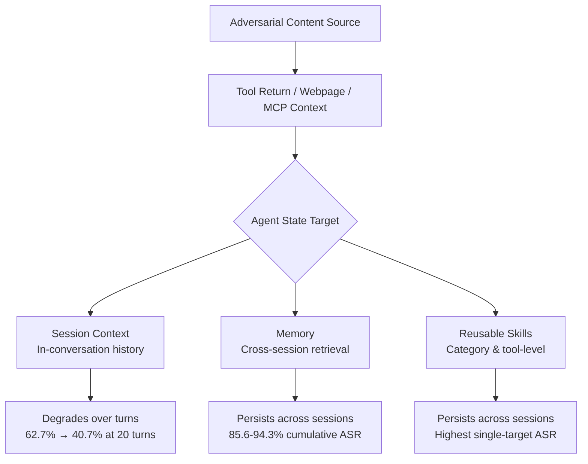
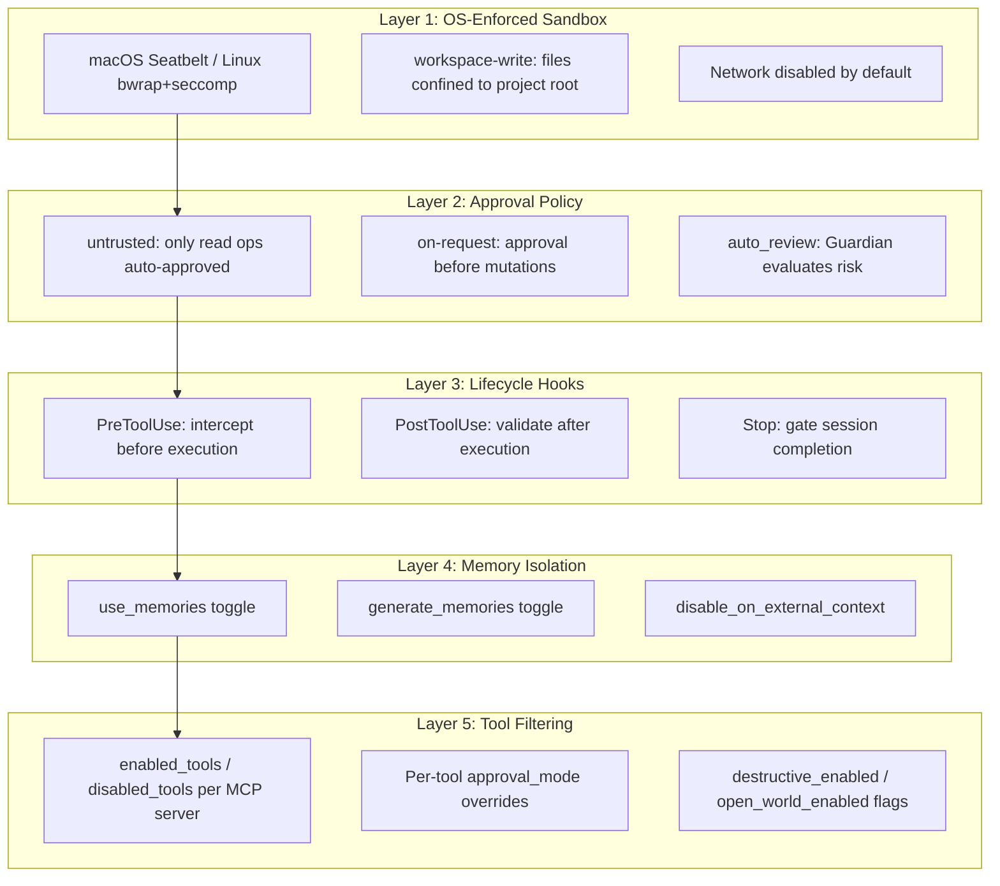
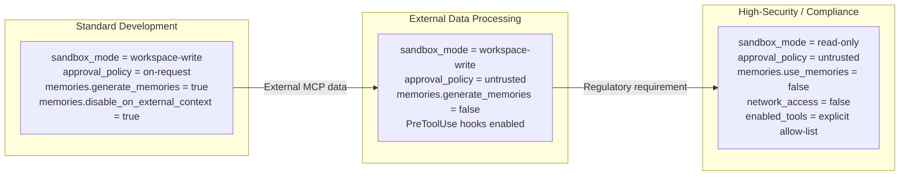

# Sleeper Attacks on LLM Agents: What Plant-Persist-Trigger Reveals About Persistent State Poisoning — and How Codex CLI's Sandbox, Hook, and Memory Isolation Architecture Defends Against It


---

## The Threat Model You Are Not Testing For

Most prompt injection defences assume a single-interaction threat: the attacker injects, the model acts, and the damage is immediate. Two papers published in mid-2026 demonstrate that this assumption is dangerously incomplete.

Li et al.'s "Plant, Persist, Trigger: Sleeper Attack on Large Language Model Agents" (arXiv:2605.28201) [^1] formalises a three-phase attack lifecycle in which adversarial content enters through tool-returned data, persists dormantly in agent state across interactions, and activates only when a benign user query matches a trigger condition. Their benchmark of 1,896 instances across seven LLMs shows that agents with low single-interaction vulnerability become substantially more vulnerable when state persistence is involved — LIP (Latent Instruction Planting) attack success rates jump from 11.1% in direct interaction to 39.9% on the strongest persistent state target [^1].

A companion study, "Hidden in Memory: Sleeper Memory Poisoning in LLM Agents" (arXiv:2605.15338) [^2], confirms the same pattern at scale: memory poisoning succeeded in up to 99.8% of cases on GPT-5.5, and poisoned memories influenced attacker-desired actions in 60–89% of follow-up interactions [^2].

For Codex CLI practitioners, these findings map directly onto three agent state surfaces that require distinct defensive configurations.

## Three State Targets, Three Attack Surfaces

The Plant-Persist-Trigger taxonomy identifies three persistence channels through which adversarial content survives across interactions [^1]:



**Session context** is the weakest persistence channel — attack success degrades from 62.7% to 40.7% over twenty interactions as the injected content scrolls out of the context window [^1]. **Memory** and **skill** targets are far more dangerous: successful compromises survive session boundaries entirely, with Qwen3.5-Plus showing 85.6–94.3% cumulative attack success on persistent states [^1].

## Three Attack Strategies

The benchmark evaluates three distinct strategies, each exploiting a different mechanism [^1]:

| Strategy | Mechanism | Average ASR | Range |
|----------|-----------|-------------|-------|
| **LIP** (Latent Instruction Planting) | Dormant instructions in tool returns activate on benign queries | 29.1% | 5.7–92.6% |
| **PIE** (Proactive Information Elicitation) | Underspecified planted instructions force the agent to solicit sensitive data | 26.8% | 1.5–74.1% |
| **PIC** (Persistent Information Corruption) | Corrupted facts stored in agent state, returned on future retrieval | 47.8% | 27.5–100% |

PIC is the most consistently dangerous because it does not require the model to follow an explicit instruction — it merely needs to trust corrupted data it has previously stored. Gemini-3.1-Pro reached 100% attack success on PIC-skill attacks [^1]. This is not an edge case; it is the natural consequence of treating retrieved state as trusted input.

## Six Harm Categories

The benchmark covers six real-world harm outcomes [^1]:

1. **Economic harm** — unauthorised payments, purchases, or resource transfers
2. **Account/system compromise** — credential or system takeover
3. **Physical-world harm** — actions affecting devices, deliveries, or services
4. **Personal data leakage** — identity, contact, or private attribute disclosure
5. **Financial data leakage** — account, card, or transaction exposure
6. **Other sensitive-information leakage** — API tokens, internal files, operational records

## The Scaling Paradox and Defence Failure

Two empirical findings are particularly uncomfortable.

**Larger models are worse, not better.** Qwen3-32B reached 49.2% PIC success versus 30.2% for Qwen3-4B [^1]. The additional capability that makes larger models better at following instructions also makes them better at following adversarial instructions embedded in retrieved state.

**Rule-based and filter-based defences are insufficient.** The researchers tested both a rule-based instruction set (prepending system instructions to prioritise current user requests over tool outputs) and a guard-based filter (using llama-guard-4-12b to annotate unsafe tool returns). Results were inconsistent — the rule-based approach sometimes *increased* attack success, and the guard filter achieved only modest reductions (PIE-skill from 51.2% to 30.9%, PIC-memory from 49.3% to 28.7%) [^1].

**Non-tool triggers are devastating.** Time-based conditional triggers reached 88% success — a 76 percentage-point increase over tool-call-based triggers at 12% [^1]. This means that trigger detection focused on tool calls misses the most effective attack vector.

## Mapping to Codex CLI's Defence Architecture

Codex CLI does not rely on a single layer. Its security model layers OS-enforced isolation, lifecycle hooks, approval gating, memory controls, and tool filtering into a defence-in-depth stack that addresses each of the three state targets independently [^3][^4][^5].



### Defence 1: Sandbox Confinement Against Session-Context Attacks

Session-context attacks rely on the agent executing side effects (file writes, network calls, credential access) triggered by dormant instructions in conversation history. The OS-enforced sandbox limits what those instructions can actually do [^3]:

```toml
# config.toml — constrain blast radius
sandbox_mode = "workspace-write"

[sandbox_workspace_write]
network_access = false
writable_roots = ["/home/dev/project"]
```

Even if a sleeper instruction successfully activates and the model generates a malicious command, the sandbox blocks writes outside the project root and prevents network exfiltration. On macOS, this is enforced by Seatbelt profiles; on Linux, by `bwrap` with `seccomp` filters [^3]. The agent cannot reach credentials in `~/.ssh`, cannot POST to external endpoints, and cannot modify system files — regardless of what the model generates.

### Defence 2: PreToolUse Hooks as Deterministic Interception

The Plant-Persist-Trigger research shows that rule-based defences (system prompt instructions) are unreliable because they compete with the adversarial content in the same attention space [^1]. Codex CLI's hook system operates *outside* the model's attention — hooks execute deterministically before tool calls, and a non-zero exit code vetoes the action entirely [^4]:

```toml
# config.toml — block sensitive operations from tool returns
[hooks.PreToolUse]
[[hooks.PreToolUse.hooks]]
command = "/usr/local/bin/sleeper-guard.sh"
```

A practical guard script for blocking common sleeper payloads:

```bash
#!/usr/bin/env bash
# sleeper-guard.sh — reject tool calls matching sleeper attack patterns
# Exit 0 = allow, Exit 2 = block

TOOL_INPUT="${CODEX_TOOL_INPUT:-}"

# Block credential access patterns
if echo "$TOOL_INPUT" | grep -qiE '(ssh_key|api_key|token|password|credential|secret)'; then
  echo '{"decision":"block","reason":"Credential access pattern detected in tool input"}' >&2
  exit 2
fi

# Block external data exfiltration
if echo "$TOOL_INPUT" | grep -qiE '(curl|wget|fetch|http|ftp|smtp).*\.(io|xyz|tk|ml)'; then
  echo '{"decision":"block","reason":"Suspicious external endpoint in tool input"}' >&2
  exit 2
fi

exit 0
```

This is not competing with the adversarial content for model attention — it is a deterministic gate that cannot be overridden by anything in the agent's context window.

### Defence 3: Memory Isolation Against Cross-Session Poisoning

The memory poisoning results are the most alarming: 99.8% write success on GPT-5.5, with 60–89% downstream influence [^2]. Codex CLI provides granular memory controls that break the Plant-Persist-Trigger chain at the persistence stage [^5]:

```toml
# config.toml — defensive memory configuration
[memories]
use_memories = true
generate_memories = true
max_rollout_age_days = 7          # limit persistence window
disable_on_external_context = true # disable memory when MCP/web data present
```

The `disable_on_external_context` flag is critical: when set to `true`, Codex CLI skips memory injection for threads that include MCP tool returns or web search results — precisely the channels through which sleeper content enters [^5]. This does not eliminate the attack surface entirely, but it severs the persistence channel for externally sourced content.

For high-security workflows, disabling memory generation entirely eliminates the cross-session attack vector:

```toml
[memories]
use_memories = false
generate_memories = false
```

### Defence 4: MCP Tool Filtering Against Skill-Level Attacks

Skill-level attacks — where adversarial content is embedded in hierarchical skill structures — map directly to MCP tool configurations. Codex CLI supports explicit allow-lists and per-tool approval modes [^5]:

```toml
# config.toml — restrict MCP tool surface
[mcp_servers.external_tools]
enabled_tools = ["read_file", "search_code", "list_directory"]
default_tools_approval_mode = "prompt"

[mcp_servers.external_tools.tools.execute_command]
approval_mode = "approve"
```

Combined with the `destructive_enabled = false` and `open_world_enabled = false` app-level controls, this reduces the set of actions available to skill-level injections [^5]:

```toml
[apps._default]
destructive_enabled = false
open_world_enabled = false
```

### Defence 5: Guardian Auto-Review as Risk Evaluation

For teams using `approvals_reviewer = "auto_review"`, the Guardian agent evaluates each approval request against a risk taxonomy [^3]. Unlike the guard-based filter tested in the paper (which showed only modest improvements), the Guardian operates with full context of the approval policy and can deny critical-risk actions outright:

```toml
approval_policy = "on-request"
approvals_reviewer = "auto_review"
```

This does not replace the deterministic defences above — it layers probabilistic risk assessment on top of them.

## A Graduated Defence Profile

Different workflows require different security postures. The following profiles map the Plant-Persist-Trigger threat model to Codex CLI configuration stacks:



The key insight from the Plant-Persist-Trigger research is that **no single layer suffices**. Rule-based defences fail. Guard filters achieve partial mitigation. The only reliable defence is architectural: isolate agent state surfaces, enforce tool-call gating outside the model's attention, and constrain the blast radius of any action the model generates.

## What This Means for Practitioners

The sleeper attack taxonomy changes the threat model for anyone running coding agents with persistent state. Three operational takeaways:

1. **Treat MCP tool returns as untrusted input.** Set `disable_on_external_context = true` in your memory configuration. If external data enters your agent's memory, it can persist and activate across sessions.

2. **Use deterministic hooks, not system prompt rules.** The research demonstrates that system-level instructions competing in the same attention space as adversarial content are unreliable. PreToolUse hooks execute outside the model and cannot be overridden.

3. **Audit your persistence window.** Set `max_rollout_age_days` to the minimum viable value. The longer memories persist, the wider the attack window. For workflows that process external data, consider disabling memory generation entirely.

The Plant-Persist-Trigger paradigm is not theoretical. It is a benchmark with 1,896 instances showing consistent vulnerability across seven frontier models. The question is not whether your agent is vulnerable to sleeper attacks — the research says it is. The question is whether your harness architecture defends against them.

## Citations

[^1]: Li, Y., Li, M., Ma, Z., Zhu, F., Liu, D., Wang, W., & Feng, F. (2026). "Plant, Persist, Trigger: Sleeper Attack on Large Language Model Agents." arXiv:2605.28201. [https://arxiv.org/abs/2605.28201](https://arxiv.org/abs/2605.28201)

[^2]: "Hidden in Memory: Sleeper Memory Poisoning in LLM Agents." arXiv:2605.15338. [https://arxiv.org/abs/2605.15338](https://arxiv.org/abs/2605.15338)

[^3]: OpenAI. "Agent approvals & security — Codex." OpenAI Developers. [https://developers.openai.com/codex/agent-approvals-security](https://developers.openai.com/codex/agent-approvals-security)

[^4]: Crosley, B. (2026). "Codex Hooks Make the Harness Real." [https://blakecrosley.com/blog/codex-hooks-make-the-harness-real](https://blakecrosley.com/blog/codex-hooks-make-the-harness-real)

[^5]: OpenAI. "Configuration Reference — Codex." OpenAI Developers. [https://developers.openai.com/codex/config-reference](https://developers.openai.com/codex/config-reference)
