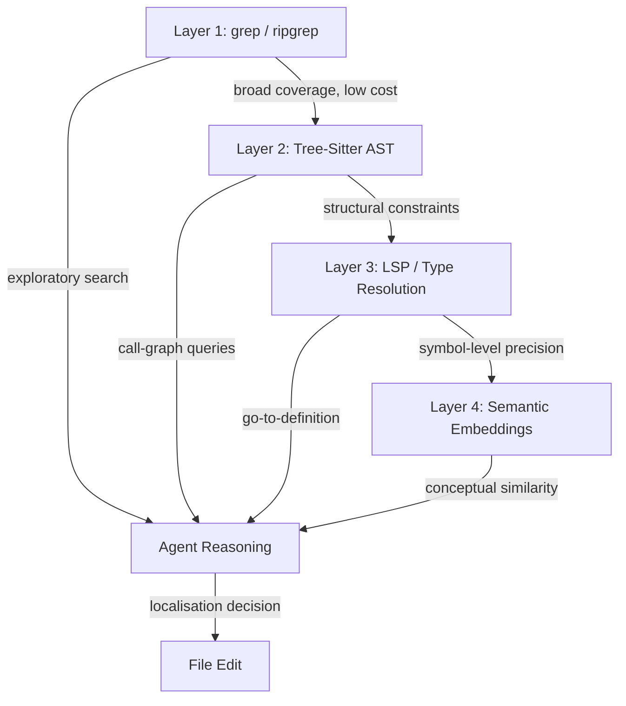
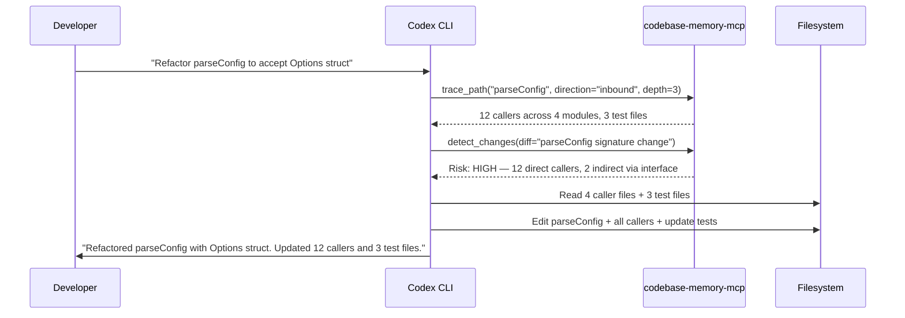

# Structural Codebase Indexing: Why grep Is Not Enough — and How to Wire a Knowledge-Graph MCP Server into Codex CLI


---

Coding agents are extraordinarily good at modifying files once they know which files to modify. The bottleneck is *finding* the right code in the first place. Two recent research efforts — Bhola et al.'s "Code Isn't Memory" (June 2026) [^1] and Vogel et al.'s "Codebase-Memory" (March 2026) [^2] — converge on the same conclusion: replacing flat text search with a structural codebase index produces measurably better localisation, lower token consumption, and no cost penalty per task. This article examines what structural indexing means in practice and walks through the configuration required to add a knowledge-graph MCP server to Codex CLI v0.142.

## The Localisation Problem

Every agentic coding session begins with the same implicit question: *where in this repository does the change belong?* Codex CLI's built-in strategy is grep-centric — `rg` (ripgrep) handles broad-coverage text search, and the model reasons over results to narrow scope [^3]. This works well for small-to-medium repositories and single-file changes. It breaks down in three predictable ways:

1. **Polyglot repositories** where the same identifier appears across languages with different semantics.
2. **Renamed or aliased symbols** where text search cannot follow the indirection.
3. **Multi-file changes** where the agent needs to understand call chains, inheritance hierarchies, or import graphs before editing.

Bhola et al. quantified this on SWE-PolyBench Verified and SWE-bench Pro using Claude Opus 4.7 [^1]. Their within-harness ablation — identical model, identical sandbox, three seeds per arm — showed that adding a structural index produced a "large localisation gain and a statistically separated resolve gain" with no cost penalty per task and lower cost per solved problem. The deployment question, as they put it, is not whether the index is too expensive to run but whether the workload includes multi-file changes where structural ranking pays off.

## Two Approaches to Structural Indexing

### Tree-Sitter Knowledge Graphs

Codebase-Memory [^2] builds a persistent knowledge graph from Tree-Sitter parse trees. The pipeline supports 158 languages via vendored grammars and adds a "Hybrid LSP" semantic resolution layer for nine languages (Python, TypeScript, Go, Rust, Java, Kotlin, C, C++, C#) [^4]. The resulting graph stores functions, classes, routes, modules, and channels as nodes, connected by typed edges: `CALLS`, `IMPORTS`, `DEFINES`, `IMPLEMENTS`, `INHERITS`, `HTTP_CALLS`, and cross-repo `CROSS_*` edges.

Evaluated across 31 real-world repositories, the graph approach achieved 83% answer quality versus 92% for a file-exploration agent — but consumed ten times fewer tokens and required 2.1 times fewer tool calls [^2]. For graph-native queries (hub detection, caller ranking, dead-code detection), it matched or exceeded the baseline on 19 of 31 languages.

### Structural Index Inside the Agent Harness

Bhola et al. took a different approach: they embedded the structural index directly inside the coding-agent harness rather than exposing it through an external tool [^1]. This kept the index tightly coupled to the agent's planning phase, allowing the model to consult structural rankings before issuing any file-read or edit commands. The key finding was that the index complemented rather than replaced grep — agents still used text search for exploratory passes but relied on the structural index for final localisation decisions.

## The Layered Retrieval Model

The industry has converged on a four-layer retrieval architecture for codebase navigation [^3]:



Codex CLI provides Layer 1 natively. Layers 2–4 require external tooling, and the MCP protocol is the integration surface.

## Wiring codebase-memory-mcp into Codex CLI

The open-source `codebase-memory-mcp` server [^4] is the most mature implementation of the Tree-Sitter knowledge-graph approach. It ships as a single static binary with zero dependencies and exposes 14 MCP tools.

### Installation

The installer auto-detects Codex CLI and writes the MCP configuration automatically:

```bash
curl -fsSL https://raw.githubusercontent.com/DeusData/codebase-memory-mcp/main/install.sh | bash
```

For manual configuration, add the server to `~/.codex/config.toml`:

```toml
[mcp_servers.codebase-memory]
command = "codebase-memory-mcp"
args = []
enabled = true
startup_timeout_sec = 30
tool_timeout_sec = 60

# Restrict to structural query tools — disable write operations
enabled_tools = [
  "get_architecture",
  "search_graph",
  "search_code",
  "trace_path",
  "detect_changes",
  "semantic_query",
  "find_dead_code"
]

default_tools_approval_mode = "auto"
```

### Project-Scoped Configuration

For repositories where the graph is committed (the `.codebase-memory/` directory contains a compressed SQLite database), scope the server to the project:

```toml
# .codex/config.toml (project-level, trusted projects only)
[mcp_servers.codebase-memory]
command = "codebase-memory-mcp"
args = ["--db", ".codebase-memory/graph.db.zst"]
enabled = true
```

### Auto-Indexing

Enable automatic indexing so that new projects are indexed on first connection:

```bash
codebase-memory-mcp config set auto_index true
```

The indexing speed is substantial: Django indexes in approximately six seconds (49K nodes, 196K edges), and even the Linux kernel completes in three minutes (4.81M nodes, 7.72M edges) [^4].

## Tool Search and MCP Discovery in v0.142

Codex CLI v0.142.2 introduced a significant change to MCP tool handling: tools now use *tool search* by default when the model supports it [^5]. Instead of loading every tool definition from every configured MCP server at session start, Codex discovers tools on demand. This is directly relevant to structural indexing because:

1. **Tool-heavy setups** (GitHub MCP + filesystem MCP + codebase-memory MCP + language-specific MCP) no longer overwhelm the model's tool schema budget.
2. **The model learns** which tools are available through search rather than pre-loading, reducing context window consumption.
3. **Compatibility** is preserved — older models and providers that do not support tool search receive the full tool list at session start.

Configure tool suggestion discoverables in `config.toml` to ensure the codebase-memory tools surface when relevant:

```toml
[[tool_suggest.discoverables]]
type = "mcp"
id = "codebase-memory"
```

## AGENTS.md Template for Structural Navigation

Encode the navigation strategy in `AGENTS.md` so that the agent uses the structural index before falling back to grep:

```markdown
## Codebase Navigation Protocol

1. For ANY multi-file change, call `get_architecture` first to understand
   the module structure, entry points, and hotspots.
2. Use `trace_path` to resolve call chains before editing callers or callees.
3. Use `detect_changes` after a git diff to identify affected symbols and
   their risk classification.
4. Fall back to `search_code` (graph-augmented grep) only when the structural
   query returns no results.
5. Never read files speculatively — use the index to confirm file relevance
   before opening.
```

## Token Economics

The token savings from structural indexing are dramatic. Codebase-Memory reports a 120× reduction in token consumption for navigation queries — from approximately 412,000 tokens via file-by-file exploration to approximately 3,400 tokens via graph queries [^4]. Even accounting for the index construction cost (amortised across sessions via the persistent SQLite database), the break-even point arrives within two or three multi-file tasks.

Combined with Codex CLI's `tool_output_token_limit` configuration key, which caps the token budget for individual tool outputs in session history [^6], the structural index keeps navigation costs firmly within budget:

```toml
# Cap individual tool outputs to prevent graph dumps consuming context
tool_output_token_limit = 8000
```

## Limitations and Caveats

- **Codex CLI has no native structural index.** The open feature request (GitHub issue #5181) [^3] remains unresolved as of v0.142.5. All structural indexing requires an external MCP server.
- **Hybrid LSP resolution** covers only nine languages [^4]. For languages outside this set, the graph captures syntactic structure but cannot resolve cross-module type references.
- **Graph quality degrades on generated code.** Machine-generated files (protobuf stubs, ORM models, bundled assets) produce noisy nodes. Configure `.codebase-memory/ignore` to exclude generated directories.
- **The 83% quality figure** from Codebase-Memory [^2] means the graph alone is not sufficient — it must be composed with text search and direct file reading for full accuracy.
- ⚠️ **Benchmark scores from "Code Isn't Memory"** are reported as relative gains ("large localisation gain", "statistically separated resolve gain") rather than absolute percentages. The paper's reproducibility materials include exclusion ledgers and audit scripts, but exact resolve-rate numbers require running the released evaluation harness.
- **Tool search in v0.142.2** is model-dependent. If your configured model does not support tool search, all MCP tools are loaded upfront, which may exceed the tool schema budget in multi-server configurations [^5].

## Practical Workflow: Impact Analysis Before Edit

A concrete example of structural indexing value: before refactoring a function, the agent traces its callers, identifies affected test files, and scopes the change:



Without the structural index, the agent would grep for `parseConfig`, potentially miss callers that use interface indirection, and either produce an incomplete change or consume significantly more tokens exploring the repository.

## Conclusion

Structural codebase indexing addresses the primary bottleneck in agentic coding: localisation. The research from Bhola et al. and Vogel et al. converges on the same finding — structural ranking produces better localisation at lower token cost, with no penalty on resolve rate. For Codex CLI users, the practical path is an MCP server like `codebase-memory-mcp` configured with tool filtering, approval gating, and an AGENTS.md navigation protocol that encodes the layered retrieval strategy. The v0.142.2 tool search feature makes this composition viable even in tool-heavy setups.

---

## Citations

[^1]: Bhola, I., Krishnan, A., Kurmala, S. & Mukunda, N.S. (2026). "Code Isn't Memory: A Structural Codebase Index Inside a Coding Agent." *arXiv:2606.22417*. [https://arxiv.org/abs/2606.22417](https://arxiv.org/abs/2606.22417)

[^2]: Vogel, M., Meyer-Eschenbach, F., Kohler, S., Grünewald, E. & Balzer, F. (2026). "Codebase-Memory: Tree-Sitter-Based Knowledge Graphs for LLM Code Exploration via MCP." *arXiv:2603.27277*. [https://arxiv.org/abs/2603.27277](https://arxiv.org/abs/2603.27277)

[^3]: GitHub. (2026). "Semantic codebase indexing and search." *openai/codex Issue #5181*. [https://github.com/openai/codex/issues/5181](https://github.com/openai/codex/issues/5181)

[^4]: DeusData. (2026). "codebase-memory-mcp: High-performance code intelligence MCP server." *GitHub*. [https://github.com/DeusData/codebase-memory-mcp](https://github.com/DeusData/codebase-memory-mcp)

[^5]: OpenAI. (2026). "Codex CLI v0.142.2 release notes." *GitHub Releases*. [https://github.com/openai/codex/releases](https://github.com/openai/codex/releases)

[^6]: OpenAI. (2026). "Configuration Reference — Codex CLI." *OpenAI Developers*. [https://developers.openai.com/codex/config-reference](https://developers.openai.com/codex/config-reference)
