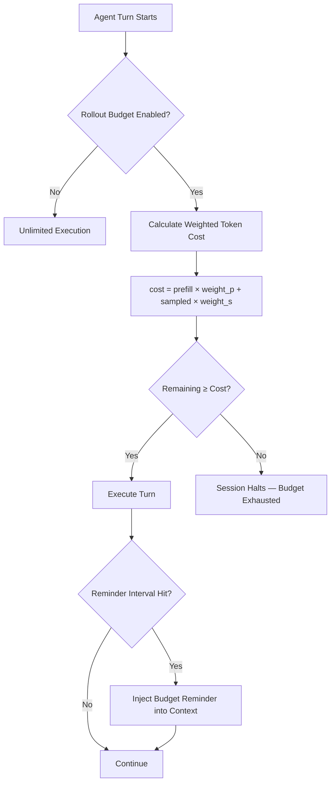

# Token Budget Overruns: What 63 Production Incidents Reveal About Runaway Agent Costs — and How Codex CLI's Rollout Budget Stops the Bleed


---

A single retry loop in a coding agent can accumulate thousands of dollars before an operator notices. This is not a hypothetical risk — it is a documented failure class with 63 confirmed production incidents across 21 orchestration frameworks [^1]. Khan's empirical catalogue, published in June 2026, taxonomises these failures into eight clusters and demonstrates that the root cause is structural: most frameworks treat token budgets as advisory counters rather than enforced constraints. Codex CLI's `rollout_token_budget` feature, shipped in v0.142.0, takes a different approach — one that aligns with the catalogue's recommendations whilst avoiding the complexity of compile-time ownership systems.

## The Scale of the Problem

The Token Budgets catalogue [^1] documents incidents from 2023 to 2026, each backed by a quoted GitHub issue, a maintainer or user statement, and documented dollar loss. The eight failure clusters reveal recurring patterns that affect every major agent framework:

| Cluster | Description | Example Pattern |
|---------|------------|----------------|
| Retry amplification | Exponential retry loops compound cost | Failed tool call retried indefinitely |
| Delegation leaks | Subagent spawns inherit parent budget without deduction | Three subagents each spend the full parent budget |
| Shadow consumption | Reasoning tokens not counted against visible budget | `o3` thinking tokens bypass cost tracking |
| Cache invalidation storms | Context eviction forces full re-ingestion | Compaction triggers re-read of entire codebase |
| Orphan continuation | Agent continues after task completion | Goal achieved but verification loop keeps running |
| Concurrent aliasing | Multiple threads share a single budget counter | Race condition allows double-spend |
| Checkpoint amnesia | Budget state lost on session recovery | Resumed session starts with fresh budget |
| Metric lag | Usage dashboard updates lag behind actual spend | Operator sees \$50 when actual spend is \$400 |

The Python asyncio evaluation in the paper is particularly stark: 30 out of 30 concurrent agent runs overshot their allocated budget when using standard counter-based tracking [^1]. The problem is not careless engineering — it is that mutable shared state is fundamentally unsuited to budget enforcement in concurrent, delegating systems.

## Why Counters Fail

Most agent frameworks implement token budgets as a simple pattern:

```python
budget_remaining -= tokens_used
if budget_remaining <= 0:
    raise BudgetExhausted()
```

This breaks in three ways that the catalogue documents repeatedly:

1. **Aliasing**: when a parent delegates to a subagent, both hold a reference to the same budget. The subagent's spend is invisible to the parent until the next check.
2. **Non-atomic deduction**: between reading `budget_remaining` and writing the decremented value, another coroutine can spend tokens against the same balance.
3. **Incomplete accounting**: reasoning tokens, cached prefix tokens, and tool output tokens are often excluded from the counter, creating shadow consumption that bypasses the guard entirely.

Khan's mitigation — a 1,180-line Rust crate using affine types — solves this elegantly at compile time [^1]. Cloning a budget handle, using it after delegation, or spending from it twice are all compile errors. But this requires rewriting orchestration logic in Rust with affine ownership semantics — a non-starter for most teams.

## Codex CLI's Rollout Budget Architecture

Codex CLI takes a pragmatic middle path. The `rollout_token_budget` feature, introduced in v0.142.0 [^2], enforces budget constraints at the session level with configurable token accounting:

```toml
[features.rollout_budget]
enabled = true
limit_tokens = 100000
reminder_interval_tokens = 10000
sampling_token_weight = 1.0
prefill_token_weight = 1.0
```

This configuration creates a hard ceiling of 100,000 tokens per session, with reminders every 10,000 tokens [^3]. The two weight parameters address the shadow consumption problem directly: by assigning explicit multipliers to prefill (cached/input) and sampling (generated output) tokens, operators can tune accounting to match their cost model.



### Addressing the Eight Failure Clusters

The rollout budget maps to each of the catalogue's failure clusters:

**Retry amplification** — each retry consumes tokens against the same session budget. The hard limit ensures that a stuck retry loop hits the ceiling rather than running indefinitely.

**Delegation leaks** — Codex CLI's subagent architecture inherits sandbox and network rules from the parent session [^4]. The rollout budget applies to the aggregate session, not to individual subagents, preventing the delegation-leak pattern where three children each spend the full parent budget.

**Shadow consumption** — the `prefill_token_weight` and `sampling_token_weight` parameters make all token classes visible in the budget. Setting `sampling_token_weight = 4.0` for a model where output tokens cost 4× input tokens produces cost-proportional accounting rather than raw token counting.

**Cache invalidation storms** — `model_auto_compact_token_limit` [^3] controls when automatic compaction triggers, and `tool_output_token_limit` caps the ingestion of individual tool outputs. Together with the rollout budget, these prevent a compaction cycle from consuming the entire session budget on re-ingestion.

**Orphan continuation** — the `reminder_interval_tokens` parameter injects periodic budget awareness into the agent's context. When the model sees "Budget: 12,000 of 100,000 tokens remaining," it can choose to wrap up rather than starting another verification cycle.

**Concurrent aliasing** — Codex CLI's Rust core (`codex-rs`) handles budget accounting in a single-threaded event loop, eliminating the race condition that caused 30/30 overruns in the Python asyncio evaluation [^1][^5].

**Checkpoint amnesia** — session state, including budget consumption, persists across the thread. The `codex-reply` tool for Agents SDK integration carries thread IDs that maintain budget continuity [^6].

**Metric lag** — because the budget is enforced locally in the CLI process rather than via a remote dashboard API, there is zero lag between actual spend and enforcement. The token count is updated synchronously before the next turn begins.

## Profile-Based Budget Strategies

Named profiles let teams maintain different budget ceilings for different risk levels [^3]:

```toml
# ~/.codex/ci.config.toml — tight budget for automated runs
[features.rollout_budget]
enabled = true
limit_tokens = 50000
sampling_token_weight = 1.0
prefill_token_weight = 0.25

# ~/.codex/exploration.config.toml — generous budget for research
[features.rollout_budget]
enabled = true
limit_tokens = 500000
reminder_interval_tokens = 50000
sampling_token_weight = 1.0
prefill_token_weight = 1.0
```

Activate with `codex --profile ci` or `codex --profile exploration`. Enterprise teams can enforce minimum budget constraints via managed `requirements.toml` [^3], preventing individual developers from disabling budget tracking.

## Complementary Research: Budget-Awareness Is Not Free

Lin et al.'s BAGEN framework [^7], published in May 2026, demonstrates that strong task performance does not correlate with budget-awareness (r=0.35). Frontier models are "consistently over-optimistic," continuing expensive tasks unlikely to succeed. Early stopping — the behaviour that Codex CLI's reminder system encourages — saved 28–64% of tokens on failed trajectories [^7].

Ye and Tan's Agent Contracts framework [^8] formalises the hierarchical budget delegation problem, achieving 90% token reduction and zero conservation violations in multi-agent scenarios. Their key insight — that delegated budgets must respect parent constraints through explicit lifecycle semantics — is exactly what Codex CLI implements through session-scoped rollout budgets that aggregate across subagent spawns.

## Practical Recommendations

For teams adopting Codex CLI's rollout budget in production:

1. **Start with monitoring, not enforcement.** Set `limit_tokens` to 2× your expected maximum session cost for two weeks. Review the actual distribution before tightening.

2. **Weight tokens by cost, not count.** If your model charges \$15/M for output and \$5/M for input, set `sampling_token_weight = 3.0` and `prefill_token_weight = 1.0` to get cost-proportional budgeting.

3. **Use profiles for risk tiers.** CI runs get tight budgets. Interactive exploration gets generous ones. Goal mode gets the tightest budget with frequent reminders.

4. **Combine with `model_auto_compact_token_limit`.** Set this below your rollout budget to ensure compaction happens before budget exhaustion, not after.

5. **Monitor via OpenTelemetry.** Codex CLI exports `codex.tokens.prefill`, `codex.tokens.sampling`, and `codex.budget.remaining` metrics [^3]. Wire these to your existing cost monitoring stack.

## The Bigger Picture

The 63-incident catalogue demonstrates that token budget overruns are not edge cases — they are a systemic failure class in autonomous agent systems. Khan's affine-type solution is theoretically elegant but demands a Rust rewrite. Codex CLI's rollout budget takes the practical path: session-scoped enforcement, configurable token weighting, periodic context injection, and single-threaded accounting that sidesteps the concurrency bugs responsible for the worst documented losses.

The feature is still marked as under development [^3], but the architecture is sound. For teams running Codex CLI in production — especially in CI pipelines, goal mode sessions, and subagent workflows — enabling rollout budgets is the single most effective defence against the runaway cost scenarios that have already cost the industry documented thousands of dollars per incident.

---

## Citations

[^1]: Khan, S. (2026). "Token Budgets: An Empirical Catalog of 63 LLM-Agent Budget-Overrun Incidents, with an Affine-Typed Rust Mitigation as a Case Study." arXiv:2606.04056. [https://arxiv.org/abs/2606.04056](https://arxiv.org/abs/2606.04056)

[^2]: OpenAI. (2026). "Codex Changelog — v0.142.0, June 23, 2026." [https://developers.openai.com/codex/changelog](https://developers.openai.com/codex/changelog)

[^3]: OpenAI. (2026). "Configuration Reference — Codex CLI." [https://developers.openai.com/codex/config-reference](https://developers.openai.com/codex/config-reference)

[^4]: OpenAI. (2026). "Subagents — Codex CLI." [https://developers.openai.com/codex/subagents](https://developers.openai.com/codex/subagents)

[^5]: OpenAI. (2026). "Codex CLI — Features." [https://developers.openai.com/codex/cli/features](https://developers.openai.com/codex/cli/features)

[^6]: OpenAI. (2026). "Use Codex with the Agents SDK." [https://developers.openai.com/codex/guides/agents-sdk](https://developers.openai.com/codex/guides/agents-sdk)

[^7]: Lin, Y. et al. (2026). "BAGEN: Are LLM Agents Budget-Aware?" arXiv:2606.00198. [https://arxiv.org/abs/2606.00198](https://arxiv.org/abs/2606.00198)

[^8]: Ye, Q. & Tan, J. (2026). "Agent Contracts: A Formal Framework for Resource-Bounded Autonomous AI Systems." arXiv:2601.08815. [https://arxiv.org/abs/2601.08815](https://arxiv.org/abs/2601.08815)
