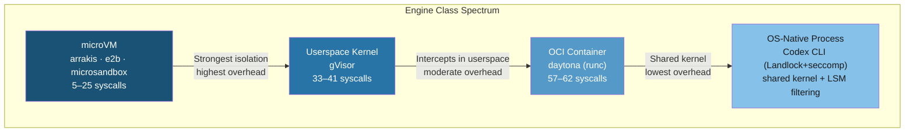

# AI Code Sandbox Security Showdown: What a Five-Product Comparative Study Reveals About Engine-Class Isolation — and Where Codex CLI's Landlock-and-Seatbelt Architecture Sits


---

Every coding agent runs untrusted code. The sandbox that separates that code from your host kernel is the single most consequential security decision in the stack — yet most developers choose a sandbox based on vibes and vendor marketing rather than measured properties. A new 61-page comparative study by Andronchik and Lokhmakov changes that, applying six quantitative axes to five commercial AI-sandbox products and producing the clearest engine-class taxonomy the field has seen [^1]. The results are directly relevant to anyone configuring Codex CLI's own OS-enforced sandbox, and they expose trade-offs that no changelog entry will tell you.

## The Study: Six Axes, Five Products, Three Engine Classes

The researchers evaluated five AI-sandbox products across six measurable dimensions: host attack surface (distinct syscall counts under strace), information leakage (host fingerprint exposure), defence-in-depth stackability (layered controls applied at defaults), public CVE history (24-month window, May 2024–May 2026), patch cadence (upstream and downstream days-to-patch), and upstream fuzzing posture [^1].

The five products and their underlying engines:

| Product | Engine | Engine Class |
|---------|--------|--------------|
| arrakis | Cloud Hypervisor | microVM |
| e2b | Firecracker | microVM |
| microsandbox | libkrun | microVM |
| gVisor | runsc | Userspace kernel |
| daytona | runc | OCI container |

The headline finding: **engine classes separate cleanly on every architectural axis, but products within a class do not** [^1]. Put differently, whether you run a microVM, a userspace kernel, or an OCI container matters enormously; *which* microVM product you pick matters less for architecture but critically for operational posture.

## Attack Surface: Syscalls Tell the Story

The strace-measured syscall footprint reveals a clear hierarchy [^1]:

| Product | Light workload | Heavy workload |
|---------|---------------|----------------|
| arrakis | 5 | 8 |
| e2b | 13 | 13 |
| microsandbox | 22 | 25 |
| gVisor | 33 | 41 |
| daytona | 57 | 62 |

MicroVM products expose 5–25 distinct syscalls to the host kernel. The userspace-kernel approach (gVisor) intercepts syscalls in user space but still needs 33–41 host-side calls for its own operation. OCI containers share the host kernel directly, exposing 57–62 calls even under a seccomp filter ceiling [^1].

Seccomp filter ceilings reinforce the pattern: e2b allows 55 syscalls, gVisor allows 84, whilst arrakis, microsandbox, and daytona run with seccomp mode 0 (no filter) — relying on architectural isolation rather than syscall filtering [^1].

## Information Leakage: What the Guest Can Learn

Information leakage quantifies how much host-identifying data is visible from inside the sandbox [^1]:

- **e2b, microsandbox**: 0 leaks — fully virtualised hardware identity
- **arrakis**: 1 leak — CPU model passthrough via CPUID
- **gVisor**: 2 leaks — MemTotal and DMI product name visible
- **daytona**: 10 leaks — full shared-kernel signature including CPU model, RAM size, kernel version, and disc serial numbers

For coding agents, leakage matters because a compromised agent that can fingerprint the host can tailor escape attempts to the specific kernel version and hardware configuration [^2].

## Defence-in-Depth: Layers at Defaults

The study counted how many of seven standard hardening layers each product applies out of the box [^1]:

| Product | Default layers (of 7) | Notable |
|---------|----------------------|---------|
| gVisor | 4 | seccomp, cap-drop, no-new-privs, pids.max |
| e2b | 2 | seccomp, no-new-privs |
| arrakis | 1 | seccomp on worker threads only |
| daytona | 1 | cap-drop on init |
| microsandbox | 0 | relies on VMM isolation alone |

GVisor leads on layered defaults despite being architecturally weaker than microVMs on attack surface. The implication: **engine architecture and operational hardening are independent variables** [^1]. A microVM with zero defence-in-depth layers is not necessarily safer in practice than a userspace kernel with four.

## CVE History and Patch Cadence

Over the 24-month window (May 2024–May 2026) [^1]:

| Engine | CVE count | Escape-class CVEs |
|--------|-----------|-------------------|
| runc (daytona) | 4 | 4 |
| gVisor | 3 | 0 |
| Firecracker (e2b) | 2 | 2 |
| Cloud Hypervisor (arrakis) | 2 | 1 |
| libkrun (microsandbox) | 0 | 0 |

Upstream patch latency is excellent across the board — P50 and P95 both evaluate to 0 days for Firecracker, Cloud Hypervisor, and runc under coordinated disclosure [^1]. GVisor exhibits a silent-fix-first pattern, with fixes shipping 165–458 days before CVE assignment [^1].

The real danger lies downstream. Arrakis was frozen at 471+ days on Cloud Hypervisor v44.0; e2b's self-hosted variant was frozen at 399 days [^1]. **Downstream pin policy is the dominant operator-facing variable** — your sandbox engine might patch in zero days, but if the product vendor never pulls the update, you inherit every intervening CVE.

## Where Codex CLI Fits

Codex CLI does not use any of the five products studied. Instead, it implements OS-native sandboxing at the process level [^3][^4]:

- **Linux**: bubblewrap (bwrap) with unprivileged user namespaces, Landlock LSM for filesystem filtering (kernel 5.13+), and seccomp-BPF for syscall restriction [^4]
- **macOS**: the built-in Seatbelt (sandbox-exec) framework [^4]
- **Windows**: restricted tokens, synthetic SIDs, ACL-based filesystem boundaries, and Windows Firewall rules [^5]

This places Codex CLI in a category the study does not cover: **OS-native process-level sandboxing**. It shares the host kernel (like OCI containers) but applies tighter-than-default filesystem and network restrictions (like userspace kernels). Understanding this positioning helps you make informed configuration decisions.



### Mapping the Six Axes to Codex CLI

**Attack surface**: Codex CLI's bubblewrap sandbox runs agent commands in a child process that shares the host kernel. The Landlock LSM restricts filesystem access — granting universal read but limiting writes to explicitly allowlisted directories plus `/dev/null` [^4]. Seccomp-BPF restricts the syscall surface beyond what a bare container would expose.

**Information leakage**: Because Codex CLI shares the host kernel, the guest process can observe host CPU, memory, and kernel version — similar to daytona's 10-leak profile. This is mitigated by the sandbox preventing network exfiltration by default: `workspace-write` mode disables outbound networking unless explicitly enabled via `sandbox_workspace_write.network_access = true` in `config.toml` [^6][^7].

**Defence-in-depth**: Codex CLI stacks multiple controls at defaults. The `workspace-write` sandbox mode combines filesystem restrictions (Landlock/Seatbelt), network isolation (disabled by default), and `approval_policy` graduated enforcement [^6]. The `auto_review` subagent adds a semantic layer that inspects agent actions before execution [^7].

**Patch cadence**: Codex CLI ships frequent updates — v0.142.0 through v0.142.5 landed between 20 June and 1 July 2026 alone [^8]. Because the sandbox relies on OS-provided primitives (Landlock, Seatbelt) rather than a vendored engine, patch cadence follows the host kernel's update cycle rather than a third-party product's pin policy.

### Configuration for Defence-in-Depth

The study's key insight — that engine architecture and operational hardening are independent variables — translates directly to Codex CLI configuration. A bare `workspace-write` sandbox provides filesystem and network isolation, but stacking additional controls improves your posture:

```toml
# config.toml — defence-in-depth profile
sandbox_mode = "workspace-write"
approval_policy = "unless-allow-listed"

[sandbox_workspace_write]
network_access = false

[auto_review]
enabled = true
```

For higher-risk workloads, add deterministic PreToolUse hooks that gate specific operations:

```toml
# .codex/hooks/pretooluse-no-sudo.toml
[hook]
type = "pre_tool_use"
event = "command"
pattern = "sudo *"
action = "deny"
message = "Elevated privileges denied by sandbox policy"
```

For teams requiring microVM-grade isolation, Codex CLI can run inside Docker or Firecracker containers, effectively layering OS-native sandboxing inside a microVM [^9]:

```bash
# Layer Codex CLI inside a Firecracker-backed sandbox
# Uses e2b or similar microVM runtime as the outer boundary
codex --sandbox workspace-write \
      --approval-policy unless-allow-listed \
      "Implement the feature described in SPEC.md"
```

This nested approach gives you the microVM's 13-syscall attack surface on the outside and Landlock's filesystem filtering on the inside — combining the architectural strengths of two engine classes.

## The Downstream Pin Problem

The study's most actionable finding for Codex CLI users is the downstream pin problem. The best upstream engine means nothing if your deployment freezes on an old version [^1]. Codex CLI sidesteps this for its own sandbox primitives — Landlock and Seatbelt are updated via the OS kernel, not a vendored binary. But if you layer Codex CLI inside a Docker or microVM runtime, you inherit that runtime's downstream pin policy.

Practical advice:

1. **Audit your outer sandbox version** — if running Codex CLI inside Docker, check `docker version` against the latest runc release. The study found runc accumulated 4 escape-class CVEs in 24 months [^1].
2. **Pin to a rolling channel** — avoid freezing your container runtime on a specific version. Daytona's use of Docker CE 29.x's bundled runc keeps it current; self-hosted Firecracker deployments that pin a specific version accumulate 399+ days of lag [^1].
3. **Monitor CVE feeds** — set up alerts for your sandbox engine's CVE identifiers (runc, Firecracker, Cloud Hypervisor, gVisor) and patch within your organisation's SLA.

## The Fuzzing Gap

The study found that fuzzing investment splits into three tiers, with the strongest combination — microVM engine paired with a continuous public fuzzer — unoccupied in their product set [^1]. Firecracker benefits from Amazon's internal fuzzing infrastructure but publishes limited coverage data; gVisor publishes continuous fuzzing via OSS-Fuzz [^1].

For Codex CLI's dependencies, Landlock benefits from Linux kernel syzkaller fuzzing — one of the most intensive continuous fuzzing campaigns in open-source software [^10]. This gives Codex CLI's Linux sandbox stronger fuzzing coverage than most commercial alternatives.

## Practical Takeaways

The study demolishes the assumption that "sandbox" is a binary property. It is a spectrum defined by measurable axes, and each axis can be independently configured:

1. **Choose your engine class deliberately** — microVMs for the strongest isolation, userspace kernels for balanced overhead, OS-native process sandboxing (Codex CLI's default) for the lowest friction with meaningful security.
2. **Stack operational hardening regardless of engine** — gVisor's four default layers on a shared-kernel architecture outperform microsandbox's zero layers on a microVM architecture on the defence-in-depth axis [^1].
3. **Treat downstream patch cadence as a security metric** — the study's 471-day freeze on arrakis demonstrates that upstream patch speed is meaningless without downstream adoption [^1].
4. **Disable network by default** — Codex CLI's `workspace-write` mode does this automatically, mitigating information leakage even though the sandbox shares the host kernel [^6].
5. **Audit and compound** — layer PreToolUse hooks, approval policies, and auto-review on top of the OS sandbox for genuine defence-in-depth [^7].

The sandbox is not a checkbox. It is an architecture, and this study gives you the measurements to configure it properly.

## Citations

[^1]: Andronchik, G. & Lokhmakov, P. "AI Code Sandboxes: A Comparative Security Study. Part 1 of 2 — Engine-Level Properties (Attack Surface, Leakage, Stackability, CVE History, Patch Cadence, Fuzzing)," arXiv:2606.08433, June 2026. 61 pages, 33 tables; five products (arrakis, e2b, microsandbox, gVisor, daytona) across three engine classes; companion repository github.com/orbitalab/RnD-ai-sandboxes-sec-study-part-1. <https://arxiv.org/abs/2606.08433>

[^2]: Singh, I., Mahmoud, H. & Murillo, A. "AI Sandboxes: A Threat Model, Taxonomy, and Measurement Framework," arXiv:2606.18532, June 2026. Cyber-physical threat model, sandbox archetype classification, and measurement framework spanning fidelity, controllability, observability, containment, reproducibility, and governance documentation. <https://arxiv.org/abs/2606.18532>

[^3]: OpenAI. "Sandbox — Codex | OpenAI Developers," developers.openai.com, 2026. Official documentation on Codex CLI sandboxing concepts and modes. <https://developers.openai.com/codex/concepts/sandboxing>

[^4]: OpenAI. "Inside the Codex Sandbox: Platform-Specific Implementation on macOS, Linux and Windows," codex.danielvaughan.com, April 2026. Engineering deep-dive on bubblewrap, Landlock LSM, Seatbelt, and Windows restricted tokens. <https://codex.danielvaughan.com/2026/04/08/codex-sandbox-platform-implementation/>

[^5]: OpenAI. "Inside the Codex Windows Sandbox: Restricted Tokens, Synthetic SIDs, and the Four-Layer Execution Architecture," codex.danielvaughan.com, May 2026. Windows-specific sandbox architecture documentation. <https://codex.danielvaughan.com/2026/05/14/codex-cli-windows-sandbox-engineering-restricted-tokens-acls-elevated-architecture/>

[^6]: OpenAI. "Configuration Reference — Codex | OpenAI Developers," developers.openai.com, 2026. Official reference for sandbox_mode, approval_policy, network_access, and auto_review settings. <https://developers.openai.com/codex/config-reference>

[^7]: OpenAI. "Agent Approvals & Security — Codex | OpenAI Developers," developers.openai.com, 2026. Graduated approval policy, auto-review subagent, and PreToolUse/PostToolUse hook documentation. <https://developers.openai.com/codex/agent-approvals-security>

[^8]: OpenAI. "Changelog — Codex | OpenAI Developers," developers.openai.com, 2026. Release history including v0.142.0–v0.142.5 (June–July 2026). <https://developers.openai.com/codex/changelog>

[^9]: Vaughan, D. "Docker Sandboxes for Codex CLI: MicroVM Isolation, the sbx CLI, and When to Use External Sandboxing," codex.danielvaughan.com, April 2026. Guide to layering Codex CLI inside Docker and microVM runtimes. <https://codex.danielvaughan.com/2026/04/13/docker-sandboxes-codex-cli-microvm-isolation/>

[^10]: The Linux Kernel Organisation. "Syzkaller — Kernel Fuzzer," github.com/google/syzkaller, 2026. Continuous kernel fuzzing infrastructure covering Landlock LSM and seccomp-BPF subsystems. <https://github.com/google/syzkaller>
