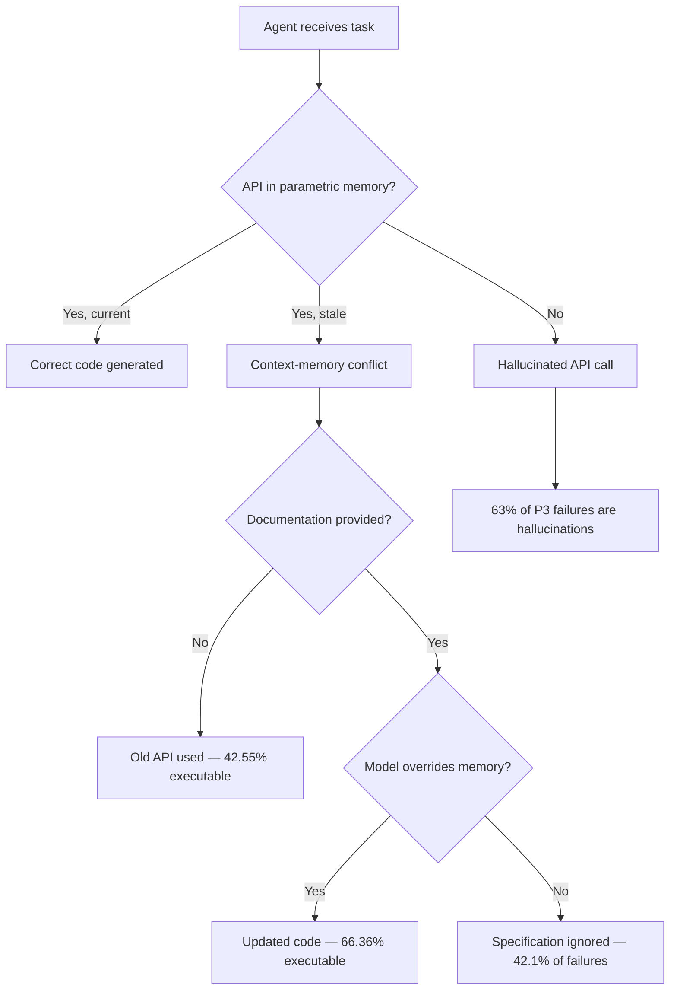
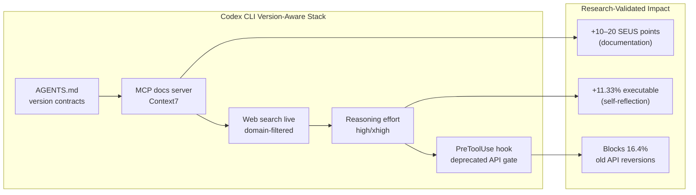

# API Version Blindness: What LibEvoBench and Context-Memory Conflicts Reveal About Temporal Knowledge Stratification — and How to Wire Version-Aware Documentation into Codex CLI


---

Your coding agent writes syntactically flawless code that calls an API deprecated three versions ago. The tests fail. The agent retries — with the same deprecated call. You have just experienced **API version blindness**, and two new benchmarks confirm it is not a fluke but a structural property of how large language models encode library knowledge.

## The Problem: Models Are Version-Oblivious

Cipollone et al.'s **LibEvoBench** (accepted at DL4Code, ICML 2026) systematically measures how code generation models handle library evolution across 29 versions of PyTorch, NumPy, and SciPy [^1]. The benchmark comprises roughly 125,000 evaluation samples spanning three complementary tasks — API Calling (29,667 samples), API Identification (39,665 samples), and Signature Recall (55,094 samples) — tracking over 16,000 APIs across versions.

The headline finding is damning: **providing an explicit version constraint yields zero measurable improvement**. When the authors added method documentation to prompts, every model gained 10–20 SEUS (Software Evolution Understanding Score) points. When they additionally specified the target library version, the score did not move [^1]. The version tag functions as a retrieval cue with no version-differentiated knowledge behind it.

Even the strongest models — GPT-5.4 (SEUS 86.0), GPT-5.5 (85.1), and Claude Sonnet 4.6 (81.0) — show a persistent 7–10 point accuracy gap between stable and evolving APIs [^1]. Mid-tier models such as Qwen3.5 35B drop below 86% retention when confronted with API changes. This is not a prompt-engineering problem; it is a **temporal knowledge stratification** problem baked into training data.

## Context-Memory Conflict Compounds the Damage

Ashik et al.'s complementary study, *When LLMs Lag Behind* (April 2026), drills into the mechanism behind these failures [^2]. Their benchmark covers 270 real-world API updates across eight Python libraries (NumPy, Pandas, scikit-learn, SciPy, JAX, Keras, TensorFlow, PyTorch), categorised into three patterns:

| Pattern | Count | Description |
|---------|-------|-------------|
| P1 — Deprecation | 45 | API removed or replaced |
| P2 — Modification | 128 | Parameters or behaviour changed |
| P3 — Addition | 97 | New API introduced |

Without documentation, the average executable rate across 11 models is just **42.55%** [^2]. Supplying full documentation lifts this to **66.36%** — a 56% relative improvement — confirming documentation as the single largest performance driver. Yet even with documentation, **context-memory conflict** persists: 42.1% of failures stem from the model completely ignoring the provided specification, and 16.4% from the model reverting to old API calls it has memorised [^2].

API modification (P2) proves most treacherous, achieving only 58.19% executable rate with documentation, because the model's parametric memory of the old signature actively conflicts with the new one [^2]. For new API additions (P3), 63% of failures involve the model hallucinating APIs that do not exist [^2].



## Why This Matters for Production Agent Workflows

A 7–10 point accuracy gap on library evolution might sound academic. In practice, it means your Codex CLI session generates code that pins `torch.nn.utils.clip_grad_norm` (deprecated since PyTorch 2.1 in favour of `clip_grad_norm_`) or calls `numpy.string_` (removed in NumPy 2.0). The agent's self-repair loop then burns tokens retrying with the same stale knowledge — exactly the pattern that triggers the rollout budget ceiling without producing working code.

The research makes clear that two interventions work and one does not:

- **Documentation injection works** — 10–20 SEUS points (LibEvoBench), +56% executable rate (Ashik et al.) [^1][^2]
- **Self-reflection works** — +11.33% executable rate when combined with chain-of-thought [^2]
- **Version tags alone do not work** — zero measurable gain [^1]

Codex CLI's configuration stack provides the machinery to operationalise the interventions that actually work.

## Defence Layer 1: Web Search for Currency

Codex CLI's `web_search` configuration is the first line of defence against stale parametric knowledge [^3]. The setting accepts three modes:

```toml
# ~/.codex/config.toml

# Default: pre-indexed results from OpenAI-maintained cache
web_search = "cached"

# Live fetches for maximum currency (default with --yolo)
web_search = "live"

# Disable entirely for air-gapped environments
web_search = "disabled"
```

For library-evolution-sensitive work, `web_search = "live"` ensures the agent can retrieve current API documentation during its reasoning loop. The advanced `tools.web_search` object form adds domain filtering and context size control [^4]:

```toml
[tools.web_search]
context_size = "high"
allowed_domains = ["pytorch.org", "numpy.org", "docs.scipy.org"]
```

This constrains search results to authoritative documentation sources, reducing prompt injection risk from arbitrary web content while maximising documentation quality — directly addressing the finding that documentation is the single largest performance driver [^2].

## Defence Layer 2: MCP Documentation Servers

Web search is reactive. For systematic coverage, wire a documentation MCP server into Codex CLI. **Context7**, the most widely adopted documentation MCP server in the ecosystem, indexes over 9,000 libraries and serves version-specific documentation through MCP [^5].

```toml
# .codex/config.toml (project-scoped)

[mcp_servers.context7]
command = "npx"
args = ["-y", "@context7/mcp-server"]
enabled = true
```

Once registered, the agent can query `mcp__context7__search_docs` to retrieve the current API surface for any pinned library version — exactly the documentation injection that LibEvoBench shows yields 10–20 SEUS points of improvement [^1].

For tighter control, restrict which MCP tools are available and require approval for documentation lookups that might inject unexpected context:

```toml
[mcp_servers.context7]
command = "npx"
args = ["-y", "@context7/mcp-server"]
enabled_tools = ["search_docs", "get_library_docs"]
default_tools_approval_mode = "unless-allow-listed"
```

## Defence Layer 3: AGENTS.md Version Contracts

The research shows that version tags fail when provided to the model as prompt text [^1]. But AGENTS.md constraints operate differently — they function as **behavioural contracts** enforced across the session, not one-shot prompt augmentations.

```markdown
<!-- AGENTS.md -->

## Library Version Constraints

This project targets:
- PyTorch >= 2.5.0 (use `torch.nn.utils.clip_grad_norm_` not `clip_grad_norm`)
- NumPy >= 2.0.0 (numpy.string_ removed; use numpy.bytes_)
- SciPy >= 1.14.0

Before using any library API:
1. Check the documentation MCP server for the current signature
2. Do NOT rely on memorised API signatures for libraries with pinned versions
3. If uncertain about an API's current status, use web search to verify

## Deprecated API Blocklist
- `numpy.string_` → use `numpy.bytes_`
- `numpy.unicode_` → use `numpy.str_`
- `torch.nn.utils.clip_grad_norm` → use `clip_grad_norm_` (with trailing underscore)
```

This approach addresses the 42.1% specification-ignoring failure mode by making version awareness a persistent session-level instruction rather than a single-turn prompt addition [^2].

## Defence Layer 4: PreToolUse Hooks for Version Verification

For teams that cannot tolerate stale API calls shipping, deterministic hooks provide a hard gate:

```toml
# .codex/config.toml

[[hooks.pre_tool_use]]
event = "pre_tool_use"
command = "python3 scripts/check-deprecated-apis.py"
timeout_ms = 5000
```

A verification script can parse the agent's proposed code changes and reject any file containing known deprecated API calls before they reach the filesystem. This is the deterministic complement to the probabilistic AGENTS.md constraints — it catches the 16.4% of cases where the model reverts to memorised old APIs despite being told not to [^2].

## Defence Layer 5: Model Reasoning for Self-Reflection

Ashik et al. found that self-reflection adds +9.00% executable rate on top of documentation, with the largest gains on API modifications (+16.8%) and additions (+17.5%) [^2]. Codex CLI's `model_reasoning_effort` configuration directly controls this:

```toml
# Higher reasoning effort for library-sensitive work
model_reasoning_effort = "high"

# Or per-profile for cost efficiency
[profiles.library-migration]
model_reasoning_effort = "xhigh"
model = "o4-mini"
```

The `xhigh` setting is particularly relevant for migration tasks where context-memory conflict is strongest. Combined with documentation injection, this addresses both the information gap (documentation) and the reasoning gap (self-reflection) identified by the research.

## Putting It Together: A Version-Aware Configuration

```toml
# .codex/config.toml — version-aware library work

model = "o4-mini"
model_reasoning_effort = "high"
web_search = "live"

[tools.web_search]
context_size = "high"
allowed_domains = ["pytorch.org", "numpy.org", "docs.scipy.org", "keras.io"]

[mcp_servers.context7]
command = "npx"
args = ["-y", "@context7/mcp-server"]
enabled_tools = ["search_docs", "get_library_docs"]

[features]
rollout_budget = 200000

[[hooks.pre_tool_use]]
event = "pre_tool_use"
command = "python3 scripts/check-deprecated-apis.py"
timeout_ms = 5000
```



## The Version Awareness Gap Is Structural

LibEvoBench establishes that temporal knowledge stratification is "a persistent, first-class capability gap, not an artefact of benchmark sensitivity or prompt framing, that neither scale nor training recency has yet proven sufficient to close" [^1]. This is not a problem future models will simply solve — the 125,000-sample benchmark shows even GPT-5.5 and Claude Sonnet 4.6 exhibit version-oblivious behaviour.

The practical implication is clear: if your Codex CLI workflow touches libraries that evolve faster than model training cycles — which is most libraries — you need an explicit documentation-injection pipeline. Web search, MCP documentation servers, AGENTS.md version contracts, and PreToolUse hooks form a layered defence that addresses each failure mode the research identifies: specification ignorance, old API reversion, and API hallucination.

The version tag your `pyproject.toml` pins means nothing to the model's parametric memory. The documentation your MCP server serves means everything.

---

## Citations

[^1]: Cipollone, D., Titov, S., Izadi, M., Bogomolov, E., & van Deursen, A. (2026). *LibEvoBench: Probing Temporal Knowledge Stratification in Code Generation Models*. arXiv:2606.25402. Accepted at DL4Code workshop, ICML 2026. [https://arxiv.org/abs/2606.25402](https://arxiv.org/abs/2606.25402)

[^2]: Ashik, A.N. et al. (2026). *When LLMs Lag Behind: Knowledge Conflicts from Evolving APIs in Code Generation*. arXiv:2604.09515. [https://arxiv.org/abs/2604.09515](https://arxiv.org/abs/2604.09515)

[^3]: OpenAI. (2026). *Config basics – Codex*. OpenAI Developers. [https://developers.openai.com/codex/config-basic](https://developers.openai.com/codex/config-basic)

[^4]: OpenAI. (2026). *Configuration Reference – Codex*. OpenAI Developers. [https://developers.openai.com/codex/config-reference](https://developers.openai.com/codex/config-reference)

[^5]: Context7 MCP Server. (2026). *Documentation MCP Servers for Codex CLI*. [https://developers.openai.com/codex/mcp](https://developers.openai.com/codex/mcp)
