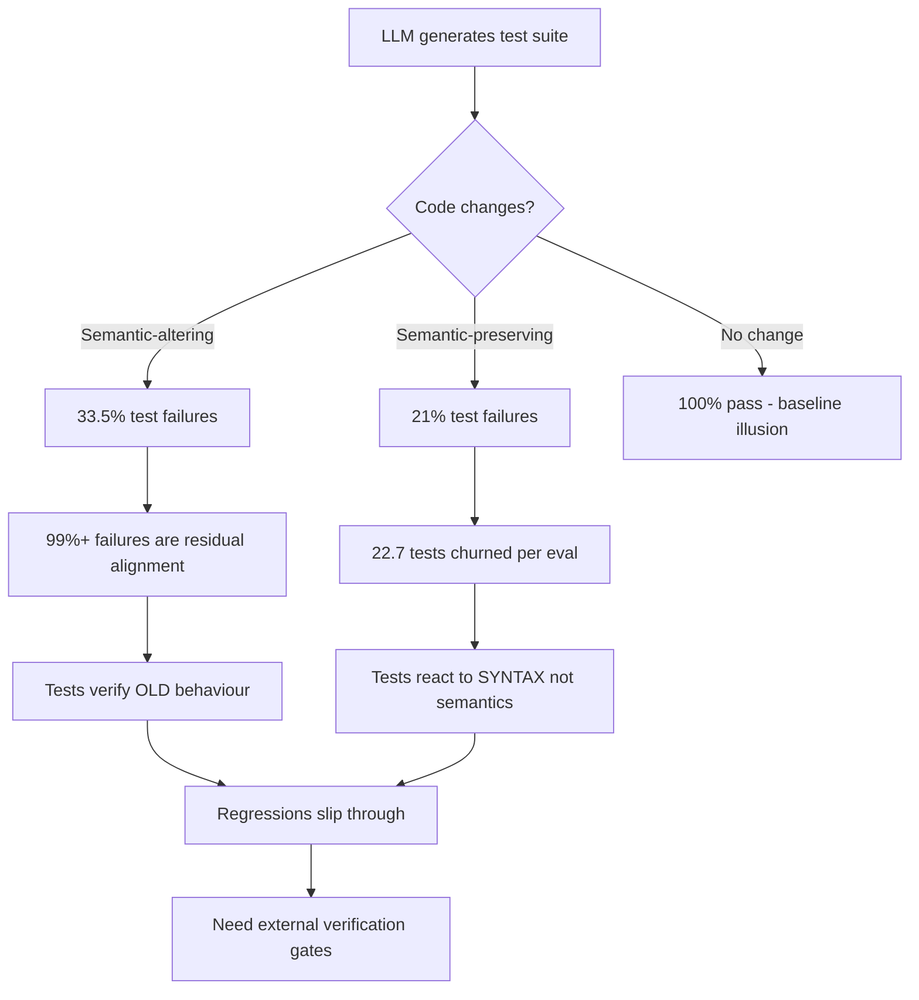
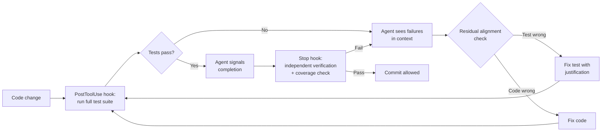

# Brittle Test Suites: What 22,000 Program Variants Reveal About LLM-Generated Tests Under Software Evolution — and How Codex CLI's Hook and Verification Stack Keeps Them Honest


---

LLM-generated tests look reassuringly green on first run. The coverage numbers are respectable, the assertions read well, and the suite passes. Then you change one line of production code and discover that a third of those tests either break for the wrong reasons or silently ignore the behavioural shift they were supposed to catch.

A large-scale empirical study published in March 2026 — Haroon et al., "Evaluating LLM-Based Test Generation Under Software Evolution" — quantifies this fragility across eight models and 22,374 program variants [^1]. The findings are uncomfortable: LLM-generated tests are surface-pattern detectors, not semantic reasoners. They react to lexical changes rather than behavioural ones, and they carry residual alignment to the original program even when the program has materially changed.

This article unpacks the research, maps it to a complementary study on LLM-generated test flakiness in database systems [^2], and shows how Codex CLI's hook architecture, Stop-hook verification gates, and AGENTS.md constraints can be configured to detect and contain these failure modes before they reach your main branch.

## The Baseline Illusion

Haroon et al. evaluated eight LLMs — GPT-OSS (20B), Nemotron-3-Nano (30B), GPT-5, GPT-5.2, Claude 4.5 Haiku, Claude 4.6 Sonnet, Gemini 2.5-Flash, and Gemini 3.1-Pro — on an initial pool of 5,723 programs (3,231 Java, 2,492 Python), filtered down to 100 fully passing projects per model [^1].

On the original, unmodified programs, the numbers are strong:

| Metric | Baseline |
|--------|----------|
| Line coverage | 79.3% |
| Branch coverage | 76.1% |
| Pass rate | 100% |
| Average tests per program | 13.1–13.2 |

These are the numbers that make teams comfortable delegating test authorship to an LLM. The problem is what happens next.

## Semantic-Altering Changes Expose Shallow Reasoning

The researchers applied mutation-driven semantic-altering changes (SACs) — boundary shifts, boolean logic inversions, arithmetic operator swaps, argument reordering, and variable role rebinding — averaging just 1.0 line modified per program [^1].

The results:

| Metric | Baseline | Under SAC | Drop |
|--------|----------|-----------|------|
| Pass rate | 100% | 66.5% | −33.5 pp |
| Line coverage | 79.3% | 67.4% | −11.9 pp |
| Branch coverage | 76.1% | 60.6% | −15.5 pp |

A single-line semantic change collapses a third of the test suite. Worse, more than 99% of the failing SAC tests still pass on the original program while executing the modified region [^1]. The tests are not testing the new behaviour — they are carrying expectations from the old program baked in during generation. The paper calls this *residual alignment*: the model's weights encode the original program's behaviour so strongly that regenerated tests inherit those expectations even when the prompt includes the updated code.

## Syntax Changes Without Semantic Impact Still Break Tests

Semantic-preserving changes (SPCs) — void loops, redundant else blocks, equivalent comparisons, unused parameters, variable renaming, and misleading comments — should not cause test failures. They do.

| Metric | Baseline | Under SPC | Drop |
|--------|----------|-----------|------|
| Pass rate | 100% | 78.9% | −21.0 pp |
| Line coverage | 79.3% | 73.7% | −5.6 pp |
| Branch coverage | 76.1% | 69.2% | −6.9 pp |

The test churn numbers are telling: under SPCs, the average evaluation produces 22.7 test-name changes with only an 18.1% match rate against the baseline suite [^1]. The model is not recognising that the program is semantically identical — it is reacting to the lexical surface, generating substantially different tests for structurally equivalent code.

## Model Variance Is Extreme

Not all models degrade equally:

| Model | SAC pass rate | SPC pass rate |
|-------|--------------|--------------|
| GPT-5 Mini | 82.9% | 90.9% |
| GPT-5.2 | 74.1% | 85.3% |
| Claude 4.6 Sonnet | 68.2% | 80.1% |
| Nemotron-3-Nano | 40.7% | 55.9% |

GPT-5 Mini maintained the highest resilience, while smaller models showed catastrophic degradation [^1]. This has direct implications for Codex CLI's model selection: if you are using a smaller or cheaper model for test generation subagents, you are amplifying exactly the fragility this research identifies.

## Flakiness Compounds the Problem

Berndt et al. independently confirmed that LLM-generated tests exhibit higher flakiness rates than human-written suites, studying four relational database systems (SAP HANA, DuckDB, MySQL, SQLite) with GPT-4o and Mistral-Large-Instruct [^2]. The dominant root cause — 72 of 115 flaky tests — was reliance on unguaranteed ordering in result sets [^2]. This is precisely the kind of implicit assumption that residual alignment produces: the model has seen ordered results in training data and bakes that expectation into assertions, even when the specification guarantees no ordering.



## Codex CLI Defence: The Verification Stack

The research points to a clear architectural response: never trust LLM-generated tests in isolation. Use them as a fast first pass, but gate every commit behind independent verification. Codex CLI's hook system provides three layers for this.

### Layer 1: AGENTS.md — Behavioural Constraints

The first defence is declarative. In your project's `AGENTS.md`, constrain how the agent interacts with tests:

```markdown
## Test Generation Rules

- NEVER modify existing test files unless explicitly asked
- After generating new tests, run the FULL existing test suite — not just the new tests
- When a test fails after a code change, determine whether the test or the code is wrong before fixing either
- Always run `npm test` (or project equivalent) after modifying any source file
- Do not delete or skip failing tests to make a suite pass
```

These are probabilistic constraints — the model may occasionally violate them — but they set a strong prior [^3]. The key instruction is the third: without it, models default to "fix the test to match the code," which is exactly the residual-alignment failure mode the research identifies.

### Layer 2: PostToolUse Hooks — Deterministic Test Gates

After every `apply_patch` that modifies source code, run the test suite automatically and inject the result into the agent's context:

```toml
[[hooks.PostToolUse]]
matcher = "apply_patch"

[[hooks.PostToolUse.hooks]]
type = "command"
command = """
#!/bin/bash
CHANGED=$(git diff --name-only HEAD 2>/dev/null | grep -v '__tests__\|test_\|_test\.\|\.test\.' || true)
if [ -n "$CHANGED" ]; then
  RESULT=$(npm test 2>&1) || true
  PASS_COUNT=$(echo "$RESULT" | grep -oP '\\d+ passing' || echo "0 passing")
  FAIL_COUNT=$(echo "$RESULT" | grep -oP '\\d+ failing' || echo "0 failing")
  echo "{ \"continue\": true, \"systemMessage\": \"Test gate: $PASS_COUNT, $FAIL_COUNT. Review failures before proceeding.\" }"
else
  echo "{ \"continue\": true }"
fi
"""
timeout = 120
statusMessage = "Running test verification gate"
```

This is deterministic — the hook runs regardless of what the model decides [^4]. The `systemMessage` injects test results directly into the conversation context, forcing the model to acknowledge failures rather than silently moving on.

### Layer 3: Stop Hook — Pre-Commit Verification

The Stop hook fires when the agent considers its turn complete. Use it to run a final comprehensive check:

```toml
[[hooks.Stop]]
matcher = ".*"

[[hooks.Stop.hooks]]
type = "command"
command = """
#!/bin/bash
RESULT=$(npm test 2>&1)
EXIT=$?
if [ $EXIT -ne 0 ]; then
  echo '{ "decision": "block", "reason": "Test suite has failures. Fix all tests before completing." }'
else
  COVERAGE=$(npm run coverage --silent 2>&1 | grep -oP 'Branches\\s*:\\s*\\K[\\d.]+' || echo "0")
  if (( $(echo "$COVERAGE < 70" | bc -l) )); then
    echo "{ \"decision\": \"block\", \"reason\": \"Branch coverage is ${COVERAGE}% — below 70% threshold. Add more tests.\" }"
  else
    echo '{ "decision": "allow" }'
  fi
fi
"""
timeout = 300
statusMessage = "Final verification gate"
```

When the Stop hook returns `"decision": "block"`, Codex CLI forces the agent to continue working rather than declaring completion [^4]. This directly counters the baseline illusion: even if the model believes all tests pass, the hook independently verifies.

### Layer 4: PreToolUse Hook — Test Deletion Guard

The research shows models churn tests aggressively — 22.7 name changes per SPC evaluation. Prevent the model from silently deleting or rewriting tests that inconveniently fail:

```toml
[[hooks.PreToolUse]]
matcher = "apply_patch"

[[hooks.PreToolUse.hooks]]
type = "command"
command = """
#!/bin/bash
# Read the patch from stdin and check for test file deletions
INPUT=$(cat)
PATCH=$(echo "$INPUT" | python3 -c "import sys,json; print(json.load(sys.stdin).get('input',{}).get('patch',''))" 2>/dev/null)
if echo "$PATCH" | grep -qE '^--- a/.*(test_|_test\.|\.test\.|__tests__)'; then
  if echo "$PATCH" | grep -qE '^\-.*assert|^\-.*expect|^\-.*it\(|^\-.*test\('; then
    echo '{"hookSpecificOutput":{"hookEventName":"PreToolUse","permissionDecision":"deny","permissionDecisionReason":"Blocked: removing assertions from test files. Justify test changes before modifying tests."}}'
    exit 0
  fi
fi
echo '{"continue": true}'
"""
timeout = 15
statusMessage = "Checking test integrity"
```

This hook intercepts patches that delete assertions from test files and blocks them with an explanation [^4]. The model must then justify the change in conversation before proceeding — creating a human-readable audit trail.

## Putting It Together: A Regression-Aware Workflow



The critical insight from Haroon et al. is that the model cannot be trusted to distinguish between "test is wrong" and "code is wrong" — it defaults to residual alignment [^1]. The AGENTS.md instruction forces deliberation; the hooks enforce verification; the Stop gate prevents premature completion.

## Configuration for Model Selection

Given the extreme variance between models (GPT-5 Mini at 82.9% SAC resilience versus Nemotron-3-Nano at 40.7%), configure your Codex CLI profiles to use stronger models for test-related work:

```toml
# In .codex/config.toml — use stronger model for test generation
[profiles.test-gen]
model = "o4-mini"
model_reasoning_effort = "high"

[profiles.test-gen.features]
rollout_budget = 50000
```

When delegating test generation to subagents, set `model_reasoning_effort` to `high` — the research shows that reasoning depth correlates directly with semantic resilience rather than surface-pattern matching [^1] [^5].

## Key Takeaways

1. **The baseline illusion is real.** 79% coverage and 100% pass rate on unmodified code tells you nothing about test quality under evolution.
2. **Residual alignment is the dominant failure mode.** 99%+ of SAC test failures stem from inherited expectations about the original program, not genuine regression detection.
3. **Syntax sensitivity produces phantom churn.** Semantically identical code changes trigger 22.7 test rewrites per evaluation — noise that obscures real regressions.
4. **Model selection matters enormously.** A 42-percentage-point spread between best and worst models on SAC resilience means your choice of test-generation model is a first-order reliability decision.
5. **Hook-based verification is non-negotiable.** PostToolUse test gates, Stop-hook coverage checks, and PreToolUse test-deletion guards provide the deterministic layer that probabilistic test generation cannot.

The tests your LLM writes are a starting point, not a safety net. Treat them accordingly.

## Citations

[^1]: Haroon, S. et al. (2026). "Evaluating LLM-Based Test Generation Under Software Evolution." arXiv:2603.23443. Accepted at FSE 2026. [https://arxiv.org/abs/2603.23443](https://arxiv.org/abs/2603.23443)

[^2]: Berndt, A. et al. (2026). "On the Flakiness of LLM-Generated Tests for Industrial and Open-Source Database Management Systems." arXiv:2601.08998. ICSE-SEIP 2026. [https://arxiv.org/abs/2601.08998](https://arxiv.org/abs/2601.08998)

[^3]: OpenAI. (2026). "AGENTS.md Guide — Codex CLI." OpenAI Developers. [https://developers.openai.com/codex/guides/agents-md](https://developers.openai.com/codex/guides/agents-md)

[^4]: OpenAI. (2026). "Hooks — Codex CLI." OpenAI Developers. [https://developers.openai.com/codex/hooks](https://developers.openai.com/codex/hooks)

[^5]: OpenAI. (2026). "Features — Codex CLI." OpenAI Developers. [https://developers.openai.com/codex/cli/features](https://developers.openai.com/codex/cli/features)
