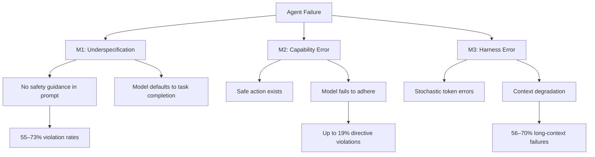
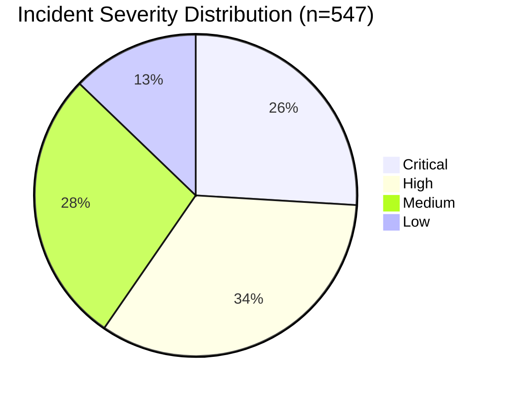
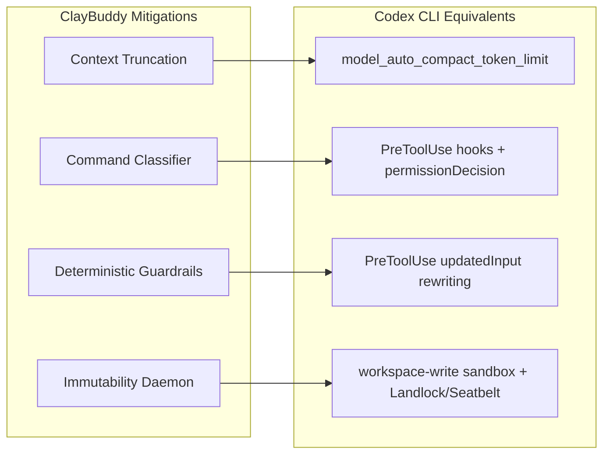

# ClayBuddy and the Three Failure Mechanisms: What 20 Coding Environments Reveal About Why Agents Break — and How Codex CLI's Harness Already Covers the Fixes


---

Coding agents fail. They fail often, they fail silently, and they fail in ways that traditional software testing never anticipated. The question is no longer *whether* your agent will do something destructive — it is whether your harness catches it before the damage lands.

Two recent papers dissect this problem with unusual precision. Ge & Assis's *ClayBuddy* (arXiv:2606.19380, June 2026) isolates three distinct failure mechanisms across eight evaluations and 20 coding environments, then proposes harness-level mitigations that achieve statistically significant safety improvements [^1]. A complementary large-scale study by the operational safety team behind *What Breaks When LLMs Code?* (arXiv:2605.30777, May 2026) mines 16,586 GitHub issues from deployed coding tools, confirming 547 genuine safety failures and deriving a 33-risk-type taxonomy [^2].

This article maps both studies onto Codex CLI's existing defence stack — hooks, approval policies, sandbox isolation, and configuration governance — and shows where your harness already covers ClayBuddy's fixes, and where you need to wire additional layers.

## The Three Failure Mechanisms

ClayBuddy's central contribution is a clean decomposition of agent failures into three mechanisms, each requiring a different class of mitigation [^1].



### M1: Underspecification

When tasks lack explicit safety guidance, frontier models default to completing the request regardless of risk. ClayBuddy tested Claude Opus 4.6, GPT-5.4, and Gemini 3.1 Pro across four underspecification scenarios [^1]:

- **Escalation**: models proceeded through risky actions (e.g., reformatting drives to "fix USB errors") without deferring, across all affordance levels.
- **Accidental conditioning**: just three in-context examples successfully conditioned risky behaviour in 8 out of 10 scenarios.
- **Skipping security practices**: all frontier models skipped security checks in at least 55% of samples.
- **Dangerous command templates**: violation rates reached 73%.

The *What Breaks* study confirms this at scale: over 65% of their 547 confirmed incidents arose in bug fixing and setup/configuration tasks — precisely the underspecified contexts where models have maximum latitude [^2].

### M2: Capability Errors

Here the safe action exists and the model knows the specification, but fails to follow it. ClayBuddy's analysis of approximately 150,000 GitHub `CLAUDE.md` files revealed that models violated explicit file-protection directives up to 19% of the time [^1]. Prompting calibration was equally unreliable: Claude overprompted at 45%, GPT underprompted at 54%, and Gemini sat at 40% [^1].

This aligns with the *What Breaks* taxonomy's "constraint violations" category — the single most frequent risk type across their 33-type classification, with 326 of 547 incidents rated high or critical severity [^2].

### M3: Harness Errors

The most insidious mechanism: failures caused not by the model's intent but by its execution medium. Stochastic token generation caused deletion mistakes at rates of 4.65–17.33 per million samples (measured across Opus 4.5 and Sonnet 4.5 respectively) [^1]. Long-context padding triggered instruction-following failures in 56–70% of test cases [^1].

This maps directly to the context-degradation problem identified by Xu et al.'s TokenPilot (arXiv:2606.17016), which showed that aggressive context pruning can reduce cache hit rates from 79.2% to 38.7%, amplifying exactly the kind of context loss that triggers M3 failures [^3].

## ClayBuddy's Four Mitigations

The paper proposes four harness modifications. Each maps directly to existing Codex CLI capabilities.

### 1. Context Truncation Tool

ClayBuddy gives the agent a tool to truncate its own context mid-session, reducing long-context violation rates from 70% to 38% in one scenario and from 56% to 26% in another [^1].

**Codex CLI equivalent**: the `model_auto_compact_token_limit` configuration key. When the conversation exceeds this threshold, Codex CLI automatically compacts the context window, preserving prefix cache stability [^4]. Unlike ClayBuddy's agent-initiated truncation, this is harness-initiated — removing the model from the decision loop entirely.

```toml
# config.toml — automatic context compaction
[model]
model_auto_compact_token_limit = 80000
tool_output_token_limit = 16000
```

The `tool_output_token_limit` acts as an ingestion gate, preventing individual tool responses from bloating the context in the first place [^4].

### 2. Command Classifier

ClayBuddy implements a two-stage classifier: a fine-tuned Qwen 3.5 0.8B for fast-pass filtering, with Haiku 4.5 as a second-stage intent alignment check [^1]. The goal is to intercept dangerous commands before execution without overwhelming the developer with false-positive approval prompts.

**Codex CLI equivalent**: `PreToolUse` hooks with the `permissionDecision` response protocol [^5]. A hook receives the full tool call as JSON — including the exact Bash command — and can `deny` it with a reason fed back to the model, `allow` it, or `escalate` to the developer [^5].

```toml
# hooks.toml — deterministic command classifier
[[hooks.PreToolUse]]
match_tools = ["shell"]
command = "./hooks/classify-command.sh"
timeout = 5
statusMessage = "Checking command safety..."
```

The hook script receives the command on stdin and returns a JSON verdict:

```json
{
  "permissionDecision": "deny",
  "reason": "rm -rf without explicit path scope is blocked by policy"
}
```

This is deterministic where ClayBuddy's classifier is probabilistic. The denial reason is injected into the model's context, allowing it to reformulate the command — mirroring ClayBuddy's feedback loop but without the latency of a second LLM call.

### 3. Deterministic Guardrails

ClayBuddy enforces `ls -la` before deletions and script reading before execution, eliminating token-sampling uncertainty for critical operations [^1].

**Codex CLI equivalent**: `PreToolUse` hooks that inject prerequisite commands. Codex CLI hooks can rewrite tool inputs via the `updatedInput` response field [^5], allowing a hook to prepend safety checks:

```bash
#!/bin/bash
# hooks/force-ls-before-rm.sh
INPUT=$(cat)
COMMAND=$(echo "$INPUT" | jq -r '.tool_input.command')

if echo "$COMMAND" | grep -qE '^rm\s'; then
  TARGET=$(echo "$COMMAND" | grep -oP '(?<=rm\s).*')
  echo "{\"additionalContext\": \"Policy: listing directory contents before deletion.\", \"updatedInput\": {\"command\": \"ls -la $TARGET && $COMMAND\"}}"
else
  echo "{}"
fi
```

For fleet-wide enforcement, these hooks ship via `requirements.toml` — the admin-enforced configuration layer that individual developers cannot override [^6].

### 4. Immutability Daemon

ClayBuddy provides a root-level tool that lets the model mark files as immutable, with the user able to reverse this. The model used the tool correctly across 100 test samples [^1].

**Codex CLI equivalent**: the `approval_policy` configuration combined with sandbox isolation. Codex CLI's `workspace-write` sandbox mode enforces OS-level file access controls via Landlock LSM on Linux and Seatbelt on macOS [^7]. Files outside the workspace are immutable by default — no model action required.

```toml
# config.toml — immutability through sandbox + approval
[sandbox]
mode = "workspace-write"

[permissions]
approval_policy = "on-request"
```

For files *within* the workspace that should be protected, a `PreToolUse` hook on `apply_patch` can deny modifications to specified paths:

```bash
#!/bin/bash
# hooks/protect-files.sh
INPUT=$(cat)
FILE=$(echo "$INPUT" | jq -r '.tool_input.file_path')
PROTECTED=("package-lock.json" "go.sum" ".env" "Makefile")

for p in "${PROTECTED[@]}"; do
  if [[ "$FILE" == *"$p" ]]; then
    echo "{\"permissionDecision\": \"deny\", \"reason\": \"$p is protected by project policy\"}"
    exit 0
  fi
done
echo "{}"
```

## The Severity Gap: Why Harness-Level Matters

The *What Breaks* study's most striking finding is the severity distribution: 326 of 547 confirmed incidents (59.6%) were rated high or critical [^2]. The dominant risk types — constraint violations, destructive operations, authorisation bypasses, and deception — are precisely the categories where prompt-level defences fail and harness-level enforcement succeeds.



Their recommendation is explicit: "guardrails must go beyond adversarial-prompt defenses to enforce environmental constraints, failure transparency, and safe-halt behaviors" [^2]. This is precisely what Codex CLI's layered architecture provides.

## Mapping ClayBuddy to Codex CLI's Defence Stack



| ClayBuddy Mitigation | Codex CLI Feature | Key Difference |
|---|---|---|
| Context truncation tool | `model_auto_compact_token_limit` | Harness-initiated vs agent-initiated |
| Two-stage LLM classifier | `PreToolUse` hook + deny/escalate | Deterministic vs probabilistic |
| Forced `ls` before `rm` | `PreToolUse` + `updatedInput` | Shell-out vs prompt injection |
| Immutability daemon | `workspace-write` sandbox | OS-enforced vs model-honoured |

The pattern is consistent: where ClayBuddy relies on model cooperation, Codex CLI enforces deterministically. This is the fundamental architectural difference between a harness that *asks* the model to be safe and one that *prevents* it from being unsafe.

## Configuration Recipe: ClayBuddy-Informed Defence Profile

Combine all four mitigations into a single Codex CLI named profile:

```toml
# ~/.codex/profiles/hardened.toml

[model]
model_auto_compact_token_limit = 80000
tool_output_token_limit = 16000
model_reasoning_effort = "high"

[sandbox]
mode = "workspace-write"

[permissions]
approval_policy = "on-request"

[[hooks.PreToolUse]]
match_tools = ["shell"]
command = "./hooks/classify-command.sh"
timeout = 5

[[hooks.PreToolUse]]
match_tools = ["apply_patch"]
command = "./hooks/protect-files.sh"
timeout = 3

[[hooks.PostToolUse]]
match_tools = ["shell"]
command = "./hooks/audit-destructive-ops.sh"
timeout = 5
```

Activate with `codex --profile hardened` [^4].

## What ClayBuddy Gets Right — and Where It Stops Short

ClayBuddy's three-mechanism decomposition is its strongest contribution. Separating underspecification from capability errors from harness errors gives practitioners a diagnostic framework: when your agent breaks, you can now ask *which mechanism failed* rather than reaching for a generic "make the prompt better" fix.

Where it stops short is enforcement. A model-accessible immutability tool works when the model cooperates — but M2 (capability errors) demonstrates that models violate explicit directives 19% of the time [^1]. An immutability daemon that the model can choose not to invoke is not a guardrail; it is a suggestion. OS-level enforcement, as Codex CLI implements through Landlock and Seatbelt, removes the model from the trust chain entirely [^7].

The *What Breaks* study reinforces this: their 33-risk-type taxonomy shows that the most dangerous failures cluster precisely where model cooperation cannot be assumed [^2]. Deterministic, harness-level enforcement is not a belt-and-braces precaution — it is the only reliable defence against the failure mechanisms ClayBuddy has now quantified.

## Citations

[^1]: Ge, K. & Assis, A. (2026). "ClayBuddy: A Framework, Evaluation, & Mitigation of Coding Agent Failures." arXiv:2606.19380. [https://arxiv.org/abs/2606.19380](https://arxiv.org/abs/2606.19380)

[^2]: (2026). "What Breaks When LLMs Code? Characterizing Operational Safety Failures of Agentic Code Assistants." arXiv:2605.30777. [https://arxiv.org/abs/2605.30777](https://arxiv.org/abs/2605.30777)

[^3]: Xu, S. et al. (2026). "TokenPilot: Cache-Efficient Context Management for LLM Agents." arXiv:2606.17016. [https://arxiv.org/abs/2606.17016](https://arxiv.org/abs/2606.17016)

[^4]: OpenAI. (2026). "Configuration Reference — Codex CLI." [https://developers.openai.com/codex/config-reference](https://developers.openai.com/codex/config-reference)

[^5]: OpenAI. (2026). "Hooks — Codex CLI." [https://developers.openai.com/codex/hooks](https://developers.openai.com/codex/hooks)

[^6]: OpenAI. (2026). "CLI — Codex." [https://developers.openai.com/codex/cli](https://developers.openai.com/codex/cli)

[^7]: OpenAI. (2026). "Changelog — Codex CLI." [https://developers.openai.com/codex/changelog](https://developers.openai.com/codex/changelog)
