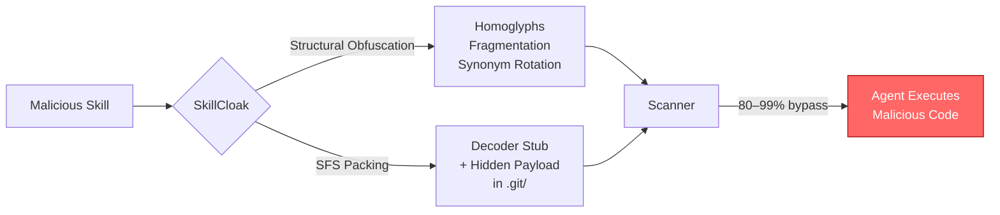
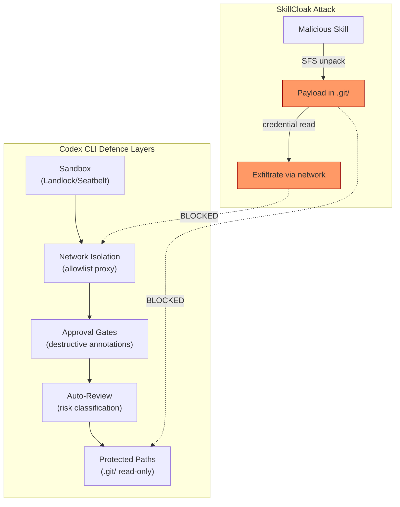

# Cloak and Detonate: What SkillCloak's 90 Per Cent Scanner Evasion Rate Reveals About Agent Skill Malware — and How Codex CLI's Runtime Defence Layers Close the Gap


---

## The Threat No One Scanned For

Coding agents run third-party skills with full agent privileges. A malicious skill can steal credentials, exfiltrate source code, or plant backdoors — and every static scanner you trust to catch it can be fooled.

That is the headline finding from Ji et al.'s *Cloak and Detonate* (arXiv:2607.02357, July 2026)[^1], a rigorous adversarial study that tested 1,613 real-world malicious skills from ClawHub against eight production scanners. Their SkillCloak evasion framework defeated every one. Their proposed defence, SKILLDETONATE, shifts detection from appearance to behaviour — and the approach maps cleanly onto Codex CLI's existing runtime security stack.

---

## How Agent Skills Become an Attack Surface

Agent skills are small add-on packages — shell scripts, Python modules, YAML-declared tool wrappers — loaded by coding agents to extend their capabilities. In Codex CLI, skills are configured as MCP servers in `~/.codex/config.toml` or installed via the plugin marketplace[^2]. In Claude Code, custom slash commands serve an equivalent role.

The supply-chain risk mirrors npm or PyPI: a developer installs a skill published by a stranger, and that skill executes with whatever privileges the host agent grants. Unlike traditional package registries, skill marketplaces are newer, less scrutinised, and lack the graduated trust signals (download counts, maintainer history, vulnerability databases) that make npm's ecosystem at least partially navigable[^3].

Ji et al. catalogue three attack classes that malicious skills commonly implement[^1]:

1. **Credential theft** — reading environment variables, SSH keys, cloud tokens, and `.env` files
2. **Source code exfiltration** — streaming repository contents to attacker-controlled endpoints
3. **Backdoor installation** — injecting persistent reverse shells or trojanised dependencies

---

## SkillCloak: Two Evasion Strategies That Break Every Scanner

The paper's core contribution is SkillCloak, a payload-preserving evasion framework with two complementary strategies.

### Structural Obfuscation

Lightweight rewriting that changes a skill's appearance without altering its semantics:

- **Homoglyph substitution** — replacing ASCII characters with visually identical Unicode lookalikes from Cyrillic, Greek, or mathematical symbol blocks. A scanner pattern matching `curl` will miss `сurl` (Cyrillic с).
- **Command fragmentation** — splitting shell commands across newlines, heredocs, or variable concatenation to break pattern-matching rules.
- **Synonym rotation** — swapping flagged API calls for equivalent alternatives (`wget` for `curl`, `nc` for `ncat`).

Structural obfuscation alone cleared over 80 per cent of tested scanners and reached 96 per cent against one hybrid scanner[^1][^4].

### Self-Extracting Skill (SFS) Packing

The heavier evasion: the entire malicious payload is moved into a directory the scanner skips — `.git/`, `.cache/`, or a dotfile path — behind a harmless-looking decoder stub. At install time, the scanner sees only the stub. At runtime, the agent executes the stub, which unpacks and runs the real payload[^4].

SFS packing bypassed every tested scanner at over 90 per cent effectiveness, exceeding 99 per cent against most[^1].



### Why Static Scanning Fails

The fundamental problem is that static scanners — whether regex-based, AST-walking, or LLM-as-judge — evaluate what a skill *looks like*, not what it *does*. SkillCloak proves that appearance and behaviour can be fully decoupled. The paper tested against eight production scanners, including Cisco's scanner (the strongest performer at 99 per cent pre-cloaking detection), which dropped to approximately 10 per cent detection after cloaking[^4].

Crucially, cloaked skills still functioned correctly under both Claude Code and Codex CLI with no statistically detectable drop in task success or execution-path similarity[^1].

---

## SKILLDETONATE: Behaviour-Centric Runtime Detection

Ji et al. propose SKILLDETONATE as the answer: a sandbox-based runtime auditor that watches what a skill actually does at the OS boundary rather than what it looks like in source.

### How It Works

SKILLDETONATE combines two techniques:

1. **On-demand closure lift** — the skill is executed in an instrumented sandbox, and its runtime instruction trace is captured, revealing the true behaviour regardless of source-level obfuscation.
2. **Marker-based taint analysis** — sensitive data (credentials, source files, environment variables) is tagged with markers. The system then tracks whether those markers flow across security boundaries: into network egress, into files outside the workspace, or into spawned processes[^1].

### Detection Performance

| Metric | Score |
|---|---|
| Attack detection (controlled) | 97% |
| False-positive rate | 2% |
| Real-world malicious skill detection | 87% |
| Time per skill | ~2 minutes |

The 2-minute scan time is significantly slower than static scanning (seconds), but given that skill installation is a one-time event per project, the trade-off is acceptable for high-value codebases[^1].

---

## How Codex CLI's Defence Stack Already Covers the Gap

Codex CLI does not yet ship a SKILLDETONATE-equivalent runtime auditor. But its layered security architecture already provides four of the five defence mechanisms that the paper implicitly recommends.

### 1. OS-Enforced Sandbox Isolation

Codex CLI's default `workspace-write` sandbox uses Landlock LSM and seccomp-BPF on Linux, Seatbelt on macOS, and restricted tokens on Windows[^2]. Network access is off by default. Even if a malicious skill unpacks and executes, it cannot:

- Read files outside the workspace (Landlock path restrictions)
- Open network connections (network disabled by default)
- Escalate privileges (seccomp-BPF syscall filtering)

```toml
# ~/.codex/config.toml — default secure posture
[sandbox]
mode = "workspace-write"   # OS-enforced file restrictions

[network]
enabled = false            # no egress by default
```

This is the single most effective control against all three attack classes (credential theft, exfiltration, backdoors), because it operates below the agent's privilege boundary[^5].

### 2. Domain-Level Network Allowlisting

When network access is required, the `network_proxy` configuration constrains outbound traffic to an explicit allowlist:

```toml
[network_proxy]
allow = ["api.github.com", "registry.npmjs.org"]
deny  = ["*"]    # deny rules override allow rules
```

DNS rebinding protections validate hostname resolution, preventing attackers from using DNS tricks to route traffic to unexpected destinations[^5]. A skill attempting to exfiltrate data to `evil.example.com` would be blocked even if it successfully unpacked from an SFS stub.

### 3. Destructive Tool Annotations and Approval Gates

MCP tools that advertise destructive annotations always require user approval, regardless of the broader approval policy[^5]. This means a malicious skill declaring `rm -rf` or `curl --upload-file` in its tool manifest would trigger an approval prompt even in permissive configurations.

The graduated approval policy adds further granularity:

```toml
[approval]
policy = "on-request"      # interactive approval for escalations

[approval.granular]
sandbox = true             # approve sandbox breaches
mcp = true                 # approve MCP tool calls
skills = true              # approve skill-script execution
```

### 4. Auto-Review Risk Classification

Codex CLI's optional `auto_review` feature evaluates eligible requests for data exfiltration, credential probing, and destructive actions before execution[^5]. The system assigns risk levels and can:

- **Deny** critical-risk actions automatically
- **Require user authorisation** for high-risk approvals
- **Allow** low-risk operations to proceed

This provides a behavioural check that partially mirrors SKILLDETONATE's taint analysis, albeit at a higher abstraction level.

### 5. Protected Paths

Even in `workspace-write` mode, Codex CLI enforces read-only protection on sensitive directories:

- `.git/` — the exact hiding spot SkillCloak's SFS packing targets
- `.agents/` and `.codex/` configuration directories[^5]

A self-extracting payload hidden in `.git/` would be unable to write its unpacked components back into those protected paths during execution.



---

## What's Still Missing: The Runtime Audit Gap

The paper exposes a genuine gap: Codex CLI's defences are *preventive* (block the action) rather than *detective* (observe and classify behaviour). A sufficiently creative attacker who finds a way within the sandbox boundary — say, poisoning a build artefact that a downstream process later executes outside the sandbox — would not be caught by current controls.

Three additions would close the gap:

1. **Taint-tracked skill execution** — tag sensitive files and environment variables, then monitor whether any skill operation causes them to flow to unexpected sinks. This is SKILLDETONATE's core insight[^1].
2. **Pre-install runtime probing** — execute skills in an ephemeral sandbox before adding them to the project, capturing their syscall and network profiles. A ~2-minute overhead per skill installation is negligible.
3. **Managed MCP server governance** — enterprise `requirements.toml` already supports MCP server allowlists[^6]. Extending this to require cryptographic attestation of skill contents would prevent SFS packing from substituting payloads post-scan.

---

## A Hardened Configuration for Skill-Heavy Projects

For teams that rely heavily on third-party skills and MCP servers, the following configuration combines every available Codex CLI control:

```toml
# ~/.codex/config.toml — skill-security hardened profile

[sandbox]
mode = "workspace-write"

[network]
enabled = true

[network_proxy]
allow = ["api.github.com", "registry.npmjs.org"]
deny  = ["*"]

[approval]
policy = "on-request"

[approval.granular]
sandbox = true
mcp = true
skills = true
permissions = true

[auto_review]
enabled = true

[tools]
restrict_to_allowed_sources = true
```

This ensures every skill execution requires explicit approval, network egress is limited to known-good domains, and auto-review provides a behavioural check before any high-risk action proceeds.

---

## Key Takeaways

- **Static skill scanning is broken.** SkillCloak's SFS packing defeats over 90 per cent of production scanners. Do not rely on install-time scanning alone[^1].
- **Behaviour beats appearance.** SKILLDETONATE's runtime auditing catches 97 per cent of attacks at 2 per cent false positives by watching what skills *do*, not what they *look like*[^1].
- **Codex CLI's sandbox is your strongest control.** The OS-enforced `workspace-write` sandbox with network disabled by default blocks the three primary attack vectors (credential theft, exfiltration, backdoors) below the agent's privilege boundary[^5].
- **Layer your defences.** Combine sandbox isolation + network allowlisting + approval gates + auto-review for defence in depth. No single control is sufficient[^5].
- **Protect `.git/`.** SkillCloak specifically targets `.git/` as a hiding spot. Codex CLI's read-only protection of this directory is directly relevant[^5].
- **Push for runtime auditing.** The gap between Codex CLI's preventive controls and SKILLDETONATE's detective approach is where the next generation of agent security tooling needs to land.

---

## Citations

[^1]: Ji, Z., Xu, C., Li, Z., Gao, Y., Wei, X., Wang, S. & Cheung, S.-C. (2026). "Cloak and Detonate: Scanner Evasion and Dynamic Detection of Agent Skill Malware." arXiv:2607.02357. [https://arxiv.org/abs/2607.02357](https://arxiv.org/abs/2607.02357)

[^2]: OpenAI. (2026). "Agent Approvals & Security — Codex." OpenAI Developers. [https://developers.openai.com/codex/agent-approvals-security](https://developers.openai.com/codex/agent-approvals-security)

[^3]: OpenAI. (2026). "Managed Configuration — Codex Enterprise." OpenAI Developers. [https://developers.openai.com/codex/enterprise/managed-configuration](https://developers.openai.com/codex/enterprise/managed-configuration)

[^4]: "SkillCloak Lets Malicious AI Agent Skills Evade Static Scanners with Self-Extracting Packing." The Hacker News, 6 July 2026. [https://thehackernews.com/2026/07/new-skillcloak-technique-lets-malicious.html](https://thehackernews.com/2026/07/new-skillcloak-technique-lets-malicious.html)

[^5]: OpenAI. (2026). "Features — Codex CLI." OpenAI Developers. [https://developers.openai.com/codex/cli/features](https://developers.openai.com/codex/cli/features)

[^6]: OpenAI. (2026). "Changelog — Codex." OpenAI Developers. [https://developers.openai.com/codex/changelog](https://developers.openai.com/codex/changelog)
