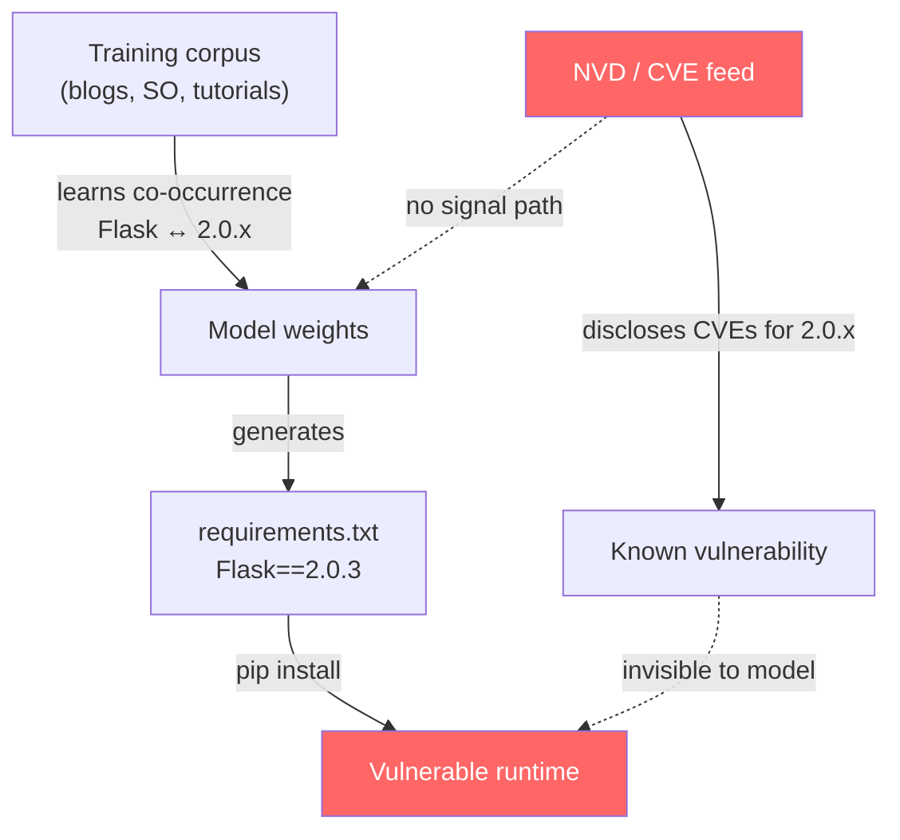
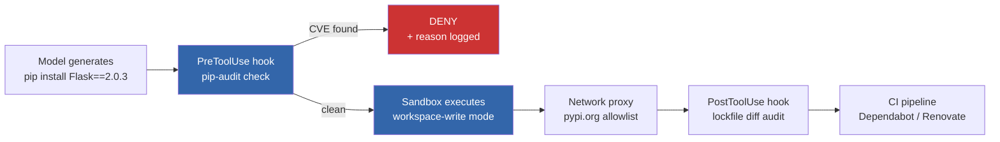

# Correct Code, Vulnerable Dependencies: Why Your LLM Pins Dangerous Library Versions — and How Codex CLI's Hook and Governance Stack Stops Them Shipping


---

The code works. The tests pass. The pull request looks clean. And buried in `requirements.txt` sits `Flask==2.0.3` — a version carrying multiple publicly disclosed CVEs, pinned there not by a careless developer but by the language model that generated the entire file [^1]. A measurement study published in May 2026 reveals that this is not an edge case: it is a systemic property of how every major LLM selects library versions.

## The PinTrace Study: 1,000 Tasks, 10 Models, One Uncomfortable Pattern

Wang et al.'s "Correct Code, Vulnerable Dependencies" (arXiv:2605.06279) evaluated ten LLMs against PinTrace, a curated benchmark of 1,000 Python programming tasks drawn from Stack Overflow [^1]. Every `requirements.txt`, `pyproject.toml`, and inline `pip install` command was checked against the National Vulnerability Database. The findings are stark:

| Metric | Range across 10 models |
|---|---|
| Tasks with ≥1 known CVE | 36.70–55.70% |
| CVEs rated Critical or High | 62.75–74.51% |
| CVEs disclosed before model knowledge cutoff | 72.27–91.37% |
| Static installation compatibility | 19.70–63.20% |
| Dynamic functional test pass rate | 6.49–48.62% |

Two observations matter for practitioners. First, the vulnerability is not a tail risk — over a third of generated dependency sets carry known CVEs, and the majority are severe [^1]. Second, the models are not hallucinating obscure packages (that problem — slopsquatting — is a separate attack surface [^2]). They are selecting *real* packages at *real but outdated* versions, versions that once appeared prominently in blog posts, tutorials, and Stack Overflow answers that formed their training data [^3].

## Why Models Converge on Dangerous Versions

The root cause is a training-data distribution bias. Models learn co-occurrence priors: "Flask" co-occurs with "2.0.x" far more frequently than with "3.1.x" in the pre-training corpus, because the older version was current during the period most heavily represented in web-scraped data [^3]. The NVD feed has no signal path into model weights. There is no mechanism by which a post-training CVE disclosure can update the version a model prefers to emit.

This creates an asymmetry: **the model's version confidence is inversely correlated with the version's security posture**. The more a version was discussed online — and thus the more likely it accumulated discovered vulnerabilities — the more likely the model is to pin it.



The version specification rate itself varies by prompting mode. When prompted directly ("install Flask to build a REST API"), models include version identifiers 26.83–95.18% of the time. When generating a manifest file such as `requirements.txt`, the rate drops to 6.45–59.19% [^1]. This means the risk surface changes depending on how the agent is invoked — a subtlety that matters for Codex CLI workflows where the model may be asked to create project scaffolding, update dependencies, or write Dockerfiles.

## The Compatibility Problem Compounds the Security Problem

Even setting CVEs aside, the pinned versions frequently fail to install or run. Static compatibility (does `pip install` succeed?) ranges from 19.70% to 63.20% across models. Dynamic compatibility (do the tests pass?) drops further to 6.49–48.62% [^1]. A version that is both vulnerable *and* non-functional creates a particularly dangerous failure mode: the developer, confronted with an installation error, may bump the version just enough to get the install working — potentially landing on another vulnerable release — rather than consulting a vulnerability database.

## How Codex CLI's Defence Stack Addresses Version Pinning Risk

Codex CLI does not solve this problem with a single feature. Instead, its layered architecture provides multiple interception points between the model's version selection and the moment a vulnerable dependency enters a running system.

### Layer 1: PreToolUse Hooks — Intercept Before Install

A PreToolUse hook fires before every Bash tool call, receives the command as JSON, and can return `deny` to block execution [^4]. This is the first line of defence against `pip install package==vulnerable-version`:

```bash
#!/usr/bin/env bash
# .codex/hooks/pretooluse-dependency-audit.sh
# Deny pip/npm install commands until audited

set -euo pipefail
INPUT=$(cat)
COMMAND=$(echo "$INPUT" | jq -r '.tool_input.command // empty')

if echo "$COMMAND" | grep -qE '(pip install|npm install|poetry add)'; then
  # Extract package specs and check against a local vulnerability DB
  PACKAGES=$(echo "$COMMAND" | grep -oE '[a-zA-Z0-9_-]+==?[0-9][0-9.]*')

  for PKG in $PACKAGES; do
    NAME=$(echo "$PKG" | cut -d= -f1)
    VERSION=$(echo "$PKG" | grep -oE '[0-9][0-9.]*$')

    # pip-audit check (requires pip-audit installed)
    if pip-audit --require-hashes=false --desc=on \
         --requirement=<(echo "${NAME}==${VERSION}") 2>&1 | grep -q "VULN"; then
      echo '{"permissionDecision":"deny","permissionDecisionReason":"Blocked: '"${NAME}==${VERSION}"' has known CVEs. Run pip-audit for details."}'
      exit 0
    fi
  done
fi
```

This hook pattern is deterministic — it fires regardless of approval mode, even under `--full-auto` [^4]. The model cannot override it.

### Layer 2: Sandbox Isolation — Contain the Blast Radius

Even if a vulnerable dependency slips past hook inspection, Codex CLI's sandbox modes limit what it can do. The default `workspace-write` sandbox confines filesystem writes to the project directory and disables network access for spawned processes [^5]. A compromised dependency that attempts to phone home or write outside the workspace is blocked at the OS level via Landlock (Linux) or the App Sandbox (macOS) [^5].

```toml
# .codex/config.toml — project-level
[sandbox]
mode = "workspace-write"      # default; OS-enforced confinement

[network_proxy]
allow = ["pypi.org", "registry.npmjs.org"]  # allowlist for install
```

### Layer 3: requirements.toml — Enterprise Governance

For organisations running Codex CLI across engineering teams, `requirements.toml` provides admin-enforced constraints that merge on top of user configuration and cannot be overridden during a session [^6]. An administrator can enforce sandbox mode, restrict MCP servers, and — critically — define managed hooks that run organisation-wide dependency auditing:

```toml
# /etc/codex/requirements.toml — deployed via MDM
[sandbox]
mode = "workspace-write"

[managed_hooks]
pretooluse = [
  { path = "/opt/codex-hooks/dependency-audit.sh", description = "CVE gate" }
]
```

This ensures that even if individual developers disable their local hooks, the organisation-level dependency audit remains active [^6].

### Layer 4: AGENTS.md Constraints — Instruct the Model

While hooks enforce policy deterministically, AGENTS.md shapes the model's behaviour probabilistically. A well-crafted AGENTS.md can instruct the model to avoid pinning specific versions and instead defer to lockfile resolution:

```markdown
## Dependency Rules

- NEVER pin exact versions in requirements.txt or package.json
- Use >= constraints with upper bounds: `Flask>=3.0,<4.0`
- Always run `pip-audit` after adding any Python dependency
- Always run `npm audit` after adding any Node.js dependency
- Defer version resolution to poetry.lock / package-lock.json
```

This is a soft constraint — the model may not always follow it — but combined with the deterministic PreToolUse hook, it creates defence in depth [^7].

## A Practical Defence Configuration

Bringing the layers together, here is a complete configuration pattern for teams that want to gate LLM-generated dependency selections:



The PostToolUse hook (firing after the install command completes) can inspect the resulting lockfile diff and flag any newly introduced CVEs that the PreToolUse hook missed — for example, transitive dependencies pulled in by a clean top-level package [^4].

## What This Means for Coding Agent Workflows

The PinTrace findings reframe a common assumption. Teams evaluating coding agents typically focus on code correctness — does the generated code work? — and code security — does it contain vulnerabilities like SQL injection? The Wang et al. study adds a third dimension: **dependency security**, where the generated code is correct and safe but the dependency graph it specifies is not [^1].

This has immediate implications for Codex CLI users:

1. **Treat `pip install` and `npm install` as security-critical tool calls**, not routine operations. Gate them with PreToolUse hooks.
2. **Never rely on the model's version selection**. Use lockfile-based resolution (`pip-compile`, `uv lock`, `poetry lock`) and let the model specify constraints rather than exact versions [^8].
3. **Run `pip-audit` or `npm audit` as a PostToolUse hook**, not just in CI. Catching a vulnerable dependency at agent runtime is cheaper than catching it in a pull request review.
4. **Use `requirements.toml` for fleet-wide enforcement** if deploying Codex CLI across an organisation. Individual developers should not be able to bypass dependency auditing [^6].

The model will keep pinning `Flask==2.0.3` because its training data says that is the right version. The defence stack exists to ensure that pin never reaches production.

## Citations

[^1]: Wang, C., Wu, J., Ling, X., Luo, T. & Zhao, C. (2026). "Correct Code, Vulnerable Dependencies: A Large Scale Measurement Study of LLM-Specified Library Versions." arXiv:2605.06279. [https://arxiv.org/abs/2605.06279](https://arxiv.org/abs/2605.06279)

[^2]: Vaughan, D. (2026). "Slopsquatting: Hallucinated Packages and Codex CLI Supply-Chain Defence." Codex Knowledge Base. [https://codex.danielvaughan.com/2026/06/16/slopsquatting-hallucinated-packages-codex-cli-supply-chain-defence-pretooluse-hooks-lockfile-discipline/](https://codex.danielvaughan.com/2026/06/16/slopsquatting-hallucinated-packages-codex-cli-supply-chain-defence-pretooluse-hooks-lockfile-discipline/)

[^3]: "LLM-Pinned Library Versions Carry Systemic CVE Exposure." AgentPatterns.ai (2026). [https://www.agentpatterns.ai/security/llm-pinned-vulnerable-versions/](https://www.agentpatterns.ai/security/llm-pinned-vulnerable-versions/)

[^4]: "Codex CLI Hooks: Complete Guide to Events, Policy Engines and Production Patterns." Codex Knowledge Base (2026). [https://codex.danielvaughan.com/2026/04/15/codex-cli-hooks-complete-guide-events-policy-patterns/](https://codex.danielvaughan.com/2026/04/15/codex-cli-hooks-complete-guide-events-policy-patterns/)

[^5]: "Agent approvals & security." OpenAI Codex Developers Documentation (2026). [https://developers.openai.com/codex/agent-approvals-security](https://developers.openai.com/codex/agent-approvals-security)

[^6]: "Managed configuration." OpenAI Codex Developers Documentation (2026). [https://developers.openai.com/codex/enterprise/managed-configuration](https://developers.openai.com/codex/enterprise/managed-configuration)

[^7]: "Advanced Configuration." OpenAI Codex Developers Documentation (2026). [https://developers.openai.com/codex/config-advanced](https://developers.openai.com/codex/config-advanced)

[^8]: "Configuration Reference." OpenAI Codex Developers Documentation (2026). [https://developers.openai.com/codex/config-reference](https://developers.openai.com/codex/config-reference)
