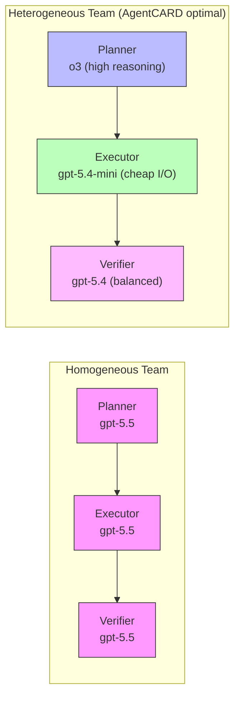
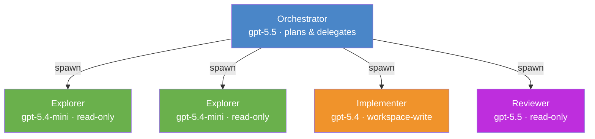

# Mixed-Model Agent Teams: What AgentCARD Reveals About Role Bottlenecks — and How to Wire Heterogeneous Workflows in Codex CLI


---

Everyone running a coding agent already knows that model choice matters. Fewer have internalised the corollary: *which role* a model fills matters more than *which model* you pick. A May 2026 paper from the University of Edinburgh introduces **AgentCARD**, a role-aware benchmark that quantifies this effect across five task domains — and the numbers are sharp enough to change how you configure Codex CLI [^1].

## The AgentCARD Finding: Roles Are Not Fungible

Jiang et al. decompose multi-agent workflows into discrete roles — planner, executor, and verifier — then exhaustively evaluate role-to-model assignments across API and self-hosted deployment modes [^1]. The benchmark combines a role-decomposed evaluation harness, a unified cost model covering API pricing and self-hosted GPU economics (H100 rental, PUE, electricity), Pareto-frontier analysis, and Shapley-based diagnostics for pinpointing which role is the system bottleneck [^1].

The headline results:

- **Heterogeneous teams** (different models per role) consistently occupy the Pareto frontier, improving accuracy by up to **44%** over cost-equivalent homogeneous teams [^1].
- Alternatively, heterogeneous assignment matches the strongest homogeneous team at up to **12× lower per-task cost** through hybrid deployment [^1].
- The **executor role** reads 200× more input tokens and consumes a median of **6× more dollars per task** than the planner [^1].
- The optimal role assignment is **domain-dependent**: some domains are planner-bottlenecked, others executor-bottlenecked [^1].

That last point is critical. There is no universal "best team". A configuration that dominates on a code-generation benchmark may underperform on a documentation or testing task. The implication for Codex CLI users: you need *switchable* role-to-model mappings, not a single hardcoded model.



## Why the Executor Dominates Cost

AgentCARD's Shapley decomposition reveals that the executor role processes vastly more tokens than any other role — it reads source files, generates patches, runs tools, and ingests their output [^1]. In Codex CLI terms, the executor is the main session loop: the agent that calls `apply_patch`, reads file contents, and runs shell commands.

This maps directly to OpenAI's token pricing structure, where output tokens cost 6–10× more than input tokens across every model tier[^2]. A heavyweight model in the executor seat multiplies costs across every tool call. Conversely, a cheaper model with strong instruction-following but lower reasoning overhead (such as `gpt-5.4-mini` at \$0.75/\$4.50 per million input/output tokens) can handle the bulk of file manipulation at a fraction of the cost [^2].

The planner and verifier roles, by contrast, process far fewer tokens but require higher reasoning fidelity — precisely the sweet spot for models like `o3` (\$2.00/\$8.00) or `gpt-5.5` with elevated reasoning effort [^2] [^3].

## Codex CLI's Heterogeneous Team Primitives

Codex CLI already ships the building blocks for mixed-model agent teams. The challenge is knowing which knobs to turn.

### Named Profiles for Role Switching

Profiles let you save named configuration layers and switch between them from the command line[^4]. When you pass `--profile profile-name`, Codex loads `~/.codex/config.toml`, then overlays `~/.codex/profile-name.config.toml` [^4]. The precedence chain runs: CLI flags → profile values → project config → user config → system config → defaults [^4].

This is your primary mechanism for switching between role-optimised configurations:

```toml
# ~/.codex/planning.config.toml
# High-reasoning profile for architectural planning
model = "o3"
model_reasoning_effort = "high"
model_reasoning_summary = "detailed"

[features.rollout_budget]
enabled = true
limit_tokens = 50_000
sampling_token_weight = 1.5
reminder_interval_tokens = 10_000
```

```toml
# ~/.codex/execution.config.toml
# Cost-efficient profile for bulk file operations
model = "gpt-5.4-mini"
model_reasoning_effort = "medium"
model_reasoning_summary = "concise"

[features.rollout_budget]
enabled = true
limit_tokens = 200_000
sampling_token_weight = 1.0
```

```toml
# ~/.codex/review.config.toml
# Balanced profile for code review and verification
model = "gpt-5.4"
model_reasoning_effort = "high"
review_model = "gpt-5.5"
```

Invoke with:

```bash
# Plan the architecture with high reasoning
codex --profile planning "Design the migration strategy for the payments module"

# Execute the bulk changes with a cost-efficient model
codex --profile execution "Implement the migration plan in PLAN.md"

# Review the result with a balanced verifier
codex --profile review "/review"
```

### Custom Subagent Definitions

For workflows where the orchestrator spawns child agents, Codex CLI supports custom agent definitions as standalone TOML files under `.codex/agents/` [^5]. Each definition can override the model, reasoning effort, and sandbox mode independently:

```toml
# .codex/agents/explorer.toml
name = "explorer"
description = "Read-only codebase navigator for localisation"
developer_instructions = """
You are a codebase explorer. Find relevant files and symbols.
Never modify files. Report paths and line numbers only.
"""
sandbox_mode = "read-only"
model = "gpt-5.4-mini"
model_reasoning_effort = "medium"
```

```toml
# .codex/agents/implementer.toml
name = "implementer"
description = "Focused code writer for single-file changes"
developer_instructions = """
You receive a file path and a change specification.
Apply the change. Run the relevant test. Report pass/fail.
"""
sandbox_mode = "workspace-write"
model = "gpt-5.4"
model_reasoning_effort = "high"
```

```toml
# .codex/agents/reviewer.toml
name = "reviewer"
description = "Post-implementation verifier"
developer_instructions = """
Review the diff for correctness, style, and security.
Flag issues with severity and line numbers.
"""
sandbox_mode = "read-only"
model = "gpt-5.5"
model_reasoning_effort = "xhigh"
```

The orchestrating session controls concurrency and depth [^5]:

```toml
# config.toml
[agents]
max_threads = 6
max_depth = 1
job_max_runtime_seconds = 1800
```

### The Cost Geometry



With this layout, the token-heavy exploration work runs on the cheapest model. The implementer uses a mid-tier model for reliable code generation. Only the orchestrator and reviewer — which process relatively few tokens but need strong reasoning — run on the most capable (and expensive) tier. AgentCARD's data suggests this kind of heterogeneous assignment should sit on or near the Pareto frontier for most software engineering tasks [^1].

## Applying Shapley Diagnostics to Your Own Workflows

AgentCARD's Shapley analysis attributes each role's marginal contribution to system accuracy, averaged over all possible coalitions [^1]. You cannot run AgentCARD directly against Codex CLI (it targets its own harness), but you can approximate the diagnostic:

1. **Isolate roles.** Run each phase (planning, execution, review) as a separate `codex` invocation with `--profile`, logging token usage from the session JSONL files in `~/.codex/` [^6].

2. **Measure accuracy per configuration.** For a code migration task, accuracy might be "tests pass after migration". For a refactoring task, it might be "no behavioural change detected by property tests". Define it before you start.

3. **Sweep model assignments.** Hold two roles fixed and vary the third. AgentCARD found that executor model choice has the largest impact on *cost*, while planner model choice has the largest impact on *accuracy* [^1]. Start your sweep there.

4. **Plot the frontier.** For each configuration, record (cost, accuracy). The configurations on the Pareto frontier — where no other configuration is both cheaper and more accurate — are your candidates.

5. **Identify the bottleneck.** If swapping the planner from `gpt-5.4-mini` to `o3` yields a large accuracy gain but swapping the executor yields none, your workflow is planner-bottlenecked. Invest reasoning budget there; keep the executor cheap.

## Budget Controls for Mixed Teams

Heterogeneous teams introduce a new failure mode: a cheap executor that loops on an ambiguous task, burning tokens without progress. Codex CLI's rollout budget provides the guardrail [^7]:

```toml
[features.rollout_budget]
enabled = true
limit_tokens = 150_000
sampling_token_weight = 1.2    # weight output tokens higher
prefill_token_weight = 0.8     # discount cached input
reminder_interval_tokens = 25_000
```

The `sampling_token_weight` and `prefill_token_weight` parameters let you tune cost-proportional accounting[^7]. For a mixed team where the executor generates heavy output, increasing `sampling_token_weight` above 1.0 ensures the budget tracks actual spend rather than raw token count.

Combine this with `model_auto_compact_token_limit` to trigger history compaction before the context window fills [^4]:

```toml
model_auto_compact_token_limit = 80_000
```

## A Concrete Example: Feature Branch Workflow

Here is a complete heterogeneous workflow for implementing a feature from a ticket:

```bash
# 1. Plan: high-reasoning model analyses the codebase and writes PLAN.md
codex --profile planning \
  "Read ticket JIRA-4521 and the relevant source files. \
   Write a detailed implementation plan to PLAN.md."

# 2. Explore: cheap subagents locate all affected files
codex --profile execution \
  "Follow PLAN.md. For each change, spawn an explorer to \
   locate the target files, then spawn an implementer to \
   apply the change and run its unit test."

# 3. Verify: strong model reviews the full diff
codex --profile review \
  "/review"
```

The planning phase might consume 15,000 tokens on `o3` at \$0.03 input + \$0.12 output ≈ **\$0.15**. The execution phase processes 200,000 tokens on `gpt-5.4-mini` at \$0.15 input + \$0.90 output ≈ **\$1.05**. The review phase uses 30,000 tokens on `gpt-5.5` at \$0.15 input + \$0.90 output ≈ **\$1.05**. Total: roughly **\$2.25**.

Running the entire workflow homogeneously on `gpt-5.5` would cost approximately \$5.00 input + \$6.00 output ≈ **\$11.00** — a 4.9× premium for, according to AgentCARD's findings, no accuracy gain and potentially *lower* accuracy if `gpt-5.5` underperforms `o3` on planning tasks [^1] [^2].

## Managed Enforcement for Teams

In enterprise environments, `requirements.toml` can enforce model assignments and budget limits fleet-wide [^8]:

```toml
# requirements.toml (managed by platform team)
[agents]
max_threads = 4
max_depth = 1

[features.rollout_budget]
enabled = true
limit_tokens = 300_000
```

Individual developers can still use named profiles to select role-appropriate models within these guardrails, but cannot exceed the managed budget ceiling or spawn depth [^8].

## What This Means for Codex CLI Users

AgentCARD's contribution is not a new tool — it is *evidence* that the intuition "use the best model everywhere" is wrong. Heterogeneous role assignment is not merely a cost optimisation; it is an accuracy optimisation. The executor does not need frontier reasoning; it needs reliable instruction-following at scale. The planner does not need cheap throughput; it needs deep reasoning on a small context.

Codex CLI's named profiles, custom subagent definitions, and rollout budget controls already provide the primitives to implement this. The gap is in measurement: systematically sweeping role-to-model assignments and plotting the Pareto frontier for *your* specific workflows. AgentCARD gives you the methodology. Codex CLI gives you the machinery.

---

## Citations

[^1]: Jiang, Y., Cheng, L., Huang, Y., Zhao, Y., Lu, Z., Dong, L., Li, W., Ponti, E. & Mai, L. (2026). "Specialize Roles, Mix Deployments: Pushing the Cost-Accuracy Frontier of LLM Agent Teams." arXiv:2606.20629. [https://arxiv.org/abs/2606.20629](https://arxiv.org/abs/2606.20629)

[^2]: OpenAI. (2026). "Codex CLI Cost Calculator: Building a Token Budget Estimator for Mixed-Model Workflows." Codex Knowledge Base. [https://codex.danielvaughan.com/2026/04/25/codex-cli-cost-calculator-token-budget-estimator-mixed-model-workflows/](https://codex.danielvaughan.com/2026/04/25/codex-cli-cost-calculator-token-budget-estimator-mixed-model-workflows/)

[^3]: OpenAI. (2026). "Model Selection in Codex CLI: Current Models and When to Use Each." Codex Knowledge Base. [https://codex.danielvaughan.com/2026/03/26/codex-cli-model-selection/](https://codex.danielvaughan.com/2026/03/26/codex-cli-model-selection/)

[^4]: OpenAI. (2026). "Configuration Reference – Codex." OpenAI Developers. [https://developers.openai.com/codex/config-reference](https://developers.openai.com/codex/config-reference)

[^5]: OpenAI. (2026). "Subagents – Codex." OpenAI Developers. [https://developers.openai.com/codex/subagents](https://developers.openai.com/codex/subagents)

[^6]: OpenAI. (2026). "Advanced Configuration – Codex." OpenAI Developers. [https://developers.openai.com/codex/config-advanced](https://developers.openai.com/codex/config-advanced)

[^7]: OpenAI. (2026). "Sample Configuration – Codex." OpenAI Developers. [https://developers.openai.com/codex/config-sample](https://developers.openai.com/codex/config-sample)

[^8]: OpenAI. (2026). "Codex CLI Named Profiles: A Cookbook of Ready-to-Use Configuration Templates." Codex Knowledge Base. [https://codex.danielvaughan.com/2026/04/30/codex-cli-named-profiles-cookbook-configuration-templates/](https://codex.danielvaughan.com/2026/04/30/codex-cli-named-profiles-cookbook-configuration-templates/)
