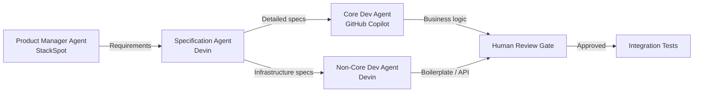

# One Developer Is All You Need: What a Brownfield Case Study Reveals About AI-Augmented Solo Delivery — and How to Wire the One-Person Squad in Codex CLI


---

The promise of AI coding assistants has always been speed. The uncomfortable truth, documented across multiple studies, is that raw speed without specification discipline produces more code, longer reviews, and flat delivery metrics [^1]. A case study from Itaú Unibanco — one of Latin America's largest financial institutions — offers the most detailed empirical picture yet of what happens when a single experienced engineer replaces a four-person squad by treating specifications, not prompts, as the primary engineering artefact [^2].

This article examines the findings, maps them to the broader productivity-reliability literature, and shows how to reproduce the one-person squad pattern using Codex CLI's custom agent definitions, AGENTS.md constraints, and delegation controls.

## The Itaú Case Study: Numbers That Matter

Vilas Boas et al. documented a nine-week brownfield project — a digital signature platform for non-account holders, built on four microservices and a single frontend, already running in production since October 2025 [^2]. The project was originally scoped for a four-person squad across six sprints.

One staff engineer with eight years of experience (four within the institution), supported by four AI agents, delivered 5 features comprising 25 user stories in three sprints:

| Metric | Result |
|--------|--------|
| Time-to-market reduction | 50% vs historical baseline |
| Throughput improvement | 5.4× (sprint 1 → sprint 3) |
| Effort per Business Complexity Point | 8.93h → 2.2h (75% reduction) |
| AI-generated code accepted on first review | 90% |
| Backend test coverage (JaCoCo) | 92.8% |
| Frontend test coverage (Jest) | 90.3% |
| Integration tests passing | 113 (100%) |
| End-to-end tests passing | 65 (100%) |
| Post-release defects | 0 |
| Cost reduction (incl. tooling) | >85% (R\$492k → ~R\$67k) |

The single post-validation defect was an accessibility issue — not a logic or integration failure [^2].

## Four Agents, Four Roles

The squad's architecture mapped each agent to a distinct lifecycle phase:



The **Product Manager Agent** (StackSpot) handled discovery with human-in-the-loop oversight, pre-loaded with domain knowledge about digital signatures and integration contracts with LACUNA, an external provider. The **Specification Agent** (Devin) refined requirements into detailed specifications across nine project repositories. The **Core Development Agent** (GitHub Copilot) implemented business-critical logic under continuous human supervision. The **Non-Core Development Agent** (Devin) autonomously developed infrastructure, API integrations, and boilerplate with minimal oversight [^2].

The critical insight: each agent operated at a different trust level, with the highest autonomy reserved for the most standardised, pattern-driven work.

## Specification Quality as the Binding Constraint

The study's most striking finding is that **"specification quality and institutional knowledge, not model capability, are the binding constraints on one-person squad success"** [^2]. Undocumented legacy integration contracts were the most frequent source of underspecification, leading to rework [^2].

This aligns precisely with Farrag's independently derived conclusion from a 67-source multivocal review: **"Specification discipline, not model capability, is the binding constraint on AI-assisted software dependability"** [^1]. Farrag identifies three moderating variables — task abstraction, codebase maturity, and developer experience — and two amplifying mechanisms: code review bottlenecks and context window constraints.

The Itaú data confirms all three moderators. The engineer's deep institutional knowledge (four years within the organisation) served as the quality gate. The settled architectural baseline with documented patterns enabled delegation. And the brownfield character of the system — active legacy integrations, regulatory constraints — defined where AI could and could not operate autonomously.

## The Productivity-Reliability Paradox

Why does this matter? Because the broader literature shows contradictory outcomes. Controlled studies report 20–56% productivity gains on well-scoped tasks, yet a rigorous randomised controlled trial documented a 19% slowdown for experienced developers [^1]. Telemetry from over 10,000 developers reveals 98% more pull requests but 91% longer review times with flat delivery metrics [^1].

The Itaú case study suggests the resolution: **specification-driven development (SDD)** treats natural-language specifications rather than code as the primary engineering artefact [^2]. Features progress through discovery → specification → implementation → testing, with the specification itself serving as both the structured prompt and the durable design record.

When specifications are thorough and unambiguous, AI-generated code acceptance on first review hits 90%. When they are vague or incomplete, the output is unusable [^2].

## Wiring the One-Person Squad in Codex CLI

Codex CLI's customisation stack — custom agent definitions, AGENTS.md, plan mode, and delegation controls — maps directly onto the four-agent architecture described in the study.

### Step 1: Define Specialised Agents

Create TOML definitions in `.codex/agents/` for each role:

```toml
# .codex/agents/spec-writer.toml
name = "spec-writer"
description = "Specification agent: refines requirements into detailed specs with interface contracts, acceptance criteria, and compliance constraints"
model = "o3"
model_reasoning_effort = "high"
sandbox_mode = "read-only"

[developer_instructions]
text = """
You are a specification writer. Output structured markdown specifications including:
- Architectural decisions and rationale
- Interface contracts with request/response schemas
- Acceptance criteria as testable assertions
- Compliance constraints (regulatory, accessibility)
- Legacy integration contracts (document ALL implicit assumptions)
Never write implementation code. Your output is the spec, not the solution.
"""
```

```toml
# .codex/agents/infra-builder.toml
name = "infra-builder"
description = "Non-core development agent: implements infrastructure, API integrations, and boilerplate from specs"
model = "o4-mini"
model_reasoning_effort = "medium"
sandbox_mode = "workspace-write"

[developer_instructions]
text = """
You implement infrastructure code, API integrations, and boilerplate strictly from specifications.
Follow existing patterns in the codebase. Do not modify business logic.
Write integration tests for every endpoint. Target 90%+ coverage.
"""
```

```toml
# .codex/agents/core-dev.toml
name = "core-dev"
description = "Core development agent: implements business-critical logic requiring domain judgment"
model = "o3"
model_reasoning_effort = "high"
sandbox_mode = "workspace-write"

[developer_instructions]
text = """
You implement business-critical logic from specifications.
Flag any ambiguity in the spec before proceeding.
Write unit tests alongside implementation. Target 90%+ coverage.
Document semantic decisions that go beyond what the spec states.
"""
```

### Step 2: Configure Delegation Controls

Set global agent constraints in `config.toml`:

```toml
[agents]
max_threads = 4          # Match the four-agent squad
max_depth = 1            # Prevent recursive delegation
job_max_runtime_seconds = 1800  # 30-minute ceiling per agent task

[features]
rollout_budget = 500000  # Token ceiling per session
```

The `max_depth = 1` setting is critical: it prevents subagents from spawning their own subagents, maintaining the flat delegation architecture that the Itaú study employed [^3].

### Step 3: Encode Specification Discipline in AGENTS.md

The AGENTS.md file serves as the persistent specification contract that survives context window rotation:

```markdown
# AGENTS.md

## Specification-Driven Workflow

Every feature MUST progress through these stages:
1. **Discovery**: User stories with acceptance criteria
2. **Specification**: Detailed spec including interface contracts,
   architectural decisions, compliance constraints, and legacy
   integration documentation
3. **Implementation**: Code generated strictly from specifications
4. **Verification**: Integration and E2E tests passing before merge

## Delegation Rules

- Business-critical logic: use @core-dev agent
- Infrastructure, API integrations, boilerplate: use @infra-builder agent
- Specification refinement: use @spec-writer agent
- NEVER implement without a written specification
- Flag underspecified legacy contracts immediately — do not guess

## Quality Gates

- Minimum 90% test coverage (backend and frontend)
- All integration tests must pass before PR
- Accessibility: WCAG 2.1 AA compliance required
```

### Step 4: Use Plan Mode for Specification Review

Start each feature in plan mode to generate the specification before any code is written:

```bash
codex --approval-mode suggest "Review the requirements in JIRA-1234.md and produce a detailed specification for the digital signature validation endpoint"
```

The `suggest` approval mode allows the agent to propose file changes that you review before execution — mirroring the human-in-the-loop pattern that achieved 90% first-review acceptance [^4].

### Step 5: Delegate with Fan-Out

Once the specification is approved, delegate implementation to specialised agents:

```
Spawn @infra-builder to implement the API integration layer from spec/sig-validation.md, and spawn @core-dev to implement the validation business logic from the same spec. Wait for both and summarise the results.
```

Codex CLI opens one thread per agent, runs them concurrently within the `max_threads` limit, and consolidates the results [^3].

## Structural Risks and Mitigations

The Itaú authors identified the obvious risk: a single point of failure. One engineer holds the complete mental model. Their mitigation was treating documentation as a first-class artefact — which maps directly to AGENTS.md as a persistent sidecar that survives engineer absence [^2].

They hypothesised that a **"two-person technical pair plus fractional product strategist"** would be more durable than the literal one-person configuration [^2]. In Codex CLI terms, this translates to shared `.codex/agents/` definitions and a committed AGENTS.md that any qualified engineer can pick up.

The deeper risk, identified by the broader literature, is **context window constraints as an amplifying mechanism** [^1]. As specifications grow, they may exceed the model's effective context. Codex CLI's `model_auto_compact_token_limit` and manual `/compact` command provide the operational controls, but the specification-driven approach itself helps: structured specifications are inherently more token-efficient than sprawling conversation histories [^5].

## When the Pattern Breaks

The study is explicit about limiting conditions [^2]:

- **Vague specifications** produce unusable output — the 90% acceptance rate depends entirely on specification quality
- **Domain-intensive logic** requiring semantic judgement cannot be fully delegated
- **Limited developer familiarity** with the codebase or domain eliminates the quality gate
- **Undocumented legacy systems** are the most frequent source of rework

The practitioner-researcher duality (one author was both the subject and observer) and the single-case design limit generalisability [^2]. The cost analysis approximates rather than audits total cost of ownership, and the productivity baseline derives from historical squad performance rather than a parallel control group.

## The Specification Imperative

The convergent finding across the Itaú case study, Farrag's multivocal review, and DeepLearning.AI's recent SDD curriculum [^6] is clear: **the binding constraint on AI-augmented development is not model capability but specification discipline**.

Codex CLI's architecture — custom agent definitions with per-role model and reasoning configurations, AGENTS.md as a persistent specification contract, graduated approval policies, and bounded delegation — provides the infrastructure to reproduce the one-person squad pattern. But the infrastructure is necessary, not sufficient. The 90% first-review acceptance rate, 92.8% test coverage, and zero post-release defects were achieved by an engineer with deep institutional knowledge writing thorough specifications, not by a more capable model.

The question is not whether one developer is all you need. It is whether that developer writes specifications worth delegating.

## Citations

[^1]: Farrag, S. E. (2026). "The Productivity-Reliability Paradox: Specification-Driven Governance for AI-Augmented Software Development." arXiv:2605.01160. [https://arxiv.org/abs/2605.01160](https://arxiv.org/abs/2605.01160)

[^2]: Vilas Boas, M., Pinto, G., Monteiro, E. R., Carida, V. F., & Ribeiro, D. (2026). "One Developer Is All You Need: A Case Study of an AI-Augmented One-Person Squad in a Brownfield Enterprise." arXiv:2605.18461. [https://arxiv.org/abs/2605.18461](https://arxiv.org/abs/2605.18461)

[^3]: OpenAI. (2026). "Subagents — Codex CLI." OpenAI Developers. [https://developers.openai.com/codex/subagents](https://developers.openai.com/codex/subagents)

[^4]: OpenAI. (2026). "Command Line Options — Codex CLI." OpenAI Developers. [https://developers.openai.com/codex/cli/reference](https://developers.openai.com/codex/cli/reference)

[^5]: OpenAI. (2026). "Advanced Configuration — Codex CLI." OpenAI Developers. [https://developers.openai.com/codex/config-advanced](https://developers.openai.com/codex/config-advanced)

[^6]: DeepLearning.AI. (2026). "Spec-Driven Development with Coding Agents." [https://www.deeplearning.ai/courses/spec-driven-development-with-coding-agents](https://www.deeplearning.ai/courses/spec-driven-development-with-coding-agents)
