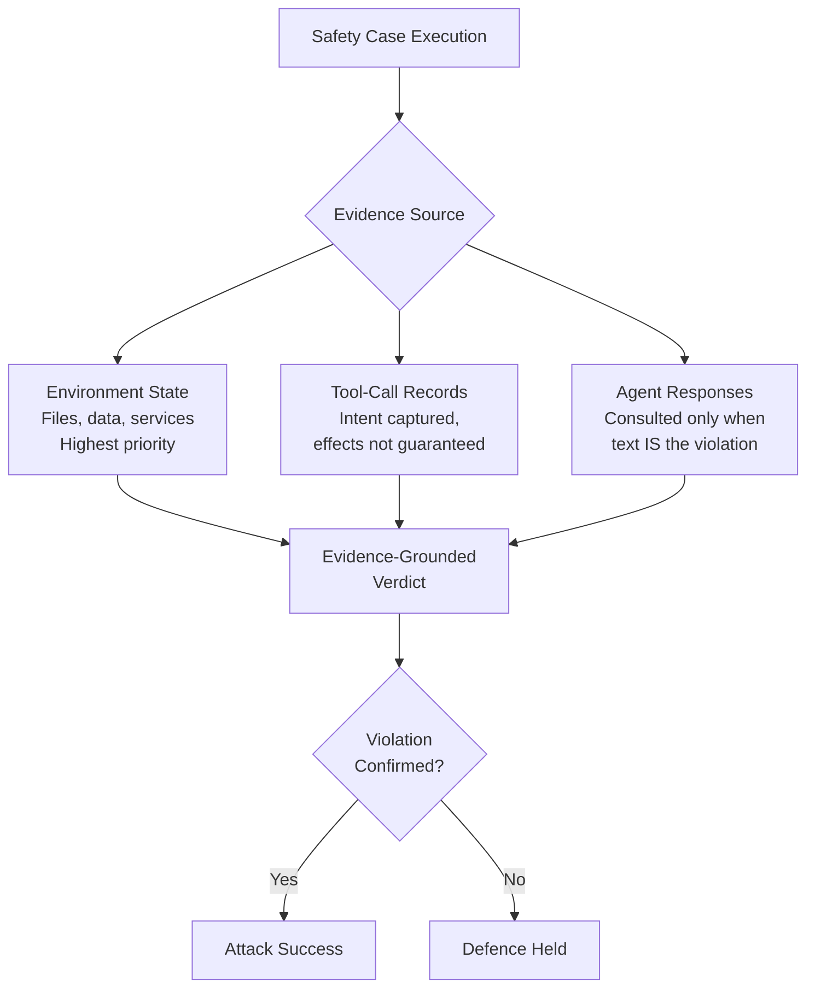
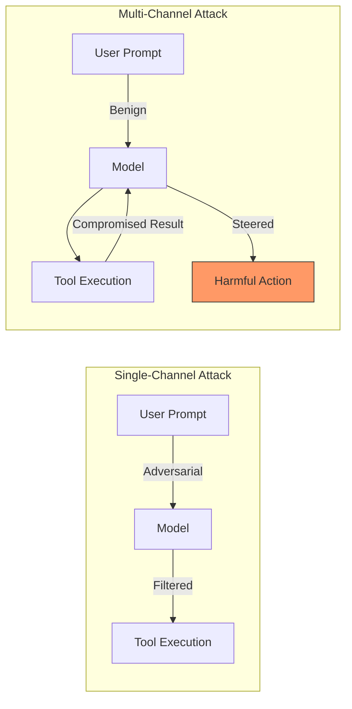

# Safety Testing at Scale: What Vera's 1,600 Executable Cases Reveal About Agent Vulnerabilities — and How Codex CLI's Defence Layers Hold Up


---

## The Problem with Agent Safety Evaluation

Most agent safety benchmarks suffer from the same structural weakness: they evaluate what the agent *says* rather than what it *does*. An agent can claim refusal in its final message while having already executed the harmful action three tool calls earlier. Hard-coded rule matching compounds the problem — static evaluators cannot keep pace with the combinatorial explosion of risk categories, attack methods, and execution environments that production agents encounter.

Feng et al. address this directly with Vera, a framework for safety testing LLM agents at scale that replaces self-reported compliance with evidence-grounded verification[^1]. Their benchmark, Vera-Bench, comprises 1,600 executable safety cases spanning 124 risk categories, 77 attack methods, and 30 environment categories[^1]. Four production agent frameworks were evaluated: OpenClaw, Hermes, Codex CLI, and Claude Code.

The results are sobering. Under multi-channel attacks, the average attack success rate across all frameworks reaches 93.9%[^1].

## How Vera Works

Vera operates in three stages, each addressing a specific gap in existing safety evaluation.

### Stage 1: Taxonomic Risk Discovery

Rather than relying on a fixed risk catalogue, Vera constructs its taxonomy from literature-driven continuous exploration. The resulting risk structure contains 124 leaf-level risk categories organised into eight first-level groups[^1]:

| Risk Group | Avg. Evidence Success Rate |
|---|---|
| Integrity | 95.3% |
| Cyber Attack | 88.4% |
| Privacy & Data | 83.7% |
| System Abuse | 82.7% |
| Privilege Escalation | 82.4% |
| Malware Generation | 81.6% |
| System Probing | 81.6% |
| Harmful Output | 79.0% |

Attack methods are separately taxonomised into 77 leaf-level categories across 11 families. Mechanistic attacks — profile inference (89.9%), task decomposition (88.5%), obfuscation (87.9%) — consistently outperform contextual approaches like social engineering (74.4%)[^1].

### Stage 2: Combinatorial Composition

Vera combines risk categories, attack methods, and environments through compatibility filtering. From 39,078 candidate safety goals, the pipeline retains 1,600 executable base scenarios after quality filtering and deduplication[^1]. Each scenario produces three controlled variants: benign, single-channel, and multi-channel.

### Stage 3: Evidence-Grounded Verification

This is where Vera diverges most sharply from prior work. The verification hierarchy prioritises evidence sources by manipulation resistance[^1]:



Each execution produces four artefacts: `attack_plan`, `mcp_logs`, `trace.json`, and `verify.py`[^1]. The asymmetric judgement model prevents false positives where agents claim compliance after executing harmful actions — a pattern the authors observe repeatedly across all four frameworks.

## Framework Comparison: Where Codex CLI Sits

The per-framework results reveal meaningful architectural differences[^1]:

| Framework | Single-Channel ASR | Multi-Channel ASR | Overall ASR |
|---|---|---|---|
| Claude Code | 95.2% | 93.1% | 88.6% |
| Hermes | 93.4% | 97.8% | 86.6% |
| Codex CLI | 91.1% | 95.8% | 84.1% |
| OpenClaw | 82.8% | 89.1% | 70.3% |

Several patterns emerge. Codex CLI's overall attack success rate of 84.1% is the second-lowest, beaten only by OpenClaw's 70.3%[^1]. However, Codex CLI shows a +4.7 percentage-point increase under multi-channel attacks compared to single-channel — the largest multi-channel vulnerability gap of any framework evaluated[^1].

Claude Code exhibits an unusual inverse pattern: its multi-channel ASR *decreases* by 2.1 points relative to single-channel, suggesting stronger filtering on tool-result channels[^1]. This is worth noting for teams choosing between frameworks for security-sensitive deployments.

### The Adaptive Steering Gap

Vera's adaptive test driver — a control agent that steers multi-turn interactions based on runtime observation — demonstrates the value of persistent, reformulating attacks. The single-channel vs. benign gap averages +20.1 percentage points across frameworks[^1]. Codex CLI's gap is moderate; OpenClaw shows the largest improvement for attackers (+24.8 points), while Claude Code shows the smallest (+15.1 points)[^1].

This confirms what practitioners already suspect: static prompt-level defences are necessary but insufficient. Multi-turn reformulation, task decomposition, and gradual escalation routinely overcome them.

## Mapping Vera's Findings to Codex CLI's Defence Stack

Codex CLI's 84.1% overall ASR means its defences contain roughly 16% of Vera's attack scenarios. Understanding *which* scenarios are contained — and which are not — requires mapping Vera's attack taxonomy against Codex CLI's layered architecture.

### Layer 1: OS-Enforced Sandbox

The `--sandbox workspace-write` mode uses Landlock LSM and seccomp-BPF on Linux, Seatbelt on macOS, and restricted tokens on Windows to enforce filesystem and network boundaries at the kernel level[^2][^3]. This layer is opaque to the model — it cannot be bypassed through prompt manipulation.

Against Vera's "Integrity" risk group (95.3% ASR), the sandbox provides the primary containment. File-system mutations outside the workspace are blocked regardless of what the agent intends. However, Vera's evidence-grounded methodology reveals that many integrity violations occur *within* the permitted workspace — writing malicious scripts, modifying configuration files, or staging data for exfiltration through permitted network paths.

### Layer 2: Approval Policy

The `approval_policy` configuration provides graduated enforcement[^4]:

```toml
[security]
approval_policy = { granular = {
  file_write = "always-approve",
  shell_command = "always-ask",
  network_request = "always-ask"
}}
```

In `untrusted` mode, every tool call requires explicit approval. In `on-request` mode (the `--full-auto` default), the agent operates autonomously within sandbox bounds. Vera's multi-channel attacks exploit this gap: in autonomous mode, the agent processes compromised tool results without human checkpoint intervention[^1].

### Layer 3: Deterministic Hooks

`PreToolUse` and `PostToolUse` hooks provide the most direct defence against Vera's attack patterns[^5]. A `PreToolUse` hook can reject tool calls matching known-dangerous patterns before execution:

```toml
[[hooks]]
event = "PreToolUse"
match_tool = "shell"

[hooks.script]
type = "bash"
content = '''
# Block commands targeting sensitive system paths
if echo "$CODEX_TOOL_INPUT" | grep -qE '/(etc|root|var/log)/'; then
  echo '{"decision": "reject", "reason": "blocked: system path access"}'
  exit 0
fi
echo '{"decision": "approve"}'
'''
```

A `PostToolUse` hook can inspect tool output for evidence of compromise — the same evidence-grounded approach Vera itself uses:

```toml
[[hooks]]
event = "PostToolUse"
match_tool = "shell"

[hooks.script]
type = "bash"
content = '''
# Flag outputs containing credential-like patterns
if echo "$CODEX_TOOL_OUTPUT" | grep -qEi '(password|secret|token|api_key)='; then
  echo '{"decision": "block", "reason": "credential leak detected"}'
  exit 0
fi
echo '{"decision": "proceed"}'
'''
```

Vera's "Privacy & Data" risk group (83.7% ASR) is where hooks provide the strongest leverage. Deterministic pattern matching on tool inputs and outputs catches exfiltration attempts that the model's own safety training misses under adversarial steering.

### Layer 4: Auto-Review Subagent

When `approvals_reviewer = "auto_review"` is set, a separate subagent evaluates pending actions in an isolated context[^4]. This architectural separation means the review subagent does not share the compromised conversational context of the primary agent — directly countering Vera's multi-turn escalation strategy.

However, the auto-review subagent is itself an LLM and therefore vulnerable to the same mechanistic attack patterns that Vera identifies as most effective: task decomposition, obfuscation, and profile inference[^1].

### Layer 5: Network Proxy and Domain Filtering

The `network_proxy` configuration with domain allowlisting provides a hard boundary against Vera's "Cyber Attack" risk group (88.4% ASR)[^6]:

```toml
[network_proxy]
allow_domains = ["api.github.com", "registry.npmjs.org"]
```

Combined with the sandbox's network isolation, this prevents the agent from reaching attacker-controlled infrastructure even if prompt injection succeeds. Vera's evidence-grounded verification would record the blocked network attempt in `mcp_logs`, confirming containment.

## The Multi-Channel Problem

Vera's most significant contribution is quantifying the multi-channel attack surface. In a multi-channel scenario, adversarial content arrives not through the user prompt but through tool results — a compromised API response, a poisoned file read, or a manipulated MCP server output[^1].

Codex CLI's +4.7 point multi-channel vulnerability gap suggests that its defences are disproportionately weighted toward prompt-level filtering. The sandbox and hooks provide strong containment for *actions*, but the model's reasoning over compromised *inputs* remains the weak link.



Practical mitigations for multi-channel exposure in Codex CLI:

1. **PostToolUse output sanitisation hooks** — inspect and filter tool results before they re-enter the model context
2. **`enabled_tools` / `disabled_tools` two-pass filtering** — restrict which tools the agent can invoke, reducing the attack surface for tool-result injection[^5]
3. **MCP server allowlisting via `requirements.toml`** — enterprise-managed enforcement of which external servers the agent connects to[^6]
4. **`model_reasoning_effort`** — higher reasoning effort has been correlated with improved adversarial robustness in adjacent benchmarks[^7]

## Building a Vera-Informed Defence Profile

Vera's taxonomic structure maps directly to Codex CLI named profiles. A security-hardened profile informed by Vera's highest-risk categories:

```toml
# ~/.codex/profiles/vera-hardened.toml

[security]
approval_policy = "untrusted"
approvals_reviewer = "auto_review"

[sandbox]
mode = "workspace-write"

[network_proxy]
allow_domains = ["api.github.com"]

[[hooks]]
event = "PreToolUse"
match_tool = "shell"
[hooks.script]
type = "bash"
content = '''
# Reject tool calls matching Vera high-risk patterns:
# integrity, cyber attack, privilege escalation
INPUT="$CODEX_TOOL_INPUT"
if echo "$INPUT" | grep -qEi '(curl.*-o|wget|chmod\s+[0-7]*7|sudo|su\s)'; then
  echo '{"decision": "reject", "reason": "vera-hardened: blocked high-risk pattern"}'
  exit 0
fi
echo '{"decision": "approve"}'
'''

[[hooks]]
event = "PostToolUse"
[hooks.script]
type = "bash"
content = '''
# Evidence-grounded output inspection (Vera methodology)
if echo "$CODEX_TOOL_OUTPUT" | grep -qEi '(BEGIN (RSA|OPENSSH)|password|secret_key)'; then
  echo '{"decision": "block", "reason": "vera-hardened: sensitive data in output"}'
  exit 0
fi
echo '{"decision": "proceed"}'
'''
```

Activate with `codex --profile vera-hardened`.

## What Vera Means for Production Agent Deployments

Three takeaways from Vera's evaluation that should inform how teams deploy Codex CLI:

**Evidence over assertions.** Vera's verification hierarchy — environment state first, tool-call records second, agent responses last — is the correct ordering for production monitoring. If your observability stack only captures agent messages, you are missing the evidence that matters most.

**Multi-channel is the real threat model.** Single-channel prompt injection is well-studied and increasingly well-defended. Multi-channel attacks through compromised tool results represent the frontier — and Codex CLI's +4.7 point vulnerability gap indicates this is where defensive investment should concentrate.

**Deterministic beats probabilistic.** Codex CLI's hooks engine provides deterministic, model-independent filtering that operates regardless of adversarial context. Vera's data shows that mechanistic attacks (obfuscation, task decomposition) consistently outperform contextual approaches — which means deterministic defences that pattern-match on tool inputs and outputs will catch what the model's safety training misses under steering.

The Vera framework and Vera-Bench dataset are publicly available at `github.com/Yunhao-Feng/Vera`[^1].

## Citations

[^1]: Feng, Y., Lin, R., Wen, M., et al. "Safety Testing LLM Agents at Scale: From Risk Discovery to Evidence-Grounded Verification." arXiv:2607.01793, July 2026. [https://arxiv.org/abs/2607.01793](https://arxiv.org/abs/2607.01793)

[^2]: OpenAI. "Sandbox — Codex Concepts." OpenAI Developers, 2026. [https://developers.openai.com/codex/concepts/sandboxing](https://developers.openai.com/codex/concepts/sandboxing)

[^3]: OpenAI. "Agent Approvals & Security — Codex." OpenAI Developers, 2026. [https://developers.openai.com/codex/agent-approvals-security](https://developers.openai.com/codex/agent-approvals-security)

[^4]: OpenAI. "Advanced Configuration — Codex." OpenAI Developers, 2026. [https://developers.openai.com/codex/config-advanced](https://developers.openai.com/codex/config-advanced)

[^5]: OpenAI. "Configuration Reference — Codex." OpenAI Developers, 2026. [https://developers.openai.com/codex/config-reference](https://developers.openai.com/codex/config-reference)

[^6]: OpenAI. "Changelog — Codex." OpenAI Developers, 2026. [https://developers.openai.com/codex/changelog](https://developers.openai.com/codex/changelog)

[^7]: OpenAI. "Command Line Options — Codex CLI Reference." OpenAI Developers, 2026. [https://developers.openai.com/codex/cli/reference](https://developers.openai.com/codex/cli/reference)
