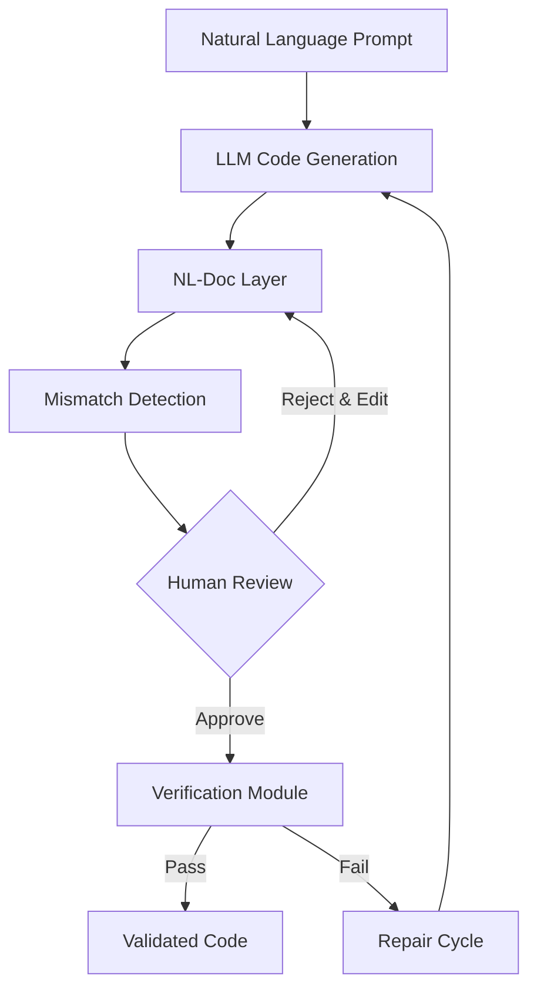
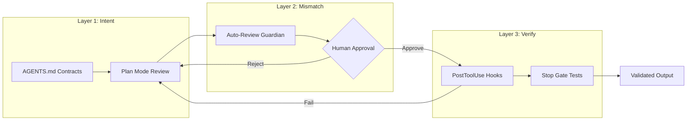

# Verifiable Literate Programming: What VLP's Three-Layer Validation Reveals About Human-in-the-Loop Code Review — and How to Wire Equivalent Gates in Codex CLI


---

LLM-generated code passes benchmarks. It also ships bugs that no benchmark catches — subtle misalignments between what the developer *meant* and what the model *produced*. Yuan et al.'s Verifiable Literate Programming framework (VLP), published in July 2026 [^1], attacks this gap with a three-layer architecture: a documentation layer that makes intent explicit, a mismatch detector that focuses human attention on suspicious lines, and a verification module that applies formal checks against validated documentation. The result: pass@1 rates jump from 28.7–73.2% to 65.4–93.5% with manageable human effort.

The insight matters beyond the paper's experimental setting. Every production coding agent faces the same validation problem, and Codex CLI already ships the primitives — hooks, auto-review, plan mode, and approval policies — to build equivalent gates into real workflows.

## The Validation Gap in LLM Code Generation

The core problem is deceptively simple: generated code can be syntactically correct, pass superficial tests, and still diverge from the developer's intent in ways that automated testing misses. VLP identifies three root causes [^1]:

1. **Underspecified requirements** — natural language prompts leave ambiguity that the model resolves silently, often incorrectly.
2. **Semantic deviations** — the code handles the happy path but misinterprets edge cases, API contracts, or domain constraints.
3. **Opaque generation** — without an intermediate representation, developers must read raw code to spot misalignment, which scales poorly.

These categories align with findings from the broader literature. Zhang et al.'s Renaissance of Literate Programming paper [^2] demonstrated that Knuth's original insight — weaving prose explanations alongside code — improves LLM comprehension in large-scale projects through their Interoperable Literate Programming (ILP) approach. The problem is that traditional literate programming produces documentation *about* code; VLP produces documentation that is *verifiable against* code.

## VLP's Three-Layer Architecture



### Layer 1: NL-Doc — The Documentation Interface

VLP introduces NL-Doc, a structured natural language representation with unambiguous syntax and mostly deterministic code-to-documentation translation [^1]. Unlike freeform comments, NL-Doc provides trace links between the original prompt and each documentation line. This is not a summary — it is a formal intermediate representation that preserves the intent hierarchy from requirement through implementation.

The key design decision is deterministic translation: given the same code, the NL-Doc output should be stable and predictable, making diffs between prompt intent and documented behaviour reviewable by developers who may not be expert programmers.

### Layer 2: Mismatch Detection — Focused Human Attention

Rather than asking developers to review everything, VLP uses LLM-assisted analysis to identify suspicious documentation lines where the NL-Doc diverges from prompt intent [^1]. The trace links between prompt fragments and documentation lines enable fine-grained highlighting: instead of "something might be wrong", the system says "line 47 of the documentation interprets your sorting requirement as ascending, but your prompt did not specify order."

This is an efficiency mechanism. Human attention is the scarcest resource in any validation pipeline. VLP's mismatch detection reduces the review surface without eliminating human judgement.

### Layer 3: Verification Module — Formal Properties from Validated Documentation

Once a developer has reviewed and validated the NL-Doc, VLP derives formal properties and API-usage checks from the validated documentation, then applies model checking against the generated code [^1]. This layer catches implementation bugs that survive semantic review — off-by-one errors, incorrect API parameter ordering, missing null checks.

The verification module closes the loop: human validation ensures intent alignment, formal verification ensures implementation correctness.

## Results: What the Numbers Show

VLP was evaluated across multiple LLMs, with pass@1 rates improving from baseline ranges of 28.7–73.2% to 65.4–93.5% after applying the full three-layer pipeline [^1]. The baseline range reflects variation across different models; the improvement is consistent across all tested configurations.

The critical finding is that this improvement comes with *manageable* human effort. VLP does not ask developers to write specifications from scratch — it generates structured documentation, highlights likely problems, and asks for targeted validation. The effort-to-improvement ratio makes the approach practical for production workflows.

## Mapping VLP Layers to Codex CLI Primitives

Codex CLI (v0.142.5 as of July 2026) [^3] does not implement VLP directly, but its feature set maps cleanly onto the three-layer architecture:

### NL-Doc ↔ Plan Mode and AGENTS.md Contracts

VLP's NL-Doc layer creates an explicit, reviewable representation of intent before code is applied. Codex CLI's plan mode serves the same function: when `approval_policy` is set to `on-request` or when using suggest approval, Codex presents its intended changes for review before execution [^4].

AGENTS.md files extend this further by encoding project-specific constraints — essentially pre-validated documentation about what the agent *should* do [^5]. A well-authored AGENTS.md acts as a persistent NL-Doc layer:

```toml
# config.toml — force plan presentation before execution
[features]
approval_policy = "on-request"

[model]
plan_mode_reasoning_effort = "high"
```

```markdown
<!-- AGENTS.md — project-level intent documentation -->
## Code Generation Rules
- All database queries MUST use parameterised queries
- API responses MUST include error handling for 4xx and 5xx status codes
- Sorting defaults to descending by created_at unless explicitly specified
```

### Mismatch Detection ↔ Auto-Review and Guardian Subagent

VLP's mismatch detection uses LLM analysis to focus human attention on likely problems. Codex CLI's `auto_review` feature performs the same role: a guardian subagent evaluates proposed changes against policy before they reach the developer [^4].

The `approvals_reviewer` configuration controls whether review is human-driven or delegated to the auto-review subagent:

```toml
# config.toml — enable auto-review with custom policy
[auto_review]
policy = """
Flag any code that:
- Modifies database schema without a migration
- Adds dependencies not in the approved list
- Changes API contracts without version bumps
- Uses deprecated API patterns
"""

[features]
approvals_reviewer = "auto"
```

When the guardian subagent identifies suspicious changes, it surfaces them for human review — precisely mirroring VLP's mismatch-detection-to-human-review pipeline.

### Verification Module ↔ PostToolUse Hooks and Stop Gates

VLP's formal verification layer checks code against derived properties after human validation. Codex CLI's hook system provides the equivalent mechanism through PostToolUse and Stop event hooks [^6]:

```json
{
  "hooks": [
    {
      "event": "PostToolUse",
      "matcher": { "tool_name": "write_file" },
      "command": {
        "program": "bash",
        "args": ["-c", "cd $CODEX_WORKSPACE && python -m pytest --tb=short -q 2>&1 | tail -20"],
        "timeout_ms": 30000
      },
      "on_failure": "reject"
    },
    {
      "event": "PostToolUse",
      "matcher": { "tool_name": "write_file", "file_glob": "*.py" },
      "command": {
        "program": "bash",
        "args": ["-c", "cd $CODEX_WORKSPACE && python -m mypy --strict $CODEX_FILE_PATH 2>&1"],
        "timeout_ms": 15000
      },
      "on_failure": "reject"
    },
    {
      "event": "Stop",
      "command": {
        "program": "bash",
        "args": ["-c", "cd $CODEX_WORKSPACE && python -m pytest --tb=short && echo 'VERIFICATION_PASSED'"],
        "timeout_ms": 60000
      },
      "on_failure": "reject"
    }
  ]
}
```

This configuration creates a verification pipeline: every file write triggers type checking and test execution (PostToolUse), and the session cannot complete without a full test suite pass (Stop gate). The `on_failure: "reject"` directive ensures that verification failures block progress — the same guarantee VLP's verification module provides.

## The Three-Layer Pipeline as a Codex CLI Profile

Combining all three layers into a named profile creates a VLP-equivalent workflow:



```toml
# ~/.codex/profiles/vlp-verified.toml
[features]
approval_policy = "on-request"
hooks = true

[model]
plan_mode_reasoning_effort = "high"
model_reasoning_effort = "high"

[auto_review]
policy = """
Evaluate all proposed changes against AGENTS.md constraints.
Flag: schema changes without migrations, undocumented API changes,
missing error handling, deprecated API usage, unparameterised queries.
"""

[features]
approvals_reviewer = "auto"
```

Activate the profile for high-stakes work:

```bash
codex --profile vlp-verified "Implement the payment reconciliation module"
```

## Beyond VLP: Where Codex CLI Extends the Model

VLP operates on single code-generation tasks. Codex CLI's architecture supports additional verification dimensions that VLP does not address:

**Temporal verification** — PreToolUse hooks can intercept commands *before* execution, preventing destructive operations that no amount of post-hoc verification can undo [^6]. VLP's verification is necessarily post-generation; Codex CLI hooks operate at both pre- and post-execution boundaries.

**Sandbox confinement** — Codex CLI's Landlock (Linux) and Seatbelt (macOS) sandbox restricts the blast radius of generated code at the OS level [^3]. Even if verification fails to catch a problem, the sandbox prevents it from escaping the workspace. VLP has no equivalent containment mechanism.

**Fleet-wide governance** — `requirements.toml` enables managed configurations that enforce verification policies across teams [^4]. A platform engineering team can mandate VLP-equivalent verification for all developers without relying on individual compliance:

```toml
# requirements.toml — organisation-wide enforcement
[managed.features]
hooks = true
approval_policy = "on-request"

[managed.auto_review]
policy = "Reject changes that bypass test coverage or violate AGENTS.md constraints"
```

## Practical Recommendations

1. **Start with AGENTS.md as your NL-Doc layer.** Encode project constraints, API contracts, and domain rules. This is the cheapest intervention with the highest impact on intent alignment.

2. **Enable auto-review for mismatch detection.** Configure the guardian subagent with domain-specific review criteria. Let it flag problems before you spend attention on them.

3. **Wire PostToolUse hooks for formal verification.** Type checking, linting, and test execution after every file write catches implementation bugs that semantic review misses.

4. **Use Stop gates as final verification.** The Stop hook ensures no session completes without passing the full test suite — equivalent to VLP's verification module as a completion gate.

5. **Package the combination as a named profile.** Profiles make verification workflows reproducible and shareable across teams.

## Citations

[^1]: Yuan, Z., Lu, W., Wu, H., Jin, D. & Wu, C. (2026). "Guiding Human Validation of LLM-Generated Code via Verifiable Literate Programming." arXiv:2607.02333. [https://arxiv.org/abs/2607.02333](https://arxiv.org/abs/2607.02333)

[^2]: Zhang, W., Li, Y., Dong, Z., Wu, Y., Zhou, Y., Wang, D., Xing, S., Zhou, C. & Shen, D. (2025). "Renaissance of Literate Programming in the Era of LLMs: Enhancing LLM-Based Code Generation in Large-Scale Projects." arXiv:2502.17441. [https://arxiv.org/abs/2502.17441](https://arxiv.org/abs/2502.17441)

[^3]: OpenAI. (2026). "Codex CLI Documentation." [https://developers.openai.com/codex/cli](https://developers.openai.com/codex/cli)

[^4]: OpenAI. (2026). "Codex CLI Configuration Reference." [https://developers.openai.com/codex/config-reference](https://developers.openai.com/codex/config-reference)

[^5]: OpenAI. (2026). "Custom Instructions with AGENTS.md." [https://developers.openai.com/codex/guides/agents-md](https://developers.openai.com/codex/guides/agents-md)

[^6]: OpenAI. (2026). "Codex CLI Features — Hooks." [https://developers.openai.com/codex/cli/features](https://developers.openai.com/codex/cli/features)
