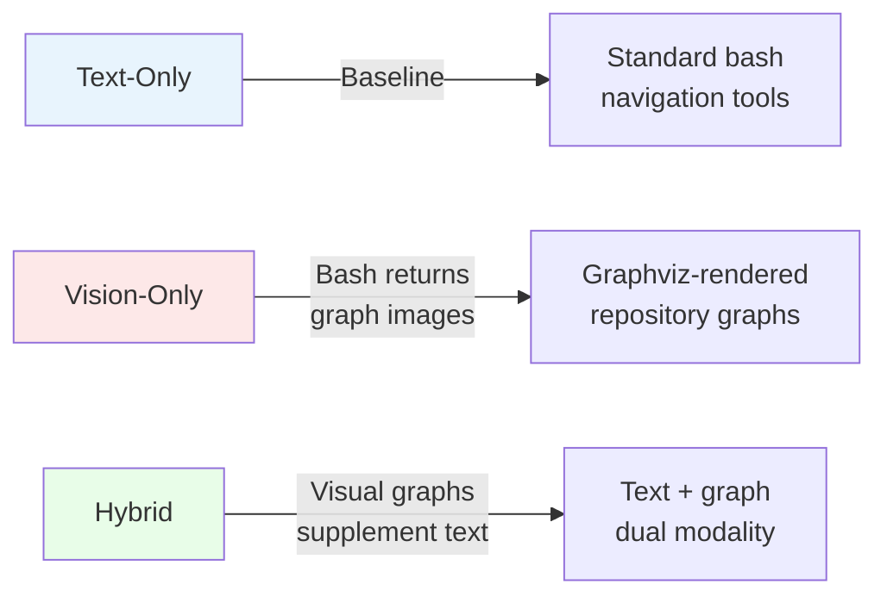
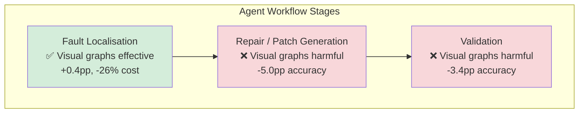
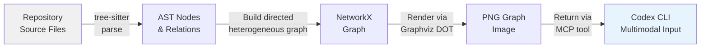

# Visual Codebase Understanding: What Multimodal Repository Graphs Reveal About Token-Efficient Exploration — and How to Wire Hybrid Visual Context into Codex CLI


---

## The Problem: Text-Only Exploration Is Expensive

Modern coding agents consume enormous token budgets exploring repositories before writing a single line of fix. When a bug report arrives, the agent must traverse directory trees, read files, trace imports, and build a mental model of the codebase — all expressed as text tokens flowing through the context window. This exploration phase routinely accounts for the majority of an agent's total token spend, yet much of it is redundant: the agent re-reads files, backtracks through call chains, and loses structural context as earlier turns scroll out of the window.

A new wave of research asks a deceptively simple question: what if agents could *see* the repository structure instead of reading it?

## The Research: LLM Agents Can See Code Repositories

Ma et al. (June 2026) present the first systematic empirical study of visual repository representations for coding agents [^1]. The core idea: model a repository as a directed heterogeneous graph with nodes representing files, classes, and functions, and edges capturing four relation types — **contains** (filesystem hierarchy), **imports** (module dependencies), **invokes** (function calls), and **inherits** (class inheritance). Render the graph via Graphviz DOT with layered left-to-right hierarchical layout and HTML-table node labels carrying semantic icons [^1].

The study evaluates four multimodal foundation models — GPT-5-mini, GPT-5.1, Kimi K2.5, and Doubao-Seed-2.0-Lite — across three experimental settings on SWE-bench Verified (500 instances from real Python projects) [^1]:



### Vision-Only Fails; Hybrid Wins

The headline finding: vision-only degrades both accuracy and cost. Without symbolic text detail, agents compensate by issuing repeated visual queries, inflating token usage:

| Model | Text-Only Pass@1 | Vision-Only Pass@1 | Hybrid Pass@1 | Cost Change (Hybrid) |
|---|---|---|---|---|
| GPT-5-mini | 55.0% | 41.4% (-13.6pp) | 55.4% (+0.4pp) | **-26%** |
| GPT-5.1 | 51.0% | — | 48.8% (-2.2pp) | **-46%** |
| Kimi K2.5 | 70.3% | 55.0% (-15.3pp) | 70.6% (+1.8pp) | -3% |
| Doubao-Seed-2.0-Lite | 51.0% | 16.9% (-34.1pp) | 52.0% (+1.0pp) | -6% |

GPT-5-mini achieves 25% input token reduction and 26% cost decrease whilst maintaining equivalent accuracy. Kimi K2.5 improves by 1.8 percentage points. The pattern is clear: visual context is a *complement*, not a replacement [^1].

### Fault Localisation Is the Sweet Spot

Perhaps the most actionable finding: visualisation is most effective during **fault localisation** — the stage where the agent narrows down which files and functions to edit. Invoking visual graphs during the repair stage degrades accuracy by 5.0 percentage points; during validation it costs 3.4 points [^1]. Early structural grounding narrows the search space, preventing redundant exploration before repair begins.



### Graph Layout Matters

The study also compares graph rendering against tabular layout. Graph rendering delivers 25% input token reduction and 26% cost reduction at 55.4% Pass@1. Tabular layout achieves 16% cost reduction but scores 1.2 points higher on accuracy. Agent-determined exploration depth achieves the optimal balance — the agent decides when to request visual context rather than receiving it unconditionally [^1].

## Companion Research: FastContext and Exploration Subagents

This visual approach sits within a broader movement towards specialised exploration. Microsoft's FastContext (June 2026) trains lightweight 4B–30B parameter models as dedicated exploration subagents that issue parallel read-only tool calls and return compact file paths and line ranges [^2]. FastContext cuts main-agent token consumption by up to 60% whilst lifting resolution rates by up to 5.5 percentage points [^2]. The models are available on Hugging Face as FastContext-1.0-4B-SFT and FastContext-1.0-4B-RL [^3].

The convergence is striking: whether through visual graphs or trained exploration subagents, the research consensus points to **separating exploration from repair** as the key architectural insight.

## Mapping to Codex CLI: Building Hybrid Visual Exploration

Codex CLI already has the building blocks for hybrid visual exploration. The challenge is wiring them together effectively.

### Image Input for Visual Context

Codex CLI accepts image inputs via the `-i` / `--image` flags, supporting PNG and JPEG formats [^4]. This means Graphviz-rendered repository graphs can be piped directly into a prompt:

```bash
# Generate a repository dependency graph
python repo_graph.py --format png --output /tmp/repo-structure.png

# Feed the visual context to Codex alongside a bug report
codex -i /tmp/repo-structure.png "Given this repository structure, \
  locate the modules responsible for authentication and identify \
  which files likely contain the session timeout bug described in issue #412"
```

### MCP Servers for Live Graph Generation

Rather than generating graphs manually, an MCP server can dynamically produce repository visualisations on demand. Codex CLI's native MCP support launches servers at session start and exposes their tools alongside built-in capabilities [^4]:

```toml
# ~/.codex/config.toml
[[mcp_servers]]
name = "repo-graph"
command = "python"
args = ["-m", "repo_graph_mcp", "--format", "png"]
```

An MCP server wrapping tree-sitter or AST-based analysis (as used in Ma et al.) could expose tools like `get_module_graph(path, depth)` and `get_call_graph(function_name)`, returning rendered PNG graphs that Codex processes multimodally.

### Subagent-Delegated Exploration

The research finding that exploration should be separated from repair maps directly to Codex CLI's subagent architecture. A dedicated exploration subagent can consume visual context, identify relevant files, and return a compact location manifest to the main agent:

```toml
# .codex/agents/explorer.toml
[agent]
name = "visual-explorer"
model = "o4-mini"
instructions = """
You are a repository exploration specialist. Use the repo-graph
MCP server to generate visual dependency graphs. Identify the
files and line ranges relevant to the given issue. Return ONLY
a compact list of file paths and line ranges — no code, no fixes.
"""

[agent.tools]
mcp_servers = ["repo-graph"]
```

In AGENTS.md, constrain the main agent to delegate exploration before attempting repairs:

```markdown
## Workflow Constraints

- Before editing any file, delegate to `visual-explorer` to identify
  the relevant files and line ranges
- Do not read files outside the explorer's returned manifest
- The explorer's context is disposable — it does not persist into
  the repair phase
```

### AGENTS.md Graph-First Exploration Contracts

Drawing on the paper's finding that agent-determined depth produces optimal results, AGENTS.md can encode when to request visual context:

```markdown
## Exploration Protocol

- For issues touching ≤3 files: text-only exploration is sufficient
- For issues requiring cross-module understanding: generate a module
  dependency graph before reading individual files
- For inheritance-related bugs: generate a class hierarchy graph
  scoped to the affected package
- Never generate graphs during the repair or validation stages
```

This directly implements the paper's finding that visual context helps at fault localisation but harms during repair [^1].

### Token Budget Awareness

The 26% cost reduction demonstrated by Ma et al. compounds with Codex CLI's existing `rollout_budget` controls. If an exploration subagent runs at lower cost per invocation, more budget remains for the repair phase:

```toml
# config.toml
[features]
rollout_budget = 500000

[agents]
max_threads = 2
max_depth = 2
```

## Practical Implementation: A Graphviz MCP Server

For teams wanting to experiment with visual repository context today, a minimal MCP server using tree-sitter for AST parsing and Graphviz for rendering provides the core pipeline:



The graph construction follows Ma et al.'s four relation types: **contains** edges from the filesystem hierarchy, **imports** edges from module-level `import` statements, **invokes** edges from function call sites, and **inherits** edges from class definitions [^1]. Scoping the graph to a relevant subtree (rather than the entire repository) keeps the rendered image legible and the token cost manageable.

## What This Means for Codex CLI Users

The research makes three points directly applicable to Codex CLI workflows:

1. **Visual context is a supplement, not a replacement.** Feed repository graphs alongside text, not instead of it. Codex CLI's `-i` flag supports this natively.

2. **Use visual context early, drop it during repair.** The exploration → localisation → repair pipeline should invoke visual tools only in the first two stages. Encode this in AGENTS.md.

3. **Separate exploration from repair at the agent level.** Codex CLI's subagent architecture and MCP integration provide the mechanism. A dedicated exploration subagent — whether using visual graphs, FastContext-style trained models, or both — prevents exploration tokens from polluting the repair context.

The 26% cost reduction on GPT-5-mini and 1.8pp accuracy gain on Kimi K2.5 are modest individually, but they compound across hundreds of daily agent invocations. For teams running Codex CLI at scale, hybrid visual exploration is a lever worth pulling.

---

## Citations

[^1]: Ma, D., Chen, S., Yang, Y., Shi, Y., Yan, Y., & Gu, X. (2026). "LLM Agents Can See Code Repositories." arXiv:2606.14061. [https://arxiv.org/abs/2606.14061](https://arxiv.org/abs/2606.14061)

[^2]: Microsoft Research. (2026). "FastContext: Training Efficient Repository Explorer for Coding Agents." arXiv:2606.14066. [https://arxiv.org/abs/2606.14066](https://arxiv.org/abs/2606.14066)

[^3]: Microsoft. (2026). "FastContext-1.0-4B-SFT." Hugging Face. [https://huggingface.co/microsoft/FastContext-1.0-4B-SFT](https://huggingface.co/microsoft/FastContext-1.0-4B-SFT)

[^4]: OpenAI. (2026). "Features – Codex CLI." OpenAI Developers. [https://developers.openai.com/codex/cli/features](https://developers.openai.com/codex/cli/features)
