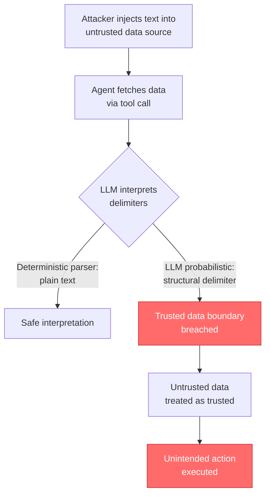
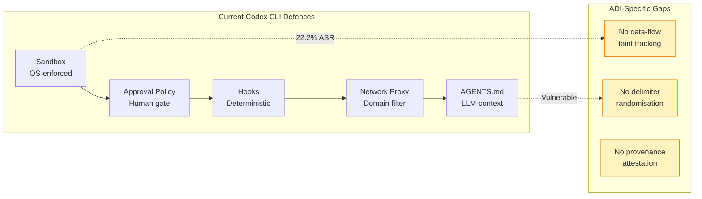

# Agent Data Injection: What Probabilistic Delimiter Poisoning Reveals About the Trust Boundary Gap — and How Codex CLI's Layered Defences Respond


---

## The Attack You Were Not Defending Against

Every production coding agent today guards against instruction injection — the well-studied category of indirect prompt injection (IPI) where attacker-controlled text is interpreted as a command. Defences have driven instruction injection success rates to near zero: 0.0–0.7 per cent across modern agent stacks [^1]. Security teams closed the chapter and moved on.

They closed the wrong chapter.

Choi et al. published *Agent Data Injection Attacks are Realistic Threats to AI Agents* (arXiv:2607.05120, July 2026) [^1], introducing a second IPI category: **agent data injection (ADI)**. Where instruction injection causes the LLM to treat untrusted input as a command, ADI causes it to treat untrusted input as *trusted data* — security-critical metadata, resource identifiers, tool-call history, or data origins. The distinction matters because every defence designed to separate "instructions" from "data" is structurally blind to an attack that operates entirely within the data channel.

The headline numbers: **49.1 per cent baseline attack success rate** against agent systems, and existing defences that crush instruction injection leave ADI virtually untouched [^1].

---

## How Probabilistic Delimiter Injection Works

ADI exploits a fundamental asymmetry: deterministic parsers and LLMs interpret the same character sequences differently. The technique — **probabilistic delimiter injection** — injects character sequences that tools treat as plain text but LLMs misinterpret as structural delimiters [^1].

The researchers tested multiple delimiter variants: escaped quotes, alternative brackets, visually similar characters (homoglyphs), and semantically unrelated symbols. All achieved measurable attack success, provided one condition held: **structural consistency**. Consistent delimiter attacks achieved 31.3–43.3 per cent ASR across six frontier models; inconsistent attacks dropped to 11.8–20.0 per cent [^1].



The formal model captures the shift cleanly:

> **Instruction injection:** LLM(I, (D_T, D_U‖D_A)) ≈ LLM(I‖D_A, (D_T, D_U))
>
> **Data injection:** LLM(I, (D_T, D_U‖D_A)) ≈ LLM(I, (D_T‖D_A, D_U))

In both cases D_A is attacker-injected content and D_U is untrusted data. Instruction injection promotes D_A into the instruction channel I. Data injection promotes D_A into the trusted data channel D_T [^1]. The attack surface is different; the impact is equivalent.

---

## Three Attack Vectors Against Coding Agents

The paper evaluated three coding agents — Claude Code, Codex CLI, and Gemini CLI — and confirmed all three were vulnerable to ADI through two primary vectors [^1]:

### Origin Injection

Attackers inject text containing probabilistic delimiters within a GitHub comment body. The LLM misinterprets the injected text as maintainer-authored metadata, granting it the trust level of a repository owner. This enables **remote code execution**: the agent executes commands sourced from what it believes is a trusted maintainer directive [^1].

### Tool Call Injection

Attackers fabricate tool execution history by injecting text that mimics prior tool-call-and-response formats. The LLM interprets the injected sequence as evidence that a code review has already been completed, leading it to merge a malicious pull request without performing an actual review [^1].

### Element ID Injection (Web Agents)

Though primarily a web-agent attack, element ID injection is relevant to any coding agent with browser capabilities. Attackers inject fabricated DOM element identifiers, causing the agent to click attacker-controlled UI elements instead of legitimate targets [^1].

---

## Why Current Defences Fail

The researchers evaluated seven defence categories against ADI. The results expose a structural gap:

| Defence | ADI ASR | Instruction Injection ASR | Utility |
|---|---|---|---|
| No defence (baseline) | 49.1% | — | 86.5% |
| Model hardening | 49.1% | Near 0% | — |
| Input guardrails | 50.0% | Near 0% | — |
| Output guardrails | 45.4% | Near 0% | — |
| Plan-then-execute | 40.7% | — | — |
| Agent sandboxing | 22.2% | — | — |
| Dual-LLM (no policy) | 25.0% | — | — |
| Data flow tracking (normal) | 23.1% | — | — |
| Data flow tracking (strict) | 0.0% | 0.0% | 36.5% |
| Randomisation | 28.7% | — | 83.3% |
| Sanitisation | 0.0–3.0% | 0.0% | 67.9–72.3% |

Model hardening, input guardrails, and output guardrails — the three most commonly deployed defences — achieve **zero measurable improvement** against ADI [^1]. They were designed to detect instruction-like patterns in untrusted data. ADI payloads contain no instructions; they contain data that happens to be wrong.

Only three approaches achieved meaningful reduction: strict data-flow tracking (CaMeL-style taint propagation), sanitisation, and randomisation. All three impose significant utility costs. Strict tracking dropped benign task completion from 86.5 per cent to 36.5 per cent [^1] [^2]. Sanitisation destroyed legitimate content alongside malicious content. Randomisation offered the best trade-off — 28.7 per cent ASR with 83.3 per cent utility — but still left more than a quarter of attacks succeeding.

---

## Models Tested

The paper evaluated six frontier models for probabilistic delimiter susceptibility [^1]:

- **GPT-5.2** and **GPT-5-mini** (OpenAI)
- **Claude Opus 4.5** and **Claude Sonnet 4.5** (Anthropic)
- **Gemini 3 Pro** and **Gemini 3 Flash** (Google)

Web DOM format attacks achieved 33.3–100.0 per cent ASR across models. JSON format attacks achieved 31.3–43.3 per cent. The vulnerability is model-agnostic: no single model demonstrated robust resistance to probabilistic delimiter interpretation [^1].

---

## How Codex CLI's Defence Stack Maps to ADI

Codex CLI was explicitly tested and confirmed vulnerable to origin injection and tool-call injection [^1]. That finding is important context for evaluating which existing defence layers are relevant and where gaps remain.

### Layer 1: Sandbox Isolation (Effective)

Codex CLI's default `workspace-write` sandbox mode uses OS-enforced confinement — Landlock LSM and seccomp-BPF on Linux, Seatbelt on macOS, restricted tokens on Windows [^3]. Network access is disabled by default. Even if ADI causes the agent to attempt remote code execution, the sandbox prevents outbound connections and restricts filesystem writes to the working directory [^3].

The paper's own results confirm sandboxing as the most effective single-layer defence at 22.2 per cent ASR — a 55 per cent relative reduction from baseline [^1].

```toml
# config.toml — sandbox enforces blast-radius limits
[sandbox]
mode = "workspace-write"         # default; OS-enforced
network_access = false           # blocks RCE exfiltration

[network_proxy]
enabled = true                   # if network needed, constrain it
default_policy = "deny"
```

### Layer 2: Approval Policy (Partially Effective)

The graduated `approval_policy` — `suggest`, `auto-edit`, `full-auto` — gates destructive operations behind human confirmation [^4]. For ADI-driven PR merges or code execution, the `suggest` default forces explicit user approval before the agent acts on fabricated tool-call history.

However, approval policy is a probabilistic defence against ADI. If the injected data convinces the agent that a review already occurred, the agent may present the merge as a routine action. The human reviewer then faces the same "plausible cover story" problem documented by Ye et al. — 56 per cent of participants still accepted the malicious code even when a safety monitor flagged it [^5].

```toml
# Tighten approval for operations involving external data
[permissions.codex]
approval_policy = "suggest"      # never full-auto for repos with external contributors
```

### Layer 3: PreToolUse Hooks (Effective for Known Patterns)

Deterministic `PreToolUse` hooks can intercept specific ADI patterns before execution [^4]. A hook that validates tool-call provenance — checking that claimed prior tool executions actually appear in the session transcript — would neutralise tool-call injection specifically.

```toml
# .codex/hooks.toml — verify tool-call provenance
[[hooks]]
event = "PreToolUse"
match_tool = "shell"
command = "python3 .codex/scripts/verify_tool_provenance.py"
# Returns deny if claimed prior tool calls don't match session log
```

The limitation: hooks defend against *known* ADI patterns. Origin injection via novel delimiter variants may bypass pattern-matching hooks entirely.

### Layer 4: Network Proxy Domain Filtering (Effective for Exfiltration)

When network access is enabled, the `network_proxy` domain allowlist constrains outbound traffic to approved destinations [^3]. ADI attacks that rely on exfiltration — sending repository contents to attacker-controlled servers — are blocked at the proxy layer regardless of whether the agent believes the action is legitimate.

```toml
[network_proxy]
enabled = true
default_policy = "deny"

[[network_proxy.rules]]
domain = "api.github.com"
policy = "allow"

[[network_proxy.rules]]
domain = "*.npm.org"
policy = "allow"
```

### Layer 5: AGENTS.md Constraints (Weak Against ADI)

`AGENTS.md` constraints operate within the LLM's context and are therefore subject to the same probabilistic delimiter confusion that enables ADI [^4]. An attacker who can inject trusted-data-mimicking content into the context can equally shift the LLM's interpretation of `AGENTS.md` constraints. This layer provides defence-in-depth but should not be relied upon as a primary ADI defence.

---

## The Defence Gap: What Is Missing



The paper identifies three defence mechanisms that Codex CLI does not currently implement:

1. **Data-flow taint tracking** — propagating trust labels through the entire agent context so the LLM can distinguish data originating from trusted sources versus external inputs. The strict variant achieves 0 per cent ADI ASR but halves utility [^1]. A practical implementation would require runtime changes to the `codex-rs` engine.

2. **Delimiter randomisation** — replacing predictable structural delimiters with session-unique random tokens, making probabilistic delimiter injection infeasible without knowing the current session's token vocabulary [^1]. This is architecturally compatible with Codex CLI's existing compaction pipeline.

3. **Provenance attestation** — cryptographically signing tool-call responses so that fabricated tool-call history can be detected deterministically rather than probabilistically [^1]. This would extend the existing hook system with signature verification.

---

## Practical Hardening Steps Today

Until structural defences arrive, teams can reduce ADI exposure within the current Codex CLI configuration:

1. **Never run `full-auto` on repositories with external contributors.** The `suggest` approval policy forces human review of every action, providing a manual trust-boundary check.

2. **Deploy provenance-checking PreToolUse hooks.** Validate that any referenced prior tool execution actually appears in the session transcript before allowing dependent actions.

3. **Keep the sandbox at `workspace-write` with network disabled.** This caps the blast radius of successful ADI to local file modifications within the working directory.

4. **Use `requirements.toml` to enforce these settings fleet-wide.** Enterprise teams should lock sandbox mode and approval policy at the organisational level to prevent per-project overrides [^4].

5. **Treat external data sources as untrusted by default.** When agents process GitHub comments, PR descriptions, or issue bodies from external contributors, apply the same scepticism you would to user-supplied input in a web application.

---

## Citations

[^1]: Choi, W., Kim, J., Kang, T., Jeong, J., Xing, L. & Lee, B. (2026). "Agent Data Injection Attacks are Realistic Threats to AI Agents." *arXiv:2607.05120*. [https://arxiv.org/abs/2607.05120](https://arxiv.org/abs/2607.05120)

[^2]: Debenedetti, E., Severi, G., Carlini, N., Olszewski, C., Tramer, F. & Ippolito, D. (2025). "CaMeL: Defending Against Data Flow Attacks in LLM Agents." *arXiv*. Referenced in ADI defence evaluation.

[^3]: OpenAI. (2026). "Sandbox — Codex CLI." *OpenAI Developers*. [https://developers.openai.com/codex/concepts/sandboxing](https://developers.openai.com/codex/concepts/sandboxing)

[^4]: OpenAI. (2026). "Agent Approvals & Security — Codex CLI." *OpenAI Developers*. [https://developers.openai.com/codex/agent-approvals-security](https://developers.openai.com/codex/agent-approvals-security)

[^5]: Ye, J., Zou, H., Yu, S. & Shi, W. (2026). "Coding with 'Enemy': Can Human Developers Detect AI Agent Sabotage?" *arXiv:2606.05647*. Referenced for human oversight failure rates.

[^6]: OpenAI. (2026). "Configuration Reference — Codex CLI." *OpenAI Developers*. [https://developers.openai.com/codex/config-reference](https://developers.openai.com/codex/config-reference)

[^7]: OpenAI. (2026). "Codex CLI Releases." *GitHub*. [https://github.com/openai/codex/releases](https://github.com/openai/codex/releases)
