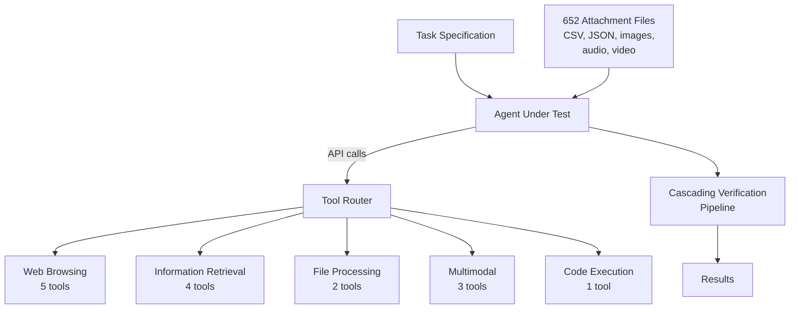
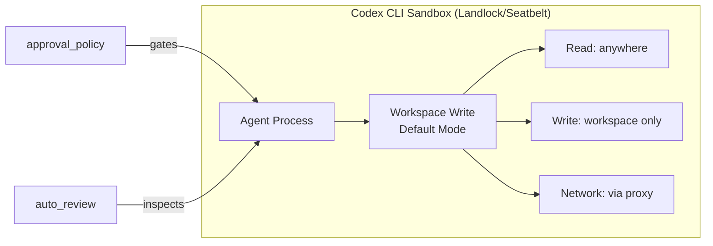

# De-Idealised Benchmarking: What AgentGym2 Reveals About Real-World Agent Readiness — and Where Codex CLI's Architecture Already Closes the Gaps


---

Most coding-agent benchmarks hand the agent a tidy toolbox, clean inputs, and a pre-specified target. AgentGym2, published by Xi et al. on 6 July 2026, strips away those comforts [^1]. Its 437 tasks across 27 domains force agents to discover tools autonomously, compose them for unseen problems, extract hidden information from noisy files, and cope with ambiguous queries laced with deliberate factual errors. Even GPT-5 manages only 46.15% Avg@3 [^1]. The paper confirms what production teams already suspect: idealised benchmarks overstate agent readiness by a wide margin.

This article unpacks AgentGym2's design, maps its failure taxonomy onto Codex CLI's current architecture (v0.143.0), and identifies where Codex's layered tooling — MCP tool search, sandbox isolation, AGENTS.md constraints, and named profiles — already addresses the gaps the benchmark exposes.

## The Idealisation Problem

Traditional agent benchmarks such as AgentBench and GAIA provide agents with pre-packaged tool sets and sanitised inputs [^1]. AgentGym2 identifies four idealisation axes that inflate scores:

1. **Pre-specified tools** — agents receive exactly the tools they need, bypassing discovery entirely.
2. **Clean inputs** — queries are unambiguous; attached files contain only relevant data.
3. **Isolated subtasks** — benchmarks test single capabilities rather than end-to-end workflows.
4. **Deterministic environments** — no network variability, no stale APIs, no permission boundaries.

By removing these four props, AgentGym2 measures what actually matters in production: can the agent figure out *what* to use, *how* to compose it, and *whether to trust* the information it retrieves?

## AgentGym2 Architecture

The benchmark provides a layered, modular runtime that decouples agents from tools and environments [^1]:



The 27-tool general-purpose toolbox spans web scraping, Google Scholar search, Wikipedia, audio transcription, image analysis, video understanding, and stateless code execution [^1]. Agents must discover which subset applies — nothing is pre-selected.

### Task Categories

| Category | Tasks | Key Challenge |
|---|---|---|
| Complex Tool Usage | 182 | Tool discovery (57) + tool composition (125) |
| Data Analysis | 57 | End-to-end EDA, cleaning, and analysis on raw data |
| Deep Search | 198 | Iterative retrieval under ambiguity (114) and bias (84) |

The deep search category is particularly brutal: 84 tasks inject deliberate factual errors into queries, simulating a user who misremembers a date or confuses two similar entities [^1]. The agent must detect and correct the error before searching.

## Results: The Production Readiness Gap

AgentGym2 tested 15 models spanning proprietary frontier systems and open-source alternatives [^1]:

| Model | Avg@3 | Pass@3 |
|---|---|---|
| GPT-5 | 46.15 | 65.68 |
| Claude Sonnet 4.5 | 37.17 | 47.82 |
| Nex-N1-671B | 32.19 | 48.52 |
| DeepSeek-V3.1 | 21.66 | 40.27 |
| Gemini 2.5 Pro | 20.67 | 35.24 |
| Kimi-K2 | 20.90 | 36.38 |
| GLM-4.6 | 20.52 | 36.62 |
| Qwen3-235B (instruct) | 14.04 | 25.40 |
| Qwen3-8B (thinking) | 5.49 | 10.53 |

The gap between Pass@3 and Avg@3 is telling: GPT-5 *can* solve 65.68% of tasks at least once across three attempts, but its *average* success rate is only 46.15% [^1]. Consistency, not peak capability, is the bottleneck.

### Failure Taxonomy

The paper identifies five dominant failure modes [^1]:

1. **Insufficient exploration** (22.8%) — the agent stops searching before finding the right tool or information source.
2. **Incorrect analysis** (24.0%) — the agent misinterprets data or draws wrong conclusions from correct retrieval.
3. **Confirmation bias in tool use** (24.7%) — the agent latches onto the first plausible tool rather than evaluating alternatives.
4. **Instruction misinterpretation** (27.0% in data analysis) — ambiguous task descriptions lead to wrong workflows.
5. **Premature search termination** (35.2% in deep search) — the agent declares success before exhausting retrieval paths.

## Mapping AgentGym2 Gaps to Codex CLI

Codex CLI's architecture (v0.143.0) already addresses several of these de-idealised dimensions, though not all equally.

### Tool Discovery: MCP Tool Search

AgentGym2's core finding — that agents struggle when tools aren't pre-specified — maps directly to Codex CLI's MCP tool search feature. Since v0.143.0, MCP tools use tool search by default when supported [^2]. Rather than loading every configured MCP server's full tool catalogue into context, Codex queries a search index to surface relevant tools on demand [^2]:

```toml
# ~/.codex/config.toml
[mcp_servers.project-tools]
command = "npx"
args = ["-y", "@myorg/project-mcp-server"]

# Tool search enabled by default since v0.143.0
# Agent discovers tools dynamically rather than receiving full catalogue
```

This mirrors AgentGym2's tool-discovery paradigm: the agent must identify what it needs rather than receiving a pre-filtered set. The critical difference is that Codex's tool search operates over a *configured* MCP universe, whilst AgentGym2 tests discovery across an unbounded internet. Teams can narrow or expand that universe per profile.

### Noise Robustness: AGENTS.md Constraints

AgentGym2's ambiguity-with-bias tasks (84 instances) test whether agents can detect and correct user errors [^1]. Codex CLI's `AGENTS.md` files provide a mechanism to encode disambiguation rules directly into the project context [^3]:

```markdown
<!-- AGENTS.md -->
## Query Handling
- When a user query contains a date, verify it against project logs before searching.
- If a file name doesn't match any known artifact, list candidates and ask for clarification.
- Never assume a branch name — always check `git branch -a` first.
```

These constraints act as guardrails against the confirmation bias and instruction misinterpretation failures that AgentGym2 highlights. They don't eliminate the problem — the agent must still follow the instructions — but they reduce the search space for correct behaviour.

### Sandbox Isolation: Preventing Cross-Task Contamination

AgentGym2 enforces strict runtime isolation to prevent cross-task contamination [^1]. Codex CLI achieves equivalent isolation through its OS-enforced sandbox:



The `workspace-write` sandbox mode restricts file writes to the current workspace directory, whilst `network_proxy` domain allowlisting controls outbound access [^4]. This is structurally similar to AgentGym2's isolation guarantee, though Codex operates at the OS kernel level (Landlock on Linux, Seatbelt on macOS) rather than at the benchmark harness level [^4].

### End-to-End Workflows: Named Profiles

AgentGym2's data analysis tasks require complete workflows — loading raw data, cleaning, analysing, and producing results [^1]. Codex CLI's named profiles bundle the model, sandbox, approval, and MCP configuration needed for specific workflow types [^5]:

```toml
# ~/.codex/config.toml
[profiles.data-analysis]
model = "gpt-5.5"
model_reasoning_effort = "xhigh"
approval_policy = "on-request"

[profiles.data-analysis.mcp_servers.pandas-server]
command = "npx"
args = ["-y", "@datascience/pandas-mcp"]

[profiles.data-analysis.mcp_servers.plotting-server]
command = "npx"
args = ["-y", "@datascience/matplotlib-mcp"]
```

Activating `codex --profile data-analysis` gives the agent a curated but not pre-specified tool environment — the MCP servers are available, but the agent must still discover which tools within them apply to the task at hand.

## The Consistency Gap

AgentGym2's most actionable finding for Codex CLI users is the consistency gap: GPT-5 succeeds 65.68% of the time in at least one of three attempts but averages only 46.15% [^1]. High performers use 20–30 interaction rounds; excessive turns do not improve results [^1].

Codex CLI offers two levers for addressing this:

**Token budgets.** The `rollout_budget` configuration caps total token spend per task, preventing the diminishing-returns tail of excessive interaction rounds [^5]:

```toml
rollout_budget = 200000  # Cap at 200K tokens
```

**Reasoning effort.** The `model_reasoning_effort` setting (available as `xhigh` for GPT-5.4 and GPT-5.5) trades latency for more thorough chain-of-thought reasoning [^5], directly targeting the "insufficient exploration" failure mode that accounts for 22.8% of AgentGym2 failures [^1].

## Where Codex CLI Falls Short

Three AgentGym2 dimensions remain only partially addressed:

1. **Multimodal tool composition.** AgentGym2 tests audio transcription, video analysis, and image understanding as first-class tool categories [^1]. Codex CLI's MCP ecosystem supports these via third-party servers, but there is no built-in multimodal tool composition framework.

2. **Error correction in queries.** The 84 ambiguity-with-bias tasks require the agent to detect and fix factual errors in the user's prompt [^1]. AGENTS.md can encode verification rules, but Codex CLI has no systematic mechanism for query-level error detection before tool invocation.

3. **Cross-domain tool discovery.** AgentGym2's 27-tool general-purpose toolbox spans domains from academic search to file processing [^1]. Codex CLI's MCP tool search operates within configured servers [^2]; discovering tools across unconfigured domains requires manual server setup.

## Practical Takeaways

For teams using Codex CLI in production:

- **Configure MCP servers broadly, then rely on tool search.** Don't pre-filter tools per task. Install domain-relevant MCP servers and let the v0.143.0 tool search surface what's needed [^2].
- **Encode disambiguation rules in AGENTS.md.** AgentGym2 shows that 27% of data analysis failures stem from instruction misinterpretation [^1]. Explicit constraints in AGENTS.md reduce this surface.
- **Use named profiles for workflow types, not individual tasks.** AgentGym2's category structure (tool usage, data analysis, deep search) maps cleanly to Codex CLI profiles with appropriate model, reasoning, and MCP configurations [^5].
- **Set token budgets to avoid diminishing returns.** AgentGym2 confirms that more interaction rounds don't help after 20–30 steps [^1]. `rollout_budget` enforces this ceiling.
- **Prefer `model_reasoning_effort = "xhigh"` for discovery-heavy tasks.** The 22.8% "insufficient exploration" failure rate drops when the model invests more reasoning tokens upfront [^1][^5].

## Conclusion

AgentGym2 is the first benchmark to systematically quantify the gap between idealised evaluation and production reality. Its results are sobering: even the best frontier model succeeds less than half the time on average when forced to discover tools, handle noise, and execute end-to-end workflows. Codex CLI's architecture — MCP tool search, OS-level sandbox isolation, AGENTS.md constraints, and named profiles — maps onto AgentGym2's de-idealised dimensions more naturally than most agent frameworks. The remaining gaps (multimodal composition, query error correction, cross-domain discovery) point to where the next round of Codex CLI features will need to land.

## Citations

[^1]: Xi, Z. et al. (2026). "AgentGym2: Benchmarking Large Language Model Agents in De-Idealized Real-World Environments." arXiv:2607.05174. [https://arxiv.org/abs/2607.05174](https://arxiv.org/abs/2607.05174)

[^2]: OpenAI. (2026). "Codex CLI Changelog — v0.143.0." [https://developers.openai.com/codex/changelog](https://developers.openai.com/codex/changelog)

[^3]: OpenAI. (2026). "Advanced Configuration — AGENTS.md." [https://developers.openai.com/codex/config-advanced](https://developers.openai.com/codex/config-advanced)

[^4]: OpenAI. (2026). "Sandbox — Codex CLI." [https://developers.openai.com/codex/concepts/sandboxing](https://developers.openai.com/codex/concepts/sandboxing)

[^5]: OpenAI. (2026). "Configuration Reference — Codex CLI." [https://developers.openai.com/codex/config-reference](https://developers.openai.com/codex/config-reference)
