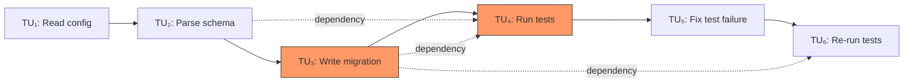
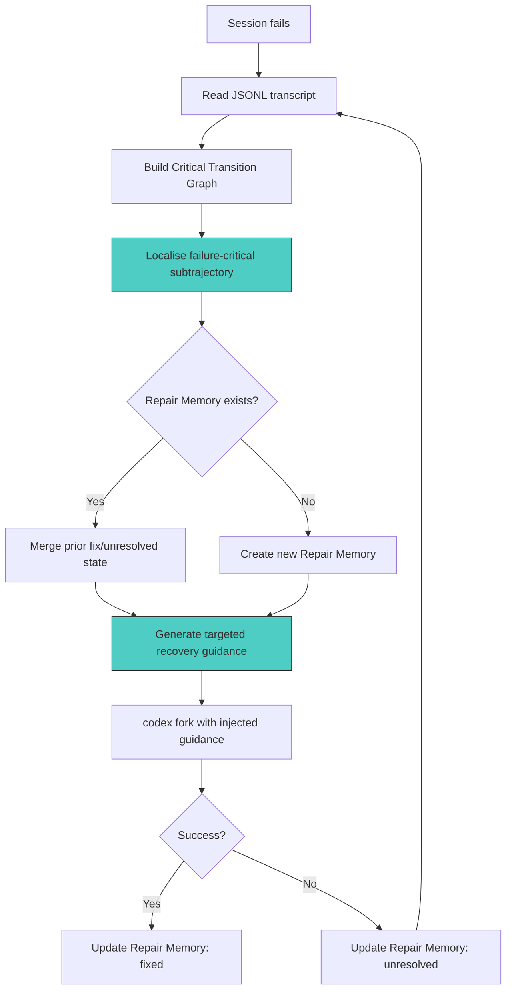

# Graph-Guided Trajectory Repair: What AgentTether Reveals About Diagnosing Agent Failures — and How to Wire Equivalent Recovery into Codex CLI


---

## The Diagnosis Deficit in Coding Agents

When a coding agent fails mid-session, what actually went wrong? The answer matters because the recovery strategy depends on it. A wrong file read in step three poisons every subsequent edit. A misunderstood API call in step twelve wastes tokens but leaves prior work intact. Yet the dominant recovery mechanisms in production agents — blind retry, outcome feedback, and self-reflection — treat all failures identically [^1].

Zhao et al.'s AgentTether framework, published on 7 July 2026 [^1], demonstrates that structuring agent trajectories as dependency-aware graphs enables dramatically better failure localisation and guided recovery. On tau-bench's 261 tasks, AgentTether repaired 69.11% of initially failed runs — a 26 percentage-point improvement over blind retry [^1]. The framework's architecture maps directly onto Codex CLI's hooks, session logs, and diagnostic infrastructure.

---

## How AgentTether Works

AgentTether sits outside the agent. It neither modifies the underlying model nor alters the execution environment. Instead, it operates as a post-run diagnostic layer with an optional runtime intervention mode [^1].

### Transition Units

Every agent trajectory is decomposed into Transition Units (TUs). Each TU bundles one complete decision-execution-feedback cycle: an observation (agent context), a belief (natural-language reasoning), an action (tool call), and feedback (execution result) [^1]. This compression reduces raw event streams to O(n) behavioural steps with stable identities — essential for attaching evidence and corrections to specific points in the trajectory.

### The Critical Transition Graph

TUs become nodes in a Critical Transition Graph (CTG). Two edge types connect them: temporal edges preserving execution order, and dependency edges linking units that share state or artefacts [^1]. The dependency edges are what distinguish this from a flat log. When a file written in TU₃ is read in TU₇ and edited in TU₁₂, the CTG captures that causal chain regardless of the intervening steps.



### Dual Anomaly Detection

Two complementary detectors identify failure-critical subtrajectories without requiring labelled failure data [^1]:

1. **Offline HGT detector** — a heterogeneous graph transformer trained on 21,143 successful trajectories from TerminalBench and SWE-smith. It learns what normal execution structure looks like and flags deviations.
2. **Real-time Isolation Forest** — scores run-local outliers across 25 graph-contextual features. This catches failures specific to the current task that the offline model has not seen.

Their union forms anomalous substructures sent to an analyst LLM (DeepSeek-V4-Pro, chosen to avoid self-evaluation bias), which returns a root cause, turning point, and recovery hints [^1].

### Repair Memory

Cross-iteration Repair Memory records which directives were successfully fixed and which remain unresolved [^1]. Before producing new guidance, the system reads memory to recover prior state; after each run, it writes updated status back. This prevents regressions on previously successful fixes whilst reinforcing persistent issues — a pattern absent from simple retry loops.

---

## Benchmark Results

The tau-bench evaluation tested 261 initially-failed tasks across three domains [^1]:

| Domain | Tasks | AgentTether | Blind Retry | Δ |
|---------|-------|-------------|-------------|-----|
| Banking | 83 | 59.04% | 26.51% | +32.53pp |
| Airline | 14 | 78.57% | 57.14% | +21.43pp |
| Retail | 26 | 96.15% | 80.77% | +15.38pp |
| **Overall** | **123** | **69.11%** | **43.09%** | **+26.02pp** |

The baselines tell a stark story. Outcome feedback (39.02%) actually *underperformed* blind retry — knowing *that* a run failed without knowing *where* or *why* can misdirect recovery [^1]. Self-reflection via Reflexion scored 44.72%, a marginal improvement [^1]. Only graph-guided localisation broke through the ceiling.

Cross-model validation on GPT-5.4 showed 65.12% repair rate on the hardest Banking domain, confirming the approach generalises beyond Qwen3.7-max [^1].

Token efficiency also improved: AgentTether consumed 1,197K end-to-end tokens versus 1,376K for blind retry — diagnosis overhead is more than offset by avoided wasted retries [^1].

---

## Mapping AgentTether to Codex CLI

Codex CLI does not ship an AgentTether equivalent, but its architecture provides the building blocks to implement the core patterns.

### Session JSONL as Transition Units

Every Codex CLI session persists a JSONL file under `~/.codex/sessions/YYYY/MM/DD/rollout-<session-id>.jsonl` [^2]. Each entry contains the event type, user prompts, model responses, tool calls, tool results, approval decisions, and token usage counters [^2]. These entries map directly to AgentTether's Transition Units — each tool-call-plus-result pair is one TU.

Tools like [codex-trace](https://github.com/PixelPaw-Labs/codex-trace) already render these JSONL files as readable turns with tool calls, token counts, and timestamps [^3]. Building a CTG constructor on top of this data requires parsing file paths and variable names from tool arguments to establish dependency edges.

### PostToolUse Hooks as Real-Time Detectors

Codex CLI's `PostToolUse` hook fires after every tool execution, including commands that exit with non-zero status [^4]. A PostToolUse hook can inspect the tool result, compare it against expected patterns, and inject diagnostic metadata — functionally equivalent to AgentTether's real-time Isolation Forest detector.

```toml
# config.toml — drift detection hook
[hooks.PostToolUse.bash]
command = "python3 ~/.codex/hooks/drift-detector.py"
```

The hook script receives the tool name, arguments, and output via environment variables. It can:

- Log structural features (file paths touched, exit codes, output length) for offline anomaly detection
- Flag semantic drift by comparing the current action against the session's stated goal
- Write findings to a side-channel file that a repair orchestrator reads between retries

### PostToolUseFailure for Failure Localisation

The `PostToolUseFailure` hook [^4] fires specifically when a tool call fails. This is the natural attachment point for AgentTether-style root cause analysis. A handler can:

1. Read the session JSONL up to the failure point
2. Build a lightweight dependency graph from file paths in prior tool calls
3. Identify the originating TU that introduced the artefact causing the failure
4. Write a diagnostic summary to Repair Memory

### Implementing Repair Memory with Session History

Codex CLI's `history.persistence = "save-all"` setting [^5] preserves complete session transcripts. Combined with `codex resume` and `codex fork` [^2], this enables a cross-iteration repair memory pattern:

```bash
# After a failed session, diagnose and retry with guidance
codex fork <session-id> --prompt "$(python3 diagnose.py <session-id>)"
```

The `diagnose.py` script reads the failed session's JSONL, builds a CTG, localises the failure, and produces targeted recovery guidance — exactly AgentTether's offline mode.

### Named Profiles for Diagnostic Sessions

Codex CLI's named profiles [^5] allow encoding diagnostic configurations as reusable presets:

```toml
# ~/.codex/profiles/diagnostic.toml
model_reasoning_effort = "xhigh"
model_reasoning_summary = "detailed"
log_dir = "~/.codex/diagnostic-logs"

[hooks.PostToolUse.bash]
command = "python3 ~/.codex/hooks/trajectory-logger.py"

[hooks.PostToolUseFailure.bash]
command = "python3 ~/.codex/hooks/failure-localiser.py"
```

Activating `codex --profile diagnostic` enables full trajectory instrumentation without altering the default workflow.

### The Runtime Intervention Gap

AgentTether's online mode applies guarded corrections *during* re-execution — injecting guidance through tool-result appending or synthetic user messages when it detects intent drift, loop behaviour, or expectation deviation [^1]. Codex CLI's hooks can observe and log, but they cannot inject synthetic messages into the conversation mid-turn. The `PreToolUse` hook can block or modify tool calls via `permissionDecision` and `updatedInput` [^4], which provides partial coverage for the "guarded intervention" pattern. Full parity would require a proposed hook that appends context to the model's next turn — an open feature request [^6].



---

## Practical Implementation: A Minimal CTG Builder

The core insight from AgentTether — that dependency edges between tool calls reveal causal failure chains — can be implemented over Codex CLI session logs with relatively little machinery:

```python
import json
from collections import defaultdict
from pathlib import Path

def build_ctg(session_path: str) -> dict:
    """Build a Critical Transition Graph from a Codex CLI JSONL session."""
    tus = []
    file_producers = defaultdict(list)  # file_path -> [tu_index]
    file_consumers = defaultdict(list)

    with open(session_path) as f:
        for line in f:
            event = json.loads(line)
            if event.get("type") == "tool_call":
                tu = {
                    "index": len(tus),
                    "tool": event["tool"],
                    "args": event.get("arguments", {}),
                    "files_written": extract_written_paths(event),
                    "files_read": extract_read_paths(event),
                }
                for fp in tu["files_written"]:
                    file_producers[fp].append(tu["index"])
                for fp in tu["files_read"]:
                    file_consumers[fp].append(tu["index"])
                tus.append(tu)

    # Build dependency edges
    dep_edges = []
    for fp, consumers in file_consumers.items():
        for producer in file_producers.get(fp, []):
            for consumer in consumers:
                if producer < consumer:
                    dep_edges.append((producer, consumer, fp))

    return {"tus": tus, "temporal_edges": list(zip(range(len(tus)-1), range(1, len(tus)))), "dependency_edges": dep_edges}
```

This structure makes failure propagation visible: when TU₁₂ fails, trace its dependency edges back to find the originating write that introduced the fault.

---

## What This Means for Codex CLI Developers

AgentTether's results carry three actionable implications:

1. **Stop blind-retrying.** The 26pp improvement over blind retry demonstrates that diagnosis before recovery is not optional overhead — it is the primary lever. Codex CLI's `codex fork` already supports injecting guidance into retries; the missing piece is automated diagnosis.

2. **Instrument your sessions.** PostToolUse hooks that log structural features (files touched, commands run, exit codes) cost almost nothing at runtime but enable offline anomaly detection. The 21,143-trajectory training set for AgentTether's offline detector suggests that even modest log corpora are sufficient.

3. **Build Repair Memory.** The single most impactful component is cross-iteration memory that tracks what worked and what did not. Without it, each retry starts from zero. Codex CLI's session persistence and fork mechanism provide the storage layer; the intelligence layer is a script that reads prior transcripts and summarises outcomes.

---

## Citations

[^1]: Zhao, C., Zhang, S., Gu, W., Sun, Y., Pei, D., Bansal, C., Rajmohan, S., & Ma, M. (2026). "AgentTether: Graph-Guided Diagnosis and Runtime Intervention for Reliable LLM Agent Operation." arXiv:2607.06273. [https://arxiv.org/abs/2607.06273](https://arxiv.org/abs/2607.06273)

[^2]: Codex CLI Log Files and Debug Tracing: The Complete Diagnostic Toolkit. Codex Knowledge Base, May 2026. [https://codex.danielvaughan.com/2026/05/21/codex-cli-log-files-debug-tracing-diagnostic-toolkit-troubleshooting/](https://codex.danielvaughan.com/2026/05/21/codex-cli-log-files-debug-tracing-diagnostic-toolkit-troubleshooting/)

[^3]: PixelPaw-Labs/codex-trace: OpenAI Codex CLI session log viewer. GitHub. [https://github.com/PixelPaw-Labs/codex-trace](https://github.com/PixelPaw-Labs/codex-trace)

[^4]: Codex CLI Hooks: Complete Guide to Events, Policy Engines and Production Patterns. Codex Knowledge Base, April 2026. [https://codex.danielvaughan.com/2026/04/15/codex-cli-hooks-complete-guide-events-policy-patterns/](https://codex.danielvaughan.com/2026/04/15/codex-cli-hooks-complete-guide-events-policy-patterns/)

[^5]: OpenAI Codex CLI Configuration Reference. OpenAI Developers. [https://developers.openai.com/codex/config-reference](https://developers.openai.com/codex/config-reference)

[^6]: Hook failure messages should identify the failing hook and expose diagnostics. GitHub Issue #27052, openai/codex. [https://github.com/openai/codex/issues/27052](https://github.com/openai/codex/issues/27052)
