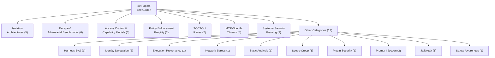
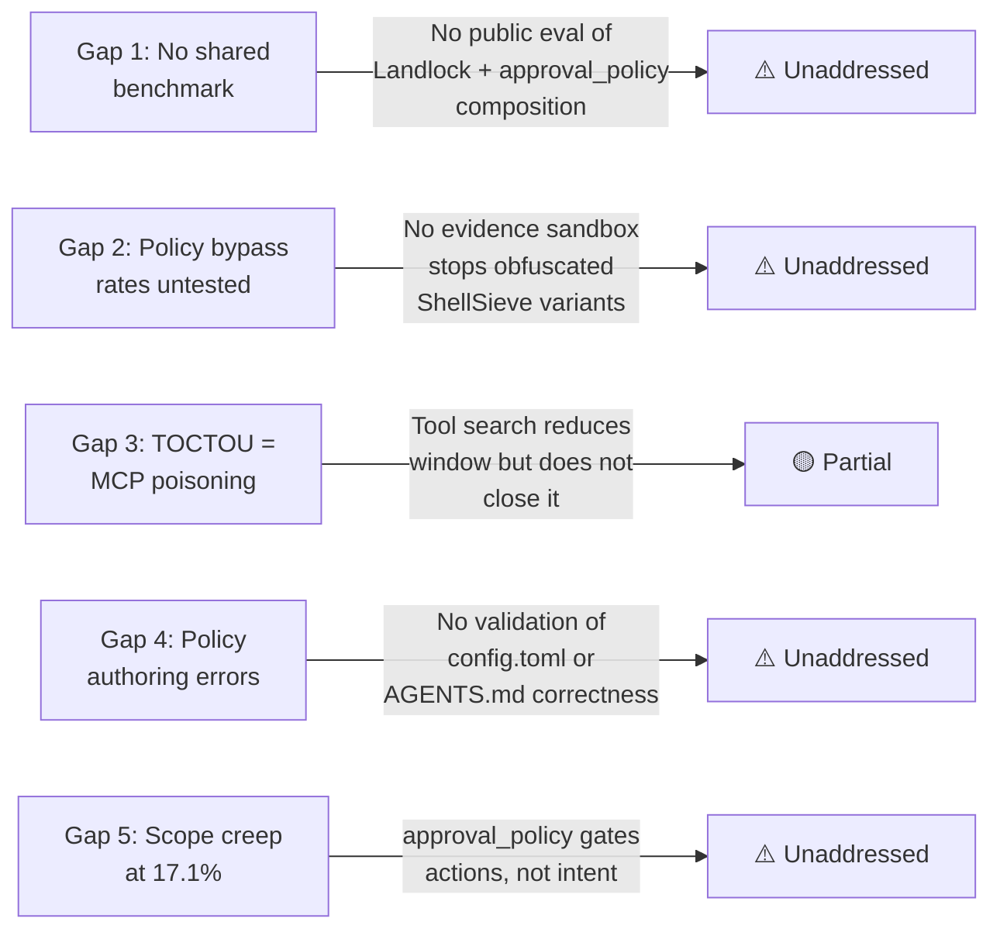

# Balkanised Execution Security: What 39 Papers Reveal About the Fragmented Defence Landscape for Coding Agents — and Where Codex CLI's Stack Stands


---

## The Problem Nobody Wants to Admit

Every major coding agent — Codex CLI, Claude Code, Cursor, Gemini CLI — ships with a sandbox. Most also ship with an approval layer. Some add hooks, network proxies, or credential delegation. Yet a systematisation-of-knowledge paper published on 7 July 2026 by Rashidi (arXiv:2607.05743) [^1] argues that these defences are developed, published, and evaluated in near-total isolation from each other. The paper synthesises 39 publications spanning 2023–2026 into 17 verified categories and surfaces five cross-cutting gaps that no single product or paper addresses. The title itself captures the diagnosis: *balkanisation*.

This article unpacks those findings, maps them against Codex CLI's current security architecture, and identifies the gaps that practitioners need to monitor.

## The Taxonomy: 17 Categories Across Four Root Causes

Rashidi organises the 39 papers into a taxonomy covering the full execution-security surface:



Underneath these categories, the paper identifies four root causes (RC1–RC4) that recur across the literature [^1]:

| Root Cause | Description |
|---|---|
| **RC1** | No structural separation between untrusted content and control input |
| **RC2** | Authorisation checked once, then trusted indefinitely |
| **RC3** | Mechanisms encode *permitted actions*, not *intended-now context* |
| **RC4** | Defences validated against author-constructed attackers, not empirical failure patterns |

RC2 is the TOCTOU problem. RC3 is the gap between static policy and dynamic intent. RC4 explains why benchmark scores overstate real-world resilience — a concern amplified by the Pwn2Own Berlin 2026 results.

## The Five Gaps

### Gap 1: No Shared Benchmark for Isolation vs Access Control

Five papers propose isolation architectures (IsolateGPT, ceLLMate, AgentBay, DeltaBox, PORTICO). Six propose access-control models. None evaluate against the same adversarial corpus [^1]. A team might deploy Codex CLI's Landlock/Seatbelt sandbox *and* its `approval_policy` graduated reference monitor, but there is no published evaluation measuring how these two layers compose under attack.

### Gap 2: Policy Bypass Rates Never Re-tested Against Isolation

ShellSieve and related work demonstrate that command denylists fail at rates between 69.0% and 98.6% [^1]. Yet no isolation paper re-evaluates its sandbox against these empirically-derived bypass techniques. The implication: your sandbox might stop a naïve `rm -rf /`, but nobody has published evidence that it stops the obfuscated variants that consistently defeat policy enforcement.

### Gap 3: TOCTOU and MCP Poisoning Are the Same Problem

Two papers study time-of-check-to-time-of-use races in agent execution. Four papers study MCP-specific threats including tool poisoning, where a malicious MCP server returns different tool descriptions between discovery and invocation [^2]. Rashidi argues these are structurally identical — both exploit the gap between when a permission decision is made and when the authorised action executes — yet the two research communities do not cite each other [^1].

### Gap 4: Policy Authoring Errors Are Unmeasured

Every enforcement mechanism assumes the policy itself is correct. No paper studies how often developers write incorrect `config.toml` rules, misconfigure `approval_policy`, or deploy contradictory `AGENTS.md` constraints [^1]. Given that Rao & Kumar found 37% of `AGENTS.md` files fall below a structural completeness threshold [^3], this gap is likely significant.

### Gap 5: Scope Creep at 17.1% Remains Unaddressed

Execution provenance work measured that prompt phrasing alone raised Claude Code's overeager action rate from 0.0% to 17.1% [^1]. No access-control mechanism currently detects or prevents this category of out-of-scope behaviour, where the agent does what it was *permitted* to do but *not asked* to do.

## Real-World Validation: Pwn2Own Berlin 2026

The paper's theoretical gaps became tangible at Pwn2Own Berlin 2026 (14–16 May), where the AI Toolchain category included Coding Agents for the first time [^4]. OpenAI Codex was exploited three separate times by three different research teams:

- Compass Security used a single CWE-150 (Improper Neutralisation of Escape, Meta, or Control Sequences) bug to exploit Codex, earning \$40,000 [^4].
- Doyensec's maitai targeted Codex using a technique that was previously known to the vendor (\$10,000) [^4].
- Viettel Cyber Security exploited Claude Code using a similarly vendor-known technique (\$20,000) [^4].

The total payout across all categories reached \$1,298,250 for 47 zero-days [^4]. The confirmed CVEs affecting production agent harnesses include CVE-2025-53773 (command injection in GitHub Copilot, CVSS 7.8), CVE-2025-59536 (Claude Code startup trust-dialog bypass, CVSS 8.8), and CVE-2026-21852 (Claude Code project-load data exfiltration, CVSS 7.5) [^1].

## How Codex CLI's Security Stack Maps to the Taxonomy

Codex CLI implements defences across several of Rashidi's categories. Here is the mapping:

### Isolation Architecture (Category 1)

Codex CLI uses platform-native kernel sandboxing [^5]:

- **Linux**: `bwrap` + `seccomp-BPF` (Landlock from kernel 5.13+)
- **macOS**: `sandbox-exec` with Seatbelt policy profiles
- **Windows**: WSL2 Linux sandbox or native Windows sandbox

Three modes control the sandbox surface:

```toml
# config.toml
sandbox_mode = "workspace-write"  # default: read everywhere, write in cwd
# sandbox_mode = "read-only"      # no writes, no commands
# sandbox_mode = "danger-full-access"  # removes all restrictions
```

Protected paths (`.git`, `.agents`, `.codex`) remain read-only regardless of mode [^5].

### Access Control (Category 3)

The `approval_policy` provides a graduated reference monitor [^5]:

```toml
approval_policy = "on-request"  # interactive approval for escalations
# approval_policy = "never"     # disables prompts
# approval_policy = "untrusted" # only known-safe reads auto-approved
```

Granular policies allow per-category control:

```toml
[approval_policy]
granular = { file_write = "on-request", network = "always-deny" }
```

### Network Egress Control (Category 11)

Default: network access is disabled. When enabled, the `network_proxy` feature constrains outbound traffic through domain allowlisting [^5]:

```toml
[features.network_proxy]
enabled = true
domains = { "api.openai.com" = "allow", "*.npmjs.org" = "allow" }
allow_local_binding = false
```

Domain rules support exact hosts, `*.domain.com` (subdomains only), and `**.domain.com` (apex plus subdomains) [^5].

### Auto-Review (Category 12 Adjacent)

Setting `approvals_reviewer = "auto_review"` routes approval requests through an automated reviewer agent that evaluates actions for data exfiltration, credential probing, and destructive operations before execution [^5]. This addresses part of the static-analysis gap, though the reviewer operates at the action level rather than on generated code.

### MCP Threat Surface (Category 6)

As of v0.143.0, MCP tools use tool search by default [^6], which defers tool description loading and reduces the window for tool-poisoning attacks. The `requirements.toml` fleet-wide MCP allowlist provides organisational control over which MCP servers are permitted [^5].

## Where Codex CLI Falls Short

Mapping Codex CLI against Rashidi's five gaps reveals specific weaknesses:



**TOCTOU (Gap 3)** is the most tractable. Codex CLI's `PreToolUse` hook fires before every tool invocation and could theoretically re-validate the tool description against the original discovery response. Today, however, the hook infrastructure does not expose tool description metadata — only the tool name and arguments [^5]. A community proposal for a `PostToolUseFailure` hook (GitHub issue #24907) would add partial coverage but still would not address the validate-then-act race.

**Scope creep (Gap 5)** is the hardest to close. The `approval_policy` is permission-based (RC3): it encodes what the agent *may* do, not what it *should* do right now. Detecting that the agent is performing permitted-but-unsolicited work requires intent modelling that sits outside the current hook and policy system.

## Practitioner Implications

### Audit Your Composed Defences

Do not assume that sandbox plus approval plus network proxy equals security. Rashidi's Gap 1 demonstrates that no published evaluation tests these layers in composition [^1]. Run your own adversarial testing against the full stack.

### Test Against Empirical Bypasses, Not Toy Examples

SecureVibeBench found that agents produce correct *and* secure solutions only 23.8% of the time [^1]. If your threat model assumes the agent generates safe code because it runs in a sandbox, the sandbox is solving the wrong problem.

### Monitor MCP Tool Descriptions

With MCP tool search now default in v0.143.0 [^6], the tool description loading is deferred — but once loaded, descriptions are cached and trusted for the session. Consider implementing a `PreToolUse` hook that checksums tool descriptions against a known-good manifest:

```bash
#!/usr/bin/env bash
# hooks/pre-tool-use-mcp-verify.sh
TOOL_NAME="$1"
EXPECTED_HASH=$(grep "^${TOOL_NAME}:" .codex/tool-manifest.sha256 | cut -d: -f2)
# If manifest exists and hash mismatches, deny
if [ -n "$EXPECTED_HASH" ]; then
  ACTUAL_HASH=$(codex mcp describe "$TOOL_NAME" 2>/dev/null | sha256sum | cut -d' ' -f1)
  if [ "$ACTUAL_HASH" != "$EXPECTED_HASH" ]; then
    echo "DENY: tool description changed mid-session" >&2
    exit 1
  fi
fi
```

⚠️ This approach is illustrative — `codex mcp describe` is not a current subcommand. The point is that the hook infrastructure needs to expose tool metadata for this class of defence to become viable.

### Watch for Config Drift

Given Gap 4's finding that policy authoring errors are unstudied, treat your `config.toml` and `AGENTS.md` as security-critical artefacts. Version-control them, review changes, and consider a CI check that validates structural completeness against the criteria in Rao & Kumar [^3].

## What Comes Next

The balkanisation diagnosis is uncomfortable but actionable. The immediate priorities for the Codex CLI ecosystem are:

1. **Publish composed-layer evaluations** — test Landlock + `approval_policy` + `network_proxy` against ShellSieve-class bypasses
2. **Expose tool metadata in hooks** — let `PreToolUse` inspect and validate tool descriptions, not just names and arguments
3. **Add intent-scope detection** — move beyond permission-based gating towards checking whether an action aligns with the current task, not just whether it is allowed
4. **Validate policy files** — a `codex doctor --security` subcommand that checks `config.toml` and `AGENTS.md` against known completeness criteria

The execution-security research exists. The defences exist. What is missing is the bridge between them.

---

## Citations

[^1]: Rashidi, M. (2026). *The Balkanization of Execution-Security Research for AI Coding Agents: Isolation, Access Control, and Time-of-Check-to-Time-of-Use Vulnerabilities*. arXiv:2607.05743. [https://arxiv.org/abs/2607.05743](https://arxiv.org/abs/2607.05743)

[^2]: Narisetty, N. et al. (2026). *Out-of-Band Prompt Injection Defences: CaMeL, FIDES, Progent, RTBAS, FORGE*. arXiv:2606.26479. [https://arxiv.org/abs/2606.26479](https://arxiv.org/abs/2606.26479)

[^3]: Rao, S. & Kumar, A. (2026). *Structural Completeness of AGENTS.md Configuration Files*. arXiv:2604.21090. [https://arxiv.org/abs/2604.21090](https://arxiv.org/abs/2604.21090)

[^4]: Zero Day Initiative. (2026). *Pwn2Own Berlin 2026 Results*. [https://www.thezdi.com/blog/2026/5/13/pwn2own-berlin-2026-day-one-results](https://www.thezdi.com/blog/2026/5/13/pwn2own-berlin-2026-day-one-results)

[^5]: OpenAI. (2026). *Agent Approvals & Security — Codex CLI*. [https://developers.openai.com/codex/agent-approvals-security](https://developers.openai.com/codex/agent-approvals-security)

[^6]: OpenAI. (2026). *Codex CLI v0.143.0 Release Notes*. [https://github.com/openai/codex/releases/tag/rust-v0.143.0](https://github.com/openai/codex/releases/tag/rust-v0.143.0)

[^7]: BleepingComputer. (2026). *Hackers earn \$1,298,250 for 47 zero-days at Pwn2Own Berlin 2026*. [https://www.bleepingcomputer.com/news/security/hackers-earn-1-298-250-for-47-zero-days-at-pwn2own-berlin-2026/](https://www.bleepingcomputer.com/news/security/hackers-earn-1-298-250-for-47-zero-days-at-pwn2own-berlin-2026/)
