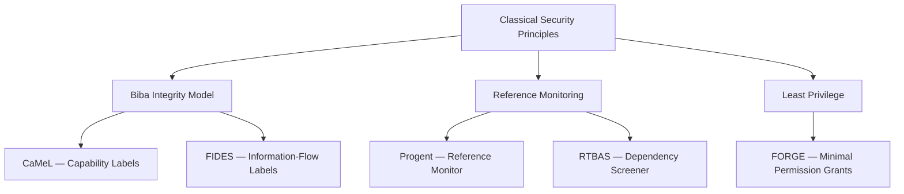
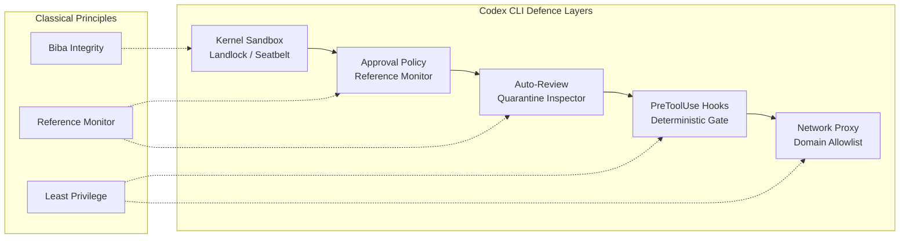

# Out-of-Band Prompt Injection Defences: What CaMeL, FIDES, and Progent Reveal About Deterministic Agent Security — and How Codex CLI's Sandbox-Approval-Hook Stack Already Implements the Pattern


---

Prompt injection remains the number-one vulnerability on the OWASP Top 10 for LLM Applications [^1]. For tool-using coding agents the risk is acute: a single poisoned README or compromised MCP server response can hijack the agent's plan, exfiltrate secrets, or corrupt the codebase. Two years of research have now converged on a decisive insight — training the model to refuse malicious instructions is insufficient; security must be enforced *outside* the model with deterministic policies that mediate every action the agent takes [^2].

A June 2026 paper from Narisetty et al. (arXiv:2606.26479) surveys five such "out-of-band" defence systems — CaMeL, FIDES, Progent, RTBAS, and FORGE — organises them under classical integrity-protection theory, and warns that every one of them has been validated only against static benchmarks [^2]. This article unpacks their shared architecture, maps each mechanism to Codex CLI's existing defence stack, and identifies the gaps that remain.

## The In-Band Defence Trap

In-band defences embed security logic inside the model's own reasoning: system prompts that say "ignore injected instructions", fine-tuning on adversarial examples, or output classifiers that scan for suspicious completions. They are easy to deploy and easy to defeat. A 2025 study by 14 researchers from OpenAI, Anthropic, Google DeepMind, and ETH Zurich — "The Attacker Moves Second" — showed that 500 human red-teamers achieved a 100 per cent success rate against every prompt-layer defence tested [^3]. Palo Alto Networks Unit 42 documented 22 distinct injection techniques embedded in ordinary web pages, targeting any agent that processes web content [^4].

The conclusion is stark: if the LLM is both the executor and the security boundary, an attacker who controls any input the model reads can control the model's actions.

## Out-of-Band: Security Outside the Model

Out-of-band defences relocate the trust boundary from the model to a deterministic runtime layer. The model proposes actions; a policy engine decides whether they execute. Narisetty et al. organise the five major systems under three classical security principles [^2]:



### CaMeL: Capability-Based Isolation

CaMeL (arXiv:2503.18813) separates execution into a *Privileged LLM* that generates plans from trusted user queries and a *Quarantined LLM* that processes untrusted data without tool access [^5]. A custom interpreter tracks data provenance through every variable, blocking any tool call where tainted data has reached a control-flow position. On AgentDojo, CaMeL reports near-total elimination of indirect prompt injection [^5].

### FIDES: Information-Flow Control

Microsoft's FIDES (arXiv:2505.23643) applies mandatory integrity labels to every data element entering the agent's context [^6]. At each tool call, the planner checks a security policy confirming the operation is permitted given the integrity level of the data involved. Risky tool outputs are stored in quarantined variables, preventing them from contaminating subsequent reasoning. With appropriate policies, FIDES stops all prompt injection attacks in its benchmark suite [^6].

### Progent: Privilege-Controlled Reference Monitor

Progent (arXiv:2504.11703) interposes a reference monitor between the agent and its tools, enforcing fine-grained privilege policies that specify which tools may be called, with which arguments, under which conditions [^7]. Narisetty et al.'s evaluation reduced mean attack success from 25.8 per cent to 4.2 per cent — a sixfold decrease — even under hand-crafted adaptive attacks (2.6 per cent success rate) [^2].

### RTBAS: Dependency Screening

RTBAS (arXiv:2502.08966) adapts information-flow control specifically for tool-based agent systems, using two novel dependency screeners — an LM-as-judge and an attention-based saliency detector — to identify when untrusted data influences a tool call [^8]. It prevents all targeted attacks on AgentDojo with only a 2 per cent utility loss [^8].

### FORGE: Minimal Permission Grants

FORGE applies least-privilege principles, granting each agent step only the permissions strictly required for the current subtask [^2]. This limits blast radius: even if an injection succeeds, the compromised step lacks the credentials to cause wider damage.

## The Static Benchmark Warning

Narisetty et al.'s sharpest contribution is methodological. Every system above was validated on AgentDojo — a fixed set of injection attempts. The same methodology made in-band defences look strong until adaptive, defence-aware attacks broke twelve of them at over 90 per cent success [^2]. The paper tested Progent against an open-weight agent (Qwen2.5-7B) on a single H200 and found encouraging resistance, but the authors caution this is "one small-scale data point on a weak model with a single black-box attack template" [^2]. White-box gradient-based attacks (GCG-style) remain entirely unexplored against out-of-band systems.

## Mapping to Codex CLI's Defence Stack

Codex CLI does not implement CaMeL or FIDES directly, but its layered architecture instantiates the same classical principles — often with stronger OS-level enforcement.

### Sandbox: The Biba Layer

Codex CLI's `workspace-write` sandbox uses Landlock LSM and seccomp-BPF on Linux, Seatbelt on macOS, and restricted tokens on Windows to enforce mandatory access control at the kernel level [^9]. Unlike CaMeL's interpreter-level capability tracking, Codex CLI's confinement operates below the language runtime:

```toml
# config.toml — sandbox configuration
sandbox_mode = "workspace-write"

[sandbox_workspace_write]
writable_roots = ["/home/dev/project"]
network_access = false
```

Network access is disabled by default in the sandbox. Even if an injection convinces the model to run `curl` with exfiltration payloads, the kernel blocks the syscall [^9].

### Approval Policy: The Reference Monitor

The `approval_policy` configuration implements a graduated reference monitor analogous to Progent's privilege controller [^10]:

```toml
# Graduated approval enforcement
approval_policy = "on-request"
```

Three modes — `untrusted` (pause on everything), `on-request` (pause on sensitive operations), and `never` (minimal pauses) — plus granular per-category overrides provide the same mediation surface that Progent enforces programmatically [^10]. Every shell command proposed by the model passes through this gate before execution.

### Auto-Review: The Quarantine Inspector

The `auto_review` subagent operates as an independent LLM evaluator — conceptually similar to FIDES' quarantined LLM — that inspects proposed actions against conversation context before approval [^10]:

```toml
approvals_reviewer = "auto_review"

[auto_review]
policy = "Block any command that accesses files outside the workspace or makes network requests to unknown domains"
```

This provides a second opinion from a model instance that has not been exposed to the potentially poisoned tool outputs that the primary agent has consumed.

### PreToolUse Hooks: Deterministic Policy Enforcement

`PreToolUse` lifecycle hooks execute arbitrary scripts before each tool dispatch, returning a policy decision [^11]. This is the closest Codex CLI analogue to RTBAS's dependency screening:

```bash
#!/bin/bash
# .codex/hooks/pre-tool-use.sh
# Block commands matching known exfiltration patterns
COMMAND="$1"
if echo "$COMMAND" | grep -qE '(curl|wget|nc)\s.*\.(ru|cn|tk)'; then
    echo '{"decision": "reject", "reason": "Blocked suspicious network command"}'
    exit 0
fi
echo '{"decision": "approve"}'
```

However, hooks reliably fire only for shell (Bash) tool calls — not for `apply_patch` file edits or most MCP tool calls [^11]. This is the most significant coverage gap relative to the academic systems.

### Network Proxy: Domain-Level Least Privilege

The `network_proxy` configuration implements FORGE-style least privilege for network access, allowlisting specific domains rather than granting blanket connectivity [^9]:

```toml
[network_proxy]
allowed_domains = ["api.github.com", "registry.npmjs.org"]
```

### Defence-in-Depth Summary



## The Gaps

Three weaknesses separate Codex CLI's current implementation from the full out-of-band vision:

1. **No data-flow taint tracking.** CaMeL and FIDES track which variables contain untrusted data and block tainted values from reaching control-flow positions. Codex CLI has no equivalent — the model freely mixes trusted instructions with untrusted tool outputs in its context window. The ADI research (arXiv:2607.05120) confirmed this gap, showing 49.1 per cent baseline attack success against agent systems [^12].

2. **Incomplete hook coverage.** PreToolUse hooks fire for shell commands but not for file-edit patches or MCP tool calls [^11]. An injection that triggers `apply_patch` to write malicious code bypasses the deterministic gate entirely.

3. **No adaptive attack testing.** Like the academic systems Narisetty et al. critique, Codex CLI's defences have not been subjected to defence-aware adaptive attacks. The Vera framework (arXiv:2607.01793) found 84.1 per cent overall attack success rate against Codex CLI across 1,600 executable safety cases, with a +4.7 percentage-point vulnerability increase under multi-channel attacks [^13].

## Practical Hardening Configuration

Until Codex CLI gains native taint tracking, a defence-in-depth configuration combining all available layers provides the strongest posture:

```toml
# config.toml — hardened profile
sandbox_mode = "workspace-write"
approval_policy = "on-request"
approvals_reviewer = "auto_review"

[sandbox_workspace_write]
writable_roots = ["."]
network_access = false

[auto_review]
policy = """
Reject any action that:
- Accesses files outside the declared workspace
- Makes network requests to domains not in the allowlist
- Modifies .git/, .env, or credential files
- Executes base64-decoded or obfuscated commands
"""

[network_proxy]
allowed_domains = ["api.github.com"]
```

Pair this with an AGENTS.md constraint block:

```markdown
## Security Constraints
- NEVER execute commands containing base64 decode pipelines
- NEVER modify files matching *.env, *.pem, *.key
- NEVER access URLs not in the network_proxy allowlist
- All shell commands must be human-readable; no obfuscation
```

AGENTS.md constraints are in-band — the model can be convinced to ignore them — but they complement the deterministic layers by raising the baseline reasoning effort an attacker must overcome [^14].

## What Comes Next

The out-of-band defence paradigm is maturing rapidly. The next steps for Codex CLI and similar tools are clear from the research:

- **Taint tracking for tool outputs** — labelling data provenance through the context window, as CaMeL and FIDES do, would close the largest remaining gap.
- **Universal hook coverage** — extending PreToolUse/PostToolUse to fire for all tool types, including file edits and MCP calls, would make deterministic policy enforcement comprehensive.
- **Adaptive red-teaming** — until defences are tested against optimised, defence-aware attacks (including white-box gradient-based methods like GCG), their true resilience remains unknown [^2].

The academic consensus is that deterministic out-of-band enforcement is the right architecture. Codex CLI already implements significant portions of it at the OS kernel level — a stronger foundation than most research prototypes. The remaining work is filling the coverage gaps and subjecting the full stack to rigorous adversarial evaluation.

## Citations

[^1]: OWASP, "OWASP Top 10 for LLM Applications," 2025. [https://owasp.org/www-project-top-10-for-large-language-model-applications/](https://owasp.org/www-project-top-10-for-large-language-model-applications/)

[^2]: Narisetty, P. et al., "Adaptive Evaluation of Out-of-Band Defenses Against Prompt Injection in LLM Agents," arXiv:2606.26479, June 2026. [https://arxiv.org/abs/2606.26479](https://arxiv.org/abs/2606.26479)

[^3]: OpenAI, Anthropic, Google DeepMind, ETH Zurich, Northeastern, "The Attacker Moves Second," 2025. Referenced in CaMeL literature and Narisetty et al.

[^4]: Palo Alto Networks Unit 42, "Large-Scale Prompt Injection in Live Web Content," March 2026. Referenced in CaMeL and FIDES analyses.

[^5]: Debenedetti, E. et al., "Defeating Prompt Injections by Design," arXiv:2503.18813, March 2025. [https://arxiv.org/abs/2503.18813](https://arxiv.org/abs/2503.18813)

[^6]: Costa, A. et al., "Securing AI Agents with Information-Flow Control (FIDES)," arXiv:2505.23643, May 2025. [https://arxiv.org/abs/2505.23643](https://arxiv.org/abs/2505.23643)

[^7]: He, D. et al., "Progent: Securing AI Agents with Privilege Control," arXiv:2504.11703, April 2025. [https://arxiv.org/abs/2504.11703](https://arxiv.org/abs/2504.11703)

[^8]: Kore, S. N. B. et al., "RTBAS: Defending LLM Agents Against Prompt Injection and Privacy Leakage," arXiv:2502.08966, February 2025. [https://arxiv.org/abs/2502.08966](https://arxiv.org/abs/2502.08966)

[^9]: OpenAI, "Codex CLI Advanced Configuration — Sandbox," OpenAI Developers, 2026. [https://developers.openai.com/codex/config-advanced](https://developers.openai.com/codex/config-advanced)

[^10]: OpenAI, "Codex CLI Advanced Configuration — Approval Policy and Auto-Review," OpenAI Developers, 2026. [https://developers.openai.com/codex/config-advanced](https://developers.openai.com/codex/config-advanced)

[^11]: Agentic Control Plane, "Codex CLI Hook Governance: What Works Today (and What Doesn't)," 2026. [https://agenticcontrolplane.com/blog/codex-cli-hooks-reference](https://agenticcontrolplane.com/blog/codex-cli-hooks-reference)

[^12]: Choi, S. et al., "Agent Data Injection," arXiv:2607.05120, July 2026. [https://arxiv.org/abs/2607.05120](https://arxiv.org/abs/2607.05120)

[^13]: Feng, Z. et al., "Vera: Safety Testing LLM Agents at Scale," arXiv:2607.01793, July 2026. [https://arxiv.org/abs/2607.01793](https://arxiv.org/abs/2607.01793)

[^14]: OpenAI, "AGENTS.md — Codex CLI," OpenAI Developers, 2026. [https://developers.openai.com/codex/cli/agents-md](https://developers.openai.com/codex/cli/agents-md)
