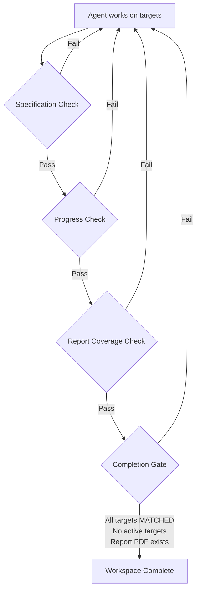

# Paper Replication with Coding Agents: What 158 Matched Targets Reveal About Evidence-Based Scientific Verification — and How to Wire the Workflow in Codex CLI


---

Machine learning's reproducibility problem is well-documented: over 70 per cent of researchers have tried and failed to reproduce another scientist's experiments [^1], and AI-specific code generation carries a 31.7 per cent failure rate with a 13.5× dependency gap [^2]. OpenAI's PaperBench showed the best coding agent scoring just 21.0 per cent on replicating ICML 2024 papers, against a human expert baseline of 41.4 per cent [^3]. A new study published on 2 July 2026 challenges that ceiling — and it does so by treating the coding agent not as a one-shot code generator but as a structured evidence-gathering instrument.

## The Paper-Replication Workflow

Hans and Bilionis (arXiv:2607.02134) introduced *Paper-replication*, a coding-agent skill that replaces the prompt-and-pray approach with a claim-target-evidence architecture [^4]. Rather than asking an agent to "replicate this paper," the workflow decomposes each paper into individually trackable *targets* — specific computational claims such as error magnitudes, coefficient values, posterior distributions, or phase portraits — and requires the agent to produce a structured *evidence bundle* for each one.

The evidence bundle for each target $j$ comprises five components [^4]:

- **Candidate output** ($\hat{y}_j$) — the agent's reconstructed result
- **Run record** ($R_j$) — execution metadata and command history
- **Provenance** ($P_j$) — links to paper justifications and method sources
- **Comparison** ($C_j$) — direct comparison against paper-reported claims
- **Report inclusion** ($G_j$) — where matched evidence appears in the replication report

This structure forces the agent to maintain an auditable chain from paper claim to generated evidence, rather than producing plausible-looking figures with no provenance.

## Architecture: Skills, Not Prompts

The implementation uses Codex CLI's SKILL.md standard as its instruction layer [^4] [^5]. The skill folder contains:

```
paper-replication/
├── SKILL.md                    # Agent instructions (Codex CLI / Claude Code)
├── scripts/
│   └── paper_replication.py    # Workspace utilities
└── spec/
    └── paper_inventory.json    # Indexed paper sources and assets
```

The Python utilities manage a set of persistent workspace files that serve as the agent's structured memory:

- **Reproduction matrix** — target definitions and status tracking
- **Task ledger** — active target and unresolved work queue
- **Specification files** — method reconstruction and assumptions
- **Run records** — execution metadata per target
- **Provenance records** — output-to-implementation links

This is a textbook application of Codex CLI's three-layer skill architecture [^5]: Layer 1 (description, ~100 tokens) stays permanently in context; Layer 2 (SKILL.md body, <5,000 tokens) loads on activation; Layer 3 (scripts, assets) loads on demand. The Paper-replication skill keeps its persistent state in workspace files rather than the context window, sidestepping the stale-context problem that fixed-interval compaction only partially addresses [^6].

## Validation Gates: External Checks the Agent Cannot Circumvent

The critical innovation is the four-stage external validation mechanism that runs *outside* the agent's reasoning loop [^4]:



Each check enforces a specific integrity constraint:

1. **Specification check** — verifies manifest, task ledger, and specification files exist
2. **Progress check** — confirms task-ledger-to-matrix agreement, detects copied paper material via hash comparison, validates comparison evidence
3. **Report coverage check** — ensures every matched target appears in the final replication report
4. **Completion gate** — requires all recorded targets in MATCHED status, no active targets remaining, all prior checks passed, and a report PDF generated

The completion predicate is conjunctive — every condition must hold [^4]. This maps directly to Codex CLI's hook architecture: each check can be implemented as a `PostToolUse` or `Stop` hook that runs deterministic validation before the agent can declare completion.

## Results: 12 Runs, 4 Papers, 158 Targets

The study evaluated Paper-replication across four scientific ML papers spanning physics-informed neural networks (PINNs), sparse system identification (SINDy), and physics-informed information field theory (PIFT), with three independent runs per paper using Codex CLI with GPT-5.4 at Extra High reasoning [^4].

| Paper | Targets per run | Scalar fidelity | Median time (h) |
|-------|----------------|-----------------|-----------------|
| PINN-I | 8 (consistent) | 0.79 posterior probability | 5.0 |
| PINN-II | 9–15 (variable) | 0.90 posterior probability | 6.9 |
| SINDy | 20 (consistent) | 0.73 posterior probability | 1.9 |
| PIFT | 8–25 (variable) | — | 2.2 |

All 12 runs passed the completion gate. All 158 recorded targets reached MATCHED status. Of 39 scalar observations against 13 standardised numeric anchors, 37 fell within paper-reported thresholds [^4].

The variation in target counts across runs (ratio up to 3.1× for PIFT) reflects genuine differences in how the agent decomposed replication scope — a feature, not a bug, since different decompositions still converged on equivalent evidence.

## Why Prompts Alone Fail

The paper explicitly catalogues four failure modes that prompt-only approaches cannot prevent [^4]:

1. **Premature completion** — declaring replication finished without covering all claims
2. **Unprovenanced figures** — treating plausible outputs as evidence without method links
3. **Material copying** — passing paper-provided material as agent-generated results (detected by hash comparison in the progress check)
4. **Post-hoc acceptance** — changing acceptance criteria after observing results

Each failure mode requires *external state* to detect — the agent's own judgement is insufficient. This aligns with Vera's evidence-grounded verification hierarchy (environment state > tool-call records > agent responses) [^7] and the broader finding that coding agent self-reporting grows less reliable over time [^8].

## Wiring Paper-Replication in Codex CLI

### Skill Installation

Place the skill in Codex CLI's skill directory:

```bash
# Personal installation
cp -r paper-replication/ ~/.codex/skills/paper-replication/

# Project-scoped installation
cp -r paper-replication/ .codex/skills/paper-replication/
```

The skill activates when Codex detects a paper-replication task, or can be invoked explicitly with `$paper-replication` in the prompt [^5].

### Goal Mode for Long-Running Replication

Paper replication runs ranged from 1.2 to 13.0 hours [^4]. Codex CLI's goal mode (GA since v0.133.0) is purpose-built for this duration [^9]:

```bash
codex --goal "Replicate computational claims from paper.pdf using Paper-replication skill"
```

Goal mode maintains a persistent plan-act-test-review-iterate cycle with three trust files (GOAL.md, VERIFY.md, PROGRESS.md) that complement the Paper-replication workspace structure [^9]. The `rollout_budget` parameter (v0.142.0) provides a token ceiling to prevent unbounded cost during multi-hour runs [^10].

### Hook-Based Validation Gates

Map the four-stage validation to Codex CLI hooks in `config.toml`:

```toml
[hooks.PostToolUse.paper-spec-check]
command = "python scripts/paper_replication.py check-spec"
description = "Verify specification files exist"
on_failure = "block"

[hooks.PostToolUse.paper-progress-check]
command = "python scripts/paper_replication.py check-progress"
description = "Validate target-ledger agreement and detect material copying"
on_failure = "block"

[hooks.Stop.paper-completion-gate]
command = "python scripts/paper_replication.py check-completion"
description = "Enforce conjunctive completion predicate"
on_failure = "block"
```

The `Stop` hook is critical: it fires when the agent attempts to end its session, enforcing the completion gate externally [^10].

### AGENTS.md Constraints

Define replication-specific constraints in `AGENTS.md`:

```markdown
## Paper Replication Protocol

- Every computational claim from the paper MUST be registered as a target
  in the reproduction matrix before implementation begins
- Every target MUST have a complete evidence bundle (output, run record,
  provenance, comparison, report inclusion) before status can be MATCHED
- NEVER copy figures, tables, or numerical values directly from the paper
  source material — all evidence must be independently generated
- NEVER declare replication complete without all targets in MATCHED status
- Record all superseded executions with reason for replacement
```

### Model and Reasoning Configuration

The original study used GPT-5.4 at Extra High reasoning [^4]. Configure this in a named profile:

```toml
[profiles.paper-replication]
model = "o4-mini"  # or GPT-5.4 for full fidelity
model_reasoning_effort = "high"
rollout_budget = 500000
model_auto_compact_token_limit = 80000
```

The `model_auto_compact_token_limit` setting manages context compaction during long replication runs, complementing the workspace-file approach where persistent state lives outside the context window [^6] [^10].

## Context: The Broader Replication Landscape

Paper-replication's 100 per cent completion rate with 158/158 matched targets stands in contrast to other benchmarks:

- **PaperBench** (OpenAI, ICML 2025): best agent scored 21.0 per cent on 8,316 granular tasks across 20 ICML papers [^3]
- **SocSci-Repro-Bench** (June 2026): Claude Code outperformed Codex on 221 social science reproduction tasks, but agents showed susceptibility to confirmatory specification search through prompt framing [^11]
- **NatureBench** (June 2026): evaluated agents against published state-of-the-art results from Nature-family papers [^12]

The key differentiator is *scope control*. PaperBench measures breadth across 20 diverse papers with 8,316 tasks. Paper-replication measures depth across 4 carefully selected papers with structured verification. Both are valid — they answer different questions. The practical lesson for Codex CLI users is that structured skill-based workflows with external validation gates dramatically outperform open-ended prompting for replication tasks.

## Limitations and Open Questions

Several caveats apply. The four replicated papers were authored or co-authored by one of the study's authors, raising questions about implicit familiarity effects in skill design [^4]. Judgement agreement varied significantly — 95 per cent for SINDy but only 46 per cent for PINN-II — suggesting that target decomposition quality drives outcome more than raw model capability [^4]. The study ran on a single hardware configuration (MacBook Pro M4 Max with access to H100 GPU nodes) [^4], and reproducibility across different compute environments remains untested.

⚠️ The 100 per cent completion rate applies to a curated set of four scientific ML papers with well-defined computational claims. Generalisation to papers with qualitative claims, proprietary data dependencies, or under-specified methods is unverified.

## What This Means for Codex CLI Users

The Paper-replication workflow demonstrates a pattern that extends well beyond scientific computing: **decompose verification into externally checkable targets, persist state in workspace files rather than context, and gate completion on conjunctive external predicates**. Whether you are replicating a paper, validating a migration, or auditing a refactoring, the architecture is the same — targets, evidence bundles, and validation gates that the agent cannot bypass.

The skill is released as open source for both Codex CLI and Claude Code [^4]. Install it, point it at a paper, and let the verification gates do what prompts cannot.

## Citations

[^1]: Baker, M. (2016). "1,500 scientists lift the lid on reproducibility." *Nature*, 533(7604), 452–454. https://www.nature.com/articles/533452a

[^2]: Yang, S. et al. (2025). "AI-Generated Code Is Not Reproducible (Yet)." arXiv:2512.22387. https://arxiv.org/abs/2512.22387

[^3]: Starace, J. et al. (2025). "PaperBench: Evaluating AI's Ability to Replicate AI Research." ICML 2025. arXiv:2504.01848. https://arxiv.org/abs/2504.01848

[^4]: Hans, A. & Bilionis, I. (2026). "Coding-agents can replicate scientific machine learning papers." arXiv:2607.02134. https://arxiv.org/abs/2607.02134

[^5]: OpenAI. (2026). "Codex CLI Skills Documentation." https://developers.openai.com/codex/cli/features

[^6]: Li, T. et al. (2026). "Self-Compacting Language Model Agents." arXiv:2606.23525. https://arxiv.org/abs/2606.23525

[^7]: Feng, Y. et al. (2026). "Vera: Safety Testing LLM Agents at Scale." arXiv:2607.01793. https://arxiv.org/abs/2607.01793

[^8]: Patel, R. et al. (2026). "How Coding Agents Fail Their Users: Developer-Agent Misalignment in 20,574 Sessions." arXiv:2605.29442. https://arxiv.org/abs/2605.29442

[^9]: OpenAI. (2026). "Codex CLI Changelog — Goal Mode GA (v0.133.0)." https://developers.openai.com/codex/changelog

[^10]: OpenAI. (2026). "Codex CLI Configuration Reference." https://developers.openai.com/codex/config-reference

[^11]: Alizadeh, M. et al. (2026). "AI Coding Agents Can Reproduce Social Science Findings." arXiv:2606.11447. https://arxiv.org/abs/2606.11447

[^12]: NatureBench. (2026). "Can Coding Agents Match the Published SOTA of Nature-Family Papers?" arXiv:2606.24530. https://arxiv.org/abs/2606.24530
