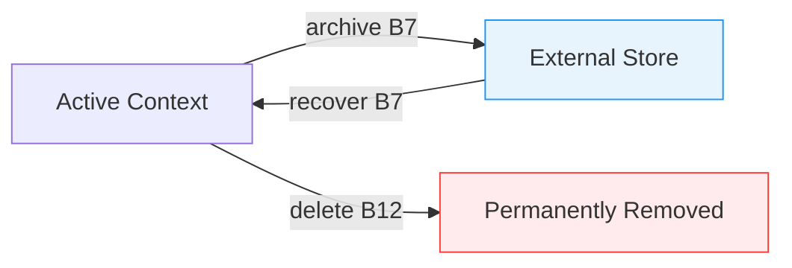
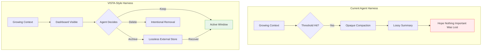

# Proprioceptive Dashboards: What VISTA Reveals About Self-Managed Context in LLM Agents — and How to Wire Equivalent Visibility into Codex CLI


---

Every coding agent eventually hits the wall. Context grows, the compaction heuristic fires, and something important disappears. The standard response — tune `model_auto_compact_token_limit`, hope for the best — treats the symptom. A June 2026 paper from CUHK argues the disease is simpler than we thought: models cannot *see* their own context state, and once you give them that visibility, they manage it themselves.

## The Proprioceptive Blindness Problem

Xu, Li, and Zhang's "LLM Agents Are Latent Context Managers" (arXiv:2606.30005) [^1] opens with an arresting claim: frontier language models are *proprioceptively blind* to their own context. From the prompt alone, they cannot determine how large each block is, how old it is, or how frequently it has been accessed — precisely the signals a keep-or-drop decision needs.

The authors quantified this blindness across four backbones [^1]:

| Model | Median Relative Error (Total Size) |
|-------|-------------------------------------|
| Claude Sonnet 4.5 | 0.84 |
| DeepSeek-V4-Pro | 0.44 |
| GLM-5 | 0.48 |
| Gemini-3-Flash | 0.43 |

Every backbone misjudged absolute context size by a wide margin. Estimates were uncorrelated with truth. Intriguingly, models estimated conversation *ordering* perfectly regardless — temporal awareness is intact, but magnitude awareness is absent.

## VISTA: Visible Internal State for Tool Agents

The proposed solution is VISTA — a training-free, model-agnostic context layer that converts the transcript into typed, addressable blocks and surfaces a per-turn dashboard [^1].

### Block Registration

Each interaction unit — user message, assistant response, tool call, tool result — receives a stable identifier (e.g., `B17`). Blocks carry one of five states:

- **Visible** — in the active prompt
- **Pinned** — required, never archived
- **Archived** — externalised with a recoverable handle
- **Blocked** — oversized, cannot fit
- **Deleted** — intentionally removed

### The Dashboard

Before every turn, VISTA injects a compact ledger:

```
┌──────────────────────────────────────────────────────┐
│  Budget: 128K  │  Used: 87,200  │  Remaining: 40,800 │
├────┬────────┬─────┬──────────┬────────┬──────────────┤
│ ID │ ~Tokens│ Age │   Type   │ Comp.  │   Status     │
├────┼────────┼─────┼──────────┼────────┼──────────────┤
│ B1 │    120 │  0r │ system   │ none   │ pinned       │
│ B2 │ 18,400 │  3r │ tool_out │ none   │ archived     │
│ B3 │  2,150 │  1r │ assistant│ none   │ visible      │
└────┴────────┴─────┴──────────┴────────┴──────────────┘
```

Four signals surface per block: **token cost**, **recency** (root-turn distance, `0r` = newest), **access history**, and **remaining budget**. With the dashboard present, size estimation error collapsed to zero [^1].

### Archive and Recovery

The critical architectural difference from compaction: archived blocks are stored as **byte-identical payloads** with stable handles. Recovery restores exact content on demand — not a summary, not a lossy compression, but full-fidelity retrieval. This is what the authors call *lossless reversible context management*.



## Benchmark Results

### LOCA-Bench: The Primary Stress Test

LOCA-Bench [^2] is a 75-task suite designed to stress context management under controllable growth, with a 128K budget on Gemini-3-Flash:

| Method | Accuracy | Trajectory Tokens |
|--------|----------|-------------------|
| VISTA (full) | **50.7%** | 2.86M |
| Claude Code | 42.7% | 6.72M |
| Auto-Archive + Recover | 44.0% | 2.73M |
| Active Context Compression | 36.0% | 3.20M |
| ReAct (baseline) | 22.7% | 3.51M |

A 28 percentage-point gain over ReAct, whilst consuming **57 per cent fewer tokens** than Claude Code [^1]. The dashboard alone — without archive/recovery — accounts for a significant portion of the improvement; without it, accuracy drops to 37.3 per cent [^1].

### Cross-Backbone Transfer

The same untrained VISTA interface improved all tested models. Claude Sonnet 4.5 jumped from 8.0 per cent to 34.7 per cent — a 4.3× improvement [^1]. The gain persists on stronger backbones, which the authors interpret as latent capability elicitation rather than weak-model compensation.

### BrowseComp-Plus (100K-scale Retrieval)

| Method | Accuracy | Active Tokens |
|--------|----------|---------------|
| VISTA | **58.0%** | 135K |
| Claude Code | 52.0% | 247K |
| SLIM | 49.3% | 162K |
| ReAct | 39.3% | 163K |

VISTA achieved higher accuracy with **45 per cent fewer active tokens** than Claude Code [^1].

### GAIA (10K-scale, General Assistant)

On shorter trajectories where context pressure is minimal, VISTA tied Claude Code at 72.7 per cent — confirming the approach imposes no penalty when context management is unnecessary [^1].

## The Recoverability Theorem

The paper includes a formal proof (Proposition 1) that under budget pressure with N independent random k-bit evidence blocks, a non-recovering method (deletion, masking, summarisation) succeeds with probability at most `B/(Nk) + 1/k`. VISTA achieves probability 1 when instruction, handles, and one recovered block fit within budget B [^1]. As N grows, the gap tends to 1 — mathematically proving that **lossless recovery is necessary, not optional**, under extreme context pressure.

## Mapping to Codex CLI

Codex CLI's context management stack already implements several VISTA-adjacent primitives. The gap lies in *visibility* — the agent cannot currently see its own context state.

### What Codex CLI Already Has

**Compaction threshold.** `model_auto_compact_token_limit` fires compaction when accumulated tokens exceed a configurable threshold (default ~200K, hard-capped at 90 per cent of the model context window) [^3]. This is the one-way truncation that VISTA aims to replace.

**Custom compaction prompts.** The `compact_prompt` and `experimental_compact_prompt_file` configuration keys allow overriding the default compaction behaviour [^3] — a surface where VISTA-style instructions could be injected.

**Tool output budgets.** `tool_output_token_limit` caps individual tool outputs before they enter the history [^3], functioning as a per-block size constraint analogous to VISTA's block registration.

**PostToolUse hooks.** The hook system [^4] can intercept tool outputs and transform them before they enter the context — a natural injection point for block-level metadata.

### What's Missing: The Dashboard Gap

Codex CLI does not currently surface a per-turn context ledger to the model. The agent cannot see:

- How many tokens each prior tool output consumed
- Which blocks are oldest and least-accessed
- How much budget remains before compaction fires
- Whether archived content is recoverable

### Wiring VISTA-Style Visibility

A practitioner can approximate the dashboard today using three mechanisms:

**1. AGENTS.md Context Budget Contract**

```markdown
## Context Management Protocol

Before each response, assess context pressure:
- If you have processed >5 large tool outputs, summarise earlier ones
- Preserve exact values from the most recent 3 tool outputs
- When exploring a codebase, archive file contents after extracting key facts
- Never discard error messages or test output from the current task
```

**2. PostToolUse Hook for Block Metadata**

A `PostToolUse` hook can prepend token-count metadata to tool outputs:

```bash
#!/bin/bash
# .codex/hooks/post-tool-use.sh
TOKEN_COUNT=$(wc -w < "$TOOL_OUTPUT_FILE" | awk '{print int($1 * 1.3)}')
echo "--- Block metadata: ~${TOKEN_COUNT} tokens, $(date -u +%H:%M:%S) ---"
cat "$TOOL_OUTPUT_FILE"
```

This gives the model partial visibility into block size — not a full dashboard, but a meaningful signal.

**3. Custom Compaction Prompt with Pinning**

```toml
# ~/.codex/config.toml
compact_prompt = """
Summarise the conversation history while preserving:
1. All AGENTS.md constraints (PINNED - never remove)
2. The most recent 3 tool outputs verbatim
3. All error messages and test failures
4. File paths and line numbers from the current task

For older tool outputs, replace with a one-line summary and note:
'[Archived: original was ~N tokens, key finding: X]'
"""
```

### Named Profile for VISTA-Style Sessions

```toml
[profile.vista]
model_auto_compact_token_limit = 80000
tool_output_token_limit = 8000
model_reasoning_effort = "high"
compact_prompt = "... (as above)"
```

Lowering the compaction threshold to 80K forces earlier, more frequent compaction cycles — mimicking VISTA's approach of maintaining a smaller active window with archived recovery paths [^5].

## The Deeper Lesson: Interface, Not Training

The most striking finding from VISTA is that context management capability is **already latent** in frontier models. The bottleneck is not learned policy but interface design [^1]. Ablation studies confirm this: changing the dashboard's wording whilst preserving its capabilities had minimal effect, isolating the mechanism as capability-based rather than prompt-sensitivity-based.

This has implications beyond Codex CLI. Every agent harness that relies on opaque compaction — and that includes Claude Code, Gemini CLI, and most MCP-based systems — is leaving performance on the table by not exposing context state to the model.



## What Codex CLI Could Adopt

The VISTA results suggest three concrete enhancements for the Codex CLI roadmap:

1. **Context telemetry injection.** A built-in per-turn summary of token usage, block ages, and budget remaining, prepended to the system prompt or appended after compaction. Cost: <500 tokens per turn [^1].

2. **Recoverable archives.** Instead of lossy compaction, externalise large blocks to a `.codex/archives/` directory with stable identifiers, accessible via a `recover` tool. VISTA's archive-then-recover loop rescued 8 of 16 tasks that would otherwise have failed [^1].

3. **Agent-directed compaction.** Rather than a fixed threshold trigger, let the model request compaction when it judges the moment is right — informed by the dashboard. The ablation showing auto-archive (44.0 per cent) underperforming agent-directed archive (50.7 per cent) supports this [^1].

## Conclusion

VISTA demonstrates that the context management problem in long-horizon agents is fundamentally an *observability* problem. Models already know how to manage context — they just cannot see it. For Codex CLI practitioners, the immediate takeaway is to use `AGENTS.md` constraints, custom compaction prompts, and PostToolUse hooks to surface as much context metadata as possible. The longer-term opportunity is for the harness itself to provide a proprioceptive dashboard, turning opaque compaction into transparent, agent-directed, recoverable context management.

---

## Citations

[^1]: Xu, B., Li, H., & Zhang, K. (2026). "LLM Agents Are Latent Context Managers: Eliciting Self-Managed Context via a Proprioceptive Dashboard." arXiv:2606.30005. [https://arxiv.org/abs/2606.30005](https://arxiv.org/abs/2606.30005)

[^2]: Zeng, W. et al. (2026). "LOCA-bench: Benchmarking Language Agents Under Controllable and Extreme Context Growth." arXiv:2602.07962. [https://arxiv.org/abs/2602.07962](https://arxiv.org/abs/2602.07962)

[^3]: OpenAI. (2026). "Configuration Reference — Codex CLI." OpenAI Developers. [https://developers.openai.com/codex/config-reference](https://developers.openai.com/codex/config-reference)

[^4]: OpenAI. (2026). "Hooks — Codex CLI." OpenAI Developers. [https://developers.openai.com/codex/hooks](https://developers.openai.com/codex/hooks)

[^5]: Chen, S. (2026). "Governance Decay: How Context Compaction Silently Erases Safety Constraints in Long-Horizon LLM Agents." arXiv:2606.22528. [https://arxiv.org/abs/2606.22528](https://arxiv.org/abs/2606.22528)
